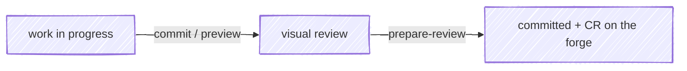

#  anchor

Git/forge skills that drive reviewed work into the permanent record.

An anchor holds a vessel fast against drift. Here it holds *work* fast: work
moves from in-progress → reviewed → committed and opened for review on the
forge, and anchor drives each leg of that passage.



## Interface

| Surface | What it does |
|---|---|
| [`/anchor:commit`](/skills/commit) | Confirm the repo, run tests, stage everything, write a *why*-focused commit message, then open the change in [moor](https://github.com/chris-peterson/moor) for a hunk-level review |
| [`/anchor:prepare-review`](/skills/prepare-review) | Rebase on `main`, open a draft change request (assigned to you, source branch set to delete on merge), and draft a description that routes reviewer attention to where their judgment matters most |
| [`/anchor:preview`](/skills/preview) | Stage all local changes and open them in moor — review in-flight work before you commit |

## Quickstart

1. **Install the plugin.**

   ```text
   /plugin install anchor
   ```

2. **Make some changes**, then commit them with a reviewed, *why*-first message:

   ```text
   /anchor:commit
   ```

3. **Open it for review.** Push the branch, then draft the change-request
   description:

   ```text
   /anchor:prepare-review
   ```

## Why these skills

The diff already shows *what* changed. The expensive, easily-skipped parts are
the ones a diff can't carry: a commit message that explains *why*, a hunk-level
look before the change leaves your machine, and a CR description that points a
reviewer at the lines where their attention pays off. anchor makes those the
path of least resistance.

- **commit** treats the visual review as part of committing, and feeds rejected
  hunks back as concrete edits rather than vague "looks off" notes.
- **prepare-review** writes for a reviewer who has never seen the system, leads
  with the *why*, and deep-links the critical path so a skim lands on what
  matters.
- **preview** is the quick look before you commit — same review channel, no
  commit yet.

## Optional integrations

anchor stands alone and reaches further when its siblings are installed; each
degrades gracefully when absent.

- **[moor](https://github.com/chris-peterson/moor)** — the keyboard-driven diff
  viewer `commit` and `preview` launch for review. Its `MOOR_CONTEXT` sidecar
  contract (the review-feedback channel) is defined in
  [moor's `SPEC.md`](https://github.com/chris-peterson/moor/blob/main/SPEC.md).
  Without moor, the visual step is skipped and the commit still lands.
- **[tack](https://github.com/chris-peterson/tack)** — the work-in-progress route
  tracker. When present, `prepare-review` records the CR as the active tack's
  deliverable and offers to mark the work done. Without tack, that linking is
  skipped.

## Reference

- **Skills** — per-skill pages in the sidebar, sourced directly from each
  `SKILL.md`
- [Forge cookbook](/forge-cookbook) — the `gh` / `glab` invocations and
  etiquette the skills follow
