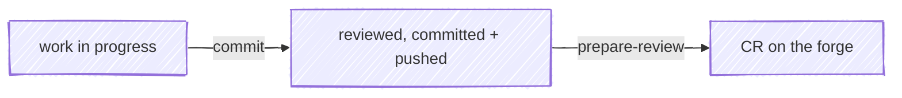

#  anchor

Git/forge skills for consistent and effective source control.

An anchor holds a vessel fast against drift. Here it holds *work* fast: work
moves from in-progress → reviewed → committed and opened for review on the
forge, and anchor drives each leg of that passage.



## In action

Tests pass, and `/anchor:commit` carries the change the rest of the way —
staging, a why-first message, and a hunk-level review in moor where a rejected
hunk comes back as a concrete edit, not a vague "looks off":

<div class="cw-session" data-cw-session="session"></div>

## Interface

| Surface | What it does |
|---|---|
| [`/anchor:commit`](/skills/commit) | Confirm the repo, run tests, stage everything, write a *why*-focused commit message, review the pending changeset in [moor](https://github.com/chris-peterson/moor) for a hunk-level look, then — once the review is clean — commit and push |
| [`/anchor:prepare-review`](/skills/prepare-review) | Rebase on `main` if behind, open a draft change request on the already-pushed branch (assigned to you, source branch set to delete on merge), and draft a description that routes reviewer attention to where their judgment matters most |
| [`/anchor:resolve-feedback`](/skills/resolve-feedback) | Fetch the unresolved review threads on an open CR, triage each with you, then drive each to resolution — fix / reply / resolve |
| [`/anchor:merge`](/skills/merge) | Land an approved CR once its gates are green — waiting on the pipeline if needed — then return to the default branch and delete the merged branch |
| [`/anchor:pipeline`](/skills/pipeline) | Work with a commit's forge pipeline — report its latest state, or watch until it settles (passed, failed with the failed jobs, or no pipeline) |
| [`/anchor:issue`](/skills/issue) | Gather the *why*, the consumer, and acceptance criteria, then draft and file (or update) a forge issue — composing into the project's issue template when one exists |
| [`/anchor:issues`](/skills/issues) | List and rank the forge issues assigned to you so you can pick what to work on next — by soonest due date, then most recently updated |
| [Ambient rules](/ambient-rules) | A SessionStart hook injects anchor's domain invariants — post-review commit etiquette, forge-CLI routing — so they hold even when no skill is invoked |

The two skills you reach for most, in motion:

<div class="cw-session" data-cw-session="examples"></div>

## Quickstart

anchor drives the forge through its official CLI, so the skills that touch a
change request, issue, or pipeline (`prepare-review`, `resolve-feedback`,
`merge`, `pipeline`, `issue`, `issues`) need the one for your `origin` remote installed and
authenticated with read+write scope. `commit` works without it. Install
[`gh`](https://cli.github.com) for GitHub or
[`glab`](https://gitlab.com/gitlab-org/cli#installation) for GitLab, then:

```bash
gh auth login      # GitHub remotes
glab auth login    # GitLab remotes
```

1. **Install the plugin.**

   ```bash
   claude plugin marketplace add chris-peterson/claude-marketplace
   claude plugin install anchor@chris-peterson
   ```

2. **Make some changes**, then commit with a reviewed, *why*-first message.
   `/anchor:commit` reviews the pending changeset, then commits and pushes once
   the review is clean:

   ```text
   /anchor:commit
   ```

3. **Open it for review.** On the already-pushed branch, draft the
   change-request description and open the draft CR:

   ```text
   /anchor:prepare-review
   ```

## Why these skills

The diff already shows *what* changed. The expensive, easily-skipped parts are
the ones a diff can't carry: a commit message that explains *why*, a hunk-level
look before the change leaves your machine, and a CR description that points a
reviewer at the lines where their attention pays off. anchor makes those the
path of least resistance.

- **commit** reviews the pending changeset before it commits, and feeds rejected
  hunks back as concrete edits rather than vague "looks off" notes — nothing is
  committed until the review is clean.
- **prepare-review** writes for a reviewer who has never seen the system, leads
  with the *why*, and deep-links the critical path so a skim lands on what
  matters.

## Optional integrations

anchor stands alone and reaches further when its siblings are installed; each
degrades gracefully when absent.

- **[moor](https://github.com/chris-peterson/moor)** — the default review
  backend, a keyboard-driven diff viewer the skills launch. Its `MOOR_CONTEXT`
  sidecar contract (the review-feedback channel) is defined in
  [moor's `SPEC.md`](https://github.com/chris-peterson/moor/blob/main/SPEC.md).
  Without moor, review falls back to `git difftool --dir-diff` with your
  configured difftool — you still get a visual review, and the skill asks whether
  to revise or proceed in place of moor's structured rejected-hunk feedback.
- **[revdiff](https://revdiff.com)** — an alternate review backend: a
  terminal-native diff reviewer (git, hg, and jj) selected with
  `git config anchor.reviewBackend revdiff`. It returns the same normalized
  review verdict as moor; its annotations come back ungraded, so the skill treats
  each as feedback to address and confirms the commit message itself. Because
  revdiff is a TUI, selecting it needs the revdiff plugin installed — anchor uses
  its terminal-overlay launcher to open the reviewer.

## Reference

- **Skills** — per-skill pages in the sidebar, sourced directly from each
  `SKILL.md`
- [Configuring anchor](/guides/configuring) — extend the commit and CR output
  with `git config anchor.*` keys and your forge's own MR/PR template
- [Forge cookbook](/guides/forge-cookbook) — the `gh` / `glab` invocations and
  etiquette the skills follow
- **Templates** — the output shapes the skills produce:
  [commit message](/templates/commit-message),
  [CR description](/templates/cr-description), and
  [issue description](/templates/issue-description)
