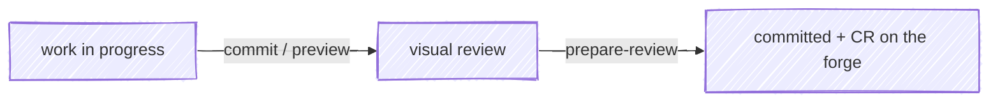

#  anchor

Git/forge skills for consistent and effective source control.

An anchor holds a vessel fast against drift. Here it holds *work* fast: work
moves from in-progress → reviewed → committed and opened for review on the
forge, and anchor drives each leg of that passage.



## In action

Validation passes, and `/anchor:commit` carries the change the rest of the
way — a hunk-level review, a why-first message, and a draft change request:

<div class="cw-session" data-cw-session="session"></div>

## Interface

| Surface | What it does |
|---|---|
| [`/anchor:preview`](/skills/preview) | Stage all local changes and open them in moor — review in-flight work before you commit |
| [`/anchor:commit`](/skills/commit) | Confirm the repo, run tests, stage everything, write a *why*-focused commit message, then open the change in [moor](https://github.com/chris-peterson/moor) for a hunk-level review |
| [`/anchor:prepare-review`](/skills/prepare-review) | Rebase on `main`, open a draft change request (assigned to you, source branch set to delete on merge), and draft a description that routes reviewer attention to where their judgment matters most |
| [`/anchor:resolve-feedback`](/skills/resolve-feedback) | Fetch the unresolved review threads on an open CR, triage each with you, then drive each to resolution — fix / reply / resolve |
| [`/anchor:pipeline`](/skills/pipeline) | Work with a commit's forge pipeline — report its latest state, or watch until it settles (passed, failed with the failed jobs, or no pipeline) |
| [`/anchor:issue`](/skills/issue) | Gather the *why*, the consumer, and acceptance criteria, then draft and file (or update) a forge issue — composing into the project's issue template when one exists |
| [Ambient rules](/ambient-rules) | A SessionStart hook injects anchor's domain invariants — post-review commit etiquette, forge-CLI routing — so they hold even when no skill is invoked |

The two skills you reach for most, in motion:

<div class="cw-session" data-cw-session="examples"></div>

## Quickstart

1. **Install the plugin.**

   ```bash
   claude plugin marketplace add chris-peterson/claude-marketplace
   claude plugin install anchor@chris-peterson
   ```

2. **Make some changes**, then:

   2a. *(optional)* Preview the working tree before committing:

   ```text
   /anchor:preview
   ```

   2b. Commit with a reviewed, *why*-first message:

   ```text
   /anchor:commit
   ```

3. **Open it for review.** Push the branch, then draft the change-request
   description:

   ```text
   /anchor:prepare-review
   ```

## Why these skills

The diff already shows *what* changed. The expensive, easily-skipped parts are
the ones a diff can't carry: a commit message that explains *why*, a hunk-level
look before the change leaves your machine, and a CR description that points a
reviewer at the lines where their attention pays off. anchor makes those the
path of least resistance.

- **commit** treats the visual review as part of committing, and feeds rejected
  hunks back as concrete edits rather than vague "looks off" notes.
- **prepare-review** writes for a reviewer who has never seen the system, leads
  with the *why*, and deep-links the critical path so a skim lands on what
  matters.
- **preview** is the quick look before you commit — same review channel, no
  commit yet.

## Optional integrations

anchor stands alone and reaches further when its siblings are installed; each
degrades gracefully when absent.

- **[moor](https://github.com/chris-peterson/moor)** — the keyboard-driven diff
  viewer `commit` and `preview` launch for review. Its `MOOR_CONTEXT` sidecar
  contract (the review-feedback channel) is defined in
  [moor's `SPEC.md`](https://github.com/chris-peterson/moor/blob/main/SPEC.md).
  Without moor, `commit` and `preview` fall back to `git difftool --dir-diff`
  with your configured difftool — you still get a visual review, and the skill
  asks whether to revise or proceed in place of moor's structured rejected-hunk
  feedback.
- **[tack](https://github.com/chris-peterson/tack)** — the work-in-progress route
  tracker. When present, `prepare-review` records the CR as the active tack's
  deliverable and offers to mark the work done. Without tack, that linking is
  skipped.

## Reference

- **Skills** — per-skill pages in the sidebar, sourced directly from each
  `SKILL.md`
- [Configuring anchor](/guides/configuring) — extend the commit and CR output
  with `git config anchor.*` keys and your forge's own MR/PR template
- [Forge cookbook](/guides/forge-cookbook) — the `gh` / `glab` invocations and
  etiquette the skills follow
- **Templates** — the output shapes the skills produce:
  [commit message](/templates/commit-message),
  [CR description](/templates/cr-description), and
  [issue description](/templates/issue-description)
