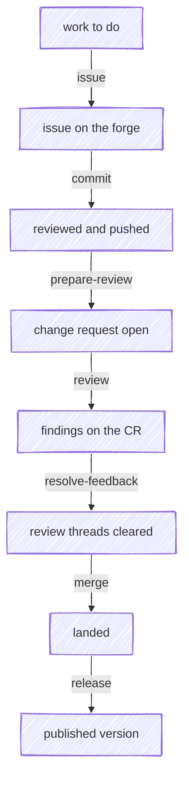

#  anchor

[](_home.md ':include')

## The lifecycle

Which skill carries a change from one state to the next:


```mermaid
%%{ init: { 'look': 'handDrawn' } }%%
flowchart TD
    Need["work to do"] -->|issue| Filed["issue on the forge"]
    Filed -->|commit| Pushed["reviewed and pushed"]
    Pushed -->|prepare-review| Open["change request open"]
    Open -->|review| Reviewed["findings on the CR"]
    Reviewed -->|resolve-feedback| Cleared["review threads cleared"]
    Cleared -->|merge| Landed["landed"]
    Landed -->|release| Shipped["published version"]
```

## In action

Tests pass, and `/anchor:commit` does the rest — staging, a why-first message,
and a code review where a rejected change comes back as a concrete
edit, not a vague "looks off":

<div class="cw-session" data-cw-session="session"></div>

The two skills you reach for most, in motion:

<div class="cw-session" data-cw-session="examples"></div>

## Quickstart

`anchor` drives the forge through its official CLI, so the skills that touch a
change request, issue, pipeline, or release (`prepare-review`, `review`,
`resolve-feedback`, `merge`, `release`, `pipeline`, `issue`, `backlog`) need the
one for your `origin` remote installed and authenticated with read+write scope.
`commit` works without it. Install
[`gh`](https://cli.github.com) for GitHub or
[`glab`](https://gitlab.com/gitlab-org/cli#installation) for GitLab, then:

```bash
gh auth login      # GitHub remotes
glab auth login    # GitLab remotes
```

1. **Make some changes**, then commit with a reviewed, *why*-first message.
   `/anchor:commit` reviews the pending changeset, then commits and pushes once
   the review is clean:

   ```text
   /anchor:commit
   ```

2. **Open it for review.** On the already-pushed branch, draft the
   change-request description and open the draft CR:

   ```text
   /anchor:prepare-review
   ```

## Why these skills

The diff already shows *what* changed. The expensive, easily-skipped parts are
the ones a diff can't carry: a commit message that explains *why*, a code review
before the change leaves your machine, and a CR description that points a
reviewer at the lines where their attention pays off. `anchor` makes those the
path of least resistance.

- **commit** reviews the pending changeset before it commits, and feeds rejected
  changes back as concrete edits rather than vague "looks off" notes — nothing is
  committed until the review is clean.
- **prepare-review** writes for a reviewer who has never seen the system, leads
  with the *why*, and deep-links the critical path so a skim lands on what
  matters.

## Optional integrations

The skills run with nothing else installed: with no diff viewer on the machine,
the review is walked with you in chat.

- **[revdiff](https://revdiff.com)** — the tool the skills reach for when
  it's installed and you haven't said otherwise: a terminal-native diff reviewer
  (git, hg, and jj) that returns a normalized verdict and marks which diff side
  each annotation sits on. It carries no commit-message round-trip, so the skill
  confirms the message itself. It renders in a terminal, so `anchor` opens it in
  one it hosts itself: a tmux popup, or an iTerm2 split of the session you are
  in.

Integration runs the other way too, and needs nothing configured. `anchor`
[announces](/events) each lifecycle fact it causes — an issue filed, a commit
pushed, a change request opened, marked ready, or merged, a release published —
as one line on its own stdout. A plugin that tracks work can follow a change from
filed to shipped by reading those, and a session where nothing is listening pays
nothing for it.

## Reference

- [What's new in 1.x](/whats-new) — the steps added since 0.x, and the three
  things that moved
- [Ambient rules](/ambient-rules) — the invariants the SessionStart hook injects
  when no skill is invoked, in the form the agent receives them
- **Skills** — per-skill pages in the sidebar, sourced directly from each
  `SKILL.md`
- [Configuring `anchor`](/guides/configuring) — extend the commit and CR output
  with `git config anchor.*` keys and your forge's own PR/MR template
- [CR verbosity, calibrated](/guides/cr-verbosity) — one changeset rendered at
  five `anchor.crVerbosity` settings, for picking how long your descriptions run
- [Forge cookbook](/guides/forge-cookbook) — the `gh` / `glab` invocations and
  etiquette the skills follow
- [Release models](/guides/release-models) — the four ways a repo publishes, and
  which one owns the version bump
- **Templates** — the output shapes the skills produce:
  [commit message](/templates/commit-message),
  [CR description](/templates/cr-description),
  [review qualities](/templates/review-qualities), and
  [issue description](/templates/issue-description)
