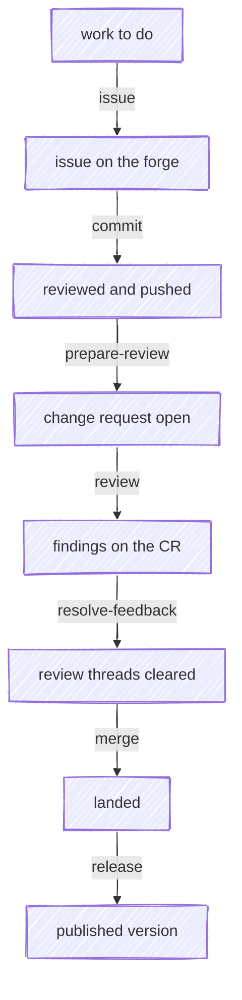

<div class="ph-hero" style="--accent: var(--color-cyan)">

<h1 class="ph-lede"><span class="ph-name">anchor</span> your development practices.</h1>

<div class="ph-badge">

[](_tags.md ':include')

</div>

</div>

An agent working for you is also speaking for you: issues, change requests,
review comments, release notes. Every one of them reaches you in full before
anyone else sees it.

Keeps your issues, commits, change requests, reviews, and releases consistent:
the same quality, structure, and formatting every time, not reinvented per
change.

## Install

```bash
claude plugin marketplace add chris-peterson/claude-marketplace
claude plugin install anchor@chris-peterson
```

## Getting started

First-time setup is two decisions, and neither needs a configuration file.

**What `anchor` may reach on your forge.** It never asks you for a token and
never stores one: it shells out to your forge's own CLI, which holds the
credential in your OS keychain.

```bash
gh auth login      # GitHub remotes
glab auth login    # GitLab remotes
```

Both default to a browser sign-in, so for most people there is no personal
access token to create at all.

**How much it may do without asking.** That dial is your Claude Code permission
settings, not `anchor`. Read-only is a real place to start, and the skills still
work: `commit` reviews the diff with you and drafts the message, then stops at
the prompt for the commit itself. Widen it when you want to.

[**Getting started →**](/getting-started) has the token scopes, everything
`anchor` can reach with one, and how to pace both dials to your own comfort.

Then edit some code and run:

```text
/anchor:commit          # review the changeset, write the why, commit and push
/anchor:prepare-review  # rebase, draft the description, open a draft CR
```

## Tenets

- **Nothing publishes under your name until you have read the exact words.**
  Commit messages, CR descriptions, issue bodies, review replies, release notes —
  each reaches you verbatim before it lands, in the review tool or in the reply,
  never as a paraphrase and never as the output of a command you would have to
  expand. Approving a plan, a shape, or a disposition is not approving the prose
  that later fills it. Decline and nothing is written.
- **A review that did not happen is not an approval.** A viewer that opened and
  reported no verdict, an editor closed without saving, a diff tool that is not
  installed — each ends the step, and `anchor` walks a
  [fallback](/guides/review-fallback) instead of asking *"you saw the diff —
  approve?"*. That question converts a tooling failure into your sign-off.
- **No AI attribution.** No `Co-Authored-By` trailer, no *Generated with* footer.
  The commit author and CR author fields already record who ran it.

Written down as requirements in [SPEC](/spec): CONFIRM-01..06 for the first,
DIFF-12 and DIFF-20 for the second, RULE-02 for the third.

## Skills

| Skill | What it does |
|---|---|
| [`/anchor:commit`](/skills/commit) | Review the changeset, then commit with a why-first message and push |
| [`/anchor:prepare-review`](/skills/prepare-review) | Rebase on the default branch and open a draft change request |
| [`/anchor:review`](/skills/review) | Read every change in a CR, weigh it against your qualities, post findings inline |
| [`/anchor:resolve-feedback`](/skills/resolve-feedback) | Work a CR's review threads to done, one by one |
| [`/anchor:merge`](/skills/merge) | Check the merge gates, wait on the pipeline, then land the CR and clean up |
| [`/anchor:release`](/skills/release) | Work out what's shipping, recommend a version, draft the notes, publish |
| [`/anchor:backlog`](/skills/backlog) | Rank the forge issues assigned to you so you can pick what to work on next |
| [`/anchor:issue`](/skills/issue) | File a new forge issue that leads with why the work is needed |
| [`/anchor:pipeline`](/skills/pipeline) | Report a commit's forge pipeline state, or watch until it settles |

Standing guidance the plugin injects on its own, and the wiring behind it:
[ambient rules](/ambient-rules), [hooks](/hooks), [events](/events).

## The lifecycle

Which skill carries a change from one state to the next:


```mermaid
%%{ init: { 'look': 'handDrawn' } }%%
flowchart TD
    Need["work to do"] -->|issue| Filed["issue on the forge"]
    Filed -->|commit| Pushed["reviewed and pushed"]
    Pushed -->|prepare-review| Open["change request open"]
    Open -->|review| Reviewed["findings on the CR"]
    Reviewed -->|resolve-feedback| Cleared["review threads cleared"]
    Cleared -->|merge| Landed["landed"]
    Landed -->|release| Shipped["published version"]
```

## In action

Tests pass, and `/anchor:commit` does the rest — staging, a why-first message,
and a code review where a rejected change comes back as a concrete
edit, not a vague "looks off":

<div class="cw-session" data-cw-session="session"></div>

The two skills you reach for most, in motion:

<div class="cw-session" data-cw-session="examples"></div>

## Why these skills

The diff already shows *what* changed. The expensive, easily-skipped parts are
the ones a diff can't carry: a commit message that explains *why*, a code review
before the change leaves your machine, and a CR description that points a
reviewer at the lines where their attention pays off. `anchor` makes those the
path of least resistance.

- **commit** reviews the pending changeset before it commits, and feeds rejected
  changes back as concrete edits rather than vague "looks off" notes — nothing is
  committed until the review is clean.
- **prepare-review** writes for a reviewer who has never seen the system, leads
  with the *why*, and deep-links the critical path so a skim lands on what
  matters.

## Optional integrations

The skills run with nothing else installed.

- **[revdiff](https://revdiff.com)** — the tool the skills reach for when
  it's installed and you haven't said otherwise: a terminal-native diff reviewer
  (git, hg, and jj) that returns a normalized verdict and marks which diff side
  each annotation sits on. It carries no commit-message round-trip, so the skill
  confirms the message itself. It renders in a terminal, so `anchor` opens it in
  one it hosts itself: a tmux popup, or an iTerm2 split of the session you are
  in.

Integration runs the other way too, and needs nothing configured. `anchor`
[announces](/events) each lifecycle fact it causes — an issue filed, a commit
pushed, a change request opened, marked ready, or merged, a release published —
as one line on its own stdout. A plugin that tracks work can follow a change from
filed to shipped by reading those, and a session where nothing is listening pays
nothing for it.

## Reference

- [What's new in 1.x](/whats-new) — the steps added since 0.x, and the three
  things that moved
- [Configuring `anchor`](/guides/configuring) — every knob, once you want one
- [Ambient rules](/ambient-rules) — the invariants the SessionStart hook injects
  when no skill is invoked, in the form the agent receives them
- **Skills** — per-skill pages in the sidebar, sourced directly from each
  `SKILL.md`
- [Guides](/guides) — the standing judgment the skills apply while they work:
  the prose guides that set the voice of every message, what a review does when
  the tool returns no verdict, and the forge, release, and configuration
  mechanics underneath
- **Templates** — the output shapes the skills produce:
  [commit message](/templates/commit-message),
  [CR description](/templates/cr-description),
  [review qualities](/templates/review-qualities), and
  [issue description](/templates/issue-description)
