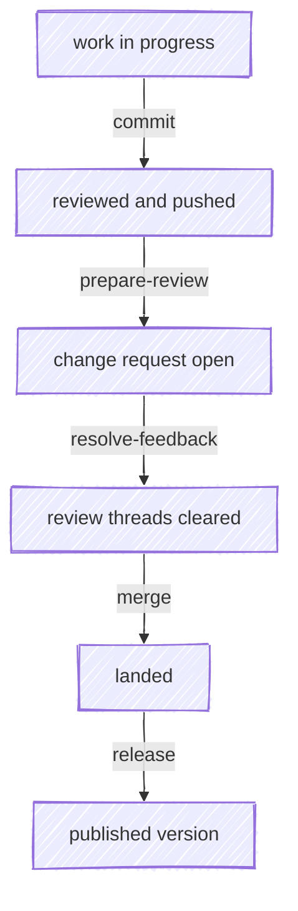

# What's new in 1.x

Through 0.x, `anchor` stopped where the change request opened. You committed, you
pushed, you got a description written for a reviewer who had never seen the
system — and then `anchor` was done, and landing and shipping were yours.

1.x covers those too. `/anchor:merge` lands the change; `/anchor:release`
publishes what landed. Every step from a dirty working tree to a published
version now has a skill.

| Step | Skill | Arrived in |
|---|---|---|
| Commit and push a reviewed change | [commit](/skills/commit) | at the start |
| Open and describe the change request | [prepare-review](/skills/prepare-review) | at the start |
| Drive review threads to done | [resolve-feedback](/skills/resolve-feedback) | 0.3.0 |
| Land it once the gates are green | [merge](/skills/merge) | **1.0.0** |
| Publish what landed | [release](/skills/release) | **1.1.0** |
| Report whether the push went green, without being asked | [commit](/skills/commit), [resolve-feedback](/skills/resolve-feedback), [prepare-review](/skills/prepare-review) | **1.3.0** |
| Show every drafted reply before any of them post | [resolve-feedback](/skills/resolve-feedback) | **1.4.0** |
| Compose the CR template your group or org supplies, not just one in the repo | [prepare-review](/skills/prepare-review) | **1.5.0** |
| Say whether the source branch survives the merge, and offer to fix it | [prepare-review](/skills/prepare-review) | **1.5.0** |

## Coming from 0.x? Three things moved

> [!WARNING]
> `/anchor:prepare-review` no longer pushes. It requires a branch that's already
> pushed, because the push moved into `/anchor:commit`. If your habit was
> `commit` then `prepare-review` to get the branch up, the new sequence is the
> same two commands doing the same two jobs — just with the push at the front.

> [!WARNING]
> `/anchor:commit --preview` is gone. The default flow reviews the changeset
> before committing, so a look-only mode was a second door to the same room.
> Plain `/anchor:commit` shows you the diff before anything is written.

> [!WARNING]
> The "here's the commit message, ok?" prompt is gone. The drafted message is
> seeded into the review instead, so you read it against the diff it describes
> rather than approving it before seeing anything. Edit it in the reviewer and
> the edit is what gets committed.

## Nothing is committed until the review is clean

This is the change underneath the rest of 1.0. `/anchor:commit` runs the tests,
stages, drafts the message, and then opens the *pending* changeset — working tree
versus `HEAD` — for review. Only a clean verdict commits; anything else edits the
working tree and re-reviews rather than amending a checkpoint you've already
made.

The practical difference: there is no commit to walk back. Under the old flow, a
review that found something left you amending, and an amend on a pushed branch is
a force-push with a rule attached. Now the review happens while the change is
still just files.

## Review runs on a backend you choose

Diff review goes through one dispatcher that normalizes whatever tool you use to
a single verdict, so the skills don't care which reviewer is installed.

| Backend | How to select it | What it gives you |
|---|---|---|
| [revdiff](https://revdiff.com) | the default since 1.4.0 | A terminal-native reviewer that also handles hg and jj, with diff-side markers on each annotation |
| [moor](https://github.com/chris-peterson/moor) | `git config anchor.reviewBackend moor` | Comments on individual changes, per-hunk review state, and an editable commit message that round-trips |

With no viewer installed, the skills walk the change with you in chat rather
than opening git's difftool: a changeset on screen with no verdict behind it
ends in "you saw it, approve?", which is the one answer a review step must not
manufacture.

The contract between them — the four-value verdict, ungraded comments anchored to
lines or files, and what a backend that can't answer a question reports instead of
guessing — is the `DIFF` category in the [requirements](/spec).

## A release knows who owns the version bump

`/anchor:release` opens by answering one question, because it decides everything
after it: **who bumps the version?** A CI workflow fired by a published release, a
workflow fired by a tag push, a bump commit in the repo, or nobody.

Get that wrong and you get two conflicting commits, or a published release with no
changelog. So where a workflow owns the bump, the skill publishes and leaves the
manifest and changelog alone; where nothing does, the bookkeeping lands through
`/anchor:commit`. The four models and the trap each one hides are in
[release models](/guides/release-models).

The publish doesn't end at the create, either. Where the release fires a workflow,
the skill watches that run to a terminal state and pulls the commit it pushed back
into your checkout — skip that and your tree is missing generated files, and the
next push is rejected as non-fast-forward.

## Full detail

Every release, with what changed and why:
[CHANGELOG.md](https://github.com/chris-peterson/anchor/blob/main/CHANGELOG.md).
