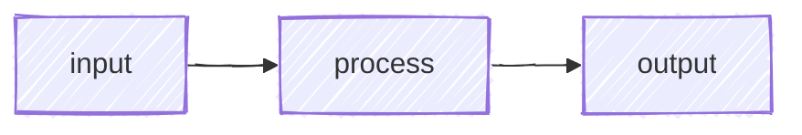
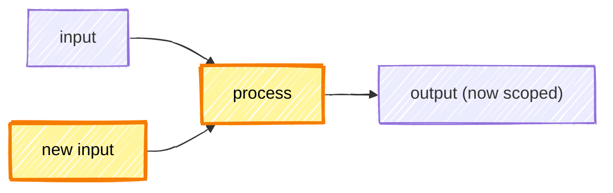

# CR description formatting

How to *render* a CR description once its shape is decided: which visualization
fits which data, the mermaid and screenshot recipes, and the prose conventions
that make a description skim-readable. `templates/cr-description.md` owns the
*shape* (which sections, in what order); this guide owns the *technique* for
realizing it. The `prepare-review` skill points here from its Step 3 drafting
flow.

For the render-time traps that bite any markdown a forge displays — character
escaping, nested fences, mermaid-fence placement, the collapsible `<details>`
blank-line rule, tables in lists — see `guides/markdown-gotchas.md`. This guide
is about *what to reach for*; that one is about *what breaks*.

## Pick the visualization that fits the data shape

Presentation is a primary concern, not a finishing pass. Before drafting, ask:
*what shape is this data, and what visualization fits it?* The right choice
makes information land in seconds; the wrong one buries it in prose reviewers
skim past. A diagram that doesn't match the data shape is worse than no diagram,
and a flat markdown table for tree-shaped data is worse than a brief HTML table.

The menu, ordered by data shape:

| Data shape | Use this | When |
|------------|----------|------|
| Linear story | Paragraphs | Motivation → consequence → next step. The default for *Context*. |
| Flat tabular | **Markdown table** | Lists with consistent columns: changed flags with old/new values, verification rows with `Run` / `Status` columns, affected services with owners. |
| Process / shape / interaction | **Mermaid diagram** | State machine (`stateDiagram-v2`), service sequence (`sequenceDiagram`), decision/data flow (`flowchart TD`), type relationships (`classDiagram`). |
| Tree-shaped / hierarchical | **Inline HTML table with `rowspan` / `colspan`** | A parent record with multiple child records sharing parent attributes; a per-environment matrix where one row spans envs. Markdown tables can't represent 2D nesting — drop into raw HTML (`<table><tr><td rowspan="2">…`). Markdown renderers accept raw HTML; use it where it's the right tool. |
| Structural change | **Before/after with highlights** | Added input, swapped algorithm, new flow. Two mermaid blocks under explicit `### Before` / `### After` headings, with `classDef` highlighting the changed nodes. |
| Files a change creates | **`diff` block, `+` additions** | A scaffold/init change that adds a tree of new files. Render the created layout as `+`-prefixed lines inside a ` ```diff ` fence so it reads as all-additions (green), not a neutral file tree. Use the real paths from the changeset — never invent a placeholder repo or root-dir name. |
| Visual / UX change | **Annotated screenshots** (preferred) or **Before/After markdown table** | Component, CSS, template, or layout changes — anything where the rendered output is what the reviewer needs to evaluate. |

Pick once and commit. If two visualizations would each carry the data, prefer
the more compact one — reviewers stop reading when they run out of time, not
when you run out of content.

## Prose conventions

After the visualization choice, lean into markdown for the surrounding prose:

- **Bold** for the key noun or verb in a sentence, and for lead-in labels (e.g. `**Why:**`, `**Note:**`).
- *Italics* sparingly — for tone, or to flag a term you're about to define.
- `Backticks` for every code identifier, file path, env var, branch name, package, or CLI flag. Anything a reader might grep for or paste into a terminal earns backticks. Inline backticks are cheap and pay back hugely in skim-readability.
  - **Exception — forge-autolink tokens stay bare.** GitLab and GitHub autolink CR/issue refs (`!148`, `#42`), commit SHAs (`a553528`), and user @mentions (`@chris`) when they appear as **bare text**. Wrapping them in backticks turns them into inert code spans and kills the link. Write `!148`, not `` `!148` ``; write `a553528`, not `` `a553528` ``.
  - **Cross-project references need the full URL.** A bare `#42` / `!148` / `@name` shortcut resolves *within the MR's own project* — `#42` autolinks to issue 42 of that project, not to a same-numbered item elsewhere. A pipeline, issue, or CR in a different project (CI/deploy pipelines routinely live in their own) must be written as a full URL; the bare shortcut silently links the wrong target and the mistake is invisible in the markdown source — it surfaces only once rendered. See the [forge cookbook](https://chris-peterson.github.io/anchor/#/guides/forge-cookbook) for the full GitLab-markdown facts.
- **Link authoritative external references.** When the description names an external API, service, spec, standard, or tool that has canonical documentation, embed a markdown link to it rather than naming it bare — one click of authoritative context beats making the reviewer go search for it.
- Fenced code blocks with a language tag for multi-line snippets, sample output, configs, or schemas.
- Headings (`##`, `###`) to chunk the description so reviewers can jump straight to "Approach" or "Testing".

## Deep-link construction (Review guide)

Always deep-link to the actual line, not just the file — reviewers should be one
click away from the hunk you're pointing them at. The skill supplies the runtime
values (`CR_URL`, and the per-file `FILE_ANCHORS` from `prepare-review`'s Step 1
block); construction differs by forge:

- **GitLab:** `<CR_URL>/diffs#<file-anchor>_<old-line>_<new-line>` where `<file-anchor>` is `sha1(<repo-relative-file-path>)` — already computed per changed file in `FILE_ANCHORS`. (You still pick the line numbers; only the path-hash is precomputed.) For a file-level link (no specific line), just use `<CR_URL>/diffs#<file-anchor>`. For pure additions, use the new line number for both `<old-line>` and `<new-line>` — the link still resolves.
- **GitHub:** `<CR_URL>/changes#diff-<file-anchor>R<new-line>` (or `L<new-line>` for the left/old side). Use the `/changes` view, not `/files` — the anchor scrolls to the line on `/changes`, but the classic Files-changed tab leaves it at the top. The `<file-anchor>` is `sha256(<repo-relative-file-path>)`, which matches GitHub's rendered `diff-…` id exactly — compute it directly (`printf '%s' <path> | shasum -a 256`) rather than hunting for it in the UI.

## Collapsible sections — fold heavy detail away

Brevity is the default, but some changes genuinely carry detail a reviewer
occasionally wants and shouldn't have to scroll past to skip: a full `terraform
plan`, a long log excerpt, an exhaustive flag-by-flag table, a verbose config
sample. Wrap that detail in a `<details><summary>…</summary>` block. The summary
line keeps the outline scannable; the detail is one click away when a reviewer
wants it. This is the escape valve that lets the description stay terse *and*
complete — reach for it instead of either inlining a wall of output or dropping
the detail entirely.

**Precedent and proof are a natural fit for this pattern.** Approval-gated CRs
(security, IAM, infra) often need to *establish* that a change is consistent with
existing grants or prior art. Collapsible blocks holding specific, deep-linked
proofs keep that case one click away without bloating the reviewer's default
view. Terseness still governs *what goes inside*: proof that bears on
*this* change (the same role, the same accounts), not an estate-wide sweep of
unrelated grants that reads as whataboutism.

**Pipeline-produced artifacts belong in the description — fetched, reasoned about, and previewed.** When the CR or its commit's pipeline generates an artifact that bears on review, pull it, read it, and include the pertinent excerpt rather than describing the change without the evidence the pipeline already produced. Fold a long artifact into a collapsible and lead with the part that matters — the summary line and anything surprising in it.

Both GitHub and GitLab render the HTML;
[GitLab's markdown reference](https://docs.gitlab.com/user/markdown/#collapsible-section)
documents the syntax. The blank-line rule that makes markdown render inside the
block is in `guides/markdown-gotchas.md`.

````markdown
<details>
<summary><strong>Full <code>terraform plan</code> output</strong></summary>

```text
# ~200 lines of plan output the reviewer can expand if they want it
```

</details>
````

## Mermaid diagrams

A small mermaid diagram earns its keep when the change has shape that prose
hides — a state machine, a sequence between services, a before/after
architecture, a decision flow. A picture lands faster than two paragraphs of
prose. Pick the type that matches the content:

- `stateDiagram-v2` for state transitions
- `sequenceDiagram` for service or actor interactions
- `flowchart TD` for decision/data flow
- `classDiagram` for type relationships

Keep diagrams tight (5–10 nodes — a diagram you have to scroll is worse than no
diagram). Follow these mermaid conventions: hand-drawn look
(`%%{ init: { 'look': 'handDrawn' } }%%`), no `\n` or `<br>` in node labels (use
separate nodes or shorter labels instead).

### Before/after with highlights

When the change has a structural shape — added input, swapped algorithm, new
flow — a before/after diagram is worth the extra lines. Use **two separate
fenced mermaid blocks under explicit `### Before` and `### After` markdown
subheadings** — *not* two `subgraph` blocks inside a single mermaid block.
Mermaid renders subgraphs in non-deterministic order, so a single-block "Before
/ After" can render with the After above the Before on GitLab. Explicit
subheadings guarantee ordering. Highlight the new or changed nodes with a
`classDef` so the reader's eye lands on the difference:

````markdown
### Before



### After


````

Use `###` when Before/After fits under an existing `##` section; use `##` when
it stands alone. Keep both diagrams tight — if the After grows several new
inputs, collapse them into a single labeled node when their individual identity
isn't load-bearing (e.g. `salt = env|app` instead of three separate nodes for
`env`, `app`, `salt`).

## Visual / UX changes — screenshots

When the diff touches rendered output, prose can't show the reviewer what
changed. Capture screenshots *before* drafting Context — for UX-driven CRs
they're usually the centerpiece, not a footnote.

- **Detect.** The changeset is UX-related when the diff touches `.css`/`.scss`, component files (`.tsx`/`.jsx`/`.vue`/`.svelte`), templates (`.html`/`.erb`/`.razor`), design tokens, or asset files (icons, images, fonts).
- **Capture After.** Drive the running app with the Playwright MCP browser tools (`browser_navigate`, `browser_take_screenshot`). For an isolated component the app can't easily mount, a frontend-design skill can compose a representative view to screenshot.
- **Force hover-revealed UI via CSS injection, not `page.hover()`.** Programmatic hover races the screenshot timing. Instead, inject a scoped `<style>` element via `browser_evaluate` with `!important` opacity / display rules, take the shot, then navigate away to reset (the `<style>` element doesn't survive route changes). The same technique scales to **focused crops**: hide non-target siblings with a temporary `display: none !important` class so the screenshot bounds tightly around the area of interest.
- **Capture Before.** Stash the working tree (or `git worktree add` at `main`), screenshot the same views, restore your branch. Match viewport size and route so the only delta is the change under review.
- **Annotate the modified regions (preferred).** Overlay boxes, arrows, or callouts on the new/modified content so the reviewer's eye lands on the change instead of doing diff-by-eye between two near-identical images.
- **Fallback — Before/After table.** When annotation isn't practical (multiple regions, layout reflow, animation, theme swap), use a side-by-side markdown table:

  ```markdown
  | Before | After |
  |--------|-------|
  |  |  |
  ```

Screenshots are local files; the markdown references them by path. After pasting
the description into the forge web UI, drag and drop each PNG into the editor —
GitHub/GitLab uploads and rewrites the path to a hosted URL automatically.
