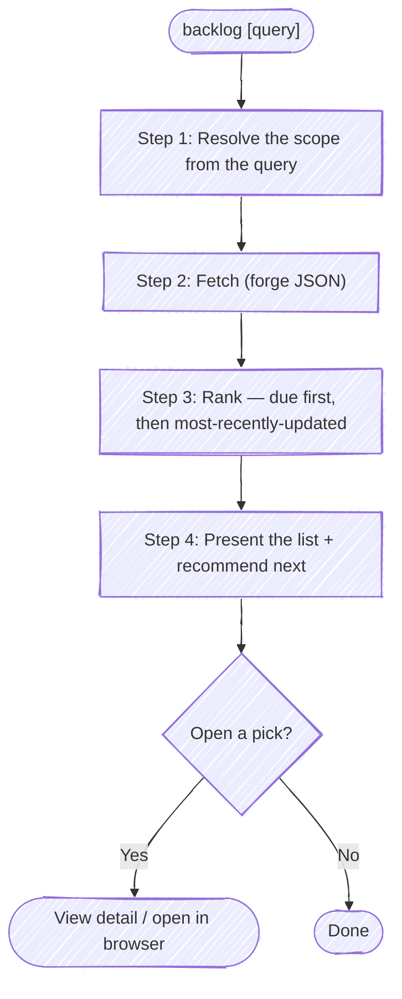

# Backlog

Before using a bundled path, resolve `<anchor-root>` to the installed plugin root
from the host's value or this `SKILL.md` path, then follow the host-neutral tool
conventions in `<anchor-root>/guides/host-runtime.md`.

Find and rank the issues that are candidates for your next unit of work, so you can choose one — the read-only counterpart to the `issue` skill. Where `issue` *authors* a single issue (file a new one, or update a known one), `backlog` *surveys* what is already filed: it fetches, ranks, and points at the next thing to pick up. It never writes to the forge.

The default view answers "what's next?" — **your** open issues, ranked by **soonest due date, then most recently updated**. So the item most likely to be next sits at the top.

**Keep plumbing quiet.** Every step below is an operating instruction, not a script to read aloud — follow the execute-quietly discipline: `<anchor-root>/guides/execute-quietly.md`. For this skill, the only things worth surfacing are a question you need answered, the ranked list, the recommended next pick, and — if the user opens one — its detail or URL.

Issues = GitHub issues or GitLab issues. Pick the forge tool by the `origin` remote (`gh` / `glab`).



## Target repo

By default this lists issues for the repo backing the working directory — pick the forge from its `origin` remote (`gh` for GitHub, `glab` for GitLab). But the user may ask about a *different* repo ("what's open in `payments-api`?"). Don't guess from a half-remembered slug — resolve the name:

```bash
bash "<anchor-root>/scripts/resolve-target.sh" <name>
```

Act on `TARGET_VIA`:

- **`cwd`** — no match (`TARGET_NOTE` separates "no repo by that name" from "no authenticated forge to ask"). Fall back to the cwd `origin`. If the user clearly meant a repo that *didn't* resolve, say so rather than silently listing the cwd repo.
- **`ambiguous`** — `TARGET_CANDIDATES` holds the matches as `[{key,url,local}]`.
  Present them as structured choices when the host supports that, otherwise ask
  directly; proceed with the chosen entry.
- **`resolved`** — exactly one match. Listing is pure-remote, so `TARGET_LOCAL` is not needed:
  - `TARGET_FORGE` picks the CLI (`gh` / `glab`).
  - **GitHub:** add `-R <TARGET_PROJECT>` to the `gh issue list` call.
  - **GitLab:** add `-R <TARGET_URL>` to the `glab issue list` call (and `--hostname <TARGET_HOST>` is harmless if you prefer it explicit).

## Step 1: Resolve the scope from the query

The query passed to `backlog` (if any) refines *which* issues to list. Map it to filter flags; when it's empty or a bare "what's next?", use the defaults. Never invent a filter the user didn't ask for — the default view is the point.

| The user says… | Scope |
|----------------|-------|
| *(nothing)*, "what's next?", "what should I work on?" | **Default:** assigned to me, open |
| "anything due soon?", "what's due?" | Default scope; the ranking already surfaces due-soonest first |
| "everything open", "the whole backlog" | Drop the assignee filter; open only |
| "unassigned…", "up for grabs" | No assignee, open |
| "…bugs", "…labeled X" | Add the label filter |
| "closed too", "including done" | State = all |
| "assigned to <person>" | That assignee |

Keep the default (**assigned to me + open**) unless the query clearly calls for something else. If the query is genuinely ambiguous about scope, ask once before fetching rather than guessing.
