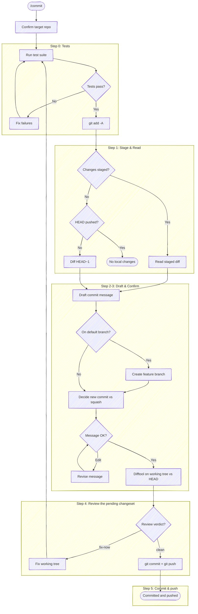

# Commit and Push

Confirm the target repo, run tests, stage all changes, draft a commit message, review the pending changeset, then — once the review is clean — commit and push in one step.

**Don't narrate your work.** Every step below is an operating instruction, not a script to read aloud — follow the execute-quietly discipline: `${CLAUDE_PLUGIN_ROOT}/guides/execute-quietly.md`. For `/commit`, the only things worth surfacing are the resolved repo in one line, a failing test, the drafted message with its options, and the review verdict; where a step prescribes exact output (e.g. `Committed [short-sha], pushed`), emit that and nothing more.



## Task tracking when orchestrated

At the very start, call `TaskList`. If any task is already `in_progress`, this
skill is running inside an orchestrator (e.g. a release workflow) — run silently
and do **not** create your own tasks; the orchestrator's list is the source of
truth. If nothing is `in_progress`, `/commit` is the entry point; enumerate these
steps as tasks. Label them by what happens, not by the `## Step N` headings
(the headings start at Step 0, so a numbered task list drifts one off) — and
don't split out a "read the diff" task, since reading is the input to drafting,
not a step of its own:

- `Run tests`
- `Stage changes`
- `Draft commit message`
- `Review the changeset`
- `Commit and push`

Review precedes the commit on purpose: the pending changeset is reviewed against
`HEAD`, and only a clean verdict — with your sign-off on the message — commits and
pushes. A `fix-now` sends you back through tests and re-review rather than
amending a commit that already exists.

If the diff is empty and the skill exits early, mark remaining tasks `deleted`
rather than leaving them pending.

## Target repo

Before anything else, resolve which repo this operates on — the working directory isn't a reliable proxy (edits may have landed in a sibling repo). Re-resolve on every invocation; don't assume the previous target carries forward.

- **With an argument** (`/anchor:commit <name>`): resolve the name through tack's repo db — `bash "${CLAUDE_PLUGIN_ROOT}/scripts/resolve-target.sh" <name>` (see the cookbook's "Resolving a named target repo"). On `TARGET_VIA=tack`, use `TARGET_LOCAL` as the checkout; committing needs a work tree, so if `TARGET_LOCAL` is empty (a known remote with no checkout) say so and stop rather than committing to the wrong place. `ambiguous` → prompt with `TARGET_CANDIDATES`. `cwd` (no tack, or no match) → fall back to a case-insensitive substring-match of `<name>` against the basename of every git repo the session has touched; one match → use it (confirm in one line), zero/multiple → ask.
- **No argument**: run `git rev-parse --show-toplevel` from the working directory. If the session touched more than one repo, or edits landed outside it, state the resolved path and ask which to target.

Run git with `-C <checkout>` when the working directory isn't the target, rather than `cd`. The test runner in Step 0 and every git command below operate on the resolved checkout. The helper scripts this skill launches — `look-ahead.sh`, `squash-check.sh`, `review-diff.sh` — read their own `origin`/git state, so pass them the same target: `--repo <checkout>` for a checkout you operate on directly, or `--worktree <path>` for a flow-owned isolated worktree. On its own each would otherwise fall back to the cwd repo. When the target is a *different* repo than the session cwd and the work will mutate it, isolate that work in a worktree first — see `scripts/worktree.sh` and create-review-request's "Operating against a non-cwd repo" for the setup/teardown lifecycle.

## Step 0: Run tests

Before reading changes, look for a test runner in the project (e.g., `just test`, `npm test`, `dotnet test`, `pytest`, `go test ./...`, a `Makefile` test target). Run the test suite.

If tests pass, proceed to Step 1.

If tests fail, **stop and fix them**. Present the failures and help the user resolve them. Do NOT proceed to Step 1 until the test suite exits cleanly. No exceptions — "pre-existing" failures still block the commit.

If no test suite is found, skip this step silently.

## Step 1: Stage and read changes

First, stage all changes:

```bash
git add -A
```

Then read what's staged:

```bash
git diff --cached --stat
```

```bash
git diff --cached
```

If nothing is staged after `git add -A`, there's no new change to commit — but the branch may hold **unpushed commits to push**. Commit-and-push means `/commit` also gets already-committed work onto the remote, so check the ahead-count:

```bash
bash "${CLAUDE_PLUGIN_ROOT}/scripts/look-ahead.sh"
```

The helper prints the ahead-count (unpushed commits) or empty if no upstream is configured. If the count is `0`, HEAD equals the remote tracking branch — nothing staged and nothing unpushed; warn the user there are no local changes and stop.

If the count is `≥1`, this is a **push-existing** run: the changeset is those unpushed commit(s), and there's no new message to draft — **skip Steps 2-3** and go straight to review-and-push. Read the unpushed range, review it in Step 4 (pass the range to the wrapper via `review-diff.sh --commit`, not `--local`), and push in Step 5. Diff the range to read it (substitute `DEFAULT_BRANCH`):

```bash
git diff "origin/main...HEAD" --stat
```

```bash
git diff "origin/main...HEAD"
```

(The message-only-amend case — an unpushed commit whose *message* is wrong, tree unchanged — is the `ALLOW_MESSAGE_AMEND` path in Step 3, not this push-only path.)

## Step 2: Write the commit message

Write the message following the format in `templates/commit-message.md` — it owns the *shape* (the [cbea.ms](https://cbea.ms/git-commit/) rules and the trailer). Spend your effort on the *why*; the code already shows the *how*. If the change is trivial (typo fix, one-liner), a subject-only message is fine.

Keep the body free of loaded framing — temporal blame, size-minimizers, self-congratulatory adverbs, defensive softeners. The tone discipline lives in `${CLAUDE_PLUGIN_ROOT}/guides/loaded-framing.md` (shared with `create-review-request` and `issue`); consult it while drafting.

### Honor `anchor.*` config

Read the project + global anchor keys once:

```bash
git config --get-regexp '^anchor\.' 2>/dev/null
```

`--get-regexp` returns the names lowercased (`anchor.worktrackerbaseuri`); match them case-insensitively. Apply the keys relevant to a commit; absent keys keep anchor's defaults — never invent a value:

- **`anchor.workTrackerBaseUri`** — when the user mentions a ticket (a full tracker URL, or a bare id), append a `Refs:` trailer (a footer line after a blank line, below the body): use a full URL as-is, or build `<base-uri><id>` from a bare id. Don't scrape the branch or prompt for a ticket — no mention, no trailer. Skip it for a trivial subject-only commit unless the user asks.
- **`anchor.commitRules`** — an extra rule layered onto the default commit-message rules for this message (the escape hatch for anything without a dedicated key).

See `${CLAUDE_PLUGIN_ROOT}/guides/configuring.md` for the full key set.

## Step 3: Confirm the branch, shape, and message

Nothing is committed in this step — it settles *what* will be committed once the review in Step 4 comes back clean: the branch to commit on, whether this is a new commit or a squash, and the message text. Display the `--stat` summary from Step 1 first so the user can see what's in scope, then the message in a fenced code block:

```text
Subject line here

Body paragraph explaining why this change was made,
wrapped at 72 characters. Focus on context that isn't
obvious from the diff.
```

### When on the default branch — create a feature branch first

The commit **pushes** (Step 5), so landing directly on the default branch publishes to it. Before anything else, check whether HEAD is the default branch:

```bash
git branch --show-current
```

Compare it to the default (`git symbolic-ref --short refs/remotes/origin/HEAD | sed 's@^origin/@@'`, falling back to `main`/`master`). **If they match, don't commit onto the default branch** — a commit meant for review belongs on a feature branch, and pushing to the default branch directly is how work lands unreviewable. Offer the branch, named from the subject you just drafted:

- **Slug the subject** — lowercase, non-alphanumeric runs → single hyphens, trim leading/trailing hyphens, cap ~50 chars. `Add retry to checkout` → `add-retry-to-checkout`.
- Ask with `AskUserQuestion` (header `Branch`), recommended option first so the default lands on branch creation:
  1. **Create branch `<slug>`** *(recommended)* — `git checkout -b <slug>`, then the rest of the flow commits and pushes onto it.
  2. **Commit to `<default>`** — the deliberate, explicit direct-to-default case (a release commit, a docs typo on `main`); the flow proceeds and pushes to the default branch. Never the default path.
  3. **Edit name** — take a name from the user, then `git checkout -b <that>`.

Create the branch (when chosen) **before** the commit, so the commit lands — and pushes — on the feature branch. Once `/commit` pushes that branch, `create-review-request` opens the CR against it (it operates on an already-pushed branch and never pushes itself).

Committing directly to the default branch is never a squash target — the gate below returns `SQUASH=blocked`, so even the "commit to `<default>`" path lands as a new commit rather than amending the published tip.

### Squash gate

Decide whether squashing the staged changes into HEAD (via `git commit --amend` in Step 5) is on the table. The gate is *"is HEAD out for review?"* — the helper decides it and returns only what you act on, one launch-and-read:

```bash
bash "${CLAUDE_PLUGIN_ROOT}/scripts/squash-check.sh"
```

The contract it prints:

| Key | What to do with it |
|-----|--------------------|
| `SQUASH` | `allowed` → amending HEAD is safe; offer squash (gated further by relatedness below). `blocked` → the ordinary new commit (below) |
| `SQUASH_FORCE_PUSH` | meaningful only when `allowed`: `1` → HEAD is pushed (a draft CR, or no CR), so the amend must be followed by `git push --force-with-lease` in Step 5 |
| `ALLOW_MESSAGE_AMEND` | `1` → squash is `blocked`, but a message-only amend is permitted (the ready-CR case); gates the exception below. `0` → no amend of any kind |
| `PRIOR_SUBJECT` | HEAD's subject, for the squash option text |

The helper folds the push-state probe (including the no-upstream `origin/<default>..HEAD` fallback), the author guard, and the CR-draft probe into that decision — don't re-run them. It deliberately does **not** emit *why* squash is blocked: the block reason, push count, CR state, and author identity stay inside the script, so there's nothing here to narrate or keep quiet by hand — the gate is silent by construction (`${CLAUDE_PLUGIN_ROOT}/guides/execute-quietly.md`).

### When `SQUASH=blocked` — the ordinary commit

The vanilla path, and the common one: HEAD isn't yours to rewrite or it's out for review, so a plain new commit is the only sensible outcome — exactly what the user asked for when they said "commit." The helper already withheld *why*, so there's nothing to keep quiet: present the drafted message with two choices. The user never raised squashing; don't mention it.

1) **Accept** — take the message as-is into the Step 4 review
2) **Edit** — tell you what to change

On Edit, revise and re-present. On Accept, the plan is a **new commit**; proceed to Step 4.

**Narrow exception — message-only amend (`ALLOW_MESSAGE_AMEND=1`).** When the helper permits a message-only amend and the user reports the *message* (not the code) is demonstrably wrong — pasted from a different repo, references identifiers that don't exist here, doesn't match what the diff does — the tree is unchanged, so the reviewer-protection motivation doesn't apply. Plan a `git commit --amend -F <msg-file>` to fix the message (there is no tree change to review, so this skips Step 4), and surface "force-push (`--force-with-lease`) affects only the message; the tree is unchanged" as an explicit choice in Step 5. The flag fires only where this is safe (a ready CR whose tree a message fix leaves untouched); when it's `0`, no amend — a new commit is the only path. Do not extend it to content rewrites; the moment any file content moves, the standard gate applies again.

### When `SQUASH=allowed` — apply the relatedness judgment

The gate is open; now *your* judgment decides squash vs new commit. Decide whether the staged changes are **related** to the prior commit (continuation, fix, or refinement of the same work) or **unrelated** (different topic, different files, new task):

- **Related** → recommend squash
- **Unrelated** → recommend new commit

When `SQUASH_FORCE_PUSH=1` (pushed draft CR), annotate the squash option so the user knows the follow-up push is a force-push — e.g. `_(CR is draft — mutable history is the norm; amend force-pushes with lease)_`. Don't let it flip the recommendation; a draft's history is expected to move.

Present options in recommended-first order:

If recommending a new commit:

1) **New commit** _(* recommended)_
2) **Squash into "[PRIOR_SUBJECT]"**
3) **Edit** — tell you what to change (e.g., "change the subject to X", "drop the second paragraph")

If recommending squash:

1) **Squash into "[PRIOR_SUBJECT]"** _(* recommended)_
2) **New commit**
3) **Edit** — tell you what to change (e.g., "change the subject to X", "drop the second paragraph")

Record the choice (new commit vs squash) and proceed to Step 4; the review runs before either is executed. If they choose Edit, revise the message and re-present.

### When a PreToolUse hook blocks the commit

Some hooks pattern-match on bash command substrings — destructive-operation gates (`npm install -g`, `git push --force`), secret-scanning regexes (`secret`/`token`/`password`/`api.?key`), or other safety guards. These can false-positive when the same string appears inside a heredoc'd commit message body — the hook sees the literal text and blocks the commit before `git` ever parses the heredoc. The trigger is often natural-language wording in the body that overlaps with the hook's keyword set.

If a commit attempt in Step 5 is rejected by a `PreToolUse` hook citing a substring that's actually inside the message body (not the executed command), stop and surface the conflict to the user. Do not reach for a temp-file workaround (`Write` to `/tmp/...` then `git commit -F`) — splitting the commit into a separate `Write` plus `Bash` doubles the permission prompts, hides the message body from the bash command preview, and introduces cross-session collision risk on predictable paths. The message wording is the right thing for the diff; the hook's matcher is the limitation. The user can approve the bypass for this commit or adjust the hook.

## Step 4: Review the pending changeset

Before committing, open the pending changeset — the working tree vs `HEAD`, the exact changes Step 5 will commit — in a visual review. First check whether moor — the difftool that speaks the sidecar contract — is on PATH, since that decides how you read the outcome (the same probe `create-review-request` and `issue` use):

```bash
command -v moor
```

Launch the wrapper in `--local` mode — **not** raw `git difftool`. The wrapper stages everything so the index equals the working tree, diffs it against `HEAD`, populates a repo/branch/summary header, drives **git's configured difftool** (moor when it's installed and set as `diff.tool`, otherwise whatever `diff.tool` names), and — once it closes — prints the verdict on its own stdout. Raw `git difftool` bypasses the header and the verdict.

**Launch as a background call** (`run_in_background: true`): the wrapper blocks until the difftool closes, so a foreground call would hold the turn open until the Bash timeout.

```bash
bash "${CLAUDE_PLUGIN_ROOT}/scripts/review-diff.sh" --local
```

(On the **push-existing** path from Step 1 — nothing staged, unpushed commits to push — review those commits instead of the working tree: `review-diff.sh --commit`.)

When the background command completes, read its stdout with the **BashOutput tool** — not `tail` / `$(...)`, which trip the command-substitution gate. The last lines carry the verdict (no separate file read):

- `REVIEW_VERDICT` — `0` clean · `1` one-or-more fix-now · `2` unreviewed · `3` closed early · `absent` (no sidecar was written — either moor closed without one, or a non-moor difftool ran)
- `REVIEW_OUTPUT` — compact JSON; when the verdict is `1`, read `.comments` from here. Each comment is `{body, action, file?, startLine?, endLine?}`: `action` is `fix-now` (the blocker), `fix-later`, or `consider`; `body` is the reviewer's inline feedback; the optional `file` / `startLine` / `endLine` anchor it to a line range (a comment may target a file, a line range, or the whole changeset with no line). The verdict and comments come from the difftool's sidecar contract, defined normatively in [moor's `SPEC.md`](https://github.com/chris-peterson/moor/blob/main/SPEC.md) (`IM.OUT-*`).

**If `moor` is on PATH**, it drove the review and the sidecar carries a real verdict. Act on it:

- **`0`** → the changeset is clean; proceed to Step 5 to commit and push. If `.comments` carries advisory comments (`action` `fix-later` or `consider`), surface them — they don't gate the commit, but the user may want to act on them (now, or as a follow-up).
- **`1`** → **do not commit.** List the `fix-now` comments (the `.comments` entries where `action == "fix-now"`), then loop back to Step 0: fix the commented lines in the working tree, re-run tests, and re-review. Surface any advisory (`fix-later` / `consider`) comments too. **If a comment's `body` is short** (e.g. "I don't get what this flag means") **and the cited line range contains more than one distinct change** (e.g. two flag additions in a usage block, two unrelated lines in the same range), ask the user which token the comment refers to before fixing — a one-second clarification beats several minutes of guessing wrong. Fix the commented lines themselves; don't expand into adjacent pre-existing code (`${CLAUDE_PLUGIN_ROOT}/guides/changeset-scope.md`).
- **`2`** → `Unreviewed hunks — what do you want to change?` Nothing is committed until the review is clean.
- **`3` or `absent`** → `Review closed without a verdict — what do you want to change?` (moor was present, so `absent` means it closed before writing one — surface it as the anomaly it is.) Nothing is committed.

**If `moor` isn't on PATH**, the wrapper deferred to your git-configured difftool (`diff.tool` — e.g. vscode, kdiff3, vimdiff), which presents the diff but doesn't speak the sidecar contract, so the verdict comes back `absent`. Here `absent` means the change was **shown in your difftool**, not that no review happened — report `Reviewed in your difftool — commit and push?` and act on the reply (proceed to Step 5 on approval), rather than committing over an unreviewed diff. If the wrapper's output shows the difftool never launched (no `diff.tool` set, or it points at a tool that isn't installed), that's a local git misconfiguration: surface it plainly so the user can fix their config or install moor — don't substitute another tool.

## Step 5: Commit and push

Reached only on a clean review (or the message-only-amend exception, which has no tree change to review). Execute the shape chosen in Step 3, then push in the same step:

- **New commit** → `git commit` with the drafted message.
- **Squash** → write a combined message covering both the prior commit and the new changes, present it for confirmation, then `git commit --amend` with it.
- **Push-existing** (Step 1 found nothing staged but unpushed commits) → no commit to make; go straight to the push.

Then push:

- **New feature branch, no upstream yet** → `git push -u origin <branch>`.
- **Existing upstream, new commit** → `git push`.
- **Amend of a pushed commit** (`SQUASH_FORCE_PUSH=1`, or the message-only amend on a pushed ready CR) → `git push --force-with-lease` so the open draft CR updates to the rewritten history. For the message-only amend, present the force-push as the explicit choice from Step 3 and let the user decide.

Report the outcome and nothing more — `Committed [short-sha], pushed to <branch>` — followed by any advisory `fix-later` / `consider` comments the review surfaced. If the push is rejected (non-fast-forward, protected branch, auth), surface the error and stop rather than retrying or force-pushing without the lease.
