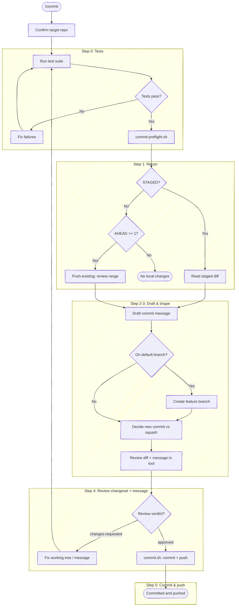

# Commit and Push

Confirm the target repo, run tests, stage all changes, draft a commit message, review the pending changeset, then — once the review is clean — commit and push in one step.

**Don't narrate your work.** Every step below is an operating instruction, not a script to read aloud — follow the execute-quietly discipline: `${CLAUDE_PLUGIN_ROOT}/guides/execute-quietly.md`. For `/commit`, the only things worth surfacing are the resolved repo in one line, a failing test, any branch/shape decision that needs the user, and the review verdict; where a step prescribes exact output (e.g. `Committed [short-sha], pushed`), emit that and nothing more. **The message is not presented in chat** — it's shown in the review tool (Step 4); don't print it or ask about it separately. No "checks pass, now staging…" transitions: run the step, read the result, move on.

**The pre-flight is internal — present the decision, not the derivation.** Staging, the working-tree state, the squash-gate result, the ahead-count, and the commit-vs-squash routing rationale are all inputs that *drive* the next decision; they are not output. Surface the decision and its options — the proposed route, the drafted message — never the `KEY=value` a helper emits, the "one commit ahead, unpushed" bookkeeping, or the chain of internal facts that led to the route. A sentence that explains *why* before it shows *what*, walking the user through the state you just read, is the failure this catches.



## Task tracking when orchestrated

At the very start, call `TaskList`. **Only track tasks when orchestrated:** if a
task is already `in_progress`, this skill is running inside an orchestrator (e.g.
a release workflow) — run silently and do **not** create your own tasks; the
orchestrator's list is the source of truth. If nothing is `in_progress`, `/commit`
is a direct interactive invocation — **don't create a task list.** It's a short
flow whose payoff is seeing the review quickly; a five-item task list is exactly
the ceremony that buries the preview. Just run the steps.

Review precedes the commit on purpose: the pending changeset (and the drafted
message) are reviewed against `HEAD`, and only a clean verdict commits and pushes.
A `fix-now` sends you back through tests and re-review rather than amending a
commit that already exists.

## Target repo

Before anything else, resolve which repo this operates on — the working directory isn't a reliable proxy (edits may have landed in a sibling repo). Re-resolve on every invocation; don't assume the previous target carries forward.

- **With an argument** (`/anchor:commit <name>`): resolve the name through tack's repo db — `bash "${CLAUDE_PLUGIN_ROOT}/scripts/resolve-target.sh" <name>` (see the cookbook's "Resolving a named target repo"). On `TARGET_VIA=tack`, use `TARGET_LOCAL` as the checkout; committing needs a work tree, so if `TARGET_LOCAL` is empty (a known remote with no checkout) say so and stop rather than committing to the wrong place. `ambiguous` → prompt with `TARGET_CANDIDATES`. `cwd` (no tack, or no match) → fall back to a case-insensitive substring-match of `<name>` against the basename of every git repo the session has touched; one match → use it (confirm in one line), zero/multiple → ask.
- **No argument**: run `git rev-parse --show-toplevel` from the working directory. If the session touched more than one repo, or edits landed outside it, state the resolved path and ask which to target.

Run git with `-C <checkout>` when the working directory isn't the target, rather than `cd`. The test runner in Step 0 and every git command below operate on the resolved checkout. The helper scripts this skill launches — `commit-preflight.sh`, `review-diff.sh`, `commit.sh` — read their own `origin`/git state, so pass them the same target: `--repo <checkout>` for a checkout you operate on directly, or `--worktree <path>` for a flow-owned isolated worktree. On its own each would otherwise fall back to the cwd repo. When the target is a *different* repo than the session cwd and the work will mutate it, isolate that work in a worktree first — see `scripts/worktree.sh` and prepare-review's "Operating against a non-cwd repo" for the setup/teardown lifecycle.

## Step 0: Run tests

Before reading changes, look for a test runner in the project (e.g., `just test`, `npm test`, `dotnet test`, `pytest`, `go test ./...`, a `Makefile` test target). Run the test suite.

If tests pass, proceed to Step 1.

If tests fail, **stop and fix them**. Present the failures and help the user resolve them. Do NOT proceed to Step 1 until the test suite exits cleanly. No exceptions — "pre-existing" failures still block the commit.

If no test suite is found, skip this step silently.

## Step 1: Stage and read changes

Run the pre-flight recon **once** — it stages (`git add -A`), then gathers the staging state, stat, branch/default, ahead-count, squash gate, and `anchor.*` config into one `KEY=value` block, so Steps 1-3 read a single command's output instead of five separate probes:

```bash
bash "${CLAUDE_PLUGIN_ROOT}/scripts/commit-preflight.sh"
```

Act only on the keys; don't re-run the folded-in probes (`git add`, `look-ahead.sh`, `squash-check.sh`):

| Key | Use |
|-----|-----|
| `STAGED` | `1` → a change to commit (read its full diff below, draft a message); `0` → see push-existing |
| `STAT` | the diffstat total — what's in scope |
| `BRANCH` / `DEFAULT_BRANCH` / `ON_DEFAULT_BRANCH` | the branch decision in Step 3 |
| `AHEAD` | unpushed commit count (empty = no upstream) — drives push-existing |
| `SQUASH` / `SQUASH_FORCE_PUSH` / `ALLOW_MESSAGE_AMEND` / `PRIOR_SUBJECT` | the squash gate in Step 3 |
| `ANCHOR_CONFIG` | the `anchor.*` keys (JSON) for Steps 2-3 |

When `STAGED=1`, read the full staged diff so you can draft the message:

```bash
git diff --cached
```

**Push-existing** — when `STAGED=0`: if `AHEAD` is `0` or empty, nothing is staged and nothing is unpushed — warn there are no local changes and stop. If `AHEAD` is `≥1`, the branch has unpushed commit(s) to push: **skip Steps 2-3**, review that range in Step 4 (`review-diff.sh --commit`, not `--local`), and push in Step 5. Read the range (substitute `DEFAULT_BRANCH`):

```bash
git diff "origin/main...HEAD"
```

(The message-only-amend case — an unpushed commit whose *message* is wrong, tree unchanged — is the `ALLOW_MESSAGE_AMEND` path in Step 3, not this push-only path.)

## Step 2: Write the commit message

Write the message following the format in `templates/commit-message.md` — it owns the *shape* (the [cbea.ms](https://cbea.ms/git-commit/) rules and the trailer). Spend your effort on the *why*; the code already shows the *how*. If the change is trivial (typo fix, one-liner), a subject-only message is fine.

Keep the body free of loaded framing — temporal blame, size-minimizers, self-congratulatory adverbs, defensive softeners. The tone discipline lives in `${CLAUDE_PLUGIN_ROOT}/guides/loaded-framing.md` (shared with `prepare-review` and `issue`); consult it while drafting.

### Honor `anchor.*` config

`ANCHOR_CONFIG` from Step 1's block holds the `anchor.*` keys as JSON (`{}` when none); the names come back lowercased (`anchor.worktrackerbaseuri`) — match case-insensitively. Apply the keys relevant to a commit; absent keys keep anchor's defaults — never invent a value:

- **`anchor.workTrackerBaseUri`** — when the user mentions a ticket (a full tracker URL, or a bare id), append a `Refs:` trailer (a footer line after a blank line, below the body): use a full URL as-is, or build `<base-uri><id>` from a bare id. Don't scrape the branch or prompt for a ticket — no mention, no trailer. Skip it for a trivial subject-only commit unless the user asks.
- **`anchor.commitRules`** — an extra rule layered onto the default commit-message rules for this message (the escape hatch for anything without a dedicated key).

See `${CLAUDE_PLUGIN_ROOT}/guides/configuring.md` for the full key set.

Write the drafted message to a temp file (`$(mktemp -u "${TMPDIR:-/tmp}/commit-msg.XXXXXX").md`) with the Write tool. Step 4 passes it into the review so you review the message alongside the diff, and Step 5 commits it (or the reviewer's edited version).

## Step 3: Settle the branch and shape

Nothing is committed in this step — it settles *where* and *how* the commit lands: the branch to commit on, and whether this is a new commit or a squash. The **message itself isn't confirmed here** — it rides into the Step 4 review, where you read it beside the diff (and, on moor, edit it in the tool). Display the `--stat` summary from Step 1 so the user sees what's in scope.

### When on the default branch — create a feature branch first

The commit **pushes** (Step 5), so landing directly on the default branch publishes to it. Step 1's block already resolved this: `ON_DEFAULT_BRANCH=1` (HEAD is `DEFAULT_BRANCH`) is the case to guard. **When it's `1`, don't commit onto the default branch** — a commit meant for review belongs on a feature branch, and pushing to the default branch directly is how work lands unreviewable. Offer the branch, named from the subject you just drafted:

- **Slug the subject** — lowercase, non-alphanumeric runs → single hyphens, trim leading/trailing hyphens, cap ~50 chars. `Add retry to checkout` → `add-retry-to-checkout`.
- Ask with `AskUserQuestion` (header `Branch`), recommended option first so the default lands on branch creation:
  1. **Create branch `<slug>`** *(recommended)* — `git checkout -b <slug>`, then the rest of the flow commits and pushes onto it.
  2. **Commit to `<default>`** — the deliberate, explicit direct-to-default case (a release commit, a docs typo on `main`); the flow proceeds and pushes to the default branch. Never the default path.
  3. **Edit name** — take a name from the user, then `git checkout -b <that>`.

Create the branch (when chosen) **before** the commit, so the commit lands — and pushes — on the feature branch. Once `/commit` pushes that branch, `prepare-review` opens the CR against it (it operates on an already-pushed branch and never pushes itself).

Committing directly to the default branch is never a squash target — the gate below returns `SQUASH=blocked`, so even the "commit to `<default>`" path lands as a new commit rather than amending the published tip.

### Squash gate

Whether squashing the staged changes into HEAD (via `git commit --amend` in Step 5) is on the table comes from **Step 1's block** — the gate is *"is HEAD out for review?"*, decided by `squash-check.sh` (folded into the recon), which returns only what you act on:

| Key | What to do with it |
|-----|--------------------|
| `SQUASH` | `allowed` → amending HEAD is safe; offer squash (gated further by relatedness below). `blocked` → the ordinary new commit (below) |
| `SQUASH_FORCE_PUSH` | meaningful only when `allowed`: `1` → HEAD is pushed (a draft CR, or no CR), so the amend must be followed by `git push --force-with-lease` in Step 5 |
| `ALLOW_MESSAGE_AMEND` | `1` → squash is `blocked`, but a message-only amend is permitted (the ready-CR case); gates the exception below. `0` → no amend of any kind |
| `PRIOR_SUBJECT` | HEAD's subject, for the squash option text |

The gate folds the push-state probe (including the no-upstream `origin/<default>..HEAD` fallback), the author guard, and the CR-draft probe into that decision — don't re-run them. It deliberately does **not** emit *why* squash is blocked: the block reason, push count, CR state, and author identity stay inside the script, so there's nothing here to narrate or keep quiet by hand (`${CLAUDE_PLUGIN_ROOT}/guides/execute-quietly.md`).

### When `SQUASH=blocked` — the ordinary commit

The vanilla path, and the common one: HEAD isn't yours to rewrite or it's out for review, so a plain new commit is the only sensible outcome — exactly what the user asked for when they said "commit." Nothing to confirm here — the message is reviewed in Step 4, and the shape is a **new commit**, so proceed straight to Step 4. The user never raised squashing; don't mention it.

**Narrow exception — message-only amend (`ALLOW_MESSAGE_AMEND=1`).** When the helper permits a message-only amend and the user reports the *message* (not the code) is demonstrably wrong — pasted from a different repo, references identifiers that don't exist here, doesn't match what the diff does — the tree is unchanged, so the reviewer-protection motivation doesn't apply. Plan a message-only amend via Step 5's `commit.sh --mode amend --force-with-lease` to fix the message (there is no tree change to review, so this skips Step 4), and surface "force-push (`--force-with-lease`) affects only the message; the tree is unchanged" as an explicit choice in Step 5. The flag fires only where this is safe (a ready CR whose tree a message fix leaves untouched); when it's `0`, no amend — a new commit is the only path. Do not extend it to content rewrites; the moment any file content moves, the standard gate applies again.

### When `SQUASH=allowed` — apply the relatedness judgment

The gate is open; now *your* judgment decides squash vs new commit. Decide whether the staged changes are **related** to the prior commit (continuation, fix, or refinement of the same work) or **unrelated** (different topic, different files, new task):

- **Related** → recommend squash
- **Unrelated** → recommend new commit

When `SQUASH_FORCE_PUSH=1` (pushed draft CR), annotate the squash option so the user knows the follow-up push is a force-push — e.g. `_(CR is draft — mutable history is the norm; amend force-pushes with lease)_`. Don't let it flip the recommendation; a draft's history is expected to move.

Present the two options in recommended-first order (the message is reviewed in Step 4, so there's no message-edit option here):

If recommending a new commit:

1) **New commit** _(* recommended)_
2) **Squash into "[PRIOR_SUBJECT]"**

If recommending squash:

1) **Squash into "[PRIOR_SUBJECT]"** _(* recommended)_
2) **New commit**

Record the choice (new commit vs squash) and proceed to Step 4; the review runs before either is executed.

### When a PreToolUse hook blocks the commit

Some hooks pattern-match on bash command substrings — destructive-operation gates (`npm install -g`, `git push --force`), secret-scanning regexes (`secret`/`token`/`password`/`api.?key`), or other safety guards. These can false-positive when the same string appears inside a heredoc'd commit message body — the hook sees the literal text and blocks the commit before `git` ever parses the heredoc. The trigger is often natural-language wording in the body that overlaps with the hook's keyword set.

If a commit attempt in Step 5 is rejected by a `PreToolUse` hook citing a substring that's actually inside the message body (not the executed command), stop and surface the conflict to the user. Do not reach for a temp-file workaround (`Write` to `/tmp/...` then `git commit -F`) — splitting the commit into a separate `Write` plus `Bash` doubles the permission prompts, hides the message body from the bash command preview, and introduces cross-session collision risk on predictable paths. The message wording is the right thing for the diff; the hook's matcher is the limitation. The user can approve the bypass for this commit or adjust the hook.

## Step 4: Review the pending changeset

Before committing, open the pending changeset — the working tree vs `HEAD`, the exact changes Step 5 will commit — in a visual review, **with the drafted message shown alongside it**. Launch the **dispatcher** in `--local` mode with `--message-file` (the message file from Step 2) — **not** raw `git difftool`. It stages everything so the index equals the working tree, diffs it against `HEAD`, seeds the drafted message (subject as the headline, body as prose) plus a repo/branch/summary header, drives the configured review backend (`anchor.reviewBackend`, default moor), and — once it closes — prints the normalized result on its own stdout. So you review the message and the diff *together* — no separate chat gate — and on moor you can edit the message in the tool (it returns as `editedFields`). Raw `git difftool` bypasses the header and the verdict.

**Launch as a background call** (`run_in_background: true`): the dispatcher blocks until the review closes, so a foreground call would hold the turn open until the Bash timeout.

```bash
bash "${CLAUDE_PLUGIN_ROOT}/scripts/review-diff.sh" --local --message-file <commit-msg-path>
```

(On the **push-existing** path from Step 1 — nothing staged, unpushed commits to push — there's no drafted message; review those commits instead of the working tree: `review-diff.sh --commit`.)

When the background command completes, read its stdout with the **BashOutput tool** — not `tail` / `$(...)`, which trip the command-substitution gate. The last lines carry the verdict (no separate file read):

- `REVIEW_VERDICT` — `approved` · `changes-requested` · `incomplete` · `no-verdict`.
- `REVIEW_OUTPUT` — compact JSON carrying `verdict`, `backend`, `severitySource`, `comments[]`, `editedFields[]`, `capabilities`, and `raw` (the REV contract, defined normatively in the plugin `SPEC.md`). Each comment is `{body, action, target, file?, startLine?, endLine?, side?}`: `action` is `fix-now` / `fix-later` / `consider` when the backend grades (`severitySource: "graded"`, e.g. moor) or `unspecified` when it doesn't (`severitySource: "inferred"`, e.g. revdiff); `target` is `line` / `file` / `changeset`.

Act on the verdict:

- **`approved`** → the changeset is clean; proceed to Step 5 to commit and push. If `comments` carries advisory entries (`fix-later` / `consider`), surface them — they don't gate the commit, but the user may want to act on them (now, or as a follow-up).
- **`changes-requested`** → **do not commit.** List the blocking comments — the `fix-now` entries when `severitySource` is `graded`, or *every* comment when it's `inferred` (an ungraded backend can't tell you which block) — then loop back to Step 0: fix the commented lines in the working tree, re-run tests, and re-review. Surface any advisory (`fix-later` / `consider`) comments too. **If a comment's `body` is short** (e.g. "I don't get what this flag means") **and the cited line range contains more than one distinct change** (e.g. two flag additions in a usage block, two unrelated lines in the same range), ask the user which token the comment refers to before fixing — a one-second clarification beats several minutes of guessing wrong. Fix the commented lines themselves; don't expand into adjacent pre-existing code (`${CLAUDE_PLUGIN_ROOT}/guides/changeset-scope.md`).
- **`incomplete`** → `Unreviewed hunks — what do you want to change?` Nothing is committed until the review is clean.
- **`no-verdict`** → nothing is committed; read the cause from the result. When `backend` is `difftool` (or `capabilities.producesVerdict` is `false`), the change was **shown in a difftool that doesn't speak the contract** — report `Reviewed in your difftool — commit and push?` and act on the reply (proceed to Step 5 on approval). Otherwise the backend closed early or errored (see `raw.exitCode`) — report `Review closed without a verdict — what do you want to change?` If the output shows no difftool launched at all (no `diff.tool` set, or it points at a tool that isn't installed), that's a local git misconfiguration: surface it plainly so the user can fix their config or install a backend — don't substitute another tool.

**The message is under review too.** If the result carries `editedFields` for the commit message (moor, when the reviewer edited it in-tool), use that edited text as the message in Step 5, overwrite the Step 2 message file with it. A `changes-requested` comment with `target: "commit-message"` is feedback on the message itself — revise the message and re-review. On a backend that can't round-trip an edited message (`capabilities.editableCommitMessage: false`, e.g. revdiff), keep the drafted message unless a comment asks to change it.

## Step 5: Commit and push

Reached only on a clean review (or the message-only-amend exception, which has no tree change to review). anchor performs the commit **and** the push through one helper — `commit.sh` — rather than separate `git commit` / `git push` calls: it's a single allowlistable invocation, and it owns the push-variant plumbing (the `@{u}` / `origin/<default>` probes) so that logic never runs from skill prose.

The message file already exists — the one from Step 2, or the reviewer's edited version if Step 4 returned `editedFields`. For a **squash**, write a combined message covering both the prior commit and the new changes to that file first. Then launch the helper with the shape chosen in Step 3:

- **New commit** → `--mode new --message-file <path>`
- **Squash** → `--mode amend --message-file <path>`; add `--force-with-lease` when `SQUASH_FORCE_PUSH=1` (HEAD is pushed).
- **Message-only amend** (the `ALLOW_MESSAGE_AMEND` exception) → `--mode amend --message-file <path> --force-with-lease` (a ready CR's HEAD is pushed); surface the force-push as the explicit Step 3 choice first.
- **Push-existing** (Step 1 found nothing staged but unpushed commits) → `--mode push-existing` (no message file — there's no commit to make).

```bash
bash "${CLAUDE_PLUGIN_ROOT}/scripts/commit.sh" --mode new --message-file <path>
```

`commit.sh` picks the push variant itself — `-u origin <branch>` for a branch with no upstream, plain `git push` otherwise, `git push --force-with-lease` when you pass `--force-with-lease`. It also **refuses to commit onto the default branch** unless you pass `--allow-default-branch`; the Step 3 branch guard means you're normally already on a feature branch, so pass that flag only for the deliberate "commit to `<default>`" case the user chose there. Target a non-cwd checkout with `--repo <checkout>` / `--worktree <path>`, same as the other helpers.

Read the helper's stdout — `COMMIT_SHA`, `BRANCH`, `PUSH_MODE`, and `PUSHED=ok` on success. Report the outcome and nothing more — `Committed <COMMIT_SHA>, pushed to <BRANCH>` — followed by any advisory `fix-later` / `consider` comments the review surfaced. If the push is rejected (non-fast-forward, protected branch, auth), `commit.sh` leaves git's error on stderr and exits non-zero; surface that and stop rather than retrying or force-pushing without the lease.
