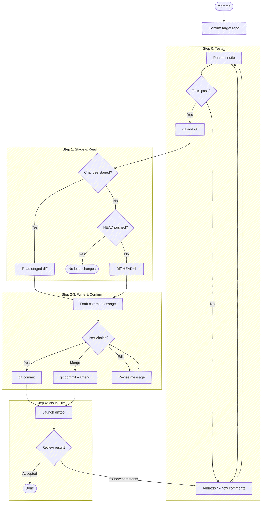

# Prepare Commit Message

Confirm the target repo, run tests, stage all changes, and generate a commit message.

**Don't narrate your work.** Every step below is an operating instruction, not a script to read aloud. Don't announce what you're about to do (*"/commit is the entry point; let me set up the tasks, confirm the repo, and run tests"*), don't report the plumbing of each command (ahead-counts, sidecar paths, *"launching in the background"*, *"let me read its stdout"*, *"confirming it's running"*), and don't restate the same status twice. Speak only when the user must act or decide: the resolved repo in one line, a failing test, the drafted message with its options, and the final review verdict. Where a step prescribes exact output (e.g. `Committed [short-sha]`), emit that and nothing more.



## Task tracking when orchestrated

At the very start, call `TaskList`. If any task is already `in_progress`, this
skill is running inside an orchestrator (e.g. a release workflow) — run silently
and do **not** create your own tasks; the orchestrator's list is the source of
truth. If nothing is `in_progress`, `/commit` is the entry point; enumerate these
steps as tasks:

- `Step 1: Run tests`
- `Step 2: Stage and read changes`
- `Step 3: Draft commit message`
- `Step 4: Commit`
- `Step 5: Visual diff review`

If the diff is empty and the skill exits early, mark remaining tasks `deleted`
rather than leaving them pending.

## Target repo

Before anything else, resolve which repo this operates on — the working directory isn't a reliable proxy (edits may have landed in a sibling repo). Re-resolve on every invocation; don't assume the previous target carries forward.

- **With an argument** (`/anchor:commit <name>`): case-insensitive substring-match `<name>` against the basename of every git repo the session has touched. One match → use it (confirm in one line). Zero or multiple → list the candidates and ask.
- **No argument**: run `git rev-parse --show-toplevel` from the working directory. If the session touched more than one repo, or edits landed outside it, state the resolved path and ask which to target.

Run git with `-C <repo>` when the working directory isn't the target, rather than `cd`. The test runner in Step 0 and every git command below operate on the resolved repo.

## Step 0: Run tests

Before reading changes, look for a test runner in the project (e.g., `just test`, `npm test`, `dotnet test`, `pytest`, `go test ./...`, a `Makefile` test target). Run the test suite.

If tests pass, proceed to Step 1.

If tests fail, **stop and fix them**. Present the failures and help the user resolve them. Do NOT proceed to Step 1 until the test suite exits cleanly. No exceptions — "pre-existing" failures still block the commit.

If no test suite is found, skip this step silently.

## Step 1: Stage and read changes

First, stage all changes:

```bash
git add -A
```

Then read what's staged:

```bash
git diff --cached --stat
```

```bash
git diff --cached
```

If nothing is staged after `git add -A`, fall back to describing the most recent commit. But first, verify HEAD hasn't already been pushed — otherwise you'd just be describing an already-published commit:

```bash
bash "${CLAUDE_PLUGIN_ROOT}/scripts/look-ahead.sh"
```

The helper prints the ahead-count (unpushed commits) or empty if no upstream is configured. If the count is `0`, HEAD equals the remote tracking branch — warn the user that there are no local changes (staged or committed) and stop.

Otherwise, diff the most recent commit:

```bash
git diff HEAD~1 --stat
```

```bash
git diff HEAD~1
```

If both staged and `HEAD~1` are empty, say so and stop.

## Step 2: Write the commit message

Write the message following the format in `templates/commit-message.md` — it owns the *shape* (the [cbea.ms](https://cbea.ms/git-commit/) rules and the trailer). Spend your effort on the *why*; the code already shows the *how*. If the change is trivial (typo fix, one-liner), a subject-only message is fine.

### Honor `anchor.*` config

Read the project + global anchor keys once:

```bash
git config --get-regexp '^anchor\.' 2>/dev/null
```

`--get-regexp` returns the names lowercased (`anchor.worktrackerbaseuri`); match them case-insensitively. Apply the keys relevant to a commit; absent keys keep anchor's defaults — never invent a value:

- **`anchor.workTrackerBaseUri`** — when the user mentions a ticket (a full tracker URL, or a bare id), append a `Refs:` trailer (a footer line after a blank line, below the body): use a full URL as-is, or build `<base-uri><id>` from a bare id. Don't scrape the branch or prompt for a ticket — no mention, no trailer. Skip it for a trivial subject-only commit unless the user asks.
- **`anchor.commitRules`** — an extra rule layered onto the default commit-message rules for this message (the escape hatch for anything without a dedicated key).

See `guides/configuring.md` for the full key set.

## Step 3: Output

First, display the `--stat` summary from Step 1 so the user can see what's being committed. Then output the commit message in a fenced code block:

```text
Subject line here

Body paragraph explaining why this change was made,
wrapped at 72 characters. Focus on context that isn't
obvious from the diff.
```

Before presenting options, check whether HEAD is ahead of the upstream (i.e., there is at least one unpushed commit):

```bash
bash "${CLAUDE_PLUGIN_ROOT}/scripts/look-ahead.sh"
```

**If output is empty (no upstream configured — common on freshly-created local branches that haven't been `push -u`'d yet):** fall back to the same `origin/main..HEAD` range Step 4 uses for the difftool — substitute the symbolic origin HEAD (`git symbolic-ref refs/remotes/origin/HEAD`) or `master` if `main` doesn't exist. A local-only branch with unpushed commits should still get the squash option; otherwise the heuristic silently misroutes the most common "I just made the first commit on a new branch" case.

**If the count is `0` (or the fallback finds no unpushed commits):** skip straight to the simple options — do not offer squash, do not run `git log`, do not mention unpushed commits:

1) **Accept** — commit as-is
2) **Edit** — tell you what to change

Squashing into a pushed commit requires force push, so the squash option must never appear when there are no unpushed commits.

**If the count is `>=1` (unpushed commits exist):** get the prior commit's subject line:

```bash
git log -1 --format=%s HEAD
```

**Then check whether a CR is open on this branch, and whether it's still a draft.** Once a CR is marked **ready** (non-draft), **force-pushing over commits a reviewer may have seen is off the table** — they should see each iteration as its own commit. While the CR is still a **draft**, mutable history remains the norm (anchor creates CRs as drafts for exactly this reason). Either way, this only protects *pushed* commits. If the squash target (HEAD) is itself unpushed, the reviewer has never seen it, and amending into it doesn't disturb the review at all.

At this point in the flow, HEAD is unpushed by definition — we only reach the squash-vs-new-commit decision when the earlier ahead-count probe (or the `origin/main..HEAD` fallback for local-only branches) reported a positive count, meaning HEAD has at least one commit (including itself) not on upstream. So the squash target is always safe to amend. An open review still informs the option text — surfacing context — but does not flip the recommendation away from amend.

**Narrow exception — message-only amend on a pushed commit no reviewer has engaged with yet.** This applies in a different code path (when HEAD itself is pushed, so the squash decision below doesn't fire). The rule's motivation is protecting reviewers from re-reviewing the same code; that motivation doesn't apply when the *diff is unchanged*. If the user reports the commit message is demonstrably wrong (e.g., pasted from a different repo, references identifiers that don't exist in this codebase, doesn't match what the diff actually does), the right action is `git commit --amend -F <msg-file>` to fix the message, then surface "force-push to overwrite the wrong message" as an explicit choice. The tree stays identical; only the message changes. Still surface the trade-off — "force-push affects only the message; the tree is unchanged" — and let the user decide. Do not extend this exception to content rewrites; the moment any file content moves, the standard rule applies again.

Detect the branch's open CR and its draft status with the matching forge tool (pick by the `origin` remote URL; empty output = no open CR):

```bash
# GitLab origin
glab mr view --output json 2>/dev/null | jq -r '.draft'
```

```bash
# GitHub origin
gh pr view --json isDraft --jq '.isDraft' 2>/dev/null
```

Use the relatedness heuristic regardless of review status. Decide whether the staged changes are **related** to the prior commit (continuation, fix, or refinement of the same work) or **unrelated** (different topic, different files, new task). Mark the recommended option with `(* recommended)` based on this judgment:

- **Related** → recommend squash
- **Unrelated** → recommend new commit

If a **ready** CR is open, annotate the squash option so the user knows the context (e.g., `_(amending the unpushed commit on top of the reviewed work — reviewer hasn't seen it)_`). If the open CR is still a **draft**, the annotation is lighter: `_(CR is draft — mutable history is the norm)_`. Do not flip the recommendation either way; the reviewer has only seen the pushed commits below HEAD, not HEAD itself.

Present options in recommended-first order:

If recommending a new commit:

1) **New commit** _(* recommended)_
2) **Squash into "[prior commit subject]"**
3) **Edit** — tell you what to change (e.g., "change the subject to X", "drop the second paragraph")

If recommending squash:

1) **Squash into "[prior commit subject]"** _(* recommended)_
2) **New commit**
3) **Edit** — tell you what to change (e.g., "change the subject to X", "drop the second paragraph")

If they choose New commit (or Accept when no squash option), run `git commit` with the message.

If they choose Squash, write a combined commit message covering both the prior commit and the new changes, present it for confirmation, then run `git commit --amend` with the new message.

If they choose Edit, commit with the drafted message then immediately open the editor:

```bash
git commit -m "..." && git commit --amend
```

### When a PreToolUse hook blocks the commit

Some hooks pattern-match on bash command substrings — destructive-operation gates (`npm install -g`, `git push --force`), secret-scanning regexes (`secret`/`token`/`password`/`api.?key`), or other safety guards. These can false-positive when the same string appears inside a heredoc'd commit message body — the hook sees the literal text and blocks the commit before `git` ever parses the heredoc. The trigger is often natural-language wording in the body that overlaps with the hook's keyword set.

If a commit attempt is rejected by a `PreToolUse` hook citing a substring that's actually inside the message body (not the executed command), stop and surface the conflict to the user. Do not reach for a temp-file workaround (`Write` to `/tmp/...` then `git commit -F`) — splitting the commit into a separate `Write` plus `Bash` doubles the permission prompts, hides the message body from the bash command preview, and introduces cross-session collision risk on predictable paths. The message wording is the right thing for the diff; the hook's matcher is the limitation. The user can approve the bypass for this commit or adjust the hook.

## Step 4: Launch visual diff

After committing, open the change in a visual review. Launch the wrapper in `--commit` mode — **not** raw `git difftool`. The wrapper determines the diff range from the unpushed-commit count (`@{upstream}...HEAD` for the first commit, `HEAD~1...HEAD` when earlier commits were already reviewed, an `origin/...` fallback when there's no upstream), pre-populates the commit subject / body / author / hash as a header, drives git's configured difftool, and — once it closes — prints the verdict on its own stdout. Raw `git difftool` bypasses the header and the verdict.

**Launch as a background call** (`run_in_background: true`): the wrapper blocks until the difftool closes, so a foreground call would hold the turn open until the Bash timeout.

```bash
bash "${CLAUDE_PLUGIN_ROOT}/scripts/review-diff.sh" --commit
```

When the background command completes, read its stdout with the **BashOutput tool** — not `tail` / `$(...)`, which trip the command-substitution gate. The last lines carry the verdict (no separate file read):

- `REVIEW_VERDICT` — `0` clean · `1` one-or-more fix-now · `2` unreviewed · `3` closed early · `absent` (the difftool wrote no verdict — e.g. the configured tool doesn't report one)
- `REVIEW_OUTPUT` — compact JSON; when the verdict is `1`, read `.comments` from here. Each comment is `{body, action, file?, startLine?, endLine?}`: `action` is `fix-now` (the blocker), `fix-later`, or `consider`; `body` is the reviewer's inline feedback; the optional `file` / `startLine` / `endLine` anchor it to a line range (a comment may target a file, a line range, or the whole changeset with no line). The verdict and comments come from the difftool's sidecar contract, defined normatively in [moor's `SPEC.md`](https://github.com/chris-peterson/moor/blob/main/SPEC.md) (`IM.OUT-*`).

Map the verdict to exactly this output and nothing more:

- **`0`** → `Committed [short-sha]`. If `.comments` carries advisory comments (`action` `fix-later` or `consider`), surface them — they don't gate the commit, but the user may want to act on them.
- **`1`** → `Committed [short-sha] — fix-now comments`, list the `fix-now` comments (the `.comments` entries where `action == "fix-now"`), then loop back to Step 0 (re-run tests after the fix). Surface any advisory (`fix-later` / `consider`) comments too. **If a comment's `body` is short** (e.g. "I don't get what this flag means") **and the cited line range contains more than one distinct change** (e.g. two flag additions in a usage block, two unrelated lines in the same range), ask the user which token the comment refers to before fixing — a one-second clarification beats several minutes of guessing wrong and re-amending. Fix the commented lines themselves; don't expand into adjacent pre-existing code (`guides/changeset-scope.md`).
- **`2`** → `Committed [short-sha] — unreviewed hunks, what do you want to change?`
- **`3` or `absent`** → `Committed [short-sha] — review closed without a verdict, what do you want to change?`

A difftool that speaks the sidecar contract (moor) returns the `0/1/2/3` verdict and the review comments; any other configured difftool yields `absent` and you ask the user directly. Either way the commit has already landed — apply any requested changes, re-stage, amend the commit (it's unpushed), and re-launch.
