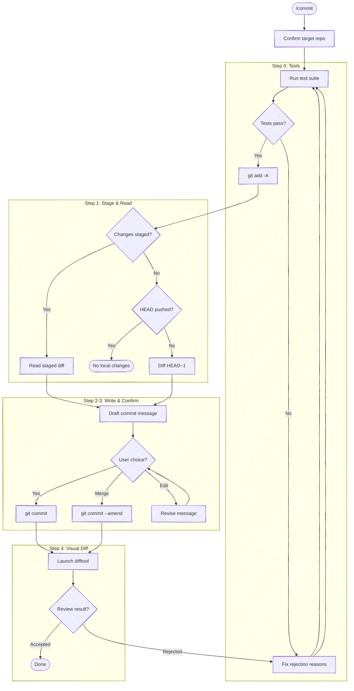

# Prepare Commit Message

Confirm the target repo, run tests, stage all changes, and generate a commit message.



## Task tracking when orchestrated

At the very start, call `TaskList`. If any task is already `in_progress`, this
skill is running inside an orchestrator (e.g. a release workflow) — run silently
and do **not** create your own tasks; the orchestrator's list is the source of
truth. If nothing is `in_progress`, `/commit` is the entry point; enumerate these
steps as tasks:

- `Step 1: Run tests`
- `Step 2: Stage and read changes`
- `Step 3: Draft commit message`
- `Step 4: Commit`
- `Step 5: Visual diff review`

If the diff is empty and the skill exits early, mark remaining tasks `deleted`
rather than leaving them pending.

## Target repo

Before anything else, resolve which repo this operates on — the working directory isn't a reliable proxy (edits may have landed in a sibling repo). Re-resolve on every invocation; don't assume the previous target carries forward.

- **With an argument** (`/anchor:commit <name>`): case-insensitive substring-match `<name>` against the basename of every git repo the session has touched. One match → use it (confirm in one line). Zero or multiple → list the candidates and ask.
- **No argument**: run `git rev-parse --show-toplevel` from the working directory. If the session touched more than one repo, or edits landed outside it, state the resolved path and ask which to target.

Run git with `-C <repo>` when the working directory isn't the target, rather than `cd`. The test runner in Step 0 and every git command below operate on the resolved repo.

## Step 0: Run tests

Before reading changes, look for a test runner in the project (e.g., `just test`, `npm test`, `dotnet test`, `pytest`, `go test ./...`, a `Makefile` test target). Run the test suite.

If tests pass, proceed to Step 1.

If tests fail, **stop and fix them**. Present the failures and help the user resolve them. Do NOT proceed to Step 1 until the test suite exits cleanly. No exceptions — "pre-existing" failures still block the commit.

If no test suite is found, skip this step silently.

## Step 1: Stage and read changes

First, stage all changes:

```bash
git add -A
```

Then read what's staged:

```bash
git diff --cached --stat
```

```bash
git diff --cached
```

If nothing is staged after `git add -A`, fall back to describing the most recent commit. But first, verify HEAD hasn't already been pushed — otherwise you'd just be describing an already-published commit:

```bash
bash "${CLAUDE_PLUGIN_ROOT}/scripts/ahead-count.sh"
```

The helper prints the ahead-count (unpushed commits) or empty if no upstream is configured. If the count is `0`, HEAD equals the remote tracking branch — warn the user that there are no local changes (staged or committed) and stop.

Otherwise, diff the most recent commit:

```bash
git diff HEAD~1 --stat
```

```bash
git diff HEAD~1
```

If both staged and `HEAD~1` are empty, say so and stop.

## Step 2: Write the commit message

Follow the seven rules from https://cbea.ms/git-commit/:

1. **Separate subject from body with a blank line**
2. **Limit the subject line to 50 characters** — hard limit 72
3. **Capitalize the subject line**
4. **Do not end the subject line with a period**
5. **Use the imperative mood** — "Add feature" not "Added feature". Test: "If applied, this commit will _[subject line]_"
6. **Wrap the body at 72 characters**
7. **Use the body to explain what and why, not how**

Focus on the *why* — the code already shows the *how*. If the change is trivial (typo fix, one-liner), a subject-only message is fine.

## Step 3: Output

First, display the `--stat` summary from Step 1 so the user can see what's being committed. Then output the commit message in a fenced code block:

```text
Subject line here

Body paragraph explaining why this change was made,
wrapped at 72 characters. Focus on context that isn't
obvious from the diff.
```

Before presenting options, check whether HEAD is ahead of the upstream (i.e., there is at least one unpushed commit):

```bash
bash "${CLAUDE_PLUGIN_ROOT}/scripts/ahead-count.sh"
```

**If output is empty (no upstream configured — common on freshly-created local branches that haven't been `push -u`'d yet):** fall back to the same `origin/main..HEAD` range Step 4 uses for the difftool — substitute the symbolic origin HEAD (`git symbolic-ref refs/remotes/origin/HEAD`) or `master` if `main` doesn't exist. A local-only branch with unpushed commits should still get the squash option; otherwise the heuristic silently misroutes the most common "I just made the first commit on a new branch" case.

**If the count is `0` (or the fallback finds no unpushed commits):** skip straight to the simple options — do not offer squash, do not run `git log`, do not mention unpushed commits:

1) **Accept** — commit as-is
2) **Edit** — tell you what to change

Squashing into a pushed commit requires force push, so the squash option must never appear when there are no unpushed commits.

**If the count is `>=1` (unpushed commits exist):** get the prior commit's subject line:

```bash
git log -1 --format=%s HEAD
```

**Then check whether a review is open on this branch.** Once anyone has opened an MR/PR, **force-pushing over commits the reviewer has already seen is off the table** — they should see each iteration as its own commit. But this rule only protects *pushed* commits. If the squash target (HEAD) is itself unpushed, the reviewer has never seen it, and amending into it doesn't disturb the review at all.

At this point in the flow, HEAD is unpushed by definition — we only reach the squash-vs-new-commit decision when the earlier ahead-count probe (or the `origin/main..HEAD` fallback for local-only branches) reported a positive count, meaning HEAD has at least one commit (including itself) not on upstream. So the squash target is always safe to amend. An open review still informs the option text — surfacing context — but does not flip the recommendation away from amend.

**Narrow exception — message-only amend on a pushed commit no reviewer has engaged with yet.** This applies in a different code path (when HEAD itself is pushed, so the squash decision below doesn't fire). The rule's motivation is protecting reviewers from re-reviewing the same code; that motivation doesn't apply when the *diff is unchanged*. If the user reports the commit message is demonstrably wrong (e.g., pasted from a different repo, references identifiers that don't exist in this codebase, doesn't match what the diff actually does), the right action is `git commit --amend -F <msg-file>` to fix the message, then surface "force-push to overwrite the wrong message" as an explicit choice. The tree stays identical; only the message changes. Still surface the trade-off — "force-push affects only the message; the tree is unchanged" — and let the user decide. Do not extend this exception to content rewrites; the moment any file content moves, the standard rule applies again.

Detect open reviews with the matching forge tool (pick by the `origin` remote URL):

```bash
# GitLab origin
glab mr list --source-branch "$(git rev-parse --abbrev-ref HEAD)" 2>/dev/null | grep -q '^![0-9]'
```

```bash
# GitHub origin
gh pr list --head "$(git rev-parse --abbrev-ref HEAD)" --json number --jq 'length>0' 2>/dev/null
```

Use the relatedness heuristic regardless of review status. Decide whether the staged changes are **related** to the prior commit (continuation, fix, or refinement of the same work) or **unrelated** (different topic, different files, new task). Mark the recommended option with `(* recommended)` based on this judgment:

- **Related** → recommend squash
- **Unrelated** → recommend new commit

If a review is open, annotate the squash option so the user knows the context (e.g., `_(amending the unpushed commit on top of the reviewed work — reviewer hasn't seen it)_`). Do not flip the recommendation; the reviewer has only seen the pushed commits below HEAD, not HEAD itself.

Present options in recommended-first order:

If recommending a new commit:

1) **New commit** _(* recommended)_
2) **Squash into "[prior commit subject]"**
3) **Edit** — tell you what to change (e.g., "change the subject to X", "drop the second paragraph")

If recommending squash:

1) **Squash into "[prior commit subject]"** _(* recommended)_
2) **New commit**
3) **Edit** — tell you what to change (e.g., "change the subject to X", "drop the second paragraph")

If they choose New commit (or Accept when no squash option), run `git commit` with the message.

If they choose Squash, write a combined commit message covering both the prior commit and the new changes, present it for confirmation, then run `git commit --amend` with the new message.

If they choose Edit, commit with the drafted message then immediately open the editor:

```bash
git commit -m "..." && git commit --amend
```

### When a PreToolUse hook blocks the commit

Some hooks pattern-match on bash command substrings — destructive-operation gates (`npm install -g`, `git push --force`), secret-scanning regexes (`secret`/`token`/`password`/`api.?key`), or other safety guards. These can false-positive when the same string appears inside a heredoc'd commit message body — the hook sees the literal text and blocks the commit before `git` ever parses the heredoc. The trigger is often natural-language wording in the body that overlaps with the hook's keyword set.

If a commit attempt is rejected by a `PreToolUse` hook citing a substring that's actually inside the message body (not the executed command), stop and surface the conflict to the user. Do not reach for a temp-file workaround (`Write` to `/tmp/...` then `git commit -F`) — splitting the commit into a separate `Write` plus `Bash` doubles the permission prompts, hides the message body from the bash command preview, and introduces cross-session collision risk on predictable paths. The message wording is the right thing for the diff; the hook's matcher is the limitation. The user can approve the bypass for this commit or adjust the hook.

## Step 4: Launch visual diff

After committing, launch a visual review.

**Determine the diff range from unpushed commit count:**

```bash
bash "${CLAUDE_PLUGIN_ROOT}/scripts/ahead-count.sh"
```

- **1 unpushed commit** (this is the first) — diff against upstream. Range: `@{upstream}...HEAD` (pass single-quoted to the wrapper).
- **2+ unpushed commits** — diff only the latest commit. Prior commits were already reviewed; avoid requiring re-review. Range: `HEAD~1...HEAD`.
- **No upstream tracking branch** (empty output) — fall back to `origin/main...HEAD`, then `origin/master...HEAD`.

If none of these produce a valid diff range, tell the user you couldn't determine the comparison target.

[moor](https://github.com/chris-peterson/moor) is the preferred reviewer but **optional** — check it's installed:

```bash
command -v moor
```

**If `moor` isn't on PATH**, delegate to git's configured difftool in directory mode. There's no `MOOR_CONTEXT` sidecar this way, so the rejected-hunk feedback loop isn't available — stand in for it by asking the user after the difftool closes (the commit has already landed):

```bash
git difftool --no-prompt --dir-diff <diff-range>
```

Then ask `Anything to change, or proceed? [describe changes / proceed]`. If the user names changes, apply them, re-stage, amend the commit (it's unpushed), and re-open the difftool. Otherwise report `Committed [short-sha] — reviewed via git difftool (moor not installed)`.

**If moor is present**, launch the difftool via the wrapper — **not** raw `git difftool`. The wrapper sets `MOOR_CONTEXT`, pre-populates the commit subject / body / author / hash in the file's `input` section so moor displays them in a header above the diff, and echoes `MOOR_CONTEXT=<path>` so you can locate the file. Running `git difftool` directly bypasses both and leaves you with no way to read the review outcome — and no header context.

**Launch via the wrapper — as a background call.** `git difftool` inside the wrapper blocks until you close moor, so launch with `run_in_background: true`; a foreground call holds the turn open until the Bash timeout.

```bash
bash "${CLAUDE_PLUGIN_ROOT}/scripts/moor-review.sh" <diff-range>
```

Then read the wrapper's stdout with the **BashOutput tool** — not `tail` / `$(...)` on the task output file, which trips the command-substitution permission gate. Poll until the `MOOR_CONTEXT=<path>` line appears (the wrapper echoes it once moor closes), then use the **Read tool** on that path. From the JSON, read `output.exitCode` (the verdict) and `output.rejections` (each `{file, hunk, line, reason}`) — moor writes these per its `MOOR_CONTEXT` sidecar contract, defined normatively in moor's [`SPEC.md`](https://github.com/chris-peterson/moor/blob/main/SPEC.md) (`IM.OUT-*`). Leave the context file in place; moor recycles it. /commit-specific phrasing:

- **`output.exitCode` `0`** → `Committed [short-sha]`. No other summary text.
- **`output.exitCode` `1`** → `Committed [short-sha] — rejected hunks detected`, list `output.rejections`, then loop back to Step 0 (re-run tests after the fix). **If the rejection text is short** (e.g. "I don't get what this flag means") **and the cited hunk contains more than one distinct change** (e.g. two flag additions in a usage block, two unrelated lines in the same hunk), ask the user to identify which token the note refers to before fixing — a one-second clarification beats several minutes of guessing wrong and re-amending.
- **`output.exitCode` `2`** → `Committed [short-sha] — unreviewed hunks, what do you want to change?`
- **`output.exitCode` `3` or absent** → `Committed [short-sha] — difftool closed without review, what do you want to change?`
