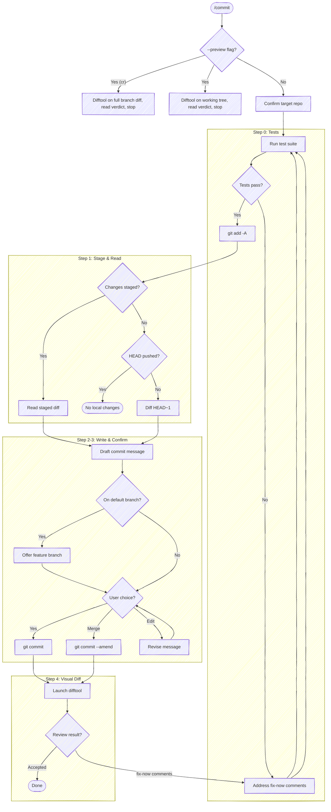

# Prepare Commit Message

Confirm the target repo, run tests, stage all changes, and generate a commit message.

**Don't narrate your work.** Every step below is an operating instruction, not a script to read aloud. Don't announce what you're about to do (*"/commit is the entry point; let me set up the tasks, confirm the repo, and run tests"*), don't report the plumbing of each command (ahead-counts, sidecar paths, *"launching in the background"*, *"let me read its stdout"*, *"confirming it's running"*), and don't restate the same status twice. Speak only when the user must act or decide: the resolved repo in one line, a failing test, the drafted message with its options, and the final review verdict. Where a step prescribes exact output (e.g. `Committed [short-sha]`), emit that and nothing more.



## Preview mode (`--preview`)

When invoked with `--preview`, this is a **look-only** path: open a diff in the difftool for review, then stop. Do **not** run tests, stage, draft a message, or commit — none of the steps below apply. Resolve the target repo the same way (see "Target repo"), pick the diff scope from the argument, and launch the shared wrapper as a **background** Bash call (`run_in_background: true`), exactly as Step 4 does for the post-commit review:

- **`--preview`** — the working tree vs `HEAD` (`--local`), to look over uncommitted work before committing. If the working tree is clean there's nothing uncommitted to show — but the branch may still hold unpushed commits worth a look before pushing. Check the unpushed-commit count:

  ```bash
  bash "${CLAUDE_PLUGIN_ROOT}/scripts/look-ahead.sh"
  ```

  If the count is `1` or more, offer the branch review — the whole branch vs the default branch, the same diff `--preview cr` shows — and run it when the user accepts:

  ```bash
  bash "${CLAUDE_PLUGIN_ROOT}/scripts/review-diff.sh" --full
  ```

  If the count is `0` or empty (nothing uncommitted and nothing unpushed), say so and stop rather than opening an empty diff.
- **`--preview cr`** (or `mr` / `pr`) — the whole branch vs the default branch (`--full`), the way a reviewer sees the change request. Useful for a self-review of the full changeset before you open or update the CR.

```bash
bash "${CLAUDE_PLUGIN_ROOT}/scripts/review-diff.sh" --local   # or --full for `cr` / `mr` / `pr`
```

Read the verdict back with the **BashOutput tool** (the `REVIEW_VERDICT` / `REVIEW_OUTPUT` contract is identical to Step 4 below). Map it to a one-line result — `Previewed — clean`, `Previewed — fix-now comments` (list them), `Previewed — unreviewed hunks` / `review closed without a verdict` — and surface any advisory `fix-later` / `consider` comments.

## Task tracking when orchestrated

At the very start, call `TaskList`. If any task is already `in_progress`, this
skill is running inside an orchestrator (e.g. a release workflow) — run silently
and do **not** create your own tasks; the orchestrator's list is the source of
truth. If nothing is `in_progress`, `/commit` is the entry point; enumerate these
steps as tasks. Label them by what happens, not by the `## Step N` headings
(the headings start at Step 0, so a numbered task list drifts one off) — and
don't split out a "read the diff" task, since reading is the input to drafting,
not a step of its own:

- `Run tests`
- `Stage changes`
- `Draft commit message`
- `Commit the checkpoint`
- `Review the commit (amend on fix-now)`

The last two read commit-then-review on purpose: the commit is a durable,
re-reviewable checkpoint, and a `fix-now` amends that still-unpushed commit and
re-reviews. (To review *before* committing, that's `--preview` — see below.)

If the diff is empty and the skill exits early, mark remaining tasks `deleted`
rather than leaving them pending.

## Target repo

Before anything else, resolve which repo this operates on — the working directory isn't a reliable proxy (edits may have landed in a sibling repo). Re-resolve on every invocation; don't assume the previous target carries forward.

- **With an argument** (`/anchor:commit <name>`): resolve the name through tack's repo db — `bash "${CLAUDE_PLUGIN_ROOT}/scripts/resolve-target.sh" <name>` (see the cookbook's "Resolving a named target repo"). On `TARGET_VIA=tack`, use `TARGET_LOCAL` as the checkout; committing needs a work tree, so if `TARGET_LOCAL` is empty (a known remote with no checkout) say so and stop rather than committing to the wrong place. `ambiguous` → prompt with `TARGET_CANDIDATES`. `cwd` (no tack, or no match) → fall back to a case-insensitive substring-match of `<name>` against the basename of every git repo the session has touched; one match → use it (confirm in one line), zero/multiple → ask.
- **No argument**: run `git rev-parse --show-toplevel` from the working directory. If the session touched more than one repo, or edits landed outside it, state the resolved path and ask which to target.

Run git with `-C <checkout>` when the working directory isn't the target, rather than `cd`. The test runner in Step 0 and every git command below operate on the resolved checkout. The helper scripts this skill launches — `look-ahead.sh`, `squash-check.sh`, `review-diff.sh` — read their own `origin`/git state, so pass them the same target: `--repo <checkout>` for a checkout you operate on directly, or `--worktree <path>` for a flow-owned isolated worktree. On its own each would otherwise fall back to the cwd repo. When the target is a *different* repo than the session cwd and the work will mutate it, isolate that work in a worktree first — see `scripts/worktree.sh` and prepare-review's "Operating against a non-cwd repo" for the setup/teardown lifecycle.

## Step 0: Run tests

Before reading changes, look for a test runner in the project (e.g., `just test`, `npm test`, `dotnet test`, `pytest`, `go test ./...`, a `Makefile` test target). Run the test suite.

If tests pass, proceed to Step 1.

If tests fail, **stop and fix them**. Present the failures and help the user resolve them. Do NOT proceed to Step 1 until the test suite exits cleanly. No exceptions — "pre-existing" failures still block the commit.

If no test suite is found, skip this step silently.

## Step 1: Stage and read changes

First, stage all changes:

```bash
git add -A
```

Then read what's staged:

```bash
git diff --cached --stat
```

```bash
git diff --cached
```

If nothing is staged after `git add -A`, fall back to describing the most recent commit. But first, verify HEAD hasn't already been pushed — otherwise you'd just be describing an already-published commit:

```bash
bash "${CLAUDE_PLUGIN_ROOT}/scripts/look-ahead.sh"
```

The helper prints the ahead-count (unpushed commits) or empty if no upstream is configured. If the count is `0`, HEAD equals the remote tracking branch — warn the user that there are no local changes (staged or committed) and stop.

Otherwise, diff the most recent commit:

```bash
git diff HEAD~1 --stat
```

```bash
git diff HEAD~1
```

If both staged and `HEAD~1` are empty, say so and stop.

## Step 2: Write the commit message

Write the message following the format in `templates/commit-message.md` — it owns the *shape* (the [cbea.ms](https://cbea.ms/git-commit/) rules and the trailer). Spend your effort on the *why*; the code already shows the *how*. If the change is trivial (typo fix, one-liner), a subject-only message is fine.

### Honor `anchor.*` config

Read the project + global anchor keys once:

```bash
git config --get-regexp '^anchor\.' 2>/dev/null
```

`--get-regexp` returns the names lowercased (`anchor.worktrackerbaseuri`); match them case-insensitively. Apply the keys relevant to a commit; absent keys keep anchor's defaults — never invent a value:

- **`anchor.workTrackerBaseUri`** — when the user mentions a ticket (a full tracker URL, or a bare id), append a `Refs:` trailer (a footer line after a blank line, below the body): use a full URL as-is, or build `<base-uri><id>` from a bare id. Don't scrape the branch or prompt for a ticket — no mention, no trailer. Skip it for a trivial subject-only commit unless the user asks.
- **`anchor.commitRules`** — an extra rule layered onto the default commit-message rules for this message (the escape hatch for anything without a dedicated key).

See `guides/configuring.md` for the full key set.

## Step 3: Output

First, display the `--stat` summary from Step 1 so the user can see what's being committed. Then output the commit message in a fenced code block:

```text
Subject line here

Body paragraph explaining why this change was made,
wrapped at 72 characters. Focus on context that isn't
obvious from the diff.
```

### When on the default branch — offer a feature branch first

Before committing, check whether HEAD is the default branch:

```bash
git branch --show-current
```

Compare it to the default (`git symbolic-ref --short refs/remotes/origin/HEAD | sed 's@^origin/@@'`, falling back to `main`/`master`). **If they match, don't just commit onto the default branch** — a commit meant for review belongs on a feature branch, and committing to the default branch directly is how work lands unreviewable (and how the leaked "commit on main, then try to open an MR from main" dead-end happens). Offer the branch, named from the subject you just drafted:

- **Slug the subject** — lowercase, non-alphanumeric runs → single hyphens, trim leading/trailing hyphens, cap ~50 chars. `Add retry to checkout` → `add-retry-to-checkout`.
- Ask with `AskUserQuestion` (header `Branch`), recommended option first so the default lands on branch creation:
  1. **Create branch `<slug>`** *(recommended)* — `git checkout -b <slug>`, then commit onto it.
  2. **Commit to `<default>`** — the deliberate direct-to-default case (a release commit, a docs typo on `main`); proceed as normal.
  3. **Edit name** — take a name from the user, then `git checkout -b <that>`.

Create the branch (when chosen) **before** the commit below, so the commit lands on the feature branch. When `/anchor:prepare-review` chained here, the recommended branch path is exactly what it needs — it re-gathers afterward and opens the CR from the new branch.

Committing directly to the default branch is never a squash target (the gate below blocks it via `default-branch-tip`), so even the "commit to `<default>`" path lands as a new commit rather than amending the published tip.

### Squash gate

Before presenting options, decide whether squashing the staged changes into HEAD (via `git commit --amend`) is on the table. The gate is *"is HEAD out for review?"* — the deterministic facts come from the helper, one launch-and-read:

```bash
bash "${CLAUDE_PLUGIN_ROOT}/scripts/squash-check.sh"
```

The block it prints:

| Key | What to do with it |
|-----|--------------------|
| `SQUASH_ALLOWED` | `1` → amending HEAD is safe; offer squash (gated further by relatedness below). `0` → squash is off the table; present the no-squash options |
| `SQUASH_BLOCK_REASON` | why squash is blocked: `other-author` (HEAD authored by someone else), `default-branch-tip` (HEAD is published on the default branch), or `cr-ready` (HEAD is pushed and the CR is out for review) |
| `SQUASH_NEEDS_FORCE_PUSH` | `1` → squash is allowed but HEAD is pushed (a draft CR, or no CR), so the amend must be followed by `git push --force-with-lease` |
| `CR_STATE` | `none` / `draft` / `ready` — the branch's open CR review state |
| `HEAD_AUTHOR_NAME` | name to cite in the `other-author` explanation |
| `PRIOR_SUBJECT` | HEAD's subject, for the squash option text |

The helper folds in the old unpushed-count probe (including the no-upstream `origin/<default>..HEAD` fallback), the author guard, and the CR-draft probe — don't re-run those.

### When `SQUASH_ALLOWED=0` — present the no-squash options

Squash is off the table; do not offer it. Present:

1) **Accept** — commit as-is (a new commit)
2) **Edit** — tell you what to change

Say why in one line:

- **`other-author`** — `HEAD was authored by <HEAD_AUTHOR_NAME> — squashing would rewrite their commit, so only a new commit is offered.` Amending rewrites HEAD in place; a commit someone else authored is never a squash target, even for a message-only fix.
- **`default-branch-tip`** — `HEAD is the published tip of <default> — amending it would rewrite shared history, so this lands as a new commit.` Reachable from `origin/<default>`, so amend + force-push would rewrite the published default branch. (This is also the "fresh feature branch, no commits of your own yet" case — HEAD is still the default-branch tip, so there's nothing of yours to squash into.) The message-only-amend exception below does **not** apply — never rewrite the published default branch.
- **`cr-ready`** — `CR is out for review — a reviewer relies on the per-commit "changes since" diff, so this lands as a new commit.`

**Narrow exception — message-only amend on a ready CR.** When the reason is `cr-ready` and the user reports the *message* (not the code) is demonstrably wrong — pasted from a different repo, references identifiers that don't exist here, doesn't match what the diff does — the tree is unchanged, so the reviewer-protection motivation doesn't apply. Offer `git commit --amend -F <msg-file>` to fix the message, then surface "force-push (`--force-with-lease`) affects only the message; the tree is unchanged" as an explicit choice and let the user decide. The `other-author` guard still holds — never amend someone else's commit even for a message fix. Do not extend this to content rewrites; the moment any file content moves, the standard gate applies again.

### When `SQUASH_ALLOWED=1` — apply the relatedness judgment

The gate is open; now *your* judgment decides squash vs new commit. Decide whether the staged changes are **related** to the prior commit (continuation, fix, or refinement of the same work) or **unrelated** (different topic, different files, new task):

- **Related** → recommend squash
- **Unrelated** → recommend new commit

When `SQUASH_NEEDS_FORCE_PUSH=1` (pushed draft CR), annotate the squash option so the user knows the follow-up push is a force-push — e.g. `_(CR is draft — mutable history is the norm; amend force-pushes with lease)_`. Don't let it flip the recommendation; a draft's history is expected to move.

Present options in recommended-first order:

If recommending a new commit:

1) **New commit** _(* recommended)_
2) **Squash into "[PRIOR_SUBJECT]"**
3) **Edit** — tell you what to change (e.g., "change the subject to X", "drop the second paragraph")

If recommending squash:

1) **Squash into "[PRIOR_SUBJECT]"** _(* recommended)_
2) **New commit**
3) **Edit** — tell you what to change (e.g., "change the subject to X", "drop the second paragraph")

### Act on the choice

If they choose New commit (or Accept when no squash option), run `git commit` with the message.

If they choose Squash, write a combined commit message covering both the prior commit and the new changes, present it for confirmation, then run `git commit --amend` with the new message. If `SQUASH_NEEDS_FORCE_PUSH=1`, follow the amend with `git push --force-with-lease` so the open draft CR updates to the rewritten history.

If they choose Edit, commit with the drafted message then immediately open the editor:

```bash
git commit -m "..." && git commit --amend
```

### When a PreToolUse hook blocks the commit

Some hooks pattern-match on bash command substrings — destructive-operation gates (`npm install -g`, `git push --force`), secret-scanning regexes (`secret`/`token`/`password`/`api.?key`), or other safety guards. These can false-positive when the same string appears inside a heredoc'd commit message body — the hook sees the literal text and blocks the commit before `git` ever parses the heredoc. The trigger is often natural-language wording in the body that overlaps with the hook's keyword set.

If a commit attempt is rejected by a `PreToolUse` hook citing a substring that's actually inside the message body (not the executed command), stop and surface the conflict to the user. Do not reach for a temp-file workaround (`Write` to `/tmp/...` then `git commit -F`) — splitting the commit into a separate `Write` plus `Bash` doubles the permission prompts, hides the message body from the bash command preview, and introduces cross-session collision risk on predictable paths. The message wording is the right thing for the diff; the hook's matcher is the limitation. The user can approve the bypass for this commit or adjust the hook.

## Step 4: Launch visual diff

After committing, open the change in a visual review. Launch the wrapper in `--commit` mode — **not** raw `git difftool`. The wrapper determines the diff range from the unpushed-commit count (`@{upstream}...HEAD` for the first commit, `HEAD~1...HEAD` when earlier commits were already reviewed, an `origin/...` fallback when there's no upstream), pre-populates the commit subject / body / author / hash as a header, drives git's configured difftool, and — once it closes — prints the verdict on its own stdout. Raw `git difftool` bypasses the header and the verdict.

**Launch as a background call** (`run_in_background: true`): the wrapper blocks until the difftool closes, so a foreground call would hold the turn open until the Bash timeout.

```bash
bash "${CLAUDE_PLUGIN_ROOT}/scripts/review-diff.sh" --commit
```

When the background command completes, read its stdout with the **BashOutput tool** — not `tail` / `$(...)`, which trip the command-substitution gate. The last lines carry the verdict (no separate file read):

- `REVIEW_VERDICT` — `0` clean · `1` one-or-more fix-now · `2` unreviewed · `3` closed early · `absent` (the difftool wrote no verdict — e.g. the configured tool doesn't report one)
- `REVIEW_OUTPUT` — compact JSON; when the verdict is `1`, read `.comments` from here. Each comment is `{body, action, file?, startLine?, endLine?}`: `action` is `fix-now` (the blocker), `fix-later`, or `consider`; `body` is the reviewer's inline feedback; the optional `file` / `startLine` / `endLine` anchor it to a line range (a comment may target a file, a line range, or the whole changeset with no line). The verdict and comments come from the difftool's sidecar contract, defined normatively in [moor's `SPEC.md`](https://github.com/chris-peterson/moor/blob/main/SPEC.md) (`IM.OUT-*`).

Map the verdict to exactly this output and nothing more:

- **`0`** → `Committed [short-sha]`. If `.comments` carries advisory comments (`action` `fix-later` or `consider`), surface them — they don't gate the commit, but the user may want to act on them.
- **`1`** → `Committed [short-sha] — fix-now comments`, list the `fix-now` comments (the `.comments` entries where `action == "fix-now"`), then loop back to Step 0 (re-run tests after the fix). Surface any advisory (`fix-later` / `consider`) comments too. **If a comment's `body` is short** (e.g. "I don't get what this flag means") **and the cited line range contains more than one distinct change** (e.g. two flag additions in a usage block, two unrelated lines in the same range), ask the user which token the comment refers to before fixing — a one-second clarification beats several minutes of guessing wrong and re-amending. Fix the commented lines themselves; don't expand into adjacent pre-existing code (`guides/changeset-scope.md`).
- **`2`** → `Committed [short-sha] — unreviewed hunks, what do you want to change?`
- **`3` or `absent`** → `Committed [short-sha] — review closed without a verdict, what do you want to change?`

A difftool that speaks the sidecar contract (moor) returns the `0/1/2/3` verdict and the review comments; any other configured difftool yields `absent` and you ask the user directly. Either way the commit has already landed — apply any requested changes, re-stage, amend the commit (it's unpushed), and re-launch.
