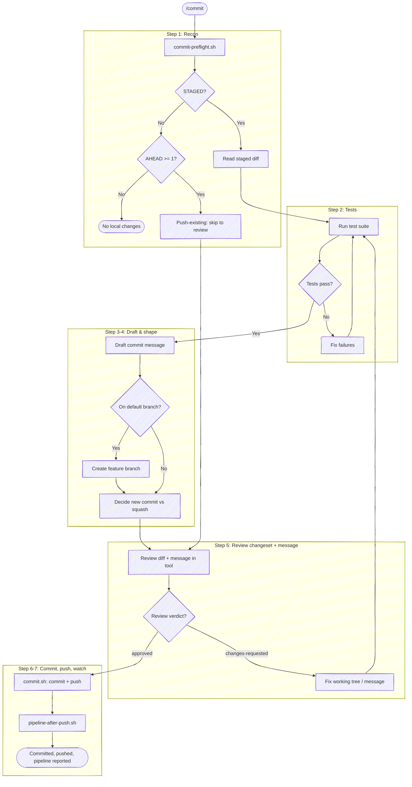

# Commit and Push

Stage all changes and read the repo's state, run tests, draft a commit message, review the pending changeset, then — once the review is clean — commit and push in one step.

**Don't narrate your work.** Every step below is an operating instruction, not a script to read aloud — follow the execute-quietly discipline: `${CLAUDE_PLUGIN_ROOT}/guides/execute-quietly.md`. For `/commit`, the only things worth surfacing are the resolved repo in one line, a failing test, any branch/shape decision that needs the user, and the review verdict; where a step prescribes exact output (e.g. `Committed [short-sha], pushed`), emit that and nothing more. **The message is not presented in chat** — it's shown in the review tool (Step 5); don't print it or ask about it separately. No "checks pass, now staging…" transitions: run the step, read the result, move on.

**The pre-flight is internal — present the decision, not the derivation.** Staging, the working-tree state, the squash-gate result, the ahead-count, and the commit-vs-squash routing rationale are all inputs that *drive* the next decision; they are not output. Surface the decision and its options — the proposed route, the drafted message — never the `KEY=value` a helper emits, the "one commit ahead, unpushed" bookkeeping, or the chain of internal facts that led to the route. A sentence that explains *why* before it shows *what*, walking the user through the state you just read, is the failure this catches.


```mermaid
%%{ init: { 'look': 'handDrawn' } }%%
flowchart TD
    Start(["/commit"]) --> Stage

    subgraph "Step 1: Recon"
        Stage["commit-preflight.sh"] --> Staged{STAGED?}
        Staged -->|Yes| ReadDiff["Read staged diff"]
        Staged -->|No| CheckHead{AHEAD >= 1?}
        CheckHead -->|No| Stop([No local changes])
        CheckHead -->|Yes| ReadHead["Push-existing: skip to review"]
    end

    subgraph "Step 2: Tests"
        Tests["Run test suite"] --> TestResult{Tests pass?}
        TestResult -->|No| FixTests["Fix failures"] --> Tests
    end

    subgraph "Step 3-4: Draft & shape"
        Draft["Draft commit message"] --> OnDefault{On default branch?}
        OnDefault -->|Yes| Branch["Create feature branch"] --> Shape
        OnDefault -->|No| Shape["Decide new commit vs squash"]
    end

    subgraph "Step 5: Review changeset + message"
        ReviewStep["Review diff + message in tool"] --> Review{Review verdict?}
        Review -->|changes-requested| FixReview["Fix working tree / message"]
    end

    subgraph "Step 6-7: Commit, push, watch"
        CommitPush["commit.sh: commit + push"] --> Watch["pipeline-after-push.sh"]
        Watch --> Done([Committed, pushed, pipeline reported])
    end

    %% Cross-subgraph edges live here, after every node is declared: mermaid
    %% assigns a node to whichever subgraph mentions it first, so wiring these
    %% inline would pull ReviewStep and CommitPush into the wrong boxes.
    ReadDiff --> Tests
    TestResult -->|Yes| Draft
    Shape --> ReviewStep
    ReadHead --> ReviewStep
    FixReview --> Tests
    Review -->|approved| CommitPush
```

## Task tracking when orchestrated

At the very start, call `TaskList`. **Only track tasks when orchestrated:** if a
task is already `in_progress`, this skill is running inside an orchestrator (e.g.
a release workflow) — run silently and do **not** create your own tasks; the
orchestrator's list is the source of truth. If nothing is `in_progress`, `/commit`
is a direct interactive invocation — **don't create a task list.** It's a short
flow whose payoff is seeing the review quickly; a five-item task list is exactly
the ceremony that buries the preview. Just run the steps.

Review precedes the commit on purpose: the pending changeset (and the drafted
message) are reviewed against `HEAD`, and only a clean verdict commits and pushes.
A `changes-requested` verdict sends you back through tests and re-review rather
than amending a commit that already exists.

## Target repo

Before anything else, resolve which repo this operates on — the working directory isn't a reliable proxy (edits may have landed in a sibling repo). Re-resolve on every invocation; don't assume the previous target carries forward.

- **With an argument** (`/anchor:commit <name>`): resolve the name through tack's repo db — `bash "${CLAUDE_PLUGIN_ROOT}/scripts/resolve-target.sh" <name>` (see the cookbook's "Resolving a named target repo"). On `TARGET_VIA=tack`, use `TARGET_LOCAL` as the checkout; committing needs a work tree, so if `TARGET_LOCAL` is empty (a known remote with no checkout) say so and stop rather than committing to the wrong place. `ambiguous` → prompt with `TARGET_CANDIDATES`. `cwd` (no tack, or no match) → fall back to a case-insensitive substring-match of `<name>` against the basename of every git repo the session has touched; one match → use it (confirm in one line), zero/multiple → ask.
- **No argument**: don't probe for it — the pre-flight in Step 1 defaults to the working directory and reports the checkout it resolved as `REPO_ROOT`. Read it from that block rather than spending a call on `git rev-parse --show-toplevel`. If the session touched more than one repo, or edits landed outside it, state that resolved path and ask which to target before going further.

Run git with `-C <checkout>` when the working directory isn't the target, rather than `cd`. The test runner in Step 2 and every git command below operate on the resolved checkout. The helper scripts this skill launches — `commit-preflight.sh`, `review-diff.sh`, `commit.sh` — read their own `origin`/git state, so pass them the same target: `--repo <checkout>` for a checkout you operate on directly, or `--worktree <path>` for a flow-owned isolated worktree. On its own each would otherwise fall back to the cwd repo. When the target is a *different* repo than the session cwd and the work will mutate it, isolate that work in a worktree first — see `${CLAUDE_PLUGIN_ROOT}/scripts/worktree.sh` and prepare-review's "Operating against a non-cwd repo" for the setup/teardown lifecycle.

## Step 1: Stage and read changes

**This is the first command the flow runs.** It's cheap, deterministic, and it decides whether the later steps have anything to do — so nothing precedes it, tests included. Run the pre-flight recon **once**; it stages the paths you name, then gathers the resolved checkout, staging state, stat, branch/default, ahead-count, squash gate, and `anchor.*` config into one `KEY=value` block, so the steps below read a single command's output instead of six separate probes:

```bash
bash "${CLAUDE_PLUGIN_ROOT}/scripts/commit-preflight.sh" --path <p> [--path <p>...]
```

**Name every path you changed, and nothing else.** One `--path` per file, relative to `REPO_ROOT`; an absolute path is refused. This is not `git add -A`: a checkout can be shared with another agent session, and staging the whole tree puts that session's in-flight files into your review and your commit, under a message that doesn't describe them. Take the list from the edits *you* made this session — the files you wrote, plus any you deleted or renamed. A path with nothing to stage is an error (exit 65), which is how a typo or a wrong-root path surfaces instead of quietly dropping a file from the commit.

If the user asks to commit work you didn't make yourself, list the paths from `git status --porcelain` first, show them, and confirm the set before staging.

Act only on the keys; don't re-run the folded-in probes (`git add`, `look-ahead.sh`, `squash-check.sh`):

| Key | Use |
|-----|-----|
| `REPO_ROOT` | the resolved checkout — the target this run operates on (see "Target repo") |
| `STAGED` | `1` → a change to commit (read its full diff below, then test in Step 2); `0` → see push-existing |
| `OTHER_STAGED` | `>0` → someone else staged paths you didn't name. Say so, name the count, and carry the same `--path` list into Steps 5-6 so their work stays out of your commit. Don't unstage it — it isn't yours |
| `STAT` | the diffstat total — what's in scope |
| `BRANCH` / `DEFAULT_BRANCH` / `ON_DEFAULT_BRANCH` | the branch decision in Step 4 |
| `AHEAD` | unpushed commit count (empty = no upstream) — drives push-existing |
| `SQUASH` / `SQUASH_FORCE_PUSH` / `ALLOW_MESSAGE_AMEND` / `PRIOR_SUBJECT` | the squash gate in Step 4 |
| `ANCHOR_CONFIG` | the `anchor.*` keys (JSON) for Steps 3-4 |

When `STAGED=1`, read the full staged diff so you can draft the message:

```bash
git diff --cached
```

**Push-existing** — when `STAGED=0`: if `AHEAD` is `0` or empty, nothing is staged and nothing is unpushed — warn there are no local changes and stop. If `AHEAD` is `≥1`, the branch has unpushed commit(s) to push: **skip Steps 2-4**, review that range in Step 5 (`review-diff.sh --commit`, not `--local`), and push in Step 6. Read the range (substitute `DEFAULT_BRANCH`):

```bash
git diff "origin/main...HEAD"
```

(The message-only-amend case — an unpushed commit whose *message* is wrong, tree unchanged — is the `ALLOW_MESSAGE_AMEND` path in Step 4, not this push-only path.)

## Step 2: Run tests

Reached only when Step 1 found something to commit (`STAGED=1`). **Skip the suite on the push-existing and nothing-to-do routes** — there's no new code to test, and those commits were tested when they were made. Running it there spends the wall-clock of a full suite to learn the run is a `git push`.

Look for a test runner in the project (e.g., `just test`, `npm test`, `dotnet test`, `pytest`, `go test ./...`, a `Makefile` test target) and run it. Discovery is yours on purpose rather than scripted: you can report progress on a slow suite, pick the right target when a repo exposes several, and act on a failure in the same pass.

**Gate on the exit code, not on the output.** A suite's stdout is not a reliable pass/fail signal: a runner that exercises a validator against known-bad fixtures prints `*** Found 1 error(s)` on a *successful* run, and `| tail -30` of that reads as a failure. Reading the output then re-running to get a clean exit code runs the suite twice. So capture the status on the first invocation and let that decide. Run the suite bare and read the status the harness reports with it; a non-zero exit is surfaced without you asking for it. Where you need a pipeline's status, put the pipeline in a script and run the script — the safety analyzer reads only the outer command line, so `${PIPESTATUS[0]}` inside `bash run-tests.sh` costs nothing, while a `;`-sequenced `echo "exit: $?"` on the command line is gated on its shape and no allow rule can reach it.

**Run the suite as its own Bash call.** Don't chain it onto another command with `&&` or fold it into a `$(…)`: a compound hides the consequential step from the permission prompt, and a non-zero exit from either half becomes ambiguous.

**A passing suite is silent.** Don't report it: it's an input to the next step, not a decision the user makes (`${CLAUDE_PLUGIN_ROOT}/guides/execute-quietly.md`). Proceed to Step 3 without a word about tests.

If tests fail, **stop and fix them**. Present the failures and help the user resolve them. Do NOT proceed to Step 3 until the test suite exits cleanly. No exceptions — "pre-existing" failures still block the commit.

If no test suite is found, skip this step silently.

## Step 3: Write the commit message

Write the message following the format in `${CLAUDE_PLUGIN_ROOT}/templates/commit-message.md` — it owns the *shape* (the [cbea.ms](https://cbea.ms/git-commit/) rules and the trailer). Spend your effort on the *why*; the code already shows the *how*. If the change is trivial (typo fix, one-liner), a subject-only message is fine.

Keep the body free of loaded framing — temporal blame, size-minimizers, self-congratulatory adverbs, defensive softeners. The tone discipline lives in `${CLAUDE_PLUGIN_ROOT}/guides/loaded-framing.md` (shared with `prepare-review` and `issue`); consult it while drafting.

### Honor `anchor.*` config

`ANCHOR_CONFIG` from Step 1's block holds the `anchor.*` keys as JSON (`{}` when none); the names come back lowercased (`anchor.worktrackerbaseuri`) — match case-insensitively. Apply the keys relevant to a commit; absent keys keep `anchor`'s defaults — never invent a value:

- **`anchor.workTrackerBaseUri`** — when the user mentions a ticket (a full tracker URL, or a bare id), append a `Refs:` trailer (a footer line after a blank line, below the body): use a full URL as-is, or build `<base-uri><id>` from a bare id. Don't scrape the branch or prompt for a ticket — no mention, no trailer. Skip it for a trivial subject-only commit unless the user asks.
- **`anchor.commitRules`** — an extra rule layered onto the default commit-message rules for this message (the escape hatch for anything without a dedicated key).
- **`anchor.commitVerbosity`** — an integer 1–100 setting where the message *body* sits between brevity and thoroughness. **Unset behaves as `50`**: the why, plus the context the diff doesn't carry. **It is not a word budget** — nothing is counted or truncated, and two changesets at the same setting run to different lengths. Clamp an out-of-range or non-integer value into the 1–100 band and say so once rather than failing the draft.

  Apply it to the body alone. **The subject line is not on the dial** — its format rules (imperative, ≤50 chars, no trailing period) are the template's and hold at every setting, and so does the `Refs:` trailer. Work down this order and stop where the draft balances where the setting asks: asides and the clause qualifying a claim nobody disputes → the decisions-and-alternatives prose, down to the decision itself → the context paragraph, down to its *why* sentence. The floor is one sentence of why; a trivial change still earns the subject-only message the template allows, which is a judgment about the change, not a verbosity setting.

See `${CLAUDE_PLUGIN_ROOT}/guides/configuring.md` for the full key set.

Write the drafted message to a temp file (`$(mktemp -u /tmp/commit-msg.XXXXXX).md`) with the Write tool — the literal `/tmp` is what a caller's `Edit(//tmp/**)` grant reaches (`${CLAUDE_PLUGIN_ROOT}/guides/temp-paths.md`). Step 5 passes it into the review so you review the message alongside the diff, and Step 6 commits it (or the reviewer's edited version).

## Step 4: Settle the branch and shape

Nothing is committed in this step — it settles *where* and *how* the commit lands: the branch to commit on, and whether this is a new commit or a squash. The **message itself isn't confirmed here** — it rides into the Step 5 review, where you read it beside the diff (and, on moor, edit it in the tool).

**Show the `--stat` summary from Step 1 only when this step actually asks the user something** — the branch prompt or the squash prompt below. There it's the scope the choice applies to. On the path where neither fires (the ordinary `SQUASH=blocked` commit on a feature branch, which is the common one), there is no question for it to qualify, and Step 5's review opens on the same changeset moments later; printing it there is a line of output attached to no decision.

### When on the default branch — create a feature branch first

The commit **pushes** (Step 6), so landing directly on the default branch publishes to it. Step 1's block already resolved this: `ON_DEFAULT_BRANCH=1` (HEAD is `DEFAULT_BRANCH`) is the case to guard. **When it's `1`, don't commit onto the default branch** — a commit meant for a CR belongs on a feature branch, and pushing to the default branch directly lands the work with no CR for anyone else to review. Step 5 reviews the diff and the message on both paths; what the default branch skips is the CR, not the user's own look at the change — so describe this choice as landing without a CR, never as skipping or bypassing review. Offer the branch, named from the subject you just drafted:

- **Slug the subject** — lowercase, non-alphanumeric runs → single hyphens, trim leading/trailing hyphens, cap ~50 chars. `Add retry to checkout` → `add-retry-to-checkout`.
- Ask with `AskUserQuestion` (header `Branch`), recommended option first so the default lands on branch creation:
  1. **Create branch `<slug>`** *(recommended)* — `git checkout -b <slug>`, then the rest of the flow commits and pushes onto it.
  2. **Commit to `<default>`** — the deliberate, explicit direct-to-default case (a release commit, a docs typo on `main`); the flow proceeds and pushes to the default branch, so the change lands without a CR. Never the default path.
  3. **Edit name** — take a name from the user, then `git checkout -b <that>`.

Create the branch (when chosen) **before** the commit, so the commit lands — and pushes — on the feature branch. Once `/commit` pushes that branch, `prepare-review` opens the CR against it (it operates on an already-pushed branch and never pushes itself).

Committing directly to the default branch is never a squash target — the gate below returns `SQUASH=blocked`, so even the "commit to `<default>`" path lands as a new commit rather than amending the published tip.

### Squash gate

Whether squashing the staged changes into HEAD (via `git commit --amend` in Step 6) is on the table comes from **Step 1's block** — the gate is *"is HEAD out for review?"*, decided by `squash-check.sh` (folded into the recon), which returns only what you act on:

| Key | What to do with it |
|-----|--------------------|
| `SQUASH` | `allowed` → amending HEAD is safe; offer squash (gated further by relatedness below). `blocked` → the ordinary new commit (below) |
| `SQUASH_FORCE_PUSH` | meaningful only when `allowed`: `1` → HEAD is pushed (a draft CR, or no CR), so the amend must be followed by `git push --force-with-lease` in Step 6 |
| `ALLOW_MESSAGE_AMEND` | `1` → squash is `blocked`, but a message-only amend is permitted (the ready-CR case); gates the exception below. `0` → no amend of any kind |
| `PRIOR_SUBJECT` | HEAD's subject, for the squash option text |

The gate folds the push-state probe (including the no-upstream `origin/<default>..HEAD` fallback), the author guard, and the CR-draft probe into that decision — don't re-run them. It deliberately does **not** emit *why* squash is blocked: the block reason, push count, CR state, and author identity stay inside the script, so there's nothing here to narrate or keep quiet by hand (`${CLAUDE_PLUGIN_ROOT}/guides/execute-quietly.md`).

### When `SQUASH=blocked` — the ordinary commit

The vanilla path, and the common one: HEAD isn't yours to rewrite or it's out for review, so a plain new commit is the only sensible outcome — exactly what the user asked for when they said "commit." Nothing to confirm here — the message is reviewed in Step 5, and the shape is a **new commit**, so proceed straight to Step 5. The user never raised squashing; don't mention it.

**Narrow exception — message-only amend (`ALLOW_MESSAGE_AMEND=1`).** When the helper permits a message-only amend and the user reports the *message* (not the code) is demonstrably wrong — pasted from a different repo, references identifiers that don't exist here, doesn't match what the diff does — the tree is unchanged, so the reviewer-protection motivation doesn't apply. Plan a message-only amend via Step 6's `commit.sh --mode amend --force-with-lease` to fix the message (there is no tree change to review, so this skips Step 5), and surface "force-push (`--force-with-lease`) affects only the message; the tree is unchanged" as an explicit choice in Step 6. The flag fires only where this is safe (a ready CR whose tree a message fix leaves untouched); when it's `0`, no amend — a new commit is the only path. Do not extend it to content rewrites; the moment any file content moves, the standard gate applies again.

### When `SQUASH=allowed` — apply the relatedness judgment

The gate is open; now *your* judgment decides squash vs new commit. Decide whether the staged changes are **related** to the prior commit (continuation, fix, or refinement of the same work) or **unrelated** (different topic, different files, new task):

- **Related** → recommend squash
- **Unrelated** → recommend new commit

When `SQUASH_FORCE_PUSH=1` (pushed draft CR), annotate the squash option so the user knows the follow-up push is a force-push — e.g. `_(CR is draft — mutable history is the norm; amend force-pushes with lease)_`. Don't let it flip the recommendation; a draft's history is expected to move.

Present the two options in recommended-first order (the message is reviewed in Step 5, so there's no message-edit option here):

If recommending a new commit:

1) **New commit** _(* recommended)_
2) **Squash into "[PRIOR_SUBJECT]"**

If recommending squash:

1) **Squash into "[PRIOR_SUBJECT]"** _(* recommended)_
2) **New commit**

Record the choice (new commit vs squash) and proceed to Step 5; the review runs before either is executed.

### When a PreToolUse hook blocks the commit

Some hooks pattern-match on bash command substrings — destructive-operation gates (`npm install -g`, `git push --force`), secret-scanning regexes (`secret`/`token`/`password`/`api.?key`), or other safety guards. These can false-positive when the same string appears inside a heredoc'd commit message body — the hook sees the literal text and blocks the commit before `git` ever parses the heredoc. The trigger is often natural-language wording in the body that overlaps with the hook's keyword set.

If a commit attempt in Step 6 is rejected by a `PreToolUse` hook citing a substring that's actually inside the message body (not the executed command), stop and surface the conflict to the user. Do not reach for a temp-file workaround (`Write` to `/tmp/...` then `git commit -F`) — splitting the commit into a separate `Write` plus `Bash` doubles the permission prompts, hides the message body from the bash command preview, and introduces cross-session collision risk on predictable paths. The message wording is the right thing for the diff; the hook's matcher is the limitation. The user can approve the bypass for this commit or adjust the hook.

## Step 5: Review the pending changeset

Before committing, open the pending changeset — the working tree vs `HEAD`, the exact changes Step 6 will commit — in a visual review, **with the drafted message shown alongside it**. Launch the **dispatcher** in `--local` mode with `--message-file` (the message file from Step 3) — **not** raw `git difftool`. It stages the paths you name so a new file is in the diff at all, diffs the tree against `HEAD`, seeds the drafted message (subject as the headline, body as prose) plus a repo/branch/summary header, drives this skill's configured review backend (`anchor.commit.reviewBackend`, else `anchor.reviewBackend` — see the configuring guide's Defaults table), and — once it closes — prints the normalized result on its own stdout. So you review the message and the diff *together* — no separate chat gate — and on moor you can edit the message in the tool (it returns as `editedFields`). Raw `git difftool` bypasses the header and the verdict.

**Launch as a background call** (`run_in_background: true`): the dispatcher blocks until the review closes, so a foreground call would hold the turn open until the Bash timeout.

**Don't announce the launch.** The backend puts the diff on screen itself — a terminal overlay (revdiff) or its own window (moor) — so the user can see it. A line saying the review is open, and what's in it, describes what the tool is already showing. The next thing you say is the verdict (or what the review asked for).

```bash
bash "${CLAUDE_PLUGIN_ROOT}/scripts/review-diff.sh" --skill commit --local --message-file <commit-msg-path> --path <p> [--path <p>...]
```

`--skill commit` is what lets this skill's backend differ from the rest — `anchor.commit.reviewBackend` over `anchor.reviewBackend` — so pass it on every launch below.

Pass the **same `--path` list** you gave the Step 1 pre-flight. The review and the commit have to cover the same set of files, or the user grades a changeset that isn't the one that lands.

(On the **push-existing** path from Step 1 — nothing staged, unpushed commits to push — there's no drafted message; review those commits instead of the working tree: `review-diff.sh --skill commit --commit`. That path is a diff with no drafted artifact, so on the `editor` backend it returns `no-verdict` naming the key to change — report that rather than pushing unreviewed.)

When the background command completes, read its stdout with the **BashOutput tool** — not `tail` / `$(...)`, which trip the command-substitution gate. The last lines carry the verdict (no separate file read):

- `REVIEW_VERDICT` — `approved` · `changes-requested` · `incomplete` · `no-verdict`.
- `REVIEW_OUTPUT` — compact JSON carrying `verdict`, `backend`, `comments[]`, `editedFields[]`, `capabilities`, and `raw` (the DIFF contract, defined normatively in the plugin `SPEC.md`). Each comment is `{body, target, file?, startLine?, endLine?, side?}`, where `target` is `line` / `file` / `changeset`. Comments are ungraded: every one is feedback to address, and the verdict — not a per-comment tier — says whether it blocks.

Act on the verdict:

- **`approved`** → the changeset is clean; proceed to Step 6 to commit and push. If `comments` is non-empty, the reviewer approved *and* left feedback: surface it — the verdict says it doesn't gate the commit, but the user may want to act on it (now, or as a follow-up).
- **`changes-requested`** → **do not commit.** List every comment — they're ungraded, so all of them are the ask — then loop back to Step 2: fix the commented lines in the working tree, re-run tests, and re-review. **If a comment's `body` is short** (e.g. "I don't get what this flag means") **and the cited line range contains more than one distinct change** (e.g. two flag additions in a usage block, two unrelated lines in the same range), ask the user which token the comment refers to before fixing — a one-second clarification beats several minutes of guessing wrong. Fix the commented lines themselves; don't expand into adjacent pre-existing code (`${CLAUDE_PLUGIN_ROOT}/guides/changeset-scope.md`).
- **`incomplete`** → `Unreviewed changes — what do you want to change?` Nothing is committed until the review is clean.
- **`no-verdict`** → nothing is committed; read the cause from the result, say what happened in one line, and walk the fallback ladder in `${CLAUDE_PLUGIN_ROOT}/guides/review-fallback.md`. `backend: "difftool"` (or `capabilities.producesVerdict: false`) means a plain difftool showed the change — what moor's adapter falls through to when moor isn't there — and it grades nothing, so the ladder applies to it exactly as it does to a backend that died (see `raw.exitCode`). **Never ask `Reviewed in your difftool — commit and push?`**: a launched window is not evidence anything was read, and treating it as approval is what the verdict exists to prevent. Here the ladder's changeset rung is the one to walk — go file by file over the pending changeset in your reply.
- **No verdict line at all** — stdout is empty, holds only stderr text, or carries no parseable `REVIEW_VERDICT` → the dispatcher exited before it could report (a bad argument, an unreadable message file, a missing `jq`, a backend that died). **Treat this exactly as `no-verdict`: nothing is committed.** Report what the output did say, then take the same ladder. An absent result is the one case where proceeding is most tempting and least defensible: it looks like nothing went wrong precisely because nothing was reported.

**The message is under review too.** If the result carries `editedFields` for the commit message — moor, when the reviewer edited it in-tool, or the `editor` backend, where the saved buffer *is* the message — use that edited text as the message in Step 6, overwrite the Step 3 message file with it. Adopt it verbatim: it's the user's own wording, not a comment to draft from. A `changes-requested` comment with `target: "commit-message"` is feedback on the message itself — revise the message and re-review. On a backend that can't round-trip an edited message (`capabilities.editableCommitMessage: false`, e.g. revdiff), keep the drafted message unless a comment asks to change it.

## Step 6: Commit and push

Reached only on a clean review (or the message-only-amend exception, which has no tree change to review). `anchor` performs the commit **and** the push through one helper — `commit.sh` — rather than separate `git commit` / `git push` calls: it's a single allowlistable invocation, and it owns the push-variant plumbing (the `@{u}` / `origin/<default>` probes) so that logic never runs from skill prose.

The message file already exists — the one from Step 3, or the reviewer's edited version if Step 5 returned `editedFields`. For a **squash**, write a combined message covering both the prior commit and the new changes to that file first. Then launch the helper with the shape chosen in Step 4:

- **New commit** → `--mode new --message-file <path>`
- **Squash** → `--mode amend --message-file <path>`; add `--force-with-lease` when `SQUASH_FORCE_PUSH=1` (HEAD is pushed).
- **Message-only amend** (the `ALLOW_MESSAGE_AMEND` exception) → `--mode amend --message-file <path> --force-with-lease` (a ready CR's HEAD is pushed); surface the force-push as the explicit Step 4 choice first.
- **Push-existing** (Step 1 found nothing staged but unpushed commits) → `--mode push-existing` (no message file — there's no commit to make).

```bash
bash "${CLAUDE_PLUGIN_ROOT}/scripts/commit.sh" --mode new --message-file <path> --path <p> [--path <p>...]
```

Carry the **same `--path` list** through from Steps 1 and 5, so the commit holds exactly what was reviewed. It scopes the commit as well as the staging: a path someone else staged stays staged rather than riding into your commit. The message-only amend is the one call that takes no `--path` — there is no tree change to scope, and `--amend` keeps every file the commit already carried.

`commit.sh` picks the push variant itself — `-u origin <branch>` for a branch with no upstream, plain `git push` otherwise, `git push --force-with-lease` when you pass `--force-with-lease`. It also **refuses to commit onto the default branch** unless you pass `--allow-default-branch`; the Step 4 branch guard means you're normally already on a feature branch, so pass that flag only for the deliberate "commit to `<default>`" case the user chose there. Target a non-cwd checkout with `--repo <checkout>` / `--worktree <path>`, same as the other helpers.

Read the helper's stdout — `COMMIT_SHA`, `BRANCH`, `PUSH_MODE`, and `PUSHED=ok` on success. Report the outcome and nothing more — `Committed <COMMIT_SHA>, pushed to <BRANCH>` — followed by any comments an `approved` review left unaddressed. If the push is rejected (non-fast-forward, protected branch, auth), `commit.sh` leaves git's error on stderr and exits non-zero; surface that and stop rather than retrying or force-pushing without the lease.

## Step 7: Report the pipeline the push triggered

The push is what starts CI, so this flow is holding the answer to whether the commit went green — don't leave the branch pushed-but-unverified and make the user think to ask. Reached only on a successful push (`PUSHED=ok`); a rejected push has no pipeline to watch.

The watch blocks while it polls, so launch it as a **background** Bash call (`run_in_background: true`) immediately after reporting the commit, and read its stdout with the **BashOutput tool** when it completes:

```bash
bash "${CLAUDE_PLUGIN_ROOT}/scripts/pipeline-after-push.sh" --skill commit
```

Nothing about *whether* to watch is decided here — the helper owns it:

- **`PIPELINE_WATCH=skipped`** → `PIPELINE_WATCH_REASON` says `config-off` (a config key turned it off) or `already-reported` (every run for this commit has been reported already). Either way there is nothing to report; end the flow silently.
- **`PIPELINE_WATCH=ran`** → the same `KEY=value` lines `/anchor:pipeline` reads follow it. Report them following `${CLAUDE_PLUGIN_ROOT}/templates/pipeline-report.md`, including its "After a push" notes.

Retarget it the way you retargeted `commit.sh` (`--repo` / `--worktree`). The commit is already reported, so this never holds the flow open — the pipeline report lands when the watch settles.
