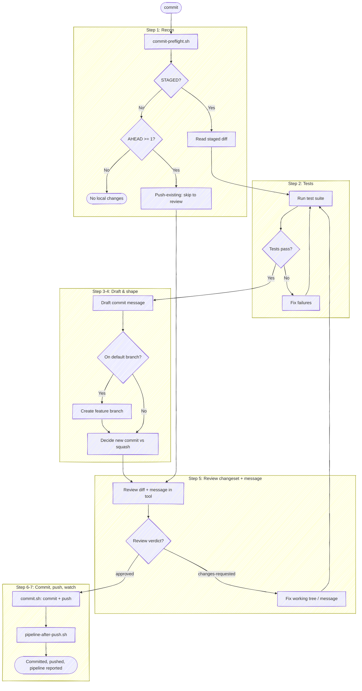

# Commit and Push

Before using a bundled path, resolve `<anchor-root>` to the installed plugin root
from the host's value or this `SKILL.md` path, then follow the host-neutral tool
conventions in `<anchor-root>/guides/host-runtime.md`.

Stage all changes and read the repo's state, run tests, draft a commit message, review the pending changeset, then — once the review is clean — commit and push in one step.

**Keep plumbing quiet.** Every step below is an operating instruction, not a script to read aloud — follow the execute-quietly discipline: `<anchor-root>/guides/execute-quietly.md`. For `commit`, the only things worth surfacing are the resolved repo in one line, a failing test, any branch/shape decision that needs the user, and the review verdict; where a step prescribes exact output (e.g. `Committed [short-sha], pushed`), emit that and nothing more. **The message is not presented in chat** — it's shown in the review tool (Step 5); don't print it or ask about it separately. No "checks pass, now staging…" transitions: run the step, read the result, move on.

**The pre-flight is internal — present the decision, not the derivation.** Staging, the working-tree state, the squash-gate result, the ahead-count, and the commit-vs-squash routing rationale are all inputs that *drive* the next decision; they are not output. Surface the decision and its options — the proposed route, the drafted message — never the `KEY=value` a helper emits, the "one commit ahead, unpushed" bookkeeping, or the chain of internal facts that led to the route. A sentence that explains *why* before it shows *what*, walking the user through the state you just read, is the failure this catches.

## Task tracking when orchestrated

If the host exposes task tracking, inspect it first. **Only track tasks when
orchestrated:** if a task is already in progress, this skill is running inside an
orchestrator (for example, a release workflow) — run inside that list and do not
create your own tasks; the orchestrator's list is the source of truth. If the
host has no task mechanism, follow an evident enclosing workflow without
inventing one. Otherwise `commit` is a direct interactive invocation — do not
create a task list. It's a short flow whose payoff is seeing the review quickly;
a five-item task list is exactly the ceremony that buries the preview.

Review precedes the commit on purpose: the pending changeset (and the drafted
message) are reviewed against `HEAD`, and only a clean verdict commits and pushes.
A `changes-requested` verdict sends you back through tests and re-review rather
than amending a commit that already exists.

## Target repo

Before anything else, resolve which repo this operates on — the working directory isn't a reliable proxy (edits may have landed in a sibling repo). Re-resolve on every invocation; don't assume the previous target carries forward.

- **With an argument** (`anchor:commit <name>`): resolve the name — `bash "<anchor-root>/scripts/resolve-target.sh" <name>` (see the cookbook's "Resolving a named target repo"). On `TARGET_VIA=resolved`, use `TARGET_LOCAL` as the checkout; committing needs a work tree, so if `TARGET_LOCAL` is empty (the repo exists on the forge but isn't the one you're standing in) say so and stop rather than committing to the wrong place. `ambiguous` → prompt with `TARGET_CANDIDATES`. `cwd` (no match) → fall back to a case-insensitive substring-match of `<name>` against the basename of every git repo the session has touched; one match → use it (confirm in one line), zero/multiple → ask.
- **No argument**: don't probe for it — the pre-flight in Step 1 defaults to the working directory and reports the checkout it resolved as `REPO_ROOT`. Read it from that block rather than spending a call on `git rev-parse --show-toplevel`. If the session touched more than one repo, or edits landed outside it, state that resolved path and ask which to target before going further.

Run git with `-C <checkout>` when the working directory isn't the target, rather than `cd`. The test runner in Step 2 and every git command below operate on the resolved checkout. The helper scripts this skill launches — `commit-preflight.sh`, `review-diff.sh`, `commit.sh` — read their own `origin`/git state, so pass them the same target with `--repo <checkout>`. On its own each would otherwise fall back to the cwd repo.
