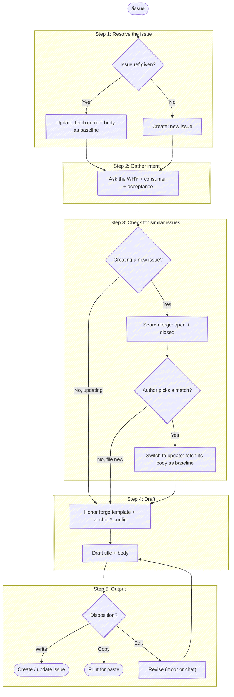

# Issue

Draft an issue whose job is to convey *why* the work is needed and *how* the author intends to approach it — written for a reader who has never seen this part of the system. An issue describes work **to be done**, so unlike `commit` and `prepare-review` there is no diff to read from: the raw material is the author's intent, gathered up front.

**Don't narrate your work.** Every step below is an operating instruction, not a script to read aloud — follow the execute-quietly discipline: `${CLAUDE_PLUGIN_ROOT}/guides/execute-quietly.md`. For this skill, the only things worth surfacing are a question you need answered, the drafted issue with its options, and the final URL. Full principle: `${CLAUDE_PLUGIN_ROOT}/guides/execute-quietly.md`.

Issue = a GitHub issue or a GitLab issue. Pick the forge tool by the `origin` remote.



## Target repo

By default this operates on the repo backing the working directory — pick the forge from its `origin` remote (`gh` for GitHub, `glab` for GitLab). But an issue is often filed *against a different repo* than the one you're sitting in ("file this against `payments-api`", "open an issue in `customer-svc`"). Don't guess from cwd or improvise a `-R` from a half-remembered slug — resolve the name through tack's repo db:

```bash
bash "${CLAUDE_PLUGIN_ROOT}/scripts/resolve-target.sh" <name>
```

Act on `TARGET_VIA`:

- **`cwd`** — no tack, or no match (`TARGET_NOTE` says which). Fall back to the cwd `origin`, exactly as today. If the user clearly meant a repo that *didn't* resolve, say so rather than silently filing against the cwd repo.
- **`ambiguous`** — `TARGET_CANDIDATES` holds the matches as `[{key,url,local}]`. Present them with `AskUserQuestion` and let the user pick; proceed with the chosen entry.
- **`tack`** — exactly one match. Use the emitted fields for every forge call below:
  - `TARGET_FORGE` picks the CLI (`gh` / `glab`).
  - **GitHub:** add `-R <TARGET_PROJECT>` to the `gh issue …` calls.
  - **GitLab:** the create/update use `glab api projects/:fullpath/…`, but `:fullpath` resolves from the *cwd* git dir — substitute the URL-encoded `TARGET_PROJECT` for `:fullpath` and add `--hostname <TARGET_HOST>` (required for self-hosted, harmless elsewhere).
  - `TARGET_LOCAL` — the checkout, when one exists. Only the template step needs it; create/update are pure-remote and work without it (the common case for a repo you don't have checked out).

## Step 1: Resolve the issue

Pick the forge per **Target repo** above (`gh` for GitHub, `glab` for GitLab).

- **An issue URL or number was provided** → **update** that issue. Pull its current body to a temp file now (`$(mktemp -u "${TMPDIR:-/tmp}/issue-current.XXXXXX").md`); Step 5 diffs the draft against it:

  ```bash
  # GitHub
  gh issue view <num> --json body --jq '.body' > <current-path>
  ```

  ```bash
  # GitLab
  glab issue view <iid> --output json | jq -r '.description' > <current-path>
  ```

- **No issue reference** → **create** a new issue.

## Step 2: Gather intent before drafting

There is no diff to mine, so the author's answers *are* the issue. Ask for what's missing — don't draft around a gap:

- **Why** — what problem this solves or what need it serves, and why it matters now.
- **Consumer** — who is the primary caller or consumer of the change?
- **Acceptance** — what does "done" look like? Concrete criteria or scenarios.
- **Approach** *(if the author has one in mind)* — the intended plan and any key design decisions. If they don't yet, the issue can be a problem statement without a proposed approach; don't invent one.

Wait for answers before drafting. If the only open item is the WHY, ask:

> **What problem does this solve, and why does it matter?** A sentence or two is enough — and who's the primary consumer of the change?

## Step 3: Check for similar issues

This step runs only on the **create** path — skip it when updating a known issue. A duplicate issue splits the discussion, so before drafting search the forge for issues that already cover this need: **open** ones (filing would duplicate active work) and **closed** ones (already done, or declined).

Distill two to four search keywords from the intent gathered in Step 2 — the subject of the work, not the WHY prose. Then search:

```bash
# GitHub — open + closed, most-recently-updated first
gh issue list --search "<keywords> sort:updated-desc" --state all --limit 10 \
  --json number,title,url,state,updatedAt
```

```bash
# GitLab — open + closed (--all), matching title and description
glab issue list --search "<keywords>" --in title,description --all --output json
```

Judge the results — a keyword hit on an unrelated issue is noise, not a match. If nothing genuinely overlaps, continue to Step 4 without comment. If one or more issues plausibly cover this need, present them with the `AskUserQuestion` tool (header `Similar issues`):

- One option per plausible candidate, labeled `#<num> <title>` and tagged by state (`[open]` / `[closed]`). Picking one means *this is the issue* → switch to the update path: fetch its current body as the baseline (the Step 1 fetch), then draft against it.
- **None of these — file new** (default) — proceed to Step 4 as a create.

## Step 4: Draft the issue

### Honor an existing forge template

Before drafting, check whether the project ships an issue template. This reads the repo's files, so it needs a **local checkout** — look under the cwd repo, or under `TARGET_LOCAL` when a `tack` target resolved one (`ls <TARGET_LOCAL>/.gitlab/issue_templates/*.md`). When the target is remote-only (`TARGET_LOCAL` empty), skip template detection and note that a project template, if the repo has one, wasn't applied — don't block the issue on a checkout you don't have.

- **GitLab:** `.gitlab/issue_templates/*.md` (respect the configured default if more than one)
- **GitHub:** `.github/ISSUE_TEMPLATE/*.md`, or the legacy `.github/ISSUE_TEMPLATE.md`. A `.yml` **issue form** is a structured format — don't compose prose into it; surface it and let the author fill it in the web UI.

If a template exists, it's the team's required scaffolding — **compose into it, don't replace it.** Fill the sections it defines, preserve its checklists and headings verbatim, and **strip any "delete before publishing" instruction block** after following its guidance. On a structure conflict the team template wins. The composition rules live in the "Honoring a project's forge template" section of `templates/issue-description.md`.

### Honor `anchor.*` config

Read the project + global anchor keys once:

```bash
git config --get-regexp '^anchor\.' 2>/dev/null
```

`--get-regexp` returns the names lowercased (`anchor.issuerules`); match them case-insensitively. Apply the keys relevant to an issue; absent keys keep anchor's defaults — never invent a value:

- **`anchor.workTrackerBaseUri`** — when the author mentions a ticket (a full tracker URL, or a bare id), link it in the Context section: use a full URL as-is, or build `<base-uri><id>` from a bare id. No mention, no link.
- **`anchor.issueRules`** — an extra standing rule layered onto every issue (the escape hatch for anything without a dedicated key).

`anchor.reviewBudgetMins` does not apply to issues. See `${CLAUDE_PLUGIN_ROOT}/guides/configuring.md` for the full key set.

### Body structure

Draft a concise imperative **title** (under 72 characters), then the body following the section template in `templates/issue-description.md`: **Context**, **Proposed approach**, **Acceptance criteria**, and **Considerations** *(optional)*. The template owns the *shape*; the discipline below owns the *technique*.

- **Lead with why, write for the unfamiliar reader** — the same ELI5 audience assumption `prepare-review` uses. Establish the system/business context in a sentence or two before the detail.
- **Keep the approach about the plan, not the code** — what's being built and why the load-bearing decisions were made, not how every class is wired.
- **Define unfamiliar terms with short callouts** (`> **Term?** …`), sparingly and only where a newcomer would be lost.
- **Diagram only when it carries shape prose hides** — anchor's mermaid conventions (hand-drawn look, no `\n`/`<br>` in labels).
- **Same "what to avoid" discipline as a CR description** — no loaded framing (`${CLAUDE_PLUGIN_ROOT}/guides/loaded-framing.md`), no drift artifacts, no leaked deliberation, nothing the reader can already see.
- **Watch the rendering gotchas** — the body is pasted into a markdown renderer; the bundled `${CLAUDE_PLUGIN_ROOT}/guides/markdown-gotchas.md` lists the traps (character escaping, nested fences, mermaid, `<details>`, tables in lists).

## Step 5: Output

Write the drafted body to a temp file (`$(mktemp -u "${TMPDIR:-/tmp}/issue-draft.XXXXXX").md`).

**Present the change.** When updating an existing issue, diff the draft against the baseline captured in Step 1 and present it in a fenced `diff` block:

```bash
git --no-pager diff --no-index <current-path> <draft-path>
```

When creating a new issue, display the full title and body in a fenced code block.

Then ask the user how to proceed with the `AskUserQuestion` tool. Use header `Disposition` and these options (default first):

- **Yes (write)** — create the issue (or push the updated body). The body comes from `<draft-path>`. On a 401/403 or similar auth failure, surface it and ask the user to refresh credentials — don't silently fall back to copy-only (per the fail-fast-on-auth rule).
- **No (copy only)** — print the title and body for the user to paste into the web UI themselves.
- **Edit** — adjust something, then re-present.

### Yes (write)

anchor assigns new issues to you. The canonical invocations — including the `glab api`-then-`glab issue update` two-step GitLab needs for a file-sourced body, and the update-from-file forms — live in the bundled forge cookbook (`${CLAUDE_PLUGIN_ROOT}/guides/forge-cookbook.md`), sections "Issue create" and "Issue description update from a file".

When a `tack` target resolved (see **Target repo**), retarget these off the cwd repo: add `-R <TARGET_PROJECT>` to the `gh issue` calls; on GitLab substitute the URL-encoded `TARGET_PROJECT` for `:fullpath` and add `--hostname <TARGET_HOST>` on the `glab api` calls, and `-R <TARGET_URL>` on `glab issue update`.

```bash
# GitHub — create
gh issue create --title "<title>" --body-file <draft-path> --assignee @me

# GitHub — update
gh issue edit <num> --body-file <draft-path>
```

```bash
# GitLab — create (API form so the body can come from a file), then assign
glab api -X POST projects/:fullpath/issues -F title="<title>" -F "description=@<draft-path>"
glab issue update <iid> --assignee <username>

# GitLab — update
glab api -X PUT projects/:fullpath/issues/<iid> -F "description=@<draft-path>"
```

After the issue lands, print its URL.

### Edit

[moor](https://github.com/chris-peterson/moor) is the preferred edit surface but **optional** — check `command -v moor`. If present, open a one-off review of the current body vs. the draft (when updating) or the draft alone, launched via the wrapper as a **background** Bash call so it doesn't hold the turn open:

```bash
bash "${CLAUDE_PLUGIN_ROOT}/scripts/review-diff.sh" --files \
  <current-path> <draft-path> \
  --title 'Issue body — proposed edits' \
  --detail repo=<repo>
```

Read the verdict back with the **BashOutput tool** (not `tail` / `$(...)`). Only `REVIEW_VERDICT` `0` is approval; `1` carries `fix-now` comments in `REVIEW_OUTPUT.comments` to fold in before re-presenting; `2`/`3`/`absent` mean the review didn't complete — surface what happened and fall back to chat rather than treating silence as approval. (The full verdict contract matches the `prepare-review` skill's Step 4.) If `moor` isn't on PATH, fall back to chat: ask what to change, revise, and re-present.
