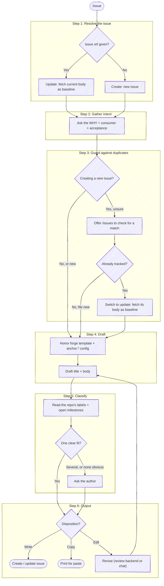

# Issue

File a new issue whose job is to convey *why* the work is needed and *how* the author intends to approach it — written for a reader who has never seen this part of the system. This is the singular, authoring counterpart to the `issues` skill: `issue` *drafts and writes* one issue (a new one, or an update to a known one), while `issues` *surveys the backlog* to find the next thing to work on. An issue describes work **to be done**, so unlike `commit` and `prepare-review` there is no diff to read from: the raw material is the author's intent, gathered up front.

**Don't narrate your work.** Every step below is an operating instruction, not a script to read aloud — follow the execute-quietly discipline: `${CLAUDE_PLUGIN_ROOT}/guides/execute-quietly.md`. For this skill, the only things worth surfacing are a question you need answered, the drafted issue with its options, and the final URL.

Issue = a GitHub issue or a GitLab issue. Pick the forge tool by the `origin` remote.


```mermaid
%%{ init: { 'look': 'handDrawn' } }%%
flowchart TD
    Start(["/issue"]) --> Mode{Issue ref given?}

    subgraph "Step 1: Resolve the issue"
        Mode -->|Yes| Update["Update: fetch current body as baseline"]
        Mode -->|No| Create["Create: new issue"]
    end

    subgraph "Step 2: Gather intent"
        Update --> Why["Ask the WHY + consumer + acceptance"]
        Create --> Why
    end

    subgraph "Step 3: Guard against duplicates"
        Why --> FromCreate{Creating a new issue?}
        FromCreate -->|Yes, unsure| Check["Offer /issues to check for a match"]
        Check --> Match{Already tracked?}
        Match -->|Yes| Reuse["Switch to update: fetch its body as baseline"]
    end

    subgraph "Step 4: Draft"
        Tmpl["Honor forge template + anchor.* config"]
        Tmpl --> Draft["Draft title + body"]
    end

    FromCreate -->|No, or new| Tmpl
    Match -->|No, file new| Tmpl
    Reuse --> Tmpl

    subgraph "Step 5: Classify"
        Draft --> Meta["Read the repo's labels + open milestones"]
        Meta --> Fit{One clear fit?}
        Fit -->|Several, or none obvious| Choose["Ask the author"]
    end

    subgraph "Step 6: Output"
        Fit -->|Yes| Out{Disposition?}
        Choose --> Out
        Out -->|Write| Forge(["Create / update issue"])
        Out -->|Copy| CopyOnly(["Print for paste"])
        Out -->|Edit| Revise["Revise (review backend or chat)"] --> Draft
    end
```

## Target repo

By default this operates on the repo backing the working directory — pick the forge from its `origin` remote (`gh` for GitHub, `glab` for GitLab). But an issue is often filed *against a different repo* than the one you're sitting in ("file this against `payments-api`", "open an issue in `customer-svc`"). Don't guess from cwd or improvise a `-R` from a half-remembered slug — resolve the name:

```bash
bash "${CLAUDE_PLUGIN_ROOT}/scripts/resolve-target.sh" <name>
```

Act on `TARGET_VIA`:

- **`cwd`** — no match (`TARGET_NOTE` separates "no repo by that name" from "no authenticated forge to ask"). Fall back to the cwd `origin`. If the user clearly meant a repo that *didn't* resolve, say so rather than silently filing against the cwd repo.
- **`ambiguous`** — `TARGET_CANDIDATES` holds the matches as `[{key,url,local}]`. Present them with `AskUserQuestion` and let the user pick; proceed with the chosen entry.
- **`resolved`** — exactly one match. Use the emitted fields for every forge call below:
  - `TARGET_FORGE` picks the CLI (`gh` / `glab`).
  - **GitHub:** add `-R <TARGET_PROJECT>` to the `gh issue …` calls.
  - **GitLab:** the create/update use `glab api projects/:fullpath/…`, but `:fullpath` resolves from the *cwd* git dir — substitute the URL-encoded `TARGET_PROJECT` for `:fullpath` and add `--hostname <TARGET_HOST>` (required for self-hosted, harmless elsewhere).
  - `TARGET_LOCAL` — the checkout, set when the target is the repo you're standing in. Only the template step needs it; create/update are pure-remote and work without it (the common case for a repo you named from elsewhere).

## Step 1: Resolve the issue

Pick the forge per **Target repo** above (`gh` for GitHub, `glab` for GitLab).

- **An issue URL or number was provided** → **update** that issue. Pull its current body to a temp file now (`$(mktemp -u /tmp/issue-current.XXXXXX).md`); Step 6 diffs the draft against it:

  ```bash
  # GitHub
  gh issue view <num> --json body --jq '.body' > <current-path>
  ```

  ```bash
  # GitLab
  glab issue view <iid> --output json | jq -r '.description' > <current-path>
  ```

- **No issue reference** → **create** a new issue.

## Step 2: Gather intent before drafting

There is no diff to mine, so the author's answers *are* the issue. Ask for what's missing — don't draft around a gap:

- **Why** — what problem this solves or what need it serves, and why it matters now.
- **Consumer** — who is the primary caller or consumer of the change?
- **Acceptance** — what does "done" look like? Concrete criteria or scenarios.
- **Approach** *(if the author has one in mind)* — the intended plan and any key design decisions. If they don't yet, the issue can be a problem statement without a proposed approach; don't invent one.

Wait for answers before drafting. If the only open item is the WHY, ask:

> **What problem does this solve, and why does it matter?** A sentence or two is enough — and who's the primary consumer of the change?

## Step 3: Guard against duplicates

This step runs only on the **create** path — skip it when updating a known issue. A duplicate issue splits the discussion, so before drafting a brand-new issue, make sure one doesn't already cover this need.

Finding and picking issues is the `issues` skill's job — don't re-implement a forge search here. If it's unclear whether this need is already tracked, say so and offer to run `issues` (scoped to a keyword or two distilled from the intent — the subject of the work, not the WHY prose) to survey open and closed issues first. If the user already knows it's new, or a quick look turns up nothing that genuinely overlaps, continue to Step 4 without further comment.

If it turns out the need *is* already tracked, this is an update, not a new issue: take that issue's number and switch to the update path — fetch its current body as the baseline (the Step 1 fetch), then draft against it.

## Step 4: Draft the issue

### Honor an existing forge template

Before drafting, check whether the project ships an issue template. This reads the repo's files, so it needs a **local checkout** — look under `TARGET_LOCAL` when a target resolved one (`ls <TARGET_LOCAL>/.gitlab/issue_templates/*.md`). When the target is remote-only (`TARGET_LOCAL` empty), skip template detection and note that a project template, if the repo has one, wasn't applied — don't block the issue on a checkout you don't have.

- **GitLab:** `.gitlab/issue_templates/*.md` (respect the configured default if more than one)
- **GitHub:** `.github/ISSUE_TEMPLATE/*.md`, or the legacy `.github/ISSUE_TEMPLATE.md`. A `.yml` **issue form** is a structured format — don't compose prose into it; surface it and let the author fill it in the web UI.

If a template exists, it's the team's required scaffolding — **compose into it, don't replace it.** Fill the sections it defines, preserve its checklists and headings verbatim, and **strip any "delete before publishing" instruction block** after following its guidance. On a structure conflict the team template wins. The composition rules live in the "Honoring a project's forge template" section of `${CLAUDE_PLUGIN_ROOT}/templates/issue-description.md`.

### Honor `anchor.*` config

Read the project + global `anchor.*` keys once:

```bash
git config --get-regexp '^anchor\.' 2>/dev/null
```

`--get-regexp` returns the names lowercased (`anchor.issuerules`); match them case-insensitively. Apply the keys relevant to an issue; absent keys keep `anchor`'s defaults — never invent a value:

- **`anchor.workTrackerBaseUri`** — when the author mentions a ticket (a full tracker URL, or a bare id), link it in the Context section: use a full URL as-is, or build `<base-uri><id>` from a bare id. No mention, no link.
- **`anchor.issueRules`** — an extra standing rule layered onto every issue (the escape hatch for anything without a dedicated key).
- **`anchor.issueVerbosity`** — an integer 1–100 setting where the issue body sits between brevity and thoroughness. **Unset behaves as `75`** — the highest of `anchor`'s four verbosity defaults, which descend as the audience widens (issue `75` → commit `50` → CR `25` → release `10`). An issue's audience is the few people who'll do the work, and background that would pad a release note saves them a conversation here. **It is not a word budget** — nothing is counted or truncated. Clamp an out-of-range or non-integer value into the 1–100 band and say so once rather than failing the draft.

  **It abbreviates sections; it never removes one.** Which sections an issue has is the template's call — `anchor`'s own shape, or the team's when the project ships one — and a section that earns its place is present at every setting. Work down this order and stop where the draft balances where the setting asks: callouts and asides → the Proposed approach's explanation, down to its load-bearing decisions → Considerations, down to one sentence per concern → Context's second paragraph, then the first down to its *why* sentence. **Acceptance criteria are never abbreviated at any setting**: they state what done means, so they're the issue's floor the way deep links are a CR description's. A low setting buys fewer words, not louder ones.

`anchor.reviewBudgetMins` does not apply to issues. See `${CLAUDE_PLUGIN_ROOT}/guides/configuring.md` for the full key set.

### Body structure

Draft a concise imperative **title** (under 72 characters), then the body following the section template in `${CLAUDE_PLUGIN_ROOT}/templates/issue-description.md`: **Context**, **Proposed approach**, **Acceptance criteria**, and **Considerations** *(optional)*. The template owns the *shape*; the discipline below owns the *technique*.

- **Lead with why, write for the unfamiliar reader** — the same ELI5 audience assumption `prepare-review` uses. Establish the system/business context in a sentence or two before the detail.
- **Keep the approach about the plan, not the code** — what's being built and why the load-bearing decisions were made, not how every class is wired.
- **Define unfamiliar terms with short callouts** (`> **Term?** …`), sparingly and only where a newcomer would be lost.
- **Diagram only when it carries shape prose hides** — `anchor`'s mermaid conventions (hand-drawn look, no `\n`/`<br>` in labels).
- **Same "what to avoid" discipline as a CR description** — no loaded framing (`${CLAUDE_PLUGIN_ROOT}/guides/loaded-framing.md`), no drift artifacts, no leaked deliberation, nothing the reader can already see.
- **Watch the rendering gotchas** — the body is pasted into a markdown renderer; the bundled `${CLAUDE_PLUGIN_ROOT}/guides/markdown-gotchas.md` lists the traps (character escaping, nested fences, mermaid, `<details>`, tables in lists).

## Step 5: Labels and milestone

An issue lands in someone's triage queue, so its metadata is part of filing it. Read what the project actually defines rather than naming a label from memory — an invented name is how a repo ends up with `bugfix` sitting next to `bug`. The listing calls for both forges are in the bundled forge cookbook (`${CLAUDE_PLUGIN_ROOT}/guides/forge-cookbook.md`), section "Labels and milestones".

Both listings are pure-remote, so a resolved target needs no checkout — retarget per **Target repo**: `-R <TARGET_PROJECT>` on `gh label list` and `TARGET_PROJECT` substituted for `{owner}/{repo}` in the `gh api` path; `-R <TARGET_URL>` on `glab label list`, `--project <TARGET_PROJECT>` on `glab milestone list`, `--hostname <TARGET_HOST>` on both.

**Labels.** The descriptions the repo ships on its labels are the triage taxonomy — match the issue against them and apply every label that plainly fits. Two cases go to the user with `AskUserQuestion` rather than being decided for them: several labels are plausible and choosing between them is a judgment about the work (`bug` vs `enhancement` for behavior someone considers wrong), or nothing in the set fits an issue a reader would expect to be labelled. No label is a legitimate answer to either.

**Milestone.** Only the open ones (GitLab: `active`) are candidates. Attach one where exactly one plausibly fits — the release the work has to ship in, or the milestone whose theme this work is part of. Where two or more fit, ask; where the repo has no open milestone, or none relates to this work, attach none and don't raise it.

**On the update path, add only.** Read what the issue already carries (`gh issue view <num> --json labels,milestone` / `glab issue view <iid> --output json`) and treat it as settled: propose a label the issue is missing, and a milestone only where it has none. Replacing or removing what someone already triaged is something the user asks for.

## Step 6: Output

Write the drafted body to a temp file (`$(mktemp -u /tmp/issue-draft.XXXXXX).md`) — the literal `/tmp` is what a caller's `Edit(//tmp/**)` grant reaches (`${CLAUDE_PLUGIN_ROOT}/guides/temp-paths.md`).

**Present the change — in your own message.** Running a command does *not* show the user anything: a Bash tool's output goes to you, and the terminal collapses it to a `+80 lines` stub they'd have to expand. Asking them to approve off the back of that is asking them to approve blind. So whatever you present, it goes in the reply as text.

When updating an existing issue, diff the draft against the baseline captured in Step 1 and **paste that diff** into a fenced `diff` block in your message:

```bash
git --no-pager diff --no-index <current-path> <draft-path>
```

When creating a new issue, display the full title and body in a fenced code block.

Either way, lead the block with the Step 5 metadata on one line — `Labels: bug, docs · Milestone: 1.7.0`, or `none` on either side — so it rides the one disposition question with the body instead of becoming a second gate.

Then ask the user how to proceed with the `AskUserQuestion` tool. Use header `Disposition` and these options (default first):

- **Yes (write)** — create the issue (or push the updated body). The body comes from `<draft-path>`. On a 401/403 or similar auth failure, surface it and ask the user to refresh credentials — don't silently fall back to copy-only (per the fail-fast-on-auth rule).
- **No (copy only)** — print the title and body for the user to paste into the web UI themselves.
- **Edit** — adjust something, then re-present.

### Yes (write)

`anchor` assigns new issues to you, and applies the labels and milestone from Step 5 in the same write. The canonical invocations — including the `glab api`-then-`glab issue update` two-step GitLab needs for a file-sourced body, and the update-from-file forms — live in the bundled forge cookbook (`${CLAUDE_PLUGIN_ROOT}/guides/forge-cookbook.md`), sections "Issue create", "Issue description update from a file", and "Labels and milestones".

When a target resolved (see **Target repo**), retarget these off the cwd repo: add `-R <TARGET_PROJECT>` to the `gh issue` calls; on GitLab substitute the URL-encoded `TARGET_PROJECT` for `:fullpath` and add `--hostname <TARGET_HOST>` on the `glab api` calls, and `-R <TARGET_URL>` on `glab issue update`.

Repeat `--label` per label; drop a metadata flag entirely where Step 5 settled on none.

```bash
# GitHub — create
gh issue create --title "<title>" --body-file <draft-path> --assignee @me \
  --label "<label>" --milestone "<milestone title>"

# GitHub — update (edit has no --label; --add-label adds without replacing)
gh issue edit <num> --body-file <draft-path> \
  --add-label "<label>" --milestone "<milestone title>"
```

```bash
# GitLab — create (API form so the body can come from a file), then the
# assignee and metadata in one porcelain follow-up
glab api -X POST projects/:fullpath/issues -F title="<title>" -F "description=@<draft-path>"
glab issue update <iid> --assignee <username> --label "<a,b>" --milestone "<milestone title>"

# GitLab — update
glab api -X PUT projects/:fullpath/issues/<iid> -F "description=@<draft-path>"
glab issue update <iid> --label "<a,b>" --milestone "<milestone title>"
```

After the issue lands, print its URL.

### Edit

The review is the preferred edit surface but **optional** — it runs when a review backend is available. The body is one drafted document, so this skill defaults to the `editor` backend: it opens in the user's editor and whatever they save *is* the body. A configured [revdiff](https://revdiff.com), or an editor with nowhere to open, gets the diff viewer instead, where the user comments and you fold the comments in. Open the current body vs. the draft (when updating) or the draft alone, via the dispatcher as a **background** Bash call so it doesn't hold the turn open:

```bash
bash "${CLAUDE_PLUGIN_ROOT}/scripts/review-diff.sh" --skill issue --files \
  <current-path> <draft-path> \
  --title 'Issue body — proposed edits' \
  --detail repo=<repo>
```

`--skill issue` selects this skill's backend (`anchor.issue.reviewBackend`, then `anchor.reviewBackend`, then the `editor` default). Ask which one it will be before launching, under the **same `--skill` the launch uses** — the probe resolves the backend the way the launch does, so a bare one answers for a different skill's default and names a tool this review will never open:

```bash
bash "${CLAUDE_PLUGIN_ROOT}/scripts/review-diff.sh" --skill issue --print-backend
```

Then say in one line where the draft is about to appear:

- **`REVIEW_BACKEND=editor`** — the editor renders wherever its host puts it, and on a GUI editor that is a window behind the terminal the user is watching. A review silently waiting in another window is indistinguishable from nothing having opened, so name it.
- **`REVIEW_BACKEND_CONFIGURED` present** — the run is opening something other than what the preference named. Name that too.
- **`REVIEW_BACKEND_SOURCE` / `REVIEW_EDITOR_SOURCE` = `default`** — anchor picked that half rather than the user. Add the configuration hint from `${CLAUDE_PLUGIN_ROOT}/guides/execute-quietly.md` under "when anchor picked the tool"; `REVIEW_EDITOR` names the editor about to open.

Say it as part of the manifest the launch carries — a table naming the repo, the issue (its number and title when updating one), the backend from that probe, and the sections the draft holds. The shape is in `${CLAUDE_PLUGIN_ROOT}/guides/execute-quietly.md` under "show what is going under review". Nothing else about the launch is output; after the table, the next thing you say is the verdict.

Read the verdict back with the **BashOutput tool** (not `tail` / `$(...)`). Only `REVIEW_VERDICT` `approved` is approval; an `approved` result carrying `editedFields` with `target: "issue-body"` — the `editor` backend, where the saved buffer *is* the body — means file that text verbatim rather than re-drafting from it; `changes-requested` carries comments in `REVIEW_OUTPUT.comments` to fold in before re-presenting — ungraded, so every one of them, and the re-open's left-hand side is the previous draft (copied aside to a sibling path with `.prev` before the extension) so the second pass shows what the feedback changed; `incomplete` / `no-verdict` mean the review didn't complete — surface what happened and take the fallback ladder rather than treating silence as approval. A result that carries **no parseable `REVIEW_VERDICT` at all** (empty stdout, stderr only — the dispatcher exited before reporting) is the same case: report what the output showed and verify with the user; nothing is filed on an unverified result. (The full verdict contract matches the `prepare-review` skill's Step 4.)

Ungraded for any reason — nothing installed, or a review that came back without a verdict — walks the ladder in `${CLAUDE_PLUGIN_ROOT}/guides/review-fallback.md` with the drafted body as the artifact. It is a drafted document, so the document rungs apply and the changeset walk doesn't.
