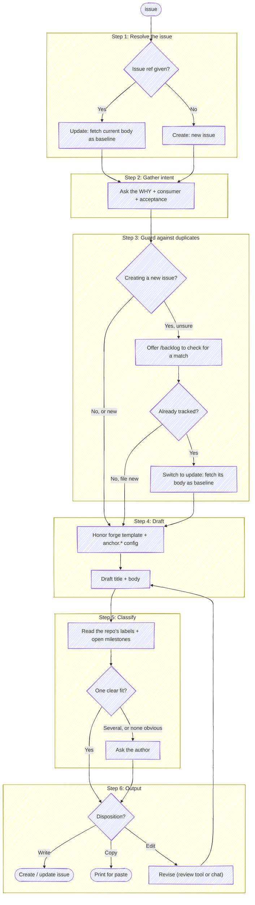

# Issue

Before using a bundled path, resolve `<anchor-root>` to the installed plugin root
from the host's value or this `SKILL.md` path, then follow the host-neutral tool
conventions in `<anchor-root>/guides/host-runtime.md`.

File a new issue whose job is to convey *why* the work is needed and *how* the author intends to approach it — written for a reader who has never seen this part of the system. This is the authoring counterpart to the `backlog` skill: `issue` *drafts and writes* one issue (a new one, or an update to a known one), while `backlog` *surveys what is already filed* to find the next thing to work on. An issue describes work **to be done**, so unlike `commit` and `prepare-review` there is no diff to read from: the raw material is the author's intent, gathered up front.

**Keep plumbing quiet.** Every step below is an operating instruction, not a script to read aloud — follow the execute-quietly discipline: `<anchor-root>/guides/execute-quietly.md`. For this skill, the only things worth surfacing are a question you need answered, the drafted issue with its options, and the final URL.

Issue = a GitHub issue or a GitLab issue. Pick the forge tool by the `origin` remote.



## Target repo

By default this operates on the repo backing the working directory — pick the forge from its `origin` remote (`gh` for GitHub, `glab` for GitLab). But an issue is often filed *against a different repo* than the one you're sitting in ("file this against `payments-api`", "open an issue in `customer-svc`"). Don't guess from cwd or improvise a `-R` from a half-remembered slug — resolve the name:

```bash
bash "<anchor-root>/scripts/resolve-target.sh" <name>
```

Act on `TARGET_VIA`:

- **`cwd`** — no match (`TARGET_NOTE` separates "no repo by that name" from "no authenticated forge to ask"). Fall back to the cwd `origin`. If the user clearly meant a repo that *didn't* resolve, say so rather than silently filing against the cwd repo.
- **`ambiguous`** — `TARGET_CANDIDATES` holds the matches as `[{key,url,local}]`.
  Present them as structured choices when the host supports that, otherwise ask
  directly, and proceed with the chosen entry.
- **`resolved`** — exactly one match. Use the emitted fields for every forge call below:
  - `TARGET_FORGE` picks the CLI (`gh` / `glab`).
  - **GitHub:** add `-R <TARGET_PROJECT>` to the `gh issue …` calls.
  - **GitLab:** the create/update use `glab api projects/:fullpath/…`, but `:fullpath` resolves from the *cwd* git dir — substitute the URL-encoded `TARGET_PROJECT` for `:fullpath` and add `--hostname <TARGET_HOST>` (required for self-hosted, harmless elsewhere).
  - `TARGET_LOCAL` — the checkout, set when the target is the repo you're standing in. Only the template step needs it; create/update are pure-remote and work without it (the common case for a repo you named from elsewhere).
