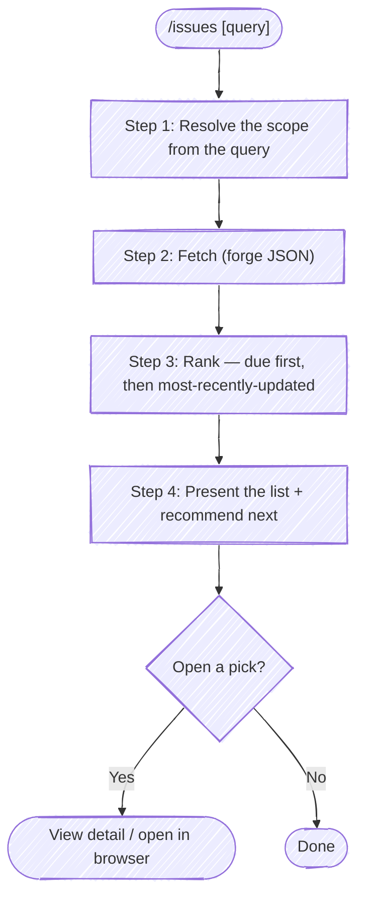

# Issues

Find and rank the issues that are candidates for your next unit of work, so you can choose one — the plural, read-only counterpart to the `issue` skill. Where `issue` *authors* a single issue (file a new one, or update a known one), `issues` *surveys* the backlog: it fetches, ranks, and points at the next thing to pick up. It never writes to the forge.

The default view answers "what's next?" — **your** open issues, ranked by **soonest due date, then most recently updated**. So the item most likely to be next sits at the top.

**Don't narrate your work.** Every step below is an operating instruction, not a script to read aloud — follow the execute-quietly discipline: `${CLAUDE_PLUGIN_ROOT}/guides/execute-quietly.md`. For this skill, the only things worth surfacing are a question you need answered, the ranked list, the recommended next pick, and — if the user opens one — its detail or URL.

Issues = GitHub issues or GitLab issues. Pick the forge tool by the `origin` remote (`gh` / `glab`).



## Target repo

By default this lists issues for the repo backing the working directory — pick the forge from its `origin` remote (`gh` for GitHub, `glab` for GitLab). But the user may ask about a *different* repo ("what's open in `payments-api`?"). Don't guess from a half-remembered slug — resolve the name through tack's repo db:

```bash
bash "${CLAUDE_PLUGIN_ROOT}/scripts/resolve-target.sh" <name>
```

Act on `TARGET_VIA`:

- **`cwd`** — no tack, or no match (`TARGET_NOTE` says which). Fall back to the cwd `origin`. If the user clearly meant a repo that *didn't* resolve, say so rather than silently listing the cwd repo.
- **`ambiguous`** — `TARGET_CANDIDATES` holds the matches as `[{key,url,local}]`. Present them with `AskUserQuestion`; proceed with the chosen entry.
- **`tack`** — exactly one match. Listing is pure-remote, so `TARGET_LOCAL` is not needed:
  - `TARGET_FORGE` picks the CLI (`gh` / `glab`).
  - **GitHub:** add `-R <TARGET_PROJECT>` to the `gh issue list` call.
  - **GitLab:** add `-R <TARGET_URL>` to the `glab issue list` call (and `--hostname <TARGET_HOST>` is harmless if you prefer it explicit).

## Step 1: Resolve the scope from the query

The query after `/issues` (if any) refines *which* issues to list. Map it to filter flags; when it's empty or a bare "what's next?", use the defaults. Never invent a filter the user didn't ask for — the default view is the point.

| The user says… | Scope |
|----------------|-------|
| *(nothing)*, "what's next?", "what should I work on?" | **Default:** assigned to me, open |
| "anything due soon?", "what's due?" | Default scope; the ranking already surfaces due-soonest first |
| "everything open", "the whole backlog" | Drop the assignee filter; open only |
| "unassigned…", "up for grabs" | No assignee, open |
| "…bugs", "…labeled X" | Add the label filter |
| "closed too", "including done" | State = all |
| "assigned to <person>" | That assignee |

Keep the default (**assigned to me + open**) unless the query clearly calls for something else. If the query is genuinely ambiguous about scope, ask once before fetching rather than guessing.

## Step 2: Fetch

Fetch as JSON so Step 3 can rank client-side — the compound sort (due, then updated) is more than either CLI does in one `--sort`, so let the CLI filter and the ranking happen locally. Cap the fetch (`--limit` / `--per-page`) at a browseable size; the goal is "what's next," not the entire history.

```bash
# GitHub — default view (assigned to me, open)
gh issue list --assignee "@me" --state open --limit 50 \
  --json number,title,url,state,updatedAt,createdAt,milestone,labels,assignees
```

```bash
# GitLab — default view (assigned to me, open — glab lists open by default;
# --closed or --all widen it)
glab issue list --assignee=@me --output json --per-page 50
```

Adjust the filter flags per Step 1: GitHub uses `--search "no:assignee"` for unassigned, `--label <name>`, `--state all`; GitLab uses `--label <name>`, `--all` (open + closed), `--author`/`--assignee <username>`. The full flag set and known gaps are in the forge cookbook (`${CLAUDE_PLUGIN_ROOT}/guides/forge-cookbook.md`).

## Step 3: Rank

Rank by **due date ascending (soonest first), then updated-at descending (most recently active first)**. Issues with no due date sort *after* all dated ones, and among themselves fall back to most-recently-updated — so the backlog you actually touch stays near the top even when nothing carries a due date.

A stable sort composes the two keys cleanly: sort by the secondary key first, then by the primary. A missing due date maps to a far-future sentinel so it lands last:

```bash
# GitHub — due is the milestone's due date (issues have no per-issue due date)
jq 'sort_by(.updatedAt) | reverse | sort_by(.milestone.dueOn // "9999-12-31")'
```

```bash
# GitLab — issues carry a native due_date
jq 'sort_by(.updated_at) | reverse | sort_by(.due_date // "9999-12-31")'
```

> **Why GitHub uses the milestone due date:** GitHub issues have no due-date field of their own — only milestones carry `dueOn`. So an issue's "due" is its milestone's due date when it has one, and absent otherwise. GitLab issues have a real `due_date`, so it's used directly. Call out this difference only if the user asks why a GitHub list looks undated.

## Step 4: Present and recommend

Print a compact table — most-actionable at the top — with the columns that drove the ranking, so the order is self-explaining:

- **#** (number), **Title**, **Due** (the date, or `—` when none), **Updated** (relative, e.g. `2d ago`), and **Labels** only if any are set.
- State column only when the scope includes more than open (e.g. "closed too").
- Lead the table with a one-line scope summary: `Assigned to you · open · ranked by due ↑ then updated ↓`.

Then **recommend the next pick**: name the top-ranked issue and give the one-line reason it's first (soonest due, or most recently active when nothing is dated). Offer to open it — this skill stops at reading, so "open" means show its detail or the browser, not start work:

```bash
# GitHub — detail in the terminal, or open in the browser
gh issue view <number>
gh issue view <number> --web
```

```bash
# GitLab
glab issue view <iid>
glab issue view <iid> --web
```

If the list is empty, say so plainly (e.g. "No open issues assigned to you") and suggest the obvious widening ("want the whole open backlog?") rather than presenting an empty table.

On a 401/403 or other auth failure, surface it and ask the user to refresh credentials — don't retry or silently degrade (per the fail-fast-on-auth rule).
