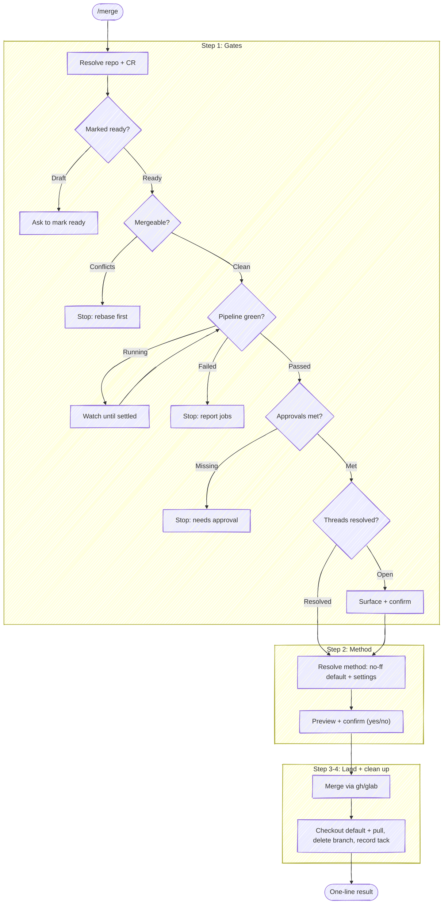

# Merge

Land an open change request into the default branch. This is the terminal step
of the anchor lifecycle: `/anchor:prepare-review` opens the CR and
`/anchor:resolve-feedback` drives its threads to done; `/anchor:merge` checks
that the CR is actually ready to land, merges it, and cleans up the branch
behind it. The job is a **safe merge**: never land a CR that a gate says isn't
ready, and never leave the local checkout stranded on a branch that no longer
exists.

CR = change request: a pull request on GitHub, a merge request on GitLab. Pick
the forge tool by the `origin` remote.

**Don't narrate your work.** Every step below is an operating instruction, not a
script to read aloud — follow the execute-quietly discipline:
`${CLAUDE_PLUGIN_ROOT}/guides/execute-quietly.md`. For this skill, the only
things worth surfacing are the resolved repo and CR in one line, any gate that
blocks, the merge-method decision, and the one-line result.



## Task tracking when orchestrated

At the very start, call `TaskList`. If any task is already `in_progress`, this
skill is running inside an orchestrator (e.g. a release workflow) — run silently
and do **not** create your own tasks. Otherwise enumerate:

- `Step 1: Check the merge gates`
- `Step 2: Choose the merge method`
- `Step 3: Merge and clean up`

## Target repo and CR

Resolve the repo as the other anchor skills do. **With a name argument**, resolve
it through tack's repo db (`scripts/resolve-target.sh <name>`, see the cookbook's
"Resolving a named target repo"): `TARGET_VIA=tack` → use `TARGET_LOCAL` as the
checkout — this skill runs `git` post-merge (checkout, pull, branch delete), so it
needs one; if `TARGET_LOCAL` is empty, ask where the checkout lives rather than
proceeding. `ambiguous` → prompt with `TARGET_CANDIDATES`. `cwd` (no tack, or no
match) → fall back to a substring-match against repos the session has touched.
**With no argument**, `git rev-parse --show-toplevel` from the working directory;
ambiguous → ask. Run git with `-C <repo>` when the working directory isn't the
target.

When the target repo isn't the working directory, the forge commands below also
default to the cwd repo — retarget each (`-R <owner/name>` for `gh`/`glab`
subcommands; substitute the URL-encoded project for `:fullpath` and add
`--hostname <host>` for `glab api`). Derive `owner/name` and the host once from
`git -C <repo> remote get-url origin`, or from a CR URL argument. The full
retargeting rules are in `${CLAUDE_PLUGIN_ROOT}/guides/forge-cookbook.md`
("Targeting a repo that isn't the working directory").

Resolve the open CR for the branch (when no URL was given):

```bash
# GitLab
glab mr view --output json 2>/dev/null | jq '{iid, web_url, draft, sha, source_branch, target_branch}'

# GitHub
gh pr view --json number,url,isDraft,headRefOid,headRefName,baseRefName 2>/dev/null
```

No open CR → say so and stop; there's nothing to merge. If the CR is already
merged or closed, report that and stop.

**Confirm local state matches the CR head** (same check as the other skills):
`git status --porcelain` clean, and local HEAD equals the CR head SHA. If they
disagree, surface the mismatch and stop — merging a CR whose head you haven't seen
means landing code you didn't review here.

## Step 1: Check the merge gates

Four gates must be green before the merge. Check them in this order — cheapest and
most-blocking first — and stop at the first that fails, so the user fixes one thing
at a time. Only the **pipeline** gate resolves itself with time; the skill waits on
that one. The other three need a person (mark ready, get an approval, resolve a
thread) or a rebase, so they stop and report rather than spin.

### 1a. Marked ready (not draft)

A draft CR is the author's "not under review yet" flag; merging one skips the review
it's waiting for. If the resolved CR is a draft (`isDraft` / `.draft` true), stop and
ask whether to mark it ready and proceed — don't mark it ready silently:

> This CR is still a draft. Marking it ready requests review; merging now lands it
> without that review. Mark ready and merge anyway? `[yes / no]`

On `yes`, mark it ready (`gh pr ready <num>` / `glab mr update <iid> --ready`), then
continue. On `no`, stop.

### 1b. Mergeable (no conflicts)

Read the forge's mergeable state (cookbook: "Check a CR's mergeable state"). If the
CR conflicts with the target branch or is behind it in a way the forge won't
auto-resolve, stop and route to a rebase — `/anchor:prepare-review` owns the
rebase-on-default flow. Don't attempt the merge; the forge would reject it anyway.

### 1c. Pipeline green — wait if it's still running

Resolve the pipeline for the CR head and read its state with the pipeline helper
(the same one `/anchor:pipeline` uses), so the poll loop, forge normalization, and
failed-job reporting are shared rather than re-derived:

```bash
bash "${CLAUDE_PLUGIN_ROOT}/scripts/pipeline-status.sh"
```

Map `PIPELINE_STATE`:

- **`success`** — gate passes; continue.
- **`running` / `pending`** — the pipeline hasn't settled. **Don't hand control
  back for the user to re-ask later** — watch it here. Re-launch the helper with
  `--watch` as a **background** call (`run_in_background: true`; a foreground call
  holds the turn open until the Bash timeout), then read the settled verdict with
  the **BashOutput tool** (not `tail` / `$(...)`, which trip the
  command-substitution gate):

  ```bash
  bash "${CLAUDE_PLUGIN_ROOT}/scripts/pipeline-status.sh" --watch
  ```

  When it settles, re-map the terminal state below. If `PIPELINE_TIMEOUT=1` (the
  watch ceiling elapsed), report the last state and offer to keep watching with a
  longer `--timeout` rather than merging on an unsettled pipeline.
- **`failed` / `canceled`** — stop. List each job from `PIPELINE_FAILED_JOBS` (name
  linked to its url) and the `PIPELINE_URL`, exactly as `/anchor:pipeline` reports.
  A red pipeline is a blocked merge; offer to look at a failed job's log rather than
  fetching it unprompted.
- **`manual`** — the pipeline is blocked awaiting a manual action; it won't progress
  on its own. Say so and stop.
- **`none`** — no pipeline for this commit (path/branch filters, or the repo has no
  CI for this ref). Treat as "no pipeline gate", not a failure — note it and
  continue.
- **`absent`** — origin isn't a recognized forge; there's no pipeline to gate on.

### 1d. Approvals satisfied

Read the CR's approval state (cookbook: "Check a CR's approvals"). If required
approvals are missing — GitHub `reviewDecision` is `REVIEW_REQUIRED` or
`CHANGES_REQUESTED`; GitLab `approvals_left > 0` — stop and report who still needs
to approve. This gate needs a reviewer; the skill can't clear it. On
`CHANGES_REQUESTED` specifically, point the user at `/anchor:resolve-feedback`.

Where a repo has no approval rules configured, there's nothing to satisfy — don't
invent a requirement; continue.

### 1e. Review threads resolved

Fetch unresolved, human-authored review threads (cookbook: "List unresolved review
threads" — the same query `/anchor:resolve-feedback` uses). If any remain, surface
them in one line each (`<file:line> — @reviewer — <ask>`) and confirm before
landing:

> `<n>` review threads are still unresolved. Merge anyway, or resolve them first?
> `[merge / resolve first]`

On `resolve first`, hand off to `/anchor:resolve-feedback` and stop. On `merge`,
continue — some threads are intentionally left open (answered questions the asker
never marked resolved), and the author is the one who knows.

## Step 2: Choose the merge method

Land the branch's commits as they stand, with a **merge commit** that preserves
every commit on the branch (git's `--no-ff`). This is the method — don't read the
commits to second-guess it. Whether the branch is one commit or twenty, tidy or
noisy, is the author's history to keep; collapsing it isn't this skill's call. The
method changes only when the project or CR is **configured** for a different one.

Read that configuration and let it override the default:

**GitLab** — the project pins the merge method; the MR pins the squash choice
(cookbook: "Merge a CR"):

```bash
glab api projects/:fullpath | jq '{merge_method, squash_option}'
glab mr view <iid> --output json | jq '{squash}'
```

- `merge_method`: `merge` → merge commit, the default (no override). `ff` →
  fast-forward, no merge commit (the project mandates a linear history).
  `rebase_merge` → semi-linear.
- `squash_option`: `always` → squash (the project requires it). `never` → don't
  squash. `default_on` / `default_off` → the author's per-MR `squash` checkbox
  decides; honor the MR's `squash` field.

**GitHub** — the repo pins which strategies are allowed; there's no enforced
default beyond that (cookbook: "Merge a CR"):

```bash
gh repo view --json mergeCommitAllowed,squashMergeAllowed,rebaseMergeAllowed
```

Use `--merge` when merge commits are allowed. Only when the repo disables them
does the method change — fall to the allowed strategy that still keeps the commits
(`--rebase`) ahead of the one that discards them (`--squash`).

Then **preview and confirm** — state what will happen and take a yes/no; don't
offer a method menu. When the method is the merge-commit default:

> Merging `!42` into `main` via merge commit (preserves 3 commits). Proceed?
> `[yes / no]`

When a setting moved it off the default, name the setting so the deviation is
visible:

> The project's merge method is fast-forward — merging `!42` into `main`
> fast-forward, no merge commit. Proceed? `[yes / no]`

On `no`, stop and don't merge. The method follows the default and the forge's
settings, not an inline menu — so to land it differently the user either adjusts
the project/CR settings (and you re-read them) or names the method to use. On
`yes`, merge.

## Step 3: Merge

Run the merge for the chosen method (cookbook: "Merge a CR"). Delete the source
branch as part of the merge where the forge supports it (`gh pr merge --delete-branch`
/ GitLab `remove_source_branch` — anchor sets `--remove-source-branch` at create time,
but pass it here too in case it wasn't). This is a forge write:

- On a **401/403 or other auth failure**, surface it and ask the user to refresh
  credentials — do not retry or fall back (the fail-fast-on-auth rule).
- If the forge **rejects the merge** because a gate flipped since Step 1 (a new
  commit, a fresh unresolved thread, protection rules), re-read the specific gate it
  names and surface that — don't force past it.

## Step 4: Clean up

Once the forge confirms the merge, leave the local checkout on a clean footing:

1. **Return to the default branch and pull the merged result:**

   ```bash
   git -C <repo> checkout <target> && git -C <repo> pull --ff-only
   ```

2. **Delete the merged local branch.** The forge deleted the remote branch (Step 3);
   remove its local counterpart:

   ```bash
   git -C <repo> branch -d <head>
   ```

   `-d` refuses to delete a branch whose commits aren't merged — if it refuses,
   surface that rather than forcing with `-D`; it means the merged commit differs
   (e.g. a squash produced a new SHA). After a squash, the branch's commits are in
   the target under a new SHA, so `-d` will refuse; confirm the merge landed, then
   delete with `-D`.

3. **Record the tack deliverable** when a tack route is bound to this session. Mark
   the CR's tack done and attach the CR as its deliverable so `/wip` and `/recap`
   reflect the landed work:

   ```bash
   tack done <route> <tackId>
   tack deliverable <route> <tackId> "<cr-url>"
   ```

   No tack route bound → skip this; don't create one just to close it.

## Step 5: Report

One line: `Merged <CR ref> into <target> (<method>) — <merge-sha>`, with the CR URL.
Note the branch cleanup only if it needed the user's attention (a `-d` that refused).
Nothing more — the merge is the outcome, not a status report.
