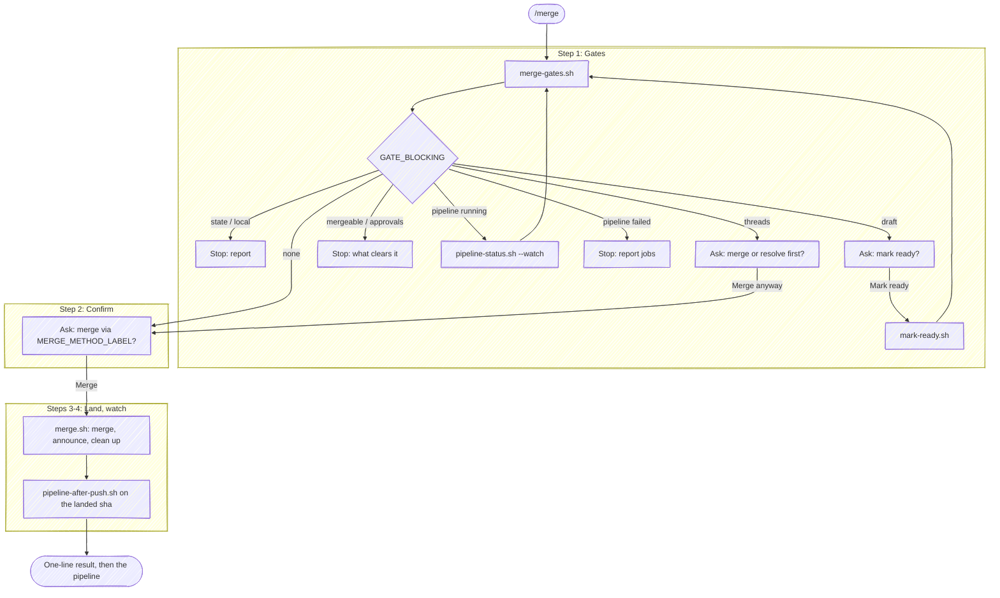

# Merge

Land an open change request into the default branch. `/anchor:prepare-review`
opens the CR and `/anchor:resolve-feedback` drives its threads to done;
`/anchor:merge` checks that the CR is actually ready to land, merges it, and
cleans up the branch behind it. The job is a **safe merge**: never land a CR that
a gate says isn't ready, and never leave the local checkout stranded on a branch
that no longer exists.

Publishing what landed is `/anchor:release`, and this skill **names it without
running it**. Releasing is a deliberate act on its own schedule — several merges
commonly batch into one release — so the choice of when to cut one belongs to the
author, not to whichever merge happened to be last.

CR = change request: a pull request on GitHub, a merge request on GitLab.

**The scripts decide the facts; this skill asks the questions.** Every gate, the
merge method, the merge itself, and the cleanup are one helper call each. Don't
reach past them with your own `gh` / `glab` / `git` / `jq` commands: a fact the
block doesn't carry is a gap in the helper, not an invitation to re-derive it.

**Don't narrate your work.** Every step below is an operating instruction, not a
script to read aloud — follow the execute-quietly discipline:
`${CLAUDE_PLUGIN_ROOT}/guides/execute-quietly.md`. This skill's output is the
list below, and the list is closed:

1. The resolved repo and CR, one line.
2. The gate table — every row once they're green, or the rows checked so far plus
   the one that blocked.
3. The merge confirmation, asked with `AskUserQuestion`.
4. The one-line result, with the release next step where the repo has one.
5. The pipeline the merge triggered, once it settles.

Each is something the user decides or would otherwise have to go ask for. What
you read to reach one of them — a `KEY=value` line, a state that turned out fine
— is input to the next step, not a paragraph in front of it.


```mermaid
%%{ init: { 'look': 'handDrawn' } }%%
flowchart TD
    Start(["/merge"]) --> Gates["merge-gates.sh"]

    subgraph "Step 1: Gates"
        Gates --> Block{GATE_BLOCKING}
        Block -->|state / local| Stop["Stop: report"]
        Block -->|draft| AskDraft["Ask: mark ready?"]
        AskDraft -->|Mark ready| Ready["mark-ready.sh"] --> Gates
        Block -->|mergeable / approvals| StopGate["Stop: what clears it"]
        Block -->|pipeline running| Watch["pipeline-status.sh --watch"] --> Gates
        Block -->|pipeline failed| StopPipe["Stop: report jobs"]
        Block -->|threads| AskThreads["Ask: merge or resolve first?"]
    end

    subgraph "Step 2: Confirm"
        Block -->|none| Confirm["Ask: merge via MERGE_METHOD_LABEL?"]
        AskThreads -->|Merge anyway| Confirm
    end

    subgraph "Steps 3-4: Land, watch"
        Confirm -->|Merge| Do["merge.sh: merge, announce, clean up"]
        Do --> WatchMain["pipeline-after-push.sh on the landed sha"]
    end

    WatchMain --> Report([One-line result, then the pipeline])
```

## Task tracking when orchestrated

At the very start, call `TaskList`. If any task is already `in_progress`, this
skill is running inside an orchestrator (e.g. a release workflow) — run silently
and do **not** create your own tasks. Otherwise enumerate:

- `Step 1: Check the merge gates`
- `Step 2: Confirm the merge`
- `Step 3: Merge and clean up`

## Target repo and CR

**With no argument**, the helpers work on the repo backing the working directory
and the CR for its current branch. **With a CR number or URL**, pass the number as
`--cr <n>`. **With a repo name**, resolve it with
`${CLAUDE_PLUGIN_ROOT}/scripts/resolve-target.sh <name>` (see the cookbook's
"Resolving a named target repo"): `TARGET_VIA=resolved` → pass `TARGET_LOCAL` as
`--repo <checkout>` to every helper below — the merge runs `git` afterwards
(checkout, pull, branch delete), so it needs one; if `TARGET_LOCAL` is empty, ask
where the checkout lives rather than proceeding. `ambiguous` → ask with
`AskUserQuestion` over `TARGET_CANDIDATES`. `cwd` (no match) → fall back to a
substring-match against repos the session has touched.

## Step 1: Check the merge gates

```bash
bash "${CLAUDE_PLUGIN_ROOT}/scripts/merge-gates.sh" [--cr <n>] [--repo <checkout>]
```

The block's header documents every key. It reads the CR, the checkout, then the
gates in order — draft, mergeable, pipeline, approvals, threads — and stops at the
first that isn't passing, naming it in `GATE_BLOCKING`. Only the **pipeline**
resolves itself with time, so that's the one this skill waits on; the others need
a person or a rebase, so they stop and report rather than spin.

A non-zero exit carries `MERGE_GATES_ERROR`. With `MERGE_GATES_AUTH=1`, surface it
and ask the user to refresh credentials — don't retry or fall back (the
fail-fast-on-auth rule).

**The gates report as one table, and that table is the whole step.** One row per
gate the block reached, the `GATE_*_DETAIL` value as its state:

| Gate | State |
| --- | --- |
| Draft | cleared |
| Mergeable | mergeable, clean |
| Pipeline | `success` — 3/3 jobs on `<sha>` |
| Approvals | 1 required, 0 left; approved by @ana |
| Threads | none unresolved |

Lead it with the one line naming the repo and the CR: `CR_REF` linked to `CR_URL`,
and `CR_TITLE`. Then act on `GATE_BLOCKING`:

- **empty** — every gate passes; go to Step 2.
- **`state`** — `CR_STATE` is `merged` or `closed`. Say so and stop; there's
  nothing to merge.
- **`local`** — `LOCAL_STATE=dirty` (uncommitted changes) or `head-mismatch`
  (`LOCAL_HEAD_SHA` isn't `CR_HEAD_SHA`). Surface it and stop: merging a head you
  haven't seen here lands code you didn't review here.
- **`draft`** — the CR is still a draft, and merging it skips the review it's
  waiting for. Ask with `AskUserQuestion` (header `Draft`):
  1. **Mark ready and continue** — clears the flag, then re-reads the gates.
  2. **Stop** — leave it a draft.

  On *Mark ready*, clear it through the helper, which reads the flag fresh and
  announces `cr.ready`:

  ```bash
  bash "${CLAUDE_PLUGIN_ROOT}/scripts/mark-ready.sh" --forge <MERGE_FORGE> --cr <CR_NUMBER> [--repo <checkout>]
  ```

  `CR_READY=ok` or `ALREADY_READY=1` both satisfy the gate; run `merge-gates.sh`
  again.
- **`mergeable`** — `GATE_MERGEABLE=conflicts` or `behind`: stop and route to
  `/anchor:prepare-review`, which owns the rebase on the default branch.
  `unknown`: the forge hadn't computed it after the helper's retries; say so and
  stop. `blocked`: the forge's own merge check refuses for a reason
  `GATE_MERGEABLE_DETAIL` names; report it and stop.
- **`pipeline`** — map `GATE_PIPELINE`:
  - **`running` / `pending`** — don't hand control back for the user to re-ask
    later. Watch it as `${CLAUDE_PLUGIN_ROOT}/guides/watching-a-pipeline.md`
    describes, then run `merge-gates.sh` again so every gate is read fresh:

    ```bash
    bash "${CLAUDE_PLUGIN_ROOT}/scripts/pipeline-status.sh" --single-run --watch --sha <CR_HEAD_SHA> [--repo <checkout>]
    ```

    A watch that hit its ceiling (`PIPELINE_TIMEOUT=1`) never merges on the
    unsettled pipeline.
  - **`failed` / `canceled`** — stop. List each job from `PIPELINE_FAILED_JOBS`
    (name linked to its url) and `PIPELINE_URL`, as `/anchor:pipeline` reports.
    Offer to look at a failed job's log rather than fetching it unprompted.
  - **`manual`** — the pipeline waits on a manual action and won't progress on
    its own. Say so and stop.
- **`approvals`** — `missing`: stop and report what `GATE_APPROVALS_DETAIL` says is
  outstanding. `changes-requested`: stop and point at `/anchor:resolve-feedback`.
- **`threads`** — list each entry of `THREADS` on one line
  (`<path:line> — @author — <body>`), then ask with `AskUserQuestion` (header
  `Threads`):
  1. **Resolve them first** — hand off to `/anchor:resolve-feedback` and stop.
  2. **Merge anyway** — some threads are intentionally left open (answered
     questions the asker never resolved), and the author is the one who knows.
     Go to Step 2.

A `none` pipeline (no CI for this commit) and `none` approvals (no approval rules)
pass their gates; their rows say so and the flow continues.

## Step 2: Confirm the merge

The block has already resolved the method: a **merge commit** preserving every
commit on the branch, unless the forge is configured otherwise — GitLab's
`merge_method` / `squash_option` and the MR's squash flag, GitHub's allowed
strategies. Take it as given; don't read the commits to second-guess it.

Ask with `AskUserQuestion` (header `Merge`). The question states what will happen,
built from the block:

> Merge `<CR_REF>` into `<CR_TARGET_BRANCH>` via `<MERGE_METHOD_LABEL>`?

When `MERGE_METHOD_SETTING` is set, lead the question with it, so the deviation
from the default is visible where the user decides:

> `<MERGE_METHOD_SETTING>` — merge `!42` into `main` via fast-forward, no merge
> commit?

Two options:

1. **Merge** — land it.
2. **Don't merge** — stop. There's no method menu: to land it another way, the
   user changes the forge setting (and you re-run the gates) or names the method
   in their reply.

**The question is this step's whole output.** The settings that produced the
method are input to it, never a paragraph ahead of it.

## Step 3: Merge and clean up

```bash
bash "${CLAUDE_PLUGIN_ROOT}/scripts/merge.sh" --cr <CR_NUMBER> --sha <CR_HEAD_SHA> \
  --method <MERGE_METHOD> --squash <MERGE_SQUASH> [--repo <checkout>]
```

It merges guarded on the head SHA, deletes the source branch on the forge, reads
back what landed, announces `cr.merged`, checks out and pulls the target, and
deletes the merged local branch.

- **Exit 70 with `MERGE_AUTH=1`** — surface it and ask the user to refresh
  credentials. Don't retry or fall back.
- **Exit 70 otherwise** — the forge refused the merge, usually because a gate
  flipped since Step 1 (a new commit, a fresh thread, a protection rule). Report
  `MERGE_ERROR` and run `merge-gates.sh` again to show which one; don't force past
  it.
- **`CLEANUP=incomplete`** — the merge landed but the local tidy-up stopped;
  `CLEANUP_DETAIL` says where. Surface it in the result line. Don't force a branch
  delete `git branch -d` refused: it means the local branch holds commits the
  merge didn't carry.

## Step 4: Watch the pipeline the merge triggered

The merge writes a commit to the target branch, and for most repos that commit
is what deploys, publishes, or releases. Launch the watch once Step 3 returns, as
`${CLAUDE_PLUGIN_ROOT}/guides/watching-a-pipeline.md` describes. The landed commit
supersedes the CR branch's pipeline, so a watch still running on that branch
stops here:

```bash
bash "${CLAUDE_PLUGIN_ROOT}/scripts/pipeline-after-push.sh" --skill merge --sha <MERGE_SHA> [--repo <checkout>]
```

Pass `MERGE_SHA` rather than letting the helper take HEAD: a squash lands a commit
the local branch never had, and a pull that couldn't fast-forward leaves HEAD
elsewhere. The report's headline carries `TARGET_BRANCH`, not the branch just
deleted.

Step 5's result goes out while this polls, so the flow is never held open; the
pipeline report lands when the watch settles.

## Step 5: Report

One line: `Merged <CR_REF> into <TARGET_BRANCH> (<method>) — <MERGE_SHA short>`,
with `CR_URL`. Add `CLEANUP_DETAIL` only when `CLEANUP=incomplete`. Nothing more —
the merge is the outcome, not a status report.

Where the repo has something to publish, close with `/anchor:release` as the next
step — one clause, not a pitch, and don't run it. On a repo with no version
artifact (`RELEASE_MODEL=no-version-artifact` — the merge *was* the release), leave
it out entirely rather than pointing at a skill that would no-op.
