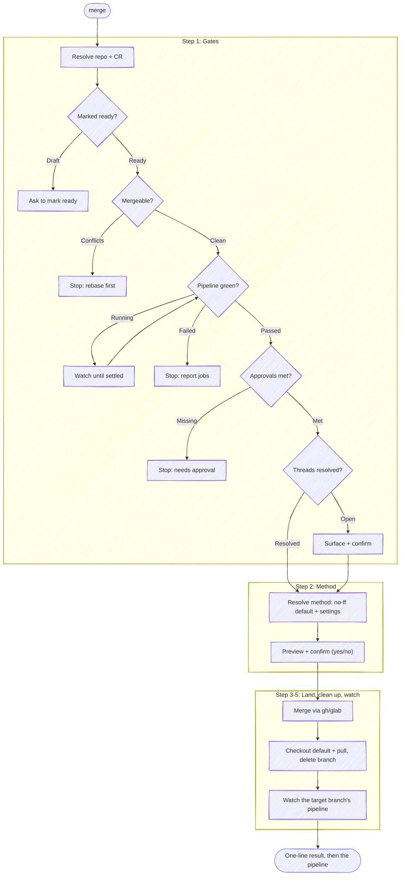

# Merge

Before using a bundled path, resolve `<anchor-root>` to the installed plugin root
from the host's value or this `SKILL.md` path, then follow the host-neutral tool
conventions in `<anchor-root>/guides/host-runtime.md`.

Land an open change request into the default branch. `anchor:prepare-review`
opens the CR and `anchor:resolve-feedback` drives its threads to done;
`anchor:merge` checks that the CR is actually ready to land, merges it, and
cleans up the branch behind it. The job is a **safe merge**: never land a CR that
a gate says isn't ready, and never leave the local checkout stranded on a branch
that no longer exists.

Publishing what landed is `anchor:release`, and this skill **names it without
running it**. Releasing is a deliberate act on its own schedule — several merges
commonly batch into one release — so the choice of when to cut one belongs to the
author, not to whichever merge happened to be last.

CR = change request: a pull request on GitHub, a merge request on GitLab. Pick
the forge tool by the `origin` remote.

**Keep plumbing quiet.** Every step below is an operating instruction, not a
script to read aloud — follow the execute-quietly discipline:
`<anchor-root>/guides/execute-quietly.md`. This skill's output is the
list below, and the list is closed:

1. The resolved repo and CR, one line.
2. The gate table — every row once they're green, or the rows checked so far plus
   the one that blocked.
3. The merge confirmation prompt.
4. The one-line result, with the release next step where the repo has one.
5. The pipeline the merge triggered, once it settles.

Each is something the user decides or would otherwise have to go ask for. What
you read to reach one of them — a config value, a forge field, a state that
turned out fine — is input to the next step, not a paragraph in front of it.



## Task tracking when orchestrated

If the host exposes task tracking, inspect it first. If any task is already in
progress, this skill is running inside an orchestrator (for example, a release
workflow) — run inside that list and do not create your own tasks. If the host
has no task mechanism, follow an evident enclosing workflow without inventing
one. Otherwise enumerate:

- `Step 1: Check the merge gates`
- `Step 2: Choose the merge method`
- `Step 3: Merge and clean up`

## Target repo and CR

Resolve the repo as the other `anchor` skills do. **With a name argument**, resolve
it with `<anchor-root>/scripts/resolve-target.sh <name>` (see the cookbook's
"Resolving a named target repo"): `TARGET_VIA=resolved` → use `TARGET_LOCAL` as the
checkout — this skill runs `git` post-merge (checkout, pull, branch delete), so it
needs one; if `TARGET_LOCAL` is empty, ask where the checkout lives rather than
proceeding. `ambiguous` → prompt with `TARGET_CANDIDATES`. `cwd` (no match) → fall
back to a substring-match against repos the session has touched.
**With no argument**, `git rev-parse --show-toplevel` from the working directory;
ambiguous → ask. Run git with `-C <repo>` when the working directory isn't the
target.

When the target repo isn't the working directory, the forge commands below also
default to the cwd repo — retarget each (`-R <owner/name>` for `gh`/`glab`
subcommands; substitute the URL-encoded project for `:fullpath` and add
`--hostname <host>` for `glab api`). Derive `owner/name` and the host once from
`git -C <repo> remote get-url origin`, or from a CR URL argument. The full
retargeting rules are in `<anchor-root>/guides/forge-cookbook.md`
("Targeting a repo that isn't the working directory").

Resolve the open CR for the branch (when no URL was given):

```bash
# GitLab
glab mr view --output json 2>/dev/null | jq '{iid, web_url, draft, sha, source_branch, target_branch}'

# GitHub
gh pr view --json number,url,isDraft,headRefOid,headRefName,baseRefName 2>/dev/null
```

No open CR → say so and stop; there's nothing to merge. If the CR is already
merged or closed, report that and stop.

**Confirm local state matches the CR head** (same check as the other skills):
`git status --porcelain` clean, and local HEAD equals the CR head SHA. If they
disagree, surface the mismatch and stop — merging a CR whose head you haven't seen
means landing code you didn't review here.
