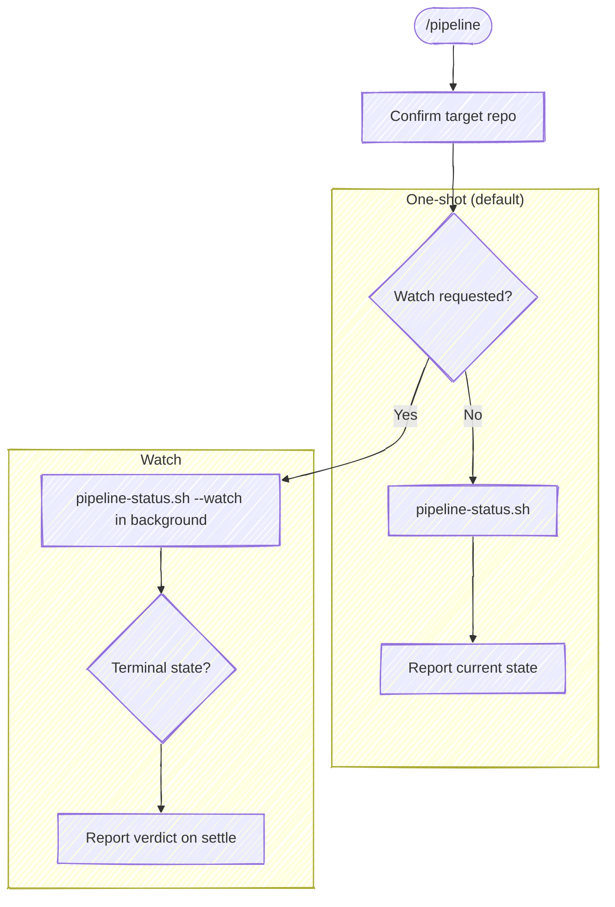

# Pipeline

Report a commit's forge pipeline state, or watch until it settles. This is the
entry point for forge-pipeline operations, and today those are the two it
covers:

- **Status (default)** — *"what's the pipeline doing?"* / *"get the latest
  pipeline."* A one-shot read: resolve the pipeline for the commit and report
  its state now.
- **Watch** — *"tell me when it's done"* / *"notify me when CI passes."* Poll
  in the background until the pipeline reaches a terminal state, then report.

GitHub calls a pipeline a *workflow run* and GitLab calls it a *pipeline*; this
skill uses **pipeline** for both, and `glab api` / `gh run` for the forge calls.

**Don't narrate your work.** Every step below is an operating instruction, not a
script to read aloud — follow the execute-quietly discipline:
`${CLAUDE_PLUGIN_ROOT}/guides/execute-quietly.md`. For this skill, the only
things worth surfacing are the resolved repo in one line if it's ambiguous, and
the pipeline verdict.



## Task tracking when orchestrated

At the very start, call `TaskList`. If any task is already `in_progress`, this
skill is running inside an orchestrator (e.g. a release workflow) — run silently
and do **not** create your own tasks; the orchestrator's list is the source of
truth. If nothing is `in_progress`, this is a single-step check — skip
task-tracking.

## Target repo

Resolve which repo this operates on — the working directory isn't a reliable
proxy. Re-resolve on every invocation.

- **With an argument** (`/anchor:pipeline <name>`): resolve the name through
  tack's repo db — `bash "${CLAUDE_PLUGIN_ROOT}/scripts/resolve-target.sh" <name>`
  (see the cookbook's "Resolving a named target repo"). `TARGET_VIA=tack` → use
  `TARGET_LOCAL` as the checkout and pass it as `--repo` to the helper below; this
  skill reads the branch and HEAD from a work tree, so if `TARGET_LOCAL` is empty
  (a repo tack knows but you have no clone of) say so and stop, rather than
  reporting the cwd repo's pipeline under the requested repo's name. `ambiguous` →
  prompt with `TARGET_CANDIDATES`. `cwd` (no tack, or no match) → fall back to a
  case-insensitive substring-match of `<name>` against the basename of every git
  repo the session has touched; one match → use it (confirm in one line),
  zero/multiple → ask.
- **No argument**: run `git rev-parse --show-toplevel` from the working
  directory. If the session touched more than one repo, or edits landed outside
  it, state the resolved path and ask which to target.

When the resolved repo isn't the working directory, pass `--repo <path>` to the
helper on every call below — **not** `cd`, which doesn't persist across the
separate Bash calls the harness runs (it resets cwd between them). `--repo`
retargets the helper's own process, so it reads the right `origin`.

## Pick the mode

Read the request:

- **Watch** when the ask is to wait or be notified — *"watch the pipeline,"*
  *"tell me when it's done,"* *"notify me when CI passes,"* *"wait for the
  build."* Also the natural mode right after a push.
- **One-shot** otherwise — *"pipeline status,"* *"get the latest pipeline,"*
  *"is the build green,"* *"did it pass?"* — and whenever you just need the
  state once.

When watching, it's worth a quick precondition check: a pipeline only exists
once the commit is on the remote. `bash "${CLAUDE_PLUGIN_ROOT}/scripts/look-ahead.sh"`
prints the unpushed-commit count — if it's `>= 1`, the pushed remote tip isn't
HEAD, so tell the user and ask whether to push first or watch the current tip.
A one-shot read needs no such check — it just reports `none` if there's no
pipeline for the commit.

## Run the helper

The helper detects the forge from the `origin` remote (`gh`/GitHub or
`glab`/GitLab), resolves the pipeline for HEAD's commit, and prints the verdict
on stdout. The forge plumbing — including the GitLab path's
`glab api projects/:fullpath/...` calls — lives in the script; the forge
cookbook's **CI / pipelines** section documents the same invocations.

**One-shot (default)** — runs and returns immediately, so call it in the
foreground and read the result:

```bash
bash "${CLAUDE_PLUGIN_ROOT}/scripts/pipeline-status.sh"
```

**Watch** — add `--watch`. It blocks while it polls, so launch it as a
**background call** (`run_in_background: true`); a foreground call would hold the
turn open until the Bash timeout. When it completes, read its stdout with the
**BashOutput tool** (not `tail` / `$(...)`, which trip the command-substitution
gate):

```bash
bash "${CLAUDE_PLUGIN_ROOT}/scripts/pipeline-status.sh" --watch
```

To target a commit other than the current HEAD (e.g. an orchestrator that pushed
`main` directly), pass `--sha <sha>`, or `--branch <ref>` to take that ref's
commit — a tag works there too, and resolution is by commit either way. In watch
mode, poll cadence and the watch ceiling default to 15s / 30min and can be tuned
with `--interval <s>` / `--timeout <s>`.

**A GitHub commit has one run per workflow, not one pipeline.** The helper folds
them into a single verdict — each workflow's latest attempt, then the
least-settled and worst-off run speaks for the commit, so it reports in-flight
while any workflow is still going and red if any went red. When the ask is about
*one* workflow, name it with `--workflow <path|file|display name>`; the run that
answered is in `PIPELINE_WORKFLOW`. Naming it is what a release watch needs: the
run that a published release or a pushed tag fires carries the **tag** as its
branch, and it shares the commit with whatever the merge already ran, so
`--workflow <release workflow>` is how the verdict is about the release and not
a neighbor. On GitLab the flag has nothing to narrow — one pipeline per commit.

The fold is what *this* skill reports. `--single-run` opts out of it and reports
the commit's most recent run — what a caller wants when the forge's own merge
check already answers "is every check green" (`/anchor:merge`'s gate does exactly
that).

**Track one named job** — when the ask is about a *specific* job rather than the
whole pipeline (*"wait for the `cand-usw2-plan` job,"* *"did the plan job
pass?"*), add `--job <name>`. It resolves the same pipeline, then reports or
watches just that job — so a one-off `glab api .../jobs | filter-by-name | poll`
loop becomes the same launch-and-read. `--watch` polls the job until it settles;
the match is the exact job name (retried jobs resolve to the latest attempt).
When you already have a pipeline id (e.g. from a URL the user pasted), pass
`--pipeline <id>` to skip commit→pipeline resolution:

```bash
bash "${CLAUDE_PLUGIN_ROOT}/scripts/pipeline-status.sh" --job cand-usw2-plan --watch
bash "${CLAUDE_PLUGIN_ROOT}/scripts/pipeline-status.sh" --pipeline 3435505 --job cand-usw2-plan
```

The output is `KEY=value` lines:

- `PIPELINE_STATE` — `success` · `failed` · `canceled` · `skipped` · `manual` ·
  `running` · `pending` · `none` (no pipeline for this commit) · `absent`
  (origin isn't a recognized forge). In watch mode, `PIPELINE_TIMEOUT=1` marks
  the last non-terminal state when the ceiling was hit.
- `PIPELINE_URL` — the pipeline's web page (link it).
- `PIPELINE_WORKFLOW` — on GitHub, the workflow whose run the verdict came from;
  empty on GitLab.
- `PIPELINE_FAILED_JOBS` — present only when `PIPELINE_STATE=failed`: a JSON
  array of `{name, url}` (GitHub) or `{name, stage, url}` (GitLab).

In `--job` mode the `PIPELINE_STATE`/`PIPELINE_URL` lines describe the parent
pipeline for context, and three more lines carry the tracked job:

- `PIPELINE_JOB_NAME` — the job name tracked.
- `PIPELINE_JOB_STATE` — normalized like `PIPELINE_STATE`; `none` means no job by
  that name exists in the pipeline yet (earlier stages may still be running).
- `PIPELINE_JOB_URL` — the job's web page (link it).

## Report

Map `PIPELINE_STATE` to exactly this and nothing more:

- **`success`** → `✓ Pipeline passed` with the `PIPELINE_URL`.
- **`running` / `pending`** *(one-shot only — watch mode never returns here)* →
  report that it's still in flight, with the `PIPELINE_URL`, and offer to watch.
- **`failed`** → `✗ Pipeline failed`, then list each job from
  `PIPELINE_FAILED_JOBS` (name, linked to its `url`), and the pipeline
  `PIPELINE_URL`. Offer to look at a failed job's log if the user wants to dig
  in — don't fetch logs unprompted.
- **`canceled` / `skipped` / `manual`** → report the terminal state plainly with
  the `PIPELINE_URL`. `manual` means the pipeline is blocked awaiting a manual
  action — say so; it won't progress on its own.
- **`none`** → no pipeline for this commit. Common causes: path/branch filters
  excluded it, the commit isn't pushed, or the repo has no CI for this ref.
  Under `--workflow`, it also means that workflow has no run for this commit —
  check the name against the repo's workflow files before reporting a gap.
  State that; don't treat it as a failure.
- **`absent`** → the `origin` remote isn't GitHub or GitLab, so there's no
  pipeline to report. Say so.
- **`PIPELINE_TIMEOUT=1`** → the watch ceiling elapsed before a terminal state;
  report the last state and offer to keep watching (re-launch with a longer
  `--timeout`).

In `--job` mode, report `PIPELINE_JOB_STATE` for the named job with the same
mapping (link `PIPELINE_JOB_URL`). A `none` here means no job by that name in the
pipeline yet — in one-shot that's "not created yet, earlier stages may still be
running"; in watch it means the appearance window elapsed without the job ever
showing (check the name, or the stage is gated). Mention the parent
`PIPELINE_STATE` only when it adds context (e.g. the pipeline failed elsewhere
while this job passed).

Name the workflow (`PIPELINE_WORKFLOW`) in the report whenever the run is what
the verdict turns on — a failure, an in-flight state, or a `--workflow` the
caller asked for. On a plain pass, `✓ Pipeline passed` already says it.

In watch mode the report *is* the notification — the harness surfaces it when
the background watch completes, so there's nothing to schedule or poll.
