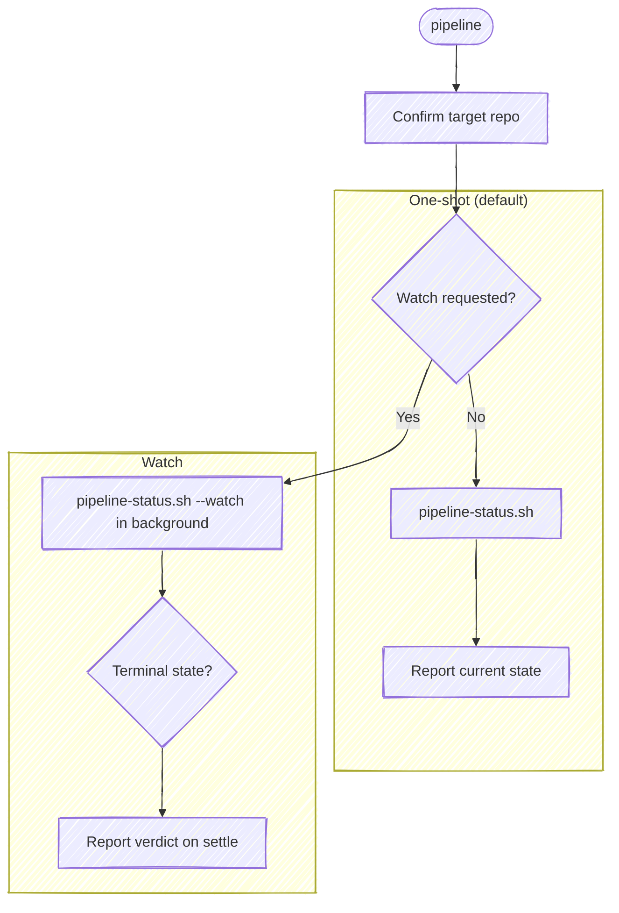

# Pipeline

Before using a bundled path, resolve `<anchor-root>` to the installed plugin root
from the host's value or this `SKILL.md` path, then follow the host-neutral tool
conventions in `<anchor-root>/guides/host-runtime.md`.

Report a commit's forge pipeline state, or watch until it settles. This is the
entry point for forge-pipeline operations, and today those are the two it
covers:

- **Status (default)** — *"what's the pipeline doing?"* / *"get the latest
  pipeline."* A one-shot read: resolve the pipeline for the commit and report
  its state now.
- **Watch** — *"tell me when it's done"* / *"notify me when CI passes."* Poll
  in the background until the pipeline reaches a terminal state, then report.

GitHub calls a pipeline a *workflow run* and GitLab calls it a *pipeline*; this
skill uses **pipeline** for both, and `glab api` / `gh run` for the forge calls.

**Keep plumbing quiet.** Every step below is an operating instruction, not a
script to read aloud — follow the execute-quietly discipline:
`<anchor-root>/guides/execute-quietly.md`. For this skill, the only
things worth surfacing are the resolved repo in one line if it's ambiguous, and
the pipeline verdict.

## Task tracking when orchestrated

If the host exposes task tracking, inspect it first. If any task is already in
progress, this skill is running inside an orchestrator (for example, a release
workflow) — run inside that list and do not create your own tasks; the
orchestrator's list is the source of truth. If the host has no task mechanism,
follow an evident enclosing workflow without inventing one. Otherwise this is a
single-step check, so skip task tracking.

## Target repo

Resolve which repo this operates on — the working directory isn't a reliable
proxy. Re-resolve on every invocation.

- **With an argument** (`anchor:pipeline <name>`): resolve the name —
  `bash "<anchor-root>/scripts/resolve-target.sh" <name>`
  (see the cookbook's "Resolving a named target repo"). `TARGET_VIA=resolved` → use
  `TARGET_LOCAL` as the checkout and pass it as `--repo` to the helper below; this
  skill reads the branch and HEAD from a work tree, so if `TARGET_LOCAL` is empty
  (a repo on the forge that isn't the one you're standing in) say so and stop,
  rather than reporting the cwd repo's pipeline under the requested repo's name.
  `ambiguous` → prompt with `TARGET_CANDIDATES`. `cwd` (no match) → fall back to a
  case-insensitive substring-match of `<name>` against the basename of every git
  repo the session has touched; one match → use it (confirm in one line),
  zero/multiple → ask.
- **No argument**: run `git rev-parse --show-toplevel` from the working
  directory. If the session touched more than one repo, or edits landed outside
  it, state the resolved path and ask which to target.

When the resolved repo isn't the working directory, pass `--repo <path>` to the
helper on every call below — **not** `cd`, which doesn't persist across the
separate Bash calls the harness runs (it resets cwd between them). `--repo`
retargets the helper's own process, so it reads the right `origin`.

## Pick the mode

Read the request:

- **Watch** when the ask is to wait or be notified — *"watch the pipeline,"*
  *"tell me when it's done,"* *"notify me when CI passes,"* *"wait for the
  build."* Also the natural mode right after a push.
- **One-shot** otherwise — *"pipeline status,"* *"get the latest pipeline,"*
  *"is the build green,"* *"did it pass?"* — and whenever you just need the
  state once.

When watching, it's worth a quick precondition check: a pipeline only exists
once the commit is on the remote. `bash "<anchor-root>/scripts/look-ahead.sh"`
prints the unpushed-commit count — if it's `>= 1`, the pushed remote tip isn't
HEAD, so tell the user and ask whether to push first or watch the current tip.
A one-shot read needs no such check — it just reports `none` if there's no
pipeline for the commit.
