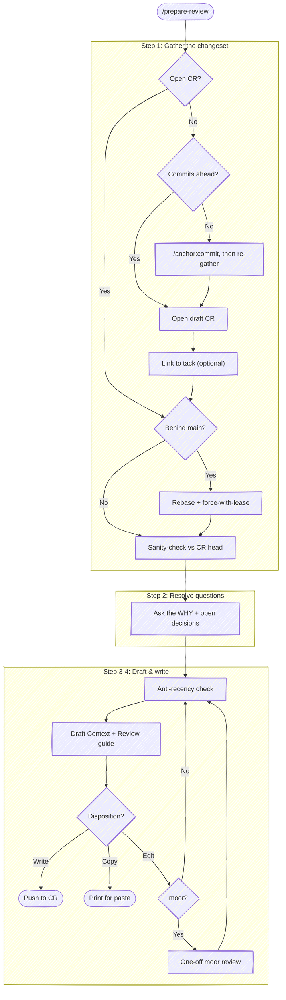
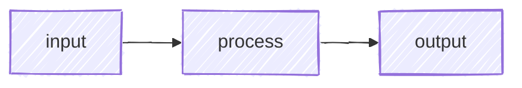
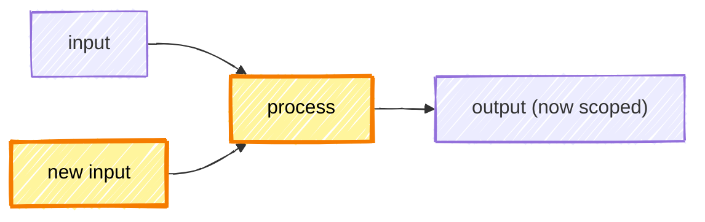

# Prepare Review

Draft a description whose job is to convey *why* the change exists and *how* it addresses the current problem. The proposed code stands on its own — the diff shows *what* changed; the description supplies the *reason*. The rest routes reviewer attention in order of criticality so they get maximum value from whatever time they can spend.

**Audience assumption — ELI5 / assume unfamiliarity.** Write for a competent developer who has never seen this system. Explain *what it does today* and *why this change exists* in plain language; spare a sentence or two to establish the business/system context up front — that investment is almost always worth the words. Skip the parts the diff already speaks to (which loop does what, which file moved where).

**Default to terse on everything else.** Justifications, hedges, asides, and "we used to / now we" framing add bytes without adding signal. Trim aggressively on the first pass; reviewers will ask for more if they want it. The shape to aim for: a Context section that earns its 30-60 seconds, then a tight Review guide. Recency-polish bullets, decisions no one was going to question, and author-todo lists all belong somewhere else — see Step 3 "What to avoid".

CR = change request: a pull request on GitHub, a merge request on GitLab. Pick the
forge tool by the `origin` remote.



## Execute quietly — do the thinking, don't show it

**The reviewer reviews A → B — the net change from base to final state — not the path you took to get there.** The minor pivots, dead ends, and intermediate iterations of this session are development *process*, not the change under review. This skill's recurring failure is narrating that process — to the user, or into the description — instead of just producing the artifact that describes A → B.

Step 1's recon and Step 4's diff/moor review each fold into one call precisely so there is nothing to narrate between them: run the call, read the result, move on.

**The entire visible output of a run is:**

1. a decision the script flagged that needs the user (`BEHIND`, a `STATE` mismatch, a `CR_CREATE_ERROR`);
2. the resolved CR URL, once;
3. the Step 2 questions;
4. the drafted description, the Step 4 options, and the final verdict.

**Everything else is internal — keep it out of the visible output:**

- **Per-step plumbing** — "origin is GitLab, 1 ahead, no template, anchors computed, tree clean." The user doesn't act on recon, and the script already ran it.
- **The anti-recency disposition** (Step 3) — the Centerpiece / Footnote / Cut rundown is scratch that *shapes* the draft; it is not output.
- **Session-internal history** — the path from A to B: "here's what I just did / iterated on / cleaned up." Process, not the change. It belongs nowhere the reviewer reads — not the chat, and not the description, where it's the "Drift artifacts" Step 3 tells you to cut.

Reserve prose for the steps that need *your* judgment or the *user's* input — the prompts in Step 2, drafting in Step 3, presenting options in Step 4. Those produce the artifact; narration *about* producing it does not.

## Step 1: Gather the changeset

Run the gather script once. It performs Step 1's deterministic recon and the safe default-path setup — detect the forge, resolve or auto-open the draft CR, count the gap to the default branch, capture the current description as the Step 4 diff baseline, check local state against the CR head, read the project template and `anchor.*` config — then prints one `KEY=value` block on stdout:

```bash
bash "${CLAUDE_PLUGIN_ROOT}/scripts/prepare-review.sh"
```

Read the block and act only on what it surfaces; don't re-run the individual probes. The keys:

| Key | What to do with it |
|-----|--------------------|
| `FORGE` | `github` / `gitlab` picks the CLI for the rest of the skill; `none` → the URL-free `skip-deep-links` path |
| `DEFAULT_BRANCH` | substitute for `main` in the diff/log commands below |
| `ON_DEFAULT_BRANCH=1` | HEAD is the default branch — no CR; the no-commits-ahead check below stops the run |
| `AHEAD=0` | nothing ahead of the default branch — `NEEDS_COMMIT=1` chains to `/anchor:commit` (see below); otherwise say so and stop |
| `NEEDS_COMMIT=1` | no CR and nothing committed ahead of the default branch — chain into `/anchor:commit` before continuing (see "Chain to commit") |
| `BEHIND=<n>` | `>0` → run the rebase dialog below |
| `CR_URL` / `CR_IID` | the resolved or freshly-opened draft — deep-link target and write target (empty on `skip-deep-links`) |
| `CR_DRAFT` | gates the post-rebase force-push (see below) |
| `STATE` | `match` → proceed; anything else → surface and stop (see "Act on `STATE`") |
| `CURRENT_DESC_PATH` | baseline the Step 4 diff reads (empty on `skip-deep-links`) |
| `TEMPLATE_PATH` | project CR template to compose into (Step 3) |
| `ANCHOR_CONFIG` | `anchor.*` keys to apply (Step 3), as JSON |
| `FILE_ANCHORS` | precomputed `sha1(path)` per changed file for GitLab deep links (Step 3), as JSON |

If the block carries a `CR_CREATE_ERROR=…` line, the draft-open hit an auth or push failure — surface it and ask the user to refresh credentials; do **not** fall back to the URL-free path (the fail-fast-on-auth rule).

### Chain to commit when `NEEDS_COMMIT=1`

"Work finished, nothing committed yet" is a common state to invoke prepare-review from — you've done the work and want to open the review. The script can't open a CR from it (a CR needs a commit ahead of the default branch to exist), so rather than letting `glab mr create` / `gh pr create` dead-end on a raw *"Could not find any commits between origin/`<default>` and `<branch>`"*, the script reports `NEEDS_COMMIT=1` and skips the auto-open.

When `NEEDS_COMMIT=1`, chain into `/anchor:commit` — commit the work first, then continue into prepare-review. Invoke the commit skill, let it run its flow (tests, staging, message, the visual diff review), and once the commit lands, **re-run the gather script** so it resolves the now-creatable CR:

```bash
bash "${CLAUDE_PLUGIN_ROOT}/scripts/prepare-review.sh"
```

The second run finds a commit ahead, auto-opens the draft CR, and returns a normal block (`NEEDS_COMMIT=0`, a resolved `CR_URL`). Proceed from there into the rebase / drafting flow as usual. If the second run still reports `NEEDS_COMMIT=1` — the user declined the commit, or it produced nothing ahead — say so and stop; don't loop.

**Why auto-open is the default.** A draft CR is cheap and reversible: it requests no review, the push already triggered any branch-level CI, and self-assign notifies only you. The deep links are the load-bearing part of the description, and a placeholder-only draft is broken on arrival — opening the real CR first is what makes the description useful. The script does **not** sniff for a "merges direct to `main`, never opens CRs" convention, because there's no reliable signal for it. Two cases give way to the `skip-deep-links` path:

- **`ON_DEFAULT_BRANCH=1`** — HEAD is the default branch, so there's no feature branch to open a CR *from*; the script skips auto-open.
- **User asks not to open one** — the repo merges direct to `main` without CRs, or the CLI's default forge instance is wrong for this repo. Re-run with `--no-open` to proceed URL-free; or, if they'd rather open the draft themselves, pause until they confirm one is open, then re-run so the script resolves its URL.

### Link the CR to tack (optional)

[tack](https://github.com/chris-peterson/tack) tracks work-in-progress as routes
and tacks. The integration is **optional** — if `tack` isn't on PATH, skip this
section silently. When it is present and a route resolves (a pinned `.tack` file,
or `tack find <CR_URL> --json` matches), record the CR as the tack's deliverable
so the WIP tracker links to the review:

```bash
tack deliverable <slug> <tack-id> "MR" "<CR_URL>"   # "PR" on GitHub
```

When the CR represents the completion of that unit of work, offer to mark the
tack done:

> Mark tack `<slug>/<tack-id>` done? `[yes / no]`

On `yes`, run `tack done <slug> <tack-id>`. Leave it open if more work on the
tack is expected after review.

### Rebase on main when `BEHIND > 0`

`BEHIND=0` → skip this section. Otherwise the branch needs `origin/<default>` before it can merge — every conflict with intervening commits has to be resolved before the CR can land, and doing it now (while the change is fresh) is cheaper than after review when context has gone cold. Secondary: deep links anchor to lines in the *current* diff, so a behind-default branch points at content that won't compose cleanly at merge time. Ask:

> Branch is `<BEHIND>` commits behind `origin/<default>`. Rebase now? `[yes / skip]`

- `yes` — run `git rebase origin/<default>`. On conflict, resolve in place: read both sides of each conflicted region, pick the resolution that preserves the intent of *both* changes (not just one side), `git add` the resolved files, then `git rebase --continue`. Loop until the rebase completes. Surface to the user when intent is genuinely ambiguous — two competing changes to the same logic, semantic conflicts the textual markers don't show, a rename colliding with an edit. Don't guess in those cases; show the conflict and ask. If a hook fails mid-rebase, surface the failure rather than retrying with `--no-verify`.
- `skip` — proceed with the current branch state. Note that deep links may render against lines that have shifted by merge time.

A rebase rewrites history, so the push that follows is a force-push. Gate it on `CR_DRAFT` — the author's declared review state, which is reliable in a way that inferred engagement signals (note counts, reviewer lists) are not:

**`CR_DRAFT=true`** — mutable history is the norm (anchor opens CRs as drafts for exactly this reason). Rebase and force-push with lease without further ceremony.

**`CR_DRAFT=false`** (ready) — a reviewer may already be looking, and there's no reliable signal for whether they have. Force-pushing over commits they've seen destroys their "changes since you last looked" diff and marks inline threads outdated. Engagement signals are advisory context for the prompt (reviewers / discussion count via `glab api projects/:fullpath/merge_requests/<CR_IID> | jq '{reviewers, user_notes_count}'` or `gh pr view --json reviews,reviewRequests,comments`), but the decision is the user's — ask before proceeding:

> This CR is marked ready. Rebasing now force-pushes over commits a reviewer may have seen, which resets their incremental diff. Rebase anyway? `[yes / skip]`

After a successful rebase (and the review-activity check above), force-push with lease so the open CR updates to the rewritten history:

```bash
git push --force-with-lease
```

`--force-with-lease` rejects the push if anyone else has pushed to the branch since you last fetched — that's the safety against clobbering a coworker's commit. If it rejects, fetch, inspect, and ask the user before escalating. If the rebase itself aborts (uncommitted changes blocking it, a rebase already in progress, missing remote), surface the error and stop.

### Read the diff and commit history

Substitute `DEFAULT_BRANCH` from the block for `main`:

```bash
git log main..HEAD --oneline
```

```bash
git diff main...HEAD --stat
```

```bash
git diff main...HEAD
```

(`AHEAD=0` already routed you — chained to `/anchor:commit` on `NEEDS_COMMIT=1`, or stopped otherwise — so a run that reaches here is ahead of the default branch.)

### Act on `STATE`

The deep links you'll generate point at specific lines of the *current* CR diff, so drafting against stale state ships a description that renders against content the reviewer can't see. `STATE=match` → proceed. Otherwise stop and surface — *do not* draft:

- **`dirty`** — uncommitted changes in the working tree. Common cause: a multi-step cleanup whose steps were each confirmed in conversation but never committed. Ask the user whether to amend (or new-commit) and push before drafting.
- **`head-mismatch`** — local HEAD ≠ CR head: the user's expected push hasn't landed, or you're on the wrong branch. Common cause: a force-push blocked by a hook, or a no-op push because the working tree was never committed. Surface the SHA mismatch (`LOCAL_HEAD_SHA` vs `CR_HEAD_SHA`) and ask.
- **`dirty+head-mismatch`** — both of the above.

State drift between conversation belief and repo reality is silent and expensive. The script's read-only state check catches it; missing it ships a broken description.

## Step 2: Resolve open questions before drafting

The description needs the author's motivation **and any decisions still in flux**. If something would otherwise come out of the description as a hedge or an open offer ("happy to bump version if you'd like", "open to adding a test", "could split this into two CRs"), it's a question — ask it now, then draft. **The CR description is not a place to negotiate.** Any ambiguity is a reason to *defer* drafting, not park inside it.

Before drafting, scan for these common ambiguities and ask the user about each one that applies:

- **Why** — what problem this solves and why it matters (the prompt below)
- **Audience / threat model** — for security or visibility changes, *who* is the affected population? "Anyone who can read X" is too vague. Name the population concretely: anyone inside the network, anyone with read access to the source, the on-call team, etc.
- **Scope decisions** — should this be split? Squashed? Feature-gated? Released alongside something else?
- **Surface decisions** — version bump, deprecation timeline, migration guidance for downstream callers
- **Verification gaps** — anything you can't actually test from the working environment (UI, downstream consumers, prod-only behaviors). Surface these to the author so they can plan how/when to verify before merge. These are author homework — they do **not** become checklist items in the description.

Wait for answers to all of them before drafting. A description shipped with parked questions is worse than one shipped a turn later.

If the only open item is the WHY, ask:

> **What problem does this solve, and why does it matter?**
>
> The diff shows *what* changed — I need you to tell me *why*. A sentence or two is enough. For example:
> - "Users were getting 500 errors when their session expired mid-checkout"
> - "We need to support the new billing API before the March deadline"
> - "The old approach couldn't scale past 10k concurrent connections"

## Step 3: Draft the description

### Honor an existing forge template

`TEMPLATE_PATH` from Step 1's block names the project's CR template (`.gitlab/merge_request_templates/*.md` or `.github/pull_request_template.md`); empty means none. When set, it's the team's required scaffolding — **compose into it, don't replace it.** Fill the sections it defines, preserve its checklists and headings verbatim, and supply anchor's prose where it leaves prose to the author; on a structure conflict the team template wins. The composition rules are documented in the "Honoring a project's forge template" section of `templates/cr-description.md`.

### Honor `anchor.*` config

`ANCHOR_CONFIG` from Step 1's block holds the project + global `anchor.*` keys as JSON (`{}` when none). The keys come back lowercased (`anchor.reviewbudgetmins`); match them case-insensitively. Apply the keys relevant to a CR description; absent keys keep anchor's defaults — never invent a value:

- **`anchor.reviewBudgetMins`** — the minutes of focused review you expect this CR to get (an *input*, not a length cap; unset behaves like ≈10). A tight budget (≈5) leads with the essentials and cuts asides hard; a generous one (≈30) keeps more supporting context and depth. This steers how aggressively the anti-recency and "What to avoid" passes cut.
- **`anchor.workTrackerBaseUri`** — when the user mentions a ticket (a full tracker URL, or a bare id), link it in the description: use a full URL as-is, or build `<base-uri><id>` from a bare id. No mention, no link — don't scrape the branch or prompt.
- **`anchor.crRules`**, with forge overrides **`anchor.mrRules`** (GitLab) / **`anchor.prRules`** (GitHub) — an extra rule layered onto the default CR-description rules. Pick the forge by the `origin` remote: use `mrRules` / `prRules` when set, else fall back to `crRules`.

See `guides/configuring.md` for the full key set.

### Anti-recency-bias check (do this *before* drafting Context)

Recency bias is the dominant failure mode here: detail you spent the last hour polishing carries disproportionate weight in working memory and anchors the Context section even when the CR is about something much larger. **The headline is what the *branch* was for — usually the first commit, not the last.** Mechanical fix:

1. **List the 3-5 things you most recently iterated on** (in this session, or in the last few commits). Be concrete: "polished two chip labels", "rewrote cache-key construction".
2. **Write a disposition for each** against *would a fresh reviewer consider this central?* — **Centerpiece** (lead Context), **Footnote** (one bullet in Review guide), or **Cut**.
3. **If everything came out "centerpiece", redo it.** Follow-up commits are footnotes. If a follow-up deserves co-headline status, it's actually a separate CR.

Run this check **internally** — it shapes what you draft, but the disposition list itself is session-internal scratch, not output. Do **not** print the "Centerpiece / Footnote / Cut" rundown to the user; the only thing they see from this step is the resulting draft. (See **Execute quietly** at the top.)

### Title

A concise imperative phrase (under 72 characters) that captures the change. Same rules as a good commit subject line.

### Body structure

Draft the description following the section template in `templates/cr-description.md`: **Context**, **Review guide**, **Approach & trade-offs** *(rare)*, **Testing** *(rare)*, and **Validation** *(shared components only)*. The template owns the *shape* — which sections, in what order, and what each is for; the guidance below owns the *technique* for realizing it.

**Deep-link construction (Review guide).** Always deep-link to the actual line, not just the file — reviewers should be one click away from the hunk you're pointing them at. Construction differs by forge:

- **GitLab:** `<CR_URL>/diffs#<file-anchor>_<old-line>_<new-line>` where `<file-anchor>` is `sha1(<repo-relative-file-path>)` — already computed per changed file in `FILE_ANCHORS` from Step 1's block. (You still pick the line numbers; only the path-hash is precomputed.) For a file-level link (no specific line), just use `<CR_URL>/diffs#<file-anchor>`. For pure additions, use the new line number for both `<old-line>` and `<new-line>` — the link still resolves.

- **GitHub:** `<CR_URL>/files#diff-<file-anchor>R<new-line>` (or `L<new-line>` for the left/old side). The `<file-anchor>` for GitHub is `sha256(<file-path>)` — `gh` doesn't expose it directly, so fall back to opening the CR's "Files changed" tab and copying the link from the line-number gutter when in doubt.

**Validation — ask, don't guess (shared components).** The Validation section applies when the change is to a shared component consumed by other repos. Detect it from these signals: shared-component repo path (`terraform-modules/`, `libraries/`, `base-configs/`), no direct deploy pipeline of its own, version exposed as a git ref or semver tag pinned by other repos. **Skip** when the change is to a deployable service or UI app — it ships its own production validation.

When the signals fire, **ask the author what validation looks like** rather than emitting a guessed checklist row:

> What does validation look like for this change? Which downstream consumer (or representative sandbox) did you exercise it against, and what did you observe?

Record their answer as the evidence row shown in the template's Validation section. The diff shows what the change *says*; the rendered artifact shows what it *renders*; the author's validation evidence tells the reviewer what the change *does* in composition with the consumers that actually exercise it.

### Tone

Conversational and informal. Reviewers are colleagues, not stakeholders — write like you'd talk through the change at a desk, not like a status report. Sentence fragments are fine. Mid-thought asides in parens are fine. Don't sweat capitalization on tier labels and short bullets, and don't sweat trailing punctuation on fragments — `core change, lives here` reads as well as `Core change, lives here.` and a closing period on a one-line bullet adds nothing. Save the more formal register for the *Why* paragraph where context actually matters; everywhere else, default low-friction.

### Formatting

**Presentation is a primary concern, not a finishing pass.** Before drafting, ask: *what shape is this data, and what visualization fits it?* The right choice makes information land in seconds; the wrong one buries it in prose that reviewers skim past. Pick deliberately — a diagram that doesn't match the data shape is worse than no diagram, and a flat markdown table for tree-shaped data is worse than a brief HTML table.

The menu, ordered by data shape:

| Data shape | Use this | When |
|------------|----------|------|
| Linear story | Paragraphs | Motivation → consequence → next step. The default for *Context*. |
| Flat tabular | **Markdown table** | Lists with consistent columns: changed flags with old/new values, verification rows with `Run` / `Status` columns, affected services with owners. |
| Process / shape / interaction | **Mermaid diagram** | State machine (`stateDiagram-v2`), service sequence (`sequenceDiagram`), decision/data flow (`flowchart TD`), type relationships (`classDiagram`). |
| Tree-shaped / hierarchical | **Inline HTML table with `rowspan` / `colspan`** | A parent record with multiple child records sharing parent attributes; a per-environment matrix where one row spans envs. Markdown tables can't represent 2D nesting — drop into raw HTML (`<table><tr><td rowspan="2">…`). Markdown renderers accept raw HTML; use it where it's the right tool. |
| Structural change | **Before/after with highlights** | Added input, swapped algorithm, new flow. Two mermaid blocks under explicit `### Before` / `### After` headings, with `classDef` highlighting the changed nodes. |
| Visual / UX change | **Annotated screenshots** (preferred) or **Before/After markdown table** | Component, CSS, template, or layout changes — anything where the rendered output is what the reviewer needs to evaluate. |

Pick once and commit. If two visualizations would each carry the data, prefer the more compact one — reviewers stop reading when they run out of time, not when you run out of content.

After visualization choice, lean into markdown for the surrounding prose:

- **Bold** for the key noun or verb in a sentence, and for lead-in labels (e.g. `**Why:**`, `**Note:**`).
- *Italics* sparingly — for tone, or to flag a term you're about to define.
- `Backticks` for every code identifier, file path, env var, branch name, package, or CLI flag. Anything a reader might grep for or paste into a terminal earns backticks. Inline backticks are cheap and pay back hugely in skim-readability.
  - **Exception — forge-autolink tokens stay bare.** GitLab and GitHub autolink CR/issue refs (`!148`, `#42`), commit SHAs (`a553528`), and user @mentions (`@chris`) when they appear as **bare text**. Wrapping them in backticks turns them into inert code spans and kills the link. Write `!148`, not `` `!148` ``; write `a553528`, not `` `a553528` ``.
- Fenced code blocks with a language tag for multi-line snippets, sample output, configs, or schemas.
- Headings (`##`, `###`) to chunk the description so reviewers can jump straight to "Approach" or "Testing".

**Collapsible sections — fold heavy detail away to keep the outline brief.** Brevity is the default, but some changes genuinely carry detail a reviewer occasionally wants and shouldn't have to scroll past to skip: a full `terraform plan`, a long log excerpt, an exhaustive flag-by-flag table, a verbose config sample. Wrap that detail in a `<details><summary>…</summary>` block. The summary line keeps the outline scannable; the detail is one click away when a reviewer wants it. This is the escape valve that lets the description stay terse *and* complete — reach for it instead of either inlining a wall of output or dropping the detail entirely. Both GitHub and GitLab render the HTML; [GitLab's markdown reference](https://docs.gitlab.com/user/markdown/#collapsible-section) documents the syntax. The one gotcha: markdown inside the block renders only with a blank line after `</summary>` and before `</details>` — without it, tables and code fences show as raw text.

````markdown
<details>
<summary><strong>Full <code>terraform plan</code> output</strong></summary>

```text
# ~200 lines of plan output the reviewer can expand if they want it
```

</details>
````

**Mermaid diagrams.** A small mermaid diagram earns its keep when the change has shape that prose hides — a state machine, a sequence between services, a before/after architecture, a decision flow. **A picture lands faster than two paragraphs of prose.** Pick the type that matches the content:

- `stateDiagram-v2` for state transitions
- `sequenceDiagram` for service or actor interactions
- `flowchart TD` for decision/data flow
- `classDiagram` for type relationships

Keep diagrams tight (5–10 nodes — a diagram you have to scroll is worse than no diagram). Follow these mermaid conventions: hand-drawn look (`%%{ init: { 'look': 'handDrawn' } }%%`), no `\n` or `<br>` in node labels (use separate nodes or shorter labels instead).

**Before/after with highlights.** When the change has a structural shape — added input, swapped algorithm, new flow — a before/after diagram is worth the extra lines. Use **two separate fenced mermaid blocks under explicit `### Before` and `### After` markdown subheadings** — *not* two `subgraph` blocks inside a single mermaid block. Mermaid renders subgraphs in non-deterministic order, so a single-block "Before / After" can render with the After above the Before on GitLab. Explicit subheadings guarantee ordering. Highlight the new or changed nodes with a `classDef` so the reader's eye lands on the difference:

````markdown
### Before



### After


````

Use `###` when Before/After fits under an existing `##` section; use `##` when it stands alone. Keep both diagrams tight — if the After grows several new inputs, collapse them into a single labeled node when their individual identity isn't load-bearing (e.g. `salt = env|app` instead of three separate nodes for `env`, `app`, `salt`).

**Visual / UX changes — screenshots.** When the diff touches rendered output, prose can't show the reviewer what changed. Capture screenshots *before* drafting Context — for UX-driven CRs they're usually the centerpiece, not a footnote.

- **Detect.** The changeset is UX-related when the diff touches `.css`/`.scss`, component files (`.tsx`/`.jsx`/`.vue`/`.svelte`), templates (`.html`/`.erb`/`.razor`), design tokens, or asset files (icons, images, fonts).
- **Capture After.** Drive the running app with the Playwright MCP browser tools (`browser_navigate`, `browser_take_screenshot`). For an isolated component the app can't easily mount, a frontend-design skill can compose a representative view to screenshot.
- **Force hover-revealed UI via CSS injection, not `page.hover()`.** Programmatic hover races the screenshot timing. Instead, inject a scoped `<style>` element via `browser_evaluate` with `!important` opacity / display rules, take the shot, then navigate away to reset (the `<style>` element doesn't survive route changes). The same technique scales to **focused crops**: hide non-target siblings with a temporary `display: none !important` class so the screenshot bounds tightly around the area of interest.
- **Capture Before.** Stash the working tree (or `git worktree add` at `main`), screenshot the same views, restore your branch. Match viewport size and route so the only delta is the change under review.
- **Annotate the modified regions (preferred).** Overlay boxes, arrows, or callouts on the new/modified content so the reviewer's eye lands on the change instead of doing diff-by-eye between two near-identical images.
- **Fallback — Before/After table.** When annotation isn't practical (multiple regions, layout reflow, animation, theme swap), use a side-by-side markdown table:

  ```markdown
  | Before | After |
  |--------|-------|
  |  |  |
  ```

Screenshots are local files; the markdown references them by path. After pasting the description into the forge web UI, drag and drop each PNG into the editor — GitHub/GitLab uploads and rewrites the path to a hosted URL automatically.

### What to avoid

Categories of cruft. If something fits one of these, it doesn't belong in the description.

- **Drift artifacts** — recency-polish bullets (run the anti-recency check above; cut anything dispositioned "Footnote" or "Cut"); implementation-history phrasing that frames the change by what it *replaces* (`now-deprecated`, `previously`, `formerly`, `the old`, `we used to`, `used to be`); past-or-future speculation ("this was originally X", "will eventually become Y", "could one day be extended to Z"); invented incidents, audiences, or current state. Every factual claim about prior workflow or current state needs a citable source — something the user said, the diff shows, or a doc establishes. (Exception: a deprecation CR whose entire purpose is announcing the deprecation — there, naming the deprecated thing is the point.)
- **Loaded framing** — temporal/historical blame ("have always omitted", "has never worked"); minimizing qualifiers about size, whether adjectives ("one short block", "a tiny fix", "trivial change") or counts used as a framing device ("one line, in …", "just a one-liner", "only N lines") — even on a genuinely small diff, lead with *where* the change is, not *how little* it is; self-congratulatory adverbs ("correctly omits", "properly handles"); defensive softeners on technical claims ("purely additive", "completely backward-compatible"). The factual claim almost always survives the trim — and reads cleaner for it.
- **Things the diff already shows** — flat lists of files changed without criticality ordering; re-stated commit messages; implementation details obvious from reading the code; dead-end approaches you tried and abandoned; anything a reviewer could derive from one click on a deep link; Review-guide bullets that narrate a hunk in prose instead of pointing at it (the point-of-generation rule lives in the Review guide section of `templates/cr-description.md`).
- **Things that belong elsewhere** — author-only checklists (eyeball staging, fill a spot-check matrix, confirm rendering, drive a fixture table — these live in a personal task list, a self-review pass, or CR comments, not the description body); changelog content the CR already ships; decisions a reviewer wouldn't have questioned (Approach & trade-offs is for *contested* choices); testing claims CI already provides; reference-grade explanation of standing behavior that grew while drafting — with the author's sign-off, split it into the repo docs and link it from the description (high bar; see the bundled `guides/description-vs-docs.md`).
- **Step-2 leftovers** — hedges, offers, or open questions ("happy to / open to / let me know if"); unsubstantiated verification claims ("verified" / "tested" / "confirmed" for things you didn't actually exercise). If ambiguity is still in flux, defer drafting; don't park it in the description.
- **Boilerplate** — generic openings ("This change updates…"); assuming domain knowledge the reviewer doesn't have.

The single exception to "no verification content in the description body" is the **Validation** evidence row for shared components — see the Validation section in `templates/cr-description.md`. That row records *evidence*, not a todo.

## Step 4: Output

Write the drafted description to a temp file (`mktemp -u /tmp/cr-desc-draft.XXXXXX.md`) — both the diff presentation here and the moor edit loop below read it.

**Present the change.** When `CURRENT_DESC_PATH` from Step 1's block is non-empty (any CR exists — including a freshly-opened draft, whose `--fill` baseline makes the draft render as all-additions), show what changed rather than the whole body — diff the draft against that baseline and present it in a fenced `diff` block:

```bash
git --no-pager diff --no-index <CURRENT_DESC_PATH> <draft-path>
```

When `CURRENT_DESC_PATH` is empty (the `skip-deep-links` path, where no CR exists), display the full description in a fenced code block instead. Use markdown formatting appropriate for the platform (GitHub, GitLab, etc.). After presenting, offer to write the description back to the forge — see the final prompt below.

### Output checklist (verify before presenting)

The description gets pasted into a markdown renderer, so rendering bugs are user-visible. Walk this list:

- **Outer fence has 4+ backticks when the description contains any 3-backtick blocks.** Mermaid blocks, code samples, and inline `\`\`\`text` fences inside the description will close a 3-backtick wrapper early. Use ` ```` ` (4 backticks) for the outer fence whenever the inner content has triple-backtick fences — otherwise the second half of the description renders as raw text.
- **Mermaid `%%{ init }%%` directive is the first line *inside* the fenced block, not before it.** A bare `%%{ init }%%` line outside ` ```mermaid ` shows up as raw text and the diagram loses its theme. The block must look like ` ```mermaid ` → `%%{ init: { 'look': 'handDrawn' } }%%` → diagram → ` ``` `.
- **All mermaid blocks have a closing fence.** Easy to drop when the diagram is the last thing before a section break.
- **Collapsible `<details>` blocks have blank lines around their inner markdown.** A `<details>`/`<summary>` wrapper renders the markdown inside it only with a blank line after `</summary>` and before `</details>` — otherwise tables, code fences, and lists inside show as raw text.
- **Backtick coverage is generous — except for forge-autolink tokens.** Re-scan the description for grep-bait: env vars (`$FAMILY`, `$CI_PIPELINE_CREATED_AT`), config keywords (`extends:`, `needs:`, `on_success`, `manual`, `allow_failure`), job/product/feature suffixes that match identifiers in the diff, CLI flags, file paths. The "if a reader might paste it into a terminal" test is more permissive than "code identifier only" — err generous. **But** scan separately for CR/issue refs (`!148`, `#42`), commit SHAs, and user @mentions — these must be **bare text** to autolink; backticks render them as inert code spans.
- **Inline single quotes around `'all'` / `'true'` style values** read fine in prose but lose their distinguishing weight in scan-mode. Convert literal dropdown/enum values to backticks.
- **Escape literal `$` in prose.** GitHub and GitLab markdown renderers interpret `$...$` as inline KaTeX/math mode and silently swallow the content between the delimiters — a description that mentions two shell variables in the same paragraph (e.g. `$FAMILY` and `$REGION`) renders as a blank gap. Inside fenced code blocks and inline backticks, `$` is safe; outside them, use `\$` for the literal sign. The same applies to bare `_underscores_` around identifiers (read as italics) and `*asterisks*` inside flag names — backtick them or escape them.

Then ask the user how to proceed using the `AskUserQuestion` tool — an arrow-key-selectable prompt beats a free-text `[write / edit / copy]` prompt the user has to type out. Use header `Disposition` and these three options (in order, so the default lands on **Yes**):

- **Yes (write)** — push the description to the open CR.
- **No (copy only)** — print the description for the user to paste themselves.
- **Edit** — mark up the change inline (moor) or in chat, then re-present.

Map the user's selection to the actions below:

1. **Yes (write)** *(default)* — push the description to the open CR. Editing a description is reversible, so this is the low-friction default. On 401/403 or similar auth failure, surface the error and ask the user to refresh credentials — do not silently fall back to copy-only. The `<draft-path>` is the temp file you wrote at the top of Step 4.

   - **GitHub:** `gh pr edit --body-file <draft-path>`.
   - **GitLab:** use the API form `glab api -X PUT projects/:fullpath/merge_requests/<CR_IID> -F "description=@<draft-path>"` — `glab mr update -d` doesn't accept a file. See the [forge cookbook](https://chris-peterson.github.io/anchor/#/guides/forge-cookbook) for the full canonical invocation.
2. **No (copy only)** — print the description for the user to paste into the web UI themselves. Useful when the user wants to hand-edit before pasting, or when the CLI's default forge instance is wrong for this repo.
3. **Edit** — the user wants to adjust something. [moor](https://github.com/chris-peterson/moor) is the preferred surface for this but **optional** — check it's installed:

   ```bash
   command -v moor
   ```

   **If `moor` is present**, open a one-off review of the current description vs. the draft so the user can comment on specific lines with a reason — directed, line-anchored feedback instead of a prose back-and-forth. Launch via the wrapper (**not** `moor` directly — the wrapper writes the `MOOR_CONTEXT` input header and prints the verdict on its stdout). The viewer blocks until closed, so launch as a **background** Bash call (`run_in_background: true`); a foreground call holds the turn open until the Bash timeout:

   ```bash
   bash "${CLAUDE_PLUGIN_ROOT}/scripts/review-diff.sh" --files \
     <CURRENT_DESC_PATH> <draft-path> \
     --title 'CR description — proposed edits' \
     --detail branch=<BRANCH> --detail CR=<CR_URL>
   ```

   When the background command completes, read its stdout with the **BashOutput tool** — not `tail` / `$(...)`, which trips the command-substitution gate. The last lines carry the verdict: `REVIEW_VERDICT` (`0`/`1`/`2`/`3`/`absent`) and `REVIEW_OUTPUT` (compact JSON, with `.comments` when the verdict is `1`). **Don't read silence as success** — only `REVIEW_VERDICT` `0` is approval; every other outcome either carries feedback to fold in or means the review never happened, so never write the description off the back of one.

   - **`0`** — reviewed clean, nothing blocking: treat as approval and write the draft to the CR (the **Yes** action above).
   - **`1`** — fix-now comments exist: each entry in `REVIEW_OUTPUT`'s `.comments` is `{body, action, file?, startLine?, endLine?}`, where `body` is the user's inline feedback and `action` is `fix-now` (blocker), `fix-later`, or `consider`. Fold every `fix-now` comment into a revised draft — along with any advisory `fix-later` / `consider` comments worth incorporating — then loop back to **Present the change**.
   - **`2`** — the user closed with hunks still unreviewed: a partial pass, not approval. Ask what they want to change, then re-present.
   - **`3` or `absent`, or no `REVIEW_VERDICT` line appeared** — the review **did not complete**: moor closed before counting any hunks, crashed, or failed to launch. Do **not** treat this as approval and do **not** write the description. Surface what happened to the user — name the verdict, or that none was written — then fall back to a path that works: re-present the chat `diff` from **Present the change** and ask what to change (the moor-absent path below). If the user has a non-moor difftool configured, offer to open the two files in it (`git difftool --no-index <CURRENT_DESC_PATH> <draft-path>`) as an alternative; don't silently retry moor, since the same failure will recur.

   The wrapper leaves the context file in place; moor recycles it.

   **If `moor` isn't on PATH**, fall back to chat: ask what to change, revise the draft, and re-present (loop back to **Present the change**).

> **One web-UI step remains regardless of choice:** screenshots embedded in the description must be dragged into the forge editor (`gh` / `glab` don't expose a clean upload path). After **Yes (write)** lands the body, open the CR in the browser, drop each PNG, and re-save — the forge rewrites the local paths to hosted URLs.
