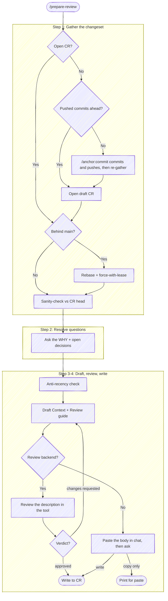

# Prepare Review

Draft a description whose job is to convey *why* the change exists and *how* it addresses the current problem. The proposed code stands on its own — the diff shows *what* changed; the description supplies the *reason*. The rest routes reviewer attention in order of criticality so they get maximum value from whatever time they can spend.

**Audience assumption — ELI5 / assume unfamiliarity.** Write for a competent developer who has never seen this system. Explain *what it does today* and *why this change exists* in plain language; spare a sentence or two to establish the business/system context up front — that investment is almost always worth the words. Skip the parts the diff already speaks to (which loop does what, which file moved where).

**Default to terse on everything else.** Justifications, hedges, asides, and "we used to / now we" framing add bytes without adding signal. Trim aggressively on the first pass; reviewers will ask for more if they want it. The shape to aim for: a Context section that earns its 30-60 seconds, then a tight Review guide. Context's ceiling is **two short paragraphs, the change named in the first** — the template holds that cap and the padding patterns it rules out, so the unfamiliarity assumption above doesn't read as licence to expand. That ceiling is the shape at `anchor.crVerbosity 100`; below it Context is the first thing the dial shortens, so at the default it's usually one paragraph (see "Honor `anchor.*` config"). Recency-polish bullets, decisions no one was going to question, and author-todo lists all belong somewhere else — see Step 3 "What to avoid".

CR = change request: a pull request on GitHub, a merge request on GitLab. Pick the
forge tool by the `origin` remote.


```mermaid
%%{ init: { 'look': 'handDrawn' } }%%
flowchart TD
    Start(["/prepare-review"]) --> CR{Open CR?}

    subgraph "Step 1: Gather the changeset"
        CR -->|No| Pushed{Pushed commits ahead?}
        CR -->|Yes| Behind
        Pushed -->|No| Commit["/anchor:commit commits and pushes, then re-gather"]
        Pushed -->|Yes| MakeCR["Open draft CR"]
        Commit --> MakeCR
        MakeCR --> Behind{Behind main?}
        Behind -->|Yes| DoRebase["Rebase + force-with-lease"]
        Behind -->|No| StateCheck
        DoRebase --> StateCheck["Sanity-check vs CR head"]
    end

    subgraph "Step 2: Resolve questions"
        StateCheck --> Why["Ask the WHY + open decisions"]
    end

    subgraph "Step 3-4: Draft, review, write"
        Why --> Recency["Anti-recency check"]
        Recency --> Draft["Draft Context + Review guide"]
        Draft --> Backend{Review backend?}
        Backend -->|Yes| InTool["Review the description in the tool"]
        Backend -->|No| Chat["Paste the body in chat, then ask"]
        InTool --> Verdict{Verdict?}
        Verdict -->|approved| Forge(["Write to CR"])
        Verdict -->|changes requested| Draft
        Chat -->|write| Forge
        Chat -->|copy only| CopyOnly(["Print for paste"])
    end
```

## Execute quietly — do the thinking, don't show it

Follow the execute-quietly discipline: `${CLAUDE_PLUGIN_ROOT}/guides/execute-quietly.md`. It bites hardest here because **the reviewer reviews A → B — the net change from base to final state — not the path you took to get there.** The session's pivots, dead ends, and intermediate iterations are development *process*, not the change under review; narrating that process — to the user, or into the description — is this skill's recurring failure. Step 1's recon and Step 4's diff/moor review each fold into one call precisely so there is nothing to narrate between them: run the call, read the result, move on.

**The entire visible output of a run is:**

1. a decision the script flagged that needs the user (`BEHIND`, a `STATE` mismatch, a `CR_CREATE_ERROR`);
2. the resolved CR URL, once;
3. the Step 2 questions;
4. the review feedback echoed back, and the one-line result of the write.

The drafted description itself is *shown in the review tool*, not pasted into chat — the exception is the no-backend fallback in Step 4, where chat is the only surface it has.

Everything else is internal: the per-step recon plumbing ("origin is GitLab, 1 ahead, no template, tree clean" — the script already ran it), the Step 3 anti-recency disposition (Centerpiece / Footnote / Cut scratch that *shapes* the draft, never output), and session-internal A → B history (which also gets cut from the description as a "Drift artifact" — see Step 3). Reserve prose for the steps that need *your* judgment or the *user's* input — the Step 2 prompts, drafting in Step 3, presenting options in Step 4.

## Step 1: Gather the changeset

Run the gather script once. It performs Step 1's deterministic recon and the safe default-path setup — detect the forge, resolve or auto-open the draft CR, count the gap to the default branch, capture the current description as the Step 4 diff baseline, check local state against the CR head, read the project template and `anchor.*` config — then prints one `KEY=value` block on stdout:

```bash
bash "${CLAUDE_PLUGIN_ROOT}/scripts/prepare-review.sh"
```

Read the block and act only on what it surfaces; don't re-run the individual probes. The keys:

| Key | What to do with it |
|-----|--------------------|
| `RESOLVED_VIA` | `cwd` (inferred from the working directory) or `repo` (an explicit `--repo` was honored) — see "Operating against a non-cwd repo" |
| `FORGE` | `github` / `gitlab` picks the CLI for the rest of the skill; `none` → the URL-free `skip-deep-links` path |
| `DEFAULT_BRANCH` | substitute for `main` in the diff/log commands below |
| `ON_DEFAULT_BRANCH=1` | HEAD is the default branch — there's no branch to open a CR *from*. With work to review, `NEEDS_BRANCH=1` routes through branch creation first; clean with nothing ahead → nothing to review, stop |
| `AHEAD=0` | nothing ahead of the default branch — `NEEDS_COMMIT=1` chains to `/anchor:commit` (see below); otherwise say so and stop |
| `NEEDS_BRANCH=1` | on the default branch with work to review — a feature branch must exist before a CR can be opened (see "Get to a reviewable, pushed commit") |
| `NEEDS_COMMIT=1` | no reviewable commit yet — chain into `/anchor:commit` before continuing (see "Get to a reviewable, pushed commit") |
| `NEEDS_PUSH=1` | commits are ahead, no CR yet, but the branch isn't pushed — chain into `/anchor:commit`, which commits and pushes, then re-gather (see "Get to a reviewable, pushed commit") |
| `BEHIND=<n>` | `>0` → run the rebase dialog below |
| `CR_URL` / `CR_IID` | the resolved or freshly-opened draft — deep-link target and write target (empty on `skip-deep-links`) |
| `CR_DRAFT` | gates the post-rebase force-push (see below) |
| `STATE` | `match` → proceed; anything else → surface and stop (see "Act on `STATE`") |
| `CURRENT_DESC_PATH` | the review's left-hand side in Step 4 (empty on `skip-deep-links`) |
| `DESC_DRAFT_PATH` | where to write the drafted description in Step 4 — already `mktemp`'d, so don't make your own |
| `TEMPLATE_PATH` | the CR template to compose into (Step 3); empty when the hierarchy holds none, or when the pick needs the author |
| `TEMPLATE_SOURCE` | which level answered — `local` / `project-settings` / `inherited` / `configured` / `ambiguous` / `none` |
| `TEMPLATE_CANDIDATES` | `ambiguous` only — `[{name, path}]` for the author to pick from (see "Honor an existing forge template") |
| `DELETE_BRANCH_ON_MERGE` | `false` on a CR this run opened → name it and offer the remediation (see "Branch deletion on merge"); `unknown` → say nothing |
| `ANCHOR_CONFIG` | `anchor.*` keys to apply (Step 3), as JSON |
| `FILE_LINKS` | ready-to-use deep-link prefix per changed file, both forges (Step 3), as JSON — append the line part, never hash a path yourself |

If the block carries a `CR_CREATE_ERROR=…` line, the draft-open hit an auth or push failure — surface it and ask the user to refresh credentials; do **not** fall back to the URL-free path (the fail-fast-on-auth rule).

### Operating against a non-cwd repo (worktree isolation)

When the CR lives in a repo other than the session's cwd (you're in repo A, the CR is in repo B), don't drive B off cwd: resolve the target, decide direct-vs-worktree **once up front** with `bash "${CLAUDE_PLUGIN_ROOT}/scripts/worktree.sh" setup <path-to-B-checkout>`, thread the resolved `<CHECKOUT>` through every later command (the harness resets cwd between Bash calls), and tear the worktree down when the flow ends. The full procedure — name resolution via `resolve-target.sh`, the `worktree.sh` setup/teardown lifecycle, and the `git -C` / `-R` / `glab api` threading rules — is in `${CLAUDE_PLUGIN_ROOT}/guides/worktree-isolation.md`; consult it whenever B ≠ cwd.

When the target is just the session cwd (no non-cwd repo in play), skip all of this — everything below is plain `git` / `gh` / `glab` against the working directory.

### Get to a reviewable, pushed commit (`NEEDS_BRANCH` / `NEEDS_COMMIT` / `NEEDS_PUSH`)

**prepare-review is meant to run from any state.** A CR needs a commit on a feature branch that is **ahead of the default branch and pushed** — opening the draft is a pure forge operation on the pushed branch, since `/anchor:commit` now does the push. When that state doesn't exist yet, the script says so (instead of letting `glab mr create` / `gh pr create` dead-end on a raw *"Could not find any commits between origin/`<default>` and `<branch>`"*) and the skill chains into `/anchor:commit` to get there. The cases, keyed off the block:

- **`NEEDS_COMMIT=1`, `NEEDS_BRANCH=0`** — on a feature branch, work uncommitted. Chain into `/anchor:commit`: it runs its flow (tests, staging, message, the visual review) and, on a clean review, commits **and pushes**. Then re-gather.
- **`NEEDS_BRANCH=1`, `NEEDS_COMMIT=1`** — on the *default* branch, work uncommitted. Still chain into `/anchor:commit` — it detects the default branch, creates the feature branch (named from the subject it drafts), commits onto it, and pushes it. Then re-gather.
- **`NEEDS_PUSH=1`** — a feature branch with commit(s) ahead of the default branch that were never pushed (e.g. committed with raw `git`). The branch just needs pushing, which is `/anchor:commit`'s job now — chain into it rather than pushing here, then re-gather.
- **`NEEDS_BRANCH=1`, `NEEDS_COMMIT=0`** — on the default branch with commits that exist only on the local default branch (committed to `main` by habit, never pushed). Move them onto their own branch first, then chain into `/anchor:commit` to push it. Slug the latest subject (`git log -1 --format=%s`, the convention `/anchor:commit` uses), confirm the name with the user, then:

  ```bash
  git branch <slug>                    # point the new branch at the current commits
  git reset --hard origin/<default>    # rewind the local default branch to the remote
  git switch <slug>                    # continue on the feature branch
  ```

  This is safe because the local default branch was only *ahead* of `origin/<default>` — the reset drops those commits from the default branch, but they're preserved on `<slug>`. Now on a feature branch with unpushed commits, chain into `/anchor:commit` to push, then re-gather.

After the branch/commit/push lands, **re-run the gather script** so it resolves the now-creatable CR:

```bash
bash "${CLAUDE_PLUGIN_ROOT}/scripts/prepare-review.sh"
```

The second run is on a pushed feature branch with a commit ahead; it auto-opens the draft CR and returns a normal block (`NEEDS_BRANCH=0`, `NEEDS_COMMIT=0`, `NEEDS_PUSH=0`, a resolved `CR_URL`). Proceed from there into the rebase / drafting flow as usual. If it still reports `NEEDS_COMMIT=1` / `NEEDS_PUSH=1` — the user declined `/anchor:commit`, or it produced nothing ahead or pushed nothing — say so and stop; don't loop.

**Why auto-open is the default.** A draft CR is cheap and reversible: it requests no review, the push already triggered any branch-level CI, and self-assign notifies only you. The deep links are the load-bearing part of the description, and a placeholder-only draft is broken on arrival — opening the real CR first is what makes the description useful. The script opens the draft against the already-pushed branch (it never pushes) and does **not** sniff for a "merges direct to `main`, never opens CRs" convention, because there's no reliable signal for it. One case gives way to the `skip-deep-links` path:

- **User asks not to open one** — the repo merges direct to `main` without CRs, or the CLI's default forge instance is wrong for this repo. Re-run with `--no-open` to proceed URL-free; or, if they'd rather open the draft themselves, pause until they confirm one is open, then re-run so the script resolves its URL.

(When `ON_DEFAULT_BRANCH=1`, the script doesn't auto-open either — but that routes through branch creation, not skip-deep-links; see above.)

### Branch deletion on merge (`DELETE_BRANCH_ON_MERGE`)

The two forges keep this in different places, so `anchor` can only set it on one of them. GitLab takes `remove_source_branch` per MR and the create call passes it. GitHub has **no per-PR field** — the only standing setting is repo-wide `deleteBranchOnMerge`, so a PR `anchor` opens carries no preference of its own. `/anchor:merge` passes `--delete-branch`, which covers the branch for merges that go through it; a merge from the web UI, a bare `gh pr merge`, or auto-merge leaves the branch behind.

So when **this run opened the CR** (`CR_CREATED=1`) and `DELETE_BRANCH_ON_MERGE=false`, name the gap once and offer to close it. On a pre-existing CR (`CR_PREEXISTING=1`) or on `unknown`, say nothing — there's nothing this run decided.

> The source branch won't be deleted when `#7` merges — GitHub carries no per-PR setting and this repo's *"Automatically delete head branches"* is off. `/anchor:merge` deletes it anyway; a merge from the web UI wouldn't. Turn the repo setting on? `[yes / no]`

On `yes`, apply the forge's remediation and report what it did:

```bash
gh repo edit --delete-branch-on-merge                     # GitHub — repo-wide, needs admin
glab api -X PUT projects/:fullpath/merge_requests/<iid> \
  -F remove_source_branch=true                            # GitLab — this MR only
```

The GitHub form changes a setting for **every** PR in the repo, which is why it needs the user's yes rather than happening at create time. It needs admin on the repo; a 403 is an authorization failure — surface it and move on with the flow (the fail-fast-on-auth rule), since the branch still gets deleted by `/anchor:merge`. On `no`, proceed; don't re-ask on later runs.

Prefer the `glab api` form over `glab mr update --remove-source-branch`, whose help describes it as a *toggle* — it would turn the flag back off on an MR that already has it.

### Rebase on the default branch when `BEHIND > 0`

`BEHIND=0` → skip this section. Otherwise the branch needs `origin/<default>` before it can merge — every conflict with intervening commits has to be resolved before the CR can land, and doing it now (while the change is fresh) is cheaper than after review when context has gone cold. Secondary: deep links anchor to lines in the *current* diff, so a behind-default branch points at content that won't compose cleanly at merge time. Ask:

> Branch is `<BEHIND>` commits behind `origin/<default>`. Rebase now? `[yes / skip]`

- `yes` — run `git rebase origin/<default>`. On conflict, resolve in place: read both sides of each conflicted region, pick the resolution that preserves the intent of *both* changes (not just one side), `git add` the resolved files, then `git rebase --continue`. Loop until the rebase completes. Surface to the user when intent is genuinely ambiguous — two competing changes to the same logic, semantic conflicts the textual markers don't show, a rename colliding with an edit. Don't guess in those cases; show the conflict and ask. If a hook fails mid-rebase, surface the failure rather than retrying with `--no-verify`.
- `skip` — proceed with the current branch state. Note that deep links may render against lines that have shifted by merge time.

A rebase rewrites history, so the push that follows is a force-push. Gate it on `CR_DRAFT` — the author's declared review state, which is reliable in a way that inferred engagement signals (note counts, reviewer lists) are not:

**`CR_DRAFT=true`** — mutable history is the norm (`anchor` opens CRs as drafts for exactly this reason). Rebase and force-push with lease without further ceremony.

**`CR_DRAFT=false`** (ready) — a reviewer may already be looking, and there's no reliable signal for whether they have. Force-pushing over commits they've seen destroys their "changes since you last looked" diff and marks inline threads outdated. Engagement signals are advisory context for the prompt (reviewers / discussion count via `glab api projects/:fullpath/merge_requests/<CR_IID> | jq '{reviewers, user_notes_count}'` or `gh pr view --json reviews,reviewRequests,comments`), but the decision is the user's — ask before proceeding:

> This CR is marked ready. Rebasing now force-pushes over commits a reviewer may have seen, which resets their incremental diff. Rebase anyway? `[yes / skip]`

After a successful rebase (and the review-activity check above), force-push with lease so the open CR updates to the rewritten history:

```bash
git push --force-with-lease
```

`--force-with-lease` rejects the push if anyone else has pushed to the branch since you last fetched — that's the safety against clobbering a coworker's commit. If it rejects, fetch, inspect, and ask the user before escalating. If the rebase itself aborts (uncommitted changes blocking it, a rebase already in progress, missing remote), surface the error and stop.

### Read the diff and commit history

Substitute `DEFAULT_BRANCH` from the block for `main`:

```bash
git log main..HEAD --oneline
```

```bash
git diff main...HEAD --stat
```

```bash
git diff main...HEAD
```

(`AHEAD=0` already routed you — chained to `/anchor:commit` on `NEEDS_COMMIT=1`, or stopped otherwise — so a run that reaches here is ahead of the default branch.)

### Act on `STATE`

The deep links you'll generate point at specific lines of the *current* CR diff, so drafting against stale state ships a description that renders against content the reviewer can't see. `STATE=match` → proceed. Otherwise stop and surface — *do not* draft:

- **`dirty`** — uncommitted changes in the working tree. Common cause: a multi-step cleanup whose steps were each confirmed in conversation but never committed. Ask the user whether to amend (or new-commit) and push before drafting.
- **`head-mismatch`** — local HEAD ≠ CR head: the user's expected push hasn't landed, or you're on the wrong branch. Common cause: a force-push blocked by a hook, or a no-op push because the working tree was never committed. Surface the SHA mismatch (`LOCAL_HEAD_SHA` vs `CR_HEAD_SHA`) and ask.
- **`dirty+head-mismatch`** — both of the above.

State drift between conversation belief and repo reality is silent and expensive. The script's read-only state check catches it; missing it ships a broken description.

## Step 2: Resolve open questions before drafting

The description needs the author's motivation **and any decisions still in flux**. If something would otherwise come out of the description as a hedge or an open offer ("happy to bump version if you'd like", "open to adding a test", "could split this into two CRs"), it's a question — ask it now, then draft. **The CR description is not a place to negotiate.** Any ambiguity is a reason to *defer* drafting, not park inside it.

Before drafting, scan for these common ambiguities and ask the user about each one that applies:

- **Why** — what problem this solves and why it matters (the prompt below)
- **Audience / threat model** — for security or visibility changes, *who* is the affected population? "Anyone who can read X" is too vague. Name the population concretely: anyone inside the network, anyone with read access to the source, the on-call team, etc.
- **Scope decisions** — should this be split? Squashed? Feature-gated? Released alongside something else?
- **Ordering dependency** — must this CR land *after* another one (a shared library before its consumer, a config that points at the consumer)? Don't infer this aggressively — take it when the user says so, or when they've had you open the CRs as an ordered chain this session. If so, capture the predecessor CR (its iid/number, and project when cross-repo); Step 3 records it in the description and Step 4 sets the forge dependency.
- **Surface decisions** — version bump, deprecation timeline, migration guidance for downstream callers
- **Verification gaps** — anything you can't actually test from the working environment (UI, downstream consumers, prod-only behaviors). Surface these to the author so they can plan how/when to verify before merge. These are author homework — they do **not** become checklist items in the description.

Wait for answers to all of them before drafting. A description shipped with parked questions is worse than one shipped a turn later.

If the only open item is the WHY, ask:

> **What problem does this solve, and why does it matter?**
>
> The diff shows *what* changed — I need you to tell me *why*. A sentence or two is enough. For example:
> - "Users were getting 500 errors when their session expired mid-checkout"
> - "We need to support the new billing API before the March deadline"
> - "The old approach couldn't scale past 10k concurrent connections"

**Draft the WHY only from what you were actually given — the author's answer, the diff, or a cited doc. A correct-but-narrow WHY always beats a speculative-but-broad one.** When the WHY comes in thin, that thinness is the signal to *ask* (or confirm your reading) — not to fill. Don't elaborate the motivation past the source, and don't invent *supporting* detail to prop it up: not a surrounding narrative (a single named artifact — a script, a job — is not evidence of a category or a recurring practice), and not technical mechanics the author never stated, however plausible. A thin, sourced WHY ships; a rich, invented one is the "invented current state" failure (Step 3, "What to avoid").

## Step 3: Draft the description

### Honor an existing forge template

`TEMPLATE_PATH` from Step 1's block names the CR template the script resolved; empty means none was found, or the choice is yours to put to the author. `TEMPLATE_SOURCE` says which level answered — a repo-local file, the GitLab project's own setting, one `inherited` from a parent group / the instance / the owner's `.github` repo, or the `anchor.crTemplateRepo` backstop. The level makes no difference to how you compose: an inherited template is the team's scaffolding just as much as a committed one.

**`TEMPLATE_SOURCE=ambiguous` — ask, don't pick.** The level holds several templates and none is a `default.md`, so `TEMPLATE_CANDIDATES` carries them as `[{name, path}]` and `TEMPLATE_PATH` is empty. Shipping more than one template is the team's deliberate choice, so put the names to the author with `AskUserQuestion` and compose into the one they choose. Never pick for them, and never fall back to `anchor`'s default narrative — the templates exist.

When a template is resolved, it's the team's required scaffolding — **compose into it, don't replace it.** Fill the sections it defines; preserve the reviewer-facing structure (headings, approval checklists) verbatim while stripping author-facing scaffolding (a section's placeholder / helper text, dev-time reminder links); answer any justification checkbox with fact, not meta-commentary; and supply `anchor`'s prose where it leaves prose to the author. On a structure conflict the team template wins. The composition rules are documented in the "Honoring a project's forge template" section of `${CLAUDE_PLUGIN_ROOT}/templates/cr-description.md`.

### Honor `anchor.*` config

`ANCHOR_CONFIG` from Step 1's block holds the project + global `anchor.*` keys as JSON (`{}` when none). The keys come back lowercased (`anchor.reviewbudgetmins`); match them case-insensitively. Apply the keys relevant to a CR description; absent keys keep `anchor`'s defaults — never invent a value:

- **`anchor.reviewBudgetMins`** — the minutes of focused review you expect this CR to get (an *input*, not a length cap; unset behaves like ≈10). A tight budget (≈5) leads with the essentials and cuts asides hard; a generous one (≈30) keeps more supporting context and depth. This steers how aggressively the anti-recency and "What to avoid" passes cut — it steers *what to include*, never the *register*; a tight budget is not license for punchy or marketing tone (see Tone).
- **`anchor.crVerbosity`**, with forge overrides **`anchor.mrVerbosity`** (GitLab) / **`anchor.prVerbosity`** (GitHub) — an integer 1–100 setting where the description sits between brevity and thoroughness. **Unset behaves as `50`**, which leans well toward the brief end; `100` is the template's full shape. **It is not a word budget** — nothing is counted or truncated, and two changesets at the same setting run to different lengths. The number says how hard to lean on brevity when brevity and thoroughness pull against each other. Resolve the forge key exactly as `crRules` resolves — the forge-specific key replaces `crVerbosity` when set — and resolve it independently of the rules key. Clamp an out-of-range or non-integer value to the 1–100 band and say so once rather than failing the draft.

  **Verbosity abbreviates a section; it never removes one.** Which sections a description has is settled by the template's `(rare)` / `(conditional)` conditions and by the budget — a section that meets its condition is present at every setting, down to `1`. Dropping a section drops *information*, which is the thing `reviewBudgetMins` does and the reason it was the wrong lever for length; a verbosity dial that also dropped sections would just be a second way to lose coverage.

  So apply it after the section list is settled: draft the sections the template and the budget call for, then decide how much prose each earns. **There are no thresholds** — work down the order asides → explanation (down to each section's load-bearing claim) → Review-guide clauses, then tiers → Context's second paragraph, and stop where the draft balances where the setting asks. Every section has a floor it reaches and stops at: Context is one sentence of *why*, the Review guide is its bare deep links, a conditional section is its one load-bearing sentence (for Validation, the evidence rows alone). The template's per-section **At lower verbosity** notes give each floor. A low setting buys *fewer words, not louder ones*; the register discipline under Tone governs at every setting.
- **`anchor.workTrackerBaseUri`** — when the user mentions a ticket (a full tracker URL, or a bare id), link it in the description: use a full URL as-is, or build `<base-uri><id>` from a bare id. No mention, no link — don't scrape the branch or prompt.
- **`anchor.crRules`**, with forge overrides **`anchor.mrRules`** (GitLab) / **`anchor.prRules`** (GitHub) — an extra rule layered onto the default CR-description rules. Pick the forge by the `origin` remote: use `mrRules` / `prRules` when set, else fall back to `crRules`.

See `${CLAUDE_PLUGIN_ROOT}/guides/configuring.md` for the full key set.

### Anti-recency-bias check (do this *before* drafting Context)

Recency bias is the dominant failure mode here: detail you spent the last hour polishing carries disproportionate weight in working memory and anchors the Context section even when the CR is about something much larger. **The headline is what the *branch* was for — usually the first commit, not the last.** Mechanical fix:

1. **List the 3-5 things you most recently iterated on** (in this session, or in the last few commits). Be concrete: "polished two chip labels", "rewrote cache-key construction".
2. **Write a disposition for each** against *would a fresh reviewer consider this central?* — **Centerpiece** (lead Context), **Footnote** (one bullet in Review guide), or **Cut**.
3. **If everything came out "centerpiece", redo it.** Follow-up commits are footnotes. If a follow-up deserves co-headline status, it's actually a separate CR.

Run this check **internally** — the disposition list is scratch that shapes the draft, not output. The only thing the user sees from this step is the resulting draft (see **Execute quietly** at the top).

### Title

A concise imperative phrase (under 72 characters) that captures the change. Same rules as a good commit subject line.

### Body structure

Draft the description following the section template in `${CLAUDE_PLUGIN_ROOT}/templates/cr-description.md`: **Context**, **Review guide**, **Approach & trade-offs** *(rare)*, **Testing** *(rare)*, and **Validation** *(when correctness is best shown by real-world use)*. The template owns the *shape*; the guidance below owns the *technique* for realizing it.

**Use these heading names verbatim** — Context / Review guide / Approach & trade-offs / Testing / Validation are canonical, not paraphrasable; reviewers scan for them. Omit a section that doesn't apply; never rename one. (The template spells out why.)

**Ordering dependency (when Step 2 captured one).** Near the top of Context, add a bare, autolinking reference — `Depends on !<iid>` (GitLab) / `Depends on #<num>` (GitHub) — and a line that it must merge first. On GitHub, and on any GitLab fall-back (see Step 4), this prose is the *only* ordering signal, so say plainly that the forge won't enforce it.

**Deep-link construction (Review guide).** Always deep-link to the actual line, not just the file — reviewers should be one click away from the change. `FILE_LINKS` from Step 1's block already carries the whole prefix per changed file (the right view path and the right path-hash for the forge); you append only the line part, whose grammar is in `${CLAUDE_PLUGIN_ROOT}/guides/cr-formatting.md`. **Two things not to do**, both of which put plumbing on the user's screen: don't hash a path yourself, and don't re-grep the diff for hunk headers — you read the full diff in Step 1, so take the line numbers from what you already read.

**Pipeline artifacts — fetch, reason, include.** When the CR or its commit's pipeline produces an artifact that bears on review, fetch it, reason about what it shows, and include the pertinent excerpt (collapsed if long; see `${CLAUDE_PLUGIN_ROOT}/guides/cr-formatting.md`). Don't describe a change whose effect the pipeline already rendered without showing it.

**Validation — ask, don't guess.** The Validation section records *evidence* of real-world use, and applies only when the diff plus the rendered artifact don't settle correctness on their own — a shared component consumed by other repos, or a tool/automation whose value is the work it drives. When those signals fire, ask the author what validation looks like rather than guessing a checklist row; skip the section entirely when the diff plus CI already settle it. The detection signals, the prompt, and the evidence-row format live in the template's Validation section (`${CLAUDE_PLUGIN_ROOT}/templates/cr-description.md`).

### Tone

Conversational and informal. Reviewers are colleagues, not stakeholders — write like you'd talk through the change at a desk, not like a status report. Sentence fragments are fine. Mid-thought asides in parens are fine. Don't sweat capitalization on tier labels and short bullets, and don't sweat trailing punctuation on fragments — `core change, lives here` reads as well as `Core change, lives here.` and a closing period on a one-line bullet adds nothing. Save the more formal register for the *Why* paragraph where context actually matters; everywhere else, default low-friction.

**Neither length knob is license for marketing punch.** A low `anchor.reviewBudgetMins` (≈5) steers *what you include* and a low `anchor.crVerbosity` steers *how much prose it gets*; neither loosens the register into hype. Short prose is where a tagline is most tempting and least affordable — at `crVerbosity 1` the few words left are all a reviewer gets, so every one of them has to be a fact. Buzzwords, reviewer flattery ("you know this system cold"), and punchy taglines cost attention without earning it. Terse means *fewer words*, not *louder ones*; the no-hyperbole discipline in "What to avoid" governs at every budget.

### Formatting

**Presentation is a primary concern, not a finishing pass.** Before drafting, ask: *what shape is this data, and what visualization fits it?* — then pick deliberately; a diagram that doesn't match the data shape is worse than none. The full technique lives in the bundled `${CLAUDE_PLUGIN_ROOT}/guides/cr-formatting.md`: the data-shape → visualization menu, the prose bold/italic/backtick conventions (with the forge-autolink bare-token exception), collapsible `<details>`, mermaid diagram and before/after recipes, and the screenshot-capture workflow. Consult it while drafting. The render-time traps that break any forge markdown — character escaping, nested fences, mermaid-fence placement, the `<details>` blank-line rule — stay in `${CLAUDE_PLUGIN_ROOT}/guides/markdown-gotchas.md`.

### What to avoid

Categories of cruft. If something fits one of these, it doesn't belong in the description.

- **Drift artifacts** — recency-polish bullets (run the anti-recency check above; cut anything dispositioned "Footnote" or "Cut"); implementation-history phrasing that frames the change by what it *replaces* (`now-deprecated`, `previously`, `formerly`, `the old`, `we used to`, `used to be`); past-or-future speculation ("this was originally X", "will eventually become Y", "could one day be extended to Z"); invented incidents, audiences, or current state — generalizing one named artifact into a category, or inventing technical mechanics to justify a claim, both count. Every factual claim about prior workflow or current state needs a citable source — something the user said, the diff shows, or a doc establishes. A claim carried over from an existing description or a prior draft is *not* pre-sourced — re-verify it against the diff before repeating it; a plausible-sounding inherited claim is often the one the diff contradicts. (Exception: a deprecation CR whose entire purpose is announcing the deprecation — there, naming the deprecated thing is the point.)
- **Loaded framing** — temporal blame, size-minimizers, self-congratulatory adverbs, defensive softeners; the full discipline with examples lives in `${CLAUDE_PLUGIN_ROOT}/guides/loaded-framing.md`. The factual claim almost always survives the trim.
- **Things the diff already shows** — flat lists of files changed without criticality ordering; re-stated commit messages; implementation details obvious from reading the code; dead-end approaches you tried and abandoned; anything a reviewer could derive from one click on a deep link; Review-guide bullets that narrate a change in prose instead of pointing at it (the point-of-generation rule lives in the Review guide section of `${CLAUDE_PLUGIN_ROOT}/templates/cr-description.md`).
  - **The "stop before a code block" trigger.** When you're about to put a multi-line *code block* in the description, stop and ask: does this duplicate what the diff already shows? It almost always does — and it drifts from the diff the moment the code changes. Drop the block; use inline single-token backticks (`` `SomeType` ``, `` `--some-flag` ``) plus a deep link to the lines. Name the params, flags, and internal types the diff already carries in inline backticks, not in prose that re-describes them. (The exceptions stay as documented under Formatting: sample *output*, a created-file tree, a `terraform plan` — content the diff does **not** carry.)
- **Things that belong elsewhere** — author-only checklists (eyeball staging, fill a spot-check matrix, confirm rendering, drive a fixture table — these live in a personal task list, a self-review pass, or CR comments, not the description body); changelog content the CR already ships; decisions a reviewer wouldn't have questioned (Approach & trade-offs is for *contested* choices); testing claims CI already provides; reference-grade explanation of standing behavior that grew while drafting — with the author's sign-off, split it into the repo docs and link it from the description (high bar; see the bundled `${CLAUDE_PLUGIN_ROOT}/guides/description-vs-docs.md`).
- **Step-2 leftovers** — hedges, offers, or open questions ("happy to / open to / let me know if"); unsubstantiated verification claims ("verified" / "tested" / "confirmed" for things you didn't actually exercise). If ambiguity is still in flux, defer drafting; don't park it in the description.
- **Boilerplate** — generic openings ("This change updates…"); assuming domain knowledge the reviewer doesn't have.

The single exception to "no verification content in the description body" is the **Validation** evidence row — see the Validation section in `${CLAUDE_PLUGIN_ROOT}/templates/cr-description.md`. That row records *evidence* of real-world use, not a todo.

## Step 4: Review the drafted description

Write the drafted description to `DESC_DRAFT_PATH` from Step 1's block — the review below reads it, and the path is already `mktemp`'d, so this costs no `mktemp` call of your own.

**The user reads the description in the review tool, not in chat.** Same discipline as `/anchor:commit`, which reviews the drafted commit message alongside the diff it describes rather than gating on it in chat: you don't ask someone to approve prose they haven't read. The review *is* the presentation, so it comes **before** any write prompt — never after.

### Output checklist (walk this before the review opens)

The description gets pasted into a markdown renderer, so rendering bugs are user-visible — and the review shows the source, not the render, so a broken fence survives a clean verdict. Walk the general rendering gotchas in the bundled `${CLAUDE_PLUGIN_ROOT}/guides/markdown-gotchas.md` — character escaping (`~`/`$`/`_`/`*`), nested code fences, mermaid blocks, collapsible `<details>`, tables in lists — then these CR-description-specific checks:

- **Backtick coverage is generous — except for forge-autolink tokens.** Re-scan the description for grep-bait: env vars (`$FAMILY`, `$CI_PIPELINE_CREATED_AT`), config keywords (`extends:`, `needs:`, `on_success`, `manual`, `allow_failure`), job/product/feature suffixes that match identifiers in the diff, CLI flags, file paths. The "if a reader might paste it into a terminal" test is more permissive than "code identifier only" — err generous. **But** scan separately for CR/issue refs (`!148`, `#42`), commit SHAs, and user @mentions — these must be **bare text** to autolink; backticks render them as inert code spans.
- **Inline single quotes around `'all'` / `'true'` style values** read fine in prose but lose their distinguishing weight in scan-mode. Convert literal dropdown/enum values to backticks.
- **Every deep link is `FILE_LINKS[<path>]` plus a line part** — no hand-built anchors (Step 3).
- **Verify the line parts against the tree.** The prefix is derived, so it's right by construction; the line part you read off the diff by hand is the half that drifts, and a drifted link still resolves — the forge just scrolls somewhere the bullet isn't describing, which nothing about the rendered link reveals. Run the checker over the draft and fix what it names:

  ```bash
  bash "${CLAUDE_PLUGIN_ROOT}/scripts/deep-links.sh" --verify <DESC_DRAFT_PATH> \
    --forge <FORGE> --cr-url <CR_URL> --base <DEFAULT_BRANCH>
  ```

  It exits non-zero with one `SUSPECT <kind> <path>:<line> <why>` per problem: `out-of-range`, `blank-line`, `unchanged-line` (the line exists but isn't in a changed hunk), `unknown-file` (an anchor for a file the range doesn't touch). Re-point each at the line the bullet is actually about. A link that landed on the *wrong changed line* is the one case it can't see, so the check passing doesn't retire your own read. It needs the clean tree Step 1's `STATE=match` already established — it reads line content from the working tree and changed hunks from `<DEFAULT_BRANCH>...HEAD`, and emits `DEEP_LINK_TREE=dirty` when those have diverged. Skip it on the `skip-deep-links` path, where there are no links to check.

### Open the review

The description review runs when the configured review backend (`anchor.reviewBackend`, default [revdiff](https://revdiff.com/)) is installed. Check for it:

```bash
command -v "$(git config anchor.reviewBackend 2>/dev/null || echo revdiff)"
```

With a backend available, open the current description vs. the draft through the **dispatcher** — not the backend directly; the dispatcher builds the header and prints the normalized result on its stdout. The viewer blocks until closed, so launch as a **background** Bash call (`run_in_background: true`); a foreground call holds the turn open until the Bash timeout:

```bash
bash "${CLAUDE_PLUGIN_ROOT}/scripts/review-diff.sh" --files \
  <CURRENT_DESC_PATH> <DESC_DRAFT_PATH> \
  --title 'CR description' \
  --detail branch=<BRANCH> --detail CR=<CR_URL>
```

`CURRENT_DESC_PATH` is the left-hand side. On a freshly-opened draft its `--fill` baseline is the commit body, so the review reads as mostly additions — that's expected, and still the right comparison: it shows the reviewer what they're getting *instead of* what the forge already has.

**Don't announce the launch.** The backend puts the diff on screen itself — a terminal overlay (revdiff) or its own window (moor) — so the user can see it. A line saying the review is open, and what's in it, describes what the tool is already showing. The next thing you say is the verdict, the feedback echoed back, or the one-line write result.

When the background command completes, read its stdout with the **BashOutput tool** — not `tail` / `$(...)`, which trips the command-substitution gate. The last lines carry `REVIEW_VERDICT` (`approved` / `changes-requested` / `incomplete` / `no-verdict`) and `REVIEW_OUTPUT` (compact JSON — the DIFF contract in `SPEC.md`). **Don't read silence as success** — only `approved` is approval:

- **`approved`** — write the draft to the CR (see "Write it" below). The reviewer read the description and signed off; a second chat gate asking the same question is the ceremony this step exists to remove. Surface any comments an approving review still left, after the write.
- **`changes-requested`** — each entry in `REVIEW_OUTPUT.comments` is `{body, target, file?, startLine?, endLine?, side?}`, where `body` is the inline feedback. Comments are ungraded, so fold in every one, then re-open the review on the revised draft. Echo the comments back first (the review-feedback table in `${CLAUDE_PLUGIN_ROOT}/guides/execute-quietly.md`) so the user knows they landed.
- **`incomplete`** — the reviewer closed with changes unreviewed: a partial pass, not approval. Ask what they want to change, then re-review.
- **`no-verdict`** — the review **did not complete**. `backend: "difftool"` (or `capabilities.producesVerdict: false`) means a difftool with no contract showed the description; otherwise the backend closed early or errored (see `raw.exitCode`). Either way the user *may* have seen it and definitely didn't grade it: report what happened, then fall back to the chat presentation below. Don't silently retry — the same failure recurs.
- **No verdict line at all** — stdout empty, only stderr text, or no parseable `REVIEW_VERDICT`: the dispatcher exited before reporting (bad argument, missing `jq`, a backend that died). Treat it as `no-verdict` — say what the output did show, and fall back to the chat presentation below. Nothing is written to the CR on an unverified result.

### When there's no review backend (or no CR yet)

Two cases land here: no backend is installed, and the `skip-deep-links` path where `CURRENT_DESC_PATH` is empty because no CR exists.

**Put the description in your own message.** Paste the full body into a fenced code block in the reply — running `git diff --no-index` (or any other command) does *not* show it to the user: a Bash tool's output goes to you, and the terminal collapses it to a `+80 lines` stub they'd have to expand. Approving off the back of that is approving blind. Then ask how to proceed with the `AskUserQuestion` tool, header `Disposition`, options in this order:

- **Yes (write)** *(default)* — push the description to the open CR.
- **No (copy only)** — leave it for the user to paste into the web UI themselves.
- **Edit** — say what to change in chat; revise and re-present.

### Write it

Reached on an `approved` review, or on **Yes (write)** from the no-backend fallback. Editing a description is reversible, which is why the review's sign-off is enough to write on. On 401/403 or similar auth failure, surface the error and ask the user to refresh credentials — do not silently fall back to copy-only. The draft is `DESC_DRAFT_PATH`:

- **GitHub:** `gh pr edit --body-file <DESC_DRAFT_PATH>`.
- **GitLab:** use the API form `glab api -X PUT projects/:fullpath/merge_requests/<CR_IID> -F "description=@<DESC_DRAFT_PATH>"` — `glab mr update -d` doesn't accept a file. See the bundled forge cookbook (`${CLAUDE_PLUGIN_ROOT}/guides/forge-cookbook.md`) for the full canonical invocation.

When operating against a non-cwd repo these are the write path, so retarget them per "Operating against a non-cwd repo": add `-R <owner/name>` to `gh pr edit`, and substitute the URL-encoded project for `:fullpath` in the `glab api` PUT (plus `--hostname` for self-hosted).

Report the write as one line — the CR URL and that the description landed. **No CR to write to** (`skip-deep-links`, or the user picked copy-only): print the body for them to paste into the web UI themselves.

### Report the branch's pipeline

Run this once the description has landed, as a **background** Bash call (`run_in_background: true`), retargeted the same way as the write path:

```bash
bash "${CLAUDE_PLUGIN_ROOT}/scripts/pipeline-after-push.sh" --skill prepare-review
```

Call it whether or not this flow pushed. It gates on the runs already reported, so a CR opened on the commit `/anchor:commit` just pushed and reported comes back `PIPELINE_WATCH=skipped`, `already-reported`, and nobody is told twice about one pipeline. Two cases still report: a force-pushed rebase is a *new* commit, and where CI is gated on the CR (`on: pull_request`), the pipeline that opening it starts is one nobody has seen — the push-time watch found nothing to report.

On `skipped`, say nothing. On `PIPELINE_WATCH=ran`, read the following lines with the **BashOutput tool** and report them following `${CLAUDE_PLUGIN_ROOT}/templates/pipeline-report.md`.

### Set the ordering dependency (when Step 2 captured one)

If this CR must land after a predecessor CR, record the ordering on the forge once the description is written — not just in the prose line from Step 3. The full invocation and the degrade ladder live in the cookbook's "Linking an ordering dependency between CRs"; in short:

- **GitLab** — set the enforced dependency: `glab api -X POST "projects/:fullpath/merge_requests/<CR_IID>/blocks" -F blocking_merge_request_iid=<predecessor-iid>` (add `-F blocking_project_id=<id>` when the predecessor is in another project). **Detect by attempt, don't pre-probe:** `201` linked · `409` already linked (fine) · `404` the instance predates the API (< 17.5) · `403` not Premium/Ultimate or no permission. On `404`/`403`, fall back to prose — confirm the Step 3 `Depends on !<iid>` line is present and tell the user the ordering isn't enforced (they can set it in the UI if the instance supports it).
- **GitHub** — no native cross-PR dependency exists; the Step 3 `Depends on #<num>` line is the only signal. State that GitHub won't block the merge on it.

No predecessor captured (a single CR, or an independent one) → skip this entirely.

> **One web-UI step remains regardless of choice:** screenshots embedded in the description must be dragged into the forge editor (`gh` / `glab` don't expose a clean upload path). After **Yes (write)** lands the body, open the CR in the browser, drop each PNG, and re-save — the forge rewrites the local paths to hosted URLs.
