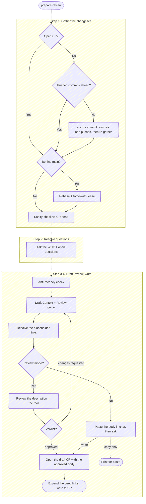

# Prepare Review

Before using a bundled path, resolve `<anchor-root>` to the installed plugin root
from the host's value or this `SKILL.md` path, then follow the host-neutral tool
conventions in `<anchor-root>/guides/host-runtime.md`.

Draft a description whose job is to convey *why* the change exists and *how* it addresses the current problem. The proposed code stands on its own — the diff shows *what* changed; the description supplies the *reason*. The rest routes reviewer attention in order of criticality so they get maximum value from whatever time they can spend.

**Audience assumption — ELI5 / assume unfamiliarity.** Write for a competent developer who has never seen this system. Explain *what it does today* and *why this change exists* in plain language; spare a sentence or two to establish the business/system context up front — that investment is almost always worth the words. Skip the parts the diff already speaks to (which loop does what, which file moved where).

**Default to terse on everything else.** Justifications, hedges, asides, and "we used to / now we" framing add bytes without adding signal. Trim aggressively on the first pass; reviewers will ask for more if they want it. The shape to aim for: a Context section that earns its 30-60 seconds, then a tight Review guide. Context's ceiling is **two short paragraphs, the change named in the first** — the template holds that cap and the padding patterns it rules out, so the unfamiliarity assumption above doesn't read as licence to expand. That ceiling is the shape at `anchor.crVerbosity 100`; below it Context is the first thing the dial shortens, so at the default it's usually one paragraph (see "Honor `anchor.*` config"). Recency-polish bullets, decisions no one was going to question, and author-todo lists all belong somewhere else — see Step 3 "What to avoid".

CR = change request: a pull request on GitHub, a merge request on GitLab. Pick the
forge tool by the `origin` remote.

## Execute quietly — do the thinking, don't show it

Follow the execute-quietly discipline: `<anchor-root>/guides/execute-quietly.md`. It bites hardest here because **the reviewer reviews A → B — the net change from base to final state — not the path you took to get there.** The session's pivots, dead ends, and intermediate iterations are development *process*, not the change under review; narrating that process — to the user, or into the description — is this skill's recurring failure. Step 1's recon and Step 4's review each fold into one call precisely so there is nothing to narrate between them: run the call, read the result, move on.

**The entire visible output of a run is:**

1. a decision the script flagged that needs the user (`BEHIND`, a `STATE` mismatch, a `CR_CREATE_ERROR`);
2. the resolved CR URL, once;
3. the Step 2 questions;
4. the review feedback echoed back, and the one-line result of the write.

The drafted description itself is *shown in the review tool*, not pasted into chat — the exception is the no-tool fallback in Step 4, where chat is the only surface it has.

Everything else is internal: the per-step recon plumbing ("origin is GitLab, 1 ahead, no template, tree clean" — the script already ran it), the Step 3 anti-recency disposition (Centerpiece / Footnote / Cut scratch that *shapes* the draft, never output), and session-internal A → B history (which also gets cut from the description as a "Drift artifact" — see Step 3). Reserve prose for the steps that need *your* judgment or the *user's* input — the Step 2 prompts, drafting in Step 3, presenting options in Step 4.
