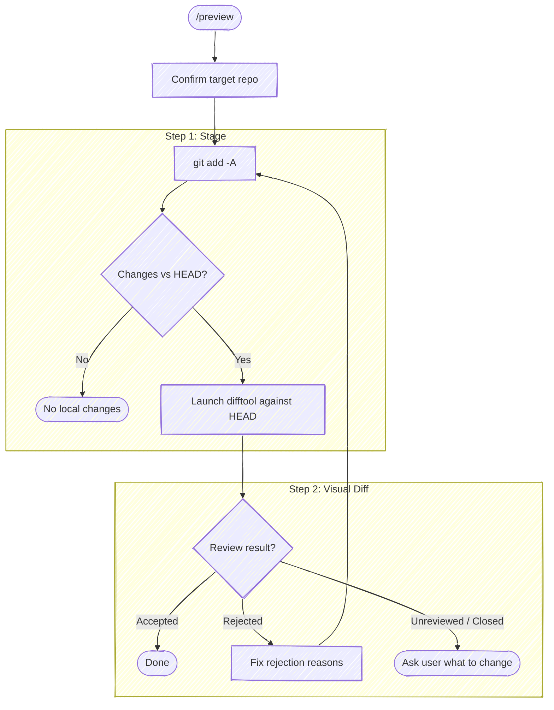

# Preview Local Changes

Stage all local changes (staged + unstaged) and launch [moor](https://github.com/chris-peterson/moor) against `HEAD` so the user can review the in-flight work before committing. Reuses the same moor sidecar protocol as `/commit` so directed feedback (rejected hunks with reasons) flows back as actionable edits.



/preview is a two-step skill (stage, diff), so it does not allocate its own tasks. If invoked inside an orchestrator (a task is already `in_progress` when you call `TaskList`), just run the steps below; the orchestrator's task list stays intact.

## Target repo

Before anything else, resolve the target repo per [`guides/target-repo`](../../guides/target-repo.md) (at runtime, `${CLAUDE_PLUGIN_ROOT}/guides/target-repo.md`). Re-run this on every /preview invocation — when reviewing changes across multiple repos in succession, do not assume the previous target carries forward.

## Step 1: Stage all changes

Stage everything so the index equals the working tree. Staging up front keeps the difftool invocation simple (one range against `HEAD`) and surfaces any further edits made in response to rejection feedback as fresh unstaged hunks on the next pass.

```bash
git add -A
```

Then check whether there's anything to preview:

```bash
git diff --cached --stat HEAD
```

If the output is empty, tell the user there are no local changes to preview and stop. Mark the remaining task `deleted`.

Otherwise, display the `--stat` summary so the user can see what's about to open in the difftool, then proceed.

## Step 2: Launch visual diff

Compare the working tree (now identical to the index after `git add -A`) against `HEAD`. This is the full surface of local changes — staged and previously-unstaged together.

moor is **optional** — check it's installed first:

```bash
command -v moor
```

If `moor` isn't on PATH, there's nothing to preview visually: report `moor not installed — staged changes are ready; run /commit when you're set` and stop.

If moor is present, launch the difftool and read the context file per [`guides/moor-sidecar-protocol`](../../guides/moor-sidecar-protocol.md) (at runtime, `${CLAUDE_PLUGIN_ROOT}/guides/moor-sidecar-protocol.md`), passing `HEAD` as the diff range:

```bash
bash "${CLAUDE_PLUGIN_ROOT}/scripts/moor-review.sh" HEAD
```

/preview-specific phrasing:

- **`output.exitCode` `0`** → `Previewed — no rejections`. No other summary text.
- **`output.exitCode` `1`** → `Previewed — rejected hunks detected`, list `output.rejections`, then loop back to Step 1 (re-stage and re-preview after the fix).
- **`output.exitCode` `2`** → `Previewed — unreviewed hunks, what do you want to change?`
- **`output.exitCode` `3` or absent** → `Previewed — difftool closed without review, what do you want to change?`
