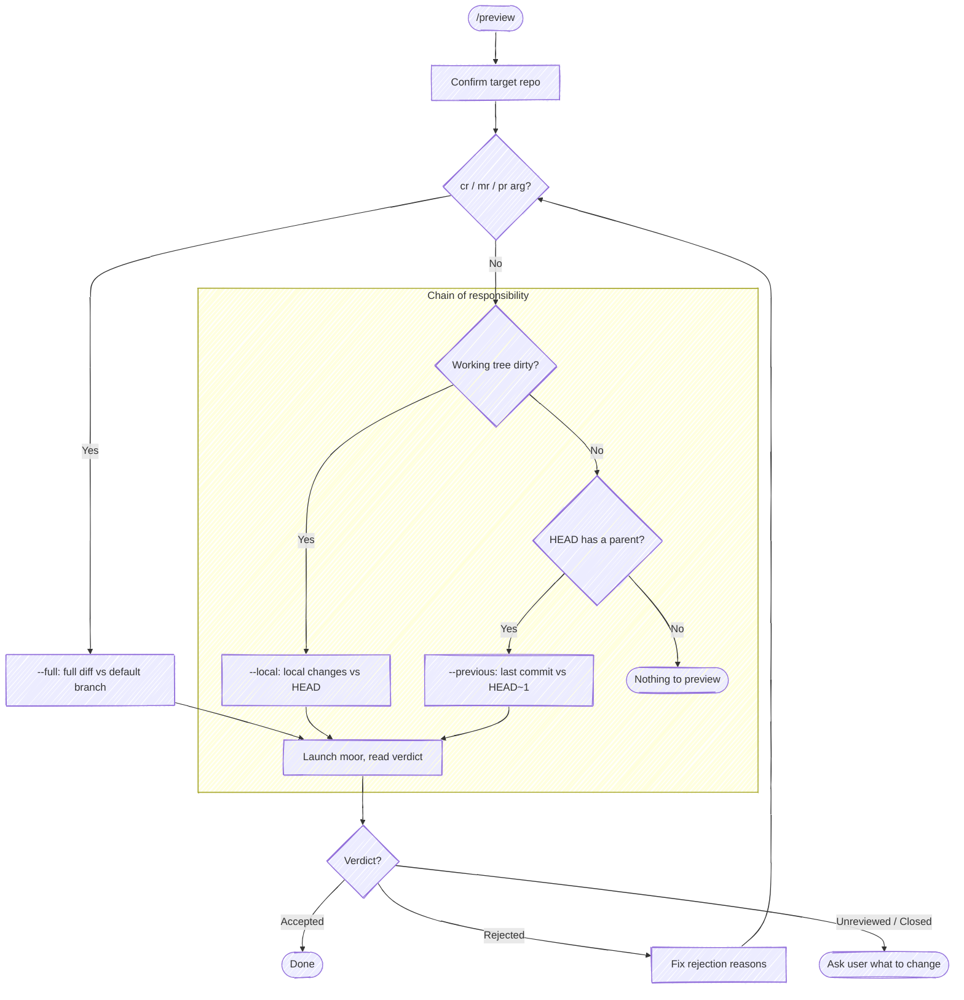

# Preview Changes

Open the in-flight work in [moor](https://github.com/chris-peterson/moor) for review. The shared `review-diff.sh` wrapper offers three review modes, each named for what it shows; `/preview` follows a **chain of responsibility** to pick one, so it always has something useful to open:

| Mode | Shows | Wrapper flag |
| --- | --- | --- |
| **Local changes** | working tree vs the last commit | `--local` |
| **Previous changeset** | the last commit vs its parent | `--previous` |
| **Full diff** | the whole branch vs the default branch | `--full` |

By default, `/preview` shows **local changes** when the working tree is dirty, and falls back to the **previous changeset** when it's clean. Pass `cr` (or `mr` / `pr`) to instead review the **full diff**, the way a reviewer sees a change request. Reuses the same moor sidecar protocol as `/commit`, so directed feedback (rejected hunks with reasons) flows back as actionable edits.

**Don't narrate your work.** Every step below is an operating instruction, not a script to read aloud. Don't announce what you're about to do, don't report the plumbing of each command (the dirty check, sidecar paths, *"launching in the background"*, *"let me read its stdout"*, *"confirming it's running"*), and don't restate the same status twice. Speak only when the user must act or decide: the resolved repo and mode in one line, and the review verdict.



/preview is a short skill (resolve mode, diff), so it does not allocate its own tasks. If invoked inside an orchestrator (a task is already `in_progress` when you call `TaskList`), just run the steps below; the orchestrator's task list stays intact.

## Step 1: Resolve target repo and mode

Before anything else, resolve which repo this operates on and which mode to run — the working directory isn't a reliable proxy (edits may have landed in a sibling repo). Re-resolve on every invocation; don't assume the previous target carries forward.

**Mode** — a standalone argument token of `cr`, `mr`, or `pr` (case-insensitive) selects the **full diff** review (`--full`). Any other token is treated as a repo substring; absence of a mode token means the default chain of responsibility.

**Repo** — match the remaining tokens (everything that isn't the mode keyword):

- **With a repo argument**: case-insensitive substring-match it against the basename of every git repo the session has touched. One match → use it (confirm in one line). Zero or multiple → list the candidates and ask.
- **No repo argument**: run `git rev-parse --show-toplevel` from the working directory. If the session touched more than one repo, or edits landed outside it, state the resolved path and ask which to target.

When the target repo isn't the working directory, run the wrapper with the target repo as the working directory so its `git` commands resolve there.

## Step 2: Pick the mode via the chain of responsibility

If the user asked for the full diff (`cr` / `mr` / `pr`), the mode is `--full` — skip to Step 3.

Otherwise, check the working tree (one command, don't narrate it):

```bash
git status --porcelain
```

- **Non-empty (dirty)** → `--local` (local changes vs the last commit).
- **Empty (clean)** → the working tree has nothing to show, so fall back to the previous changeset. Confirm `HEAD` has a parent:

  ```bash
  git rev-parse --verify --quiet HEAD~1
  ```

  - **Succeeds** → `--previous` (last commit vs its parent).
  - **Fails** (clean tree, root commit) → tell the user there's nothing to preview and stop.

## Step 3: Launch visual diff

Launch the wrapper in the resolved mode — `--local`, `--previous`, or `--full`. It pre-populates the moor header, drives git's configured difftool, and — once it closes — prints the verdict on its own stdout. Don't call raw `git difftool`; that bypasses the header and the verdict.

**Launch as a background call** (`run_in_background: true`): the wrapper blocks until the difftool closes, so a foreground call would hold the turn open until the Bash timeout.

```bash
bash "${CLAUDE_PLUGIN_ROOT}/scripts/review-diff.sh" --local
```

When the background command completes, read its stdout with the **BashOutput tool** — not `tail` / `$(...)`, which trip the command-substitution gate. The last lines carry the verdict (no separate file read):

- `REVIEW_VERDICT` — `0` clean · `1` rejections · `2` unreviewed · `3` closed early · `absent` (the difftool wrote no verdict — e.g. the configured tool doesn't report one)
- `REVIEW_OUTPUT` — compact JSON; when the verdict is `1`, read `.rejections` from here. The verdict and rejections come from the difftool's sidecar contract, defined in [moor's `SPEC.md`](https://github.com/chris-peterson/moor/blob/main/SPEC.md) (`IM.OUT-*`).

Map the verdict to exactly this output and nothing more:

- **`0`** → `Previewed — no rejections`.
- **`1`** → `Previewed — rejected hunks detected`, list the rejections, then fix and re-preview after the fix.
- **`2`** → `Previewed — unreviewed hunks, what do you want to change?`
- **`3` or `absent`** → `Previewed — review closed without a verdict, what do you want to change?`

A difftool that speaks the sidecar contract (moor) returns the `0/1/2/3` verdict and the rejected-hunk feedback; any other configured difftool yields `absent` and you ask the user directly.
