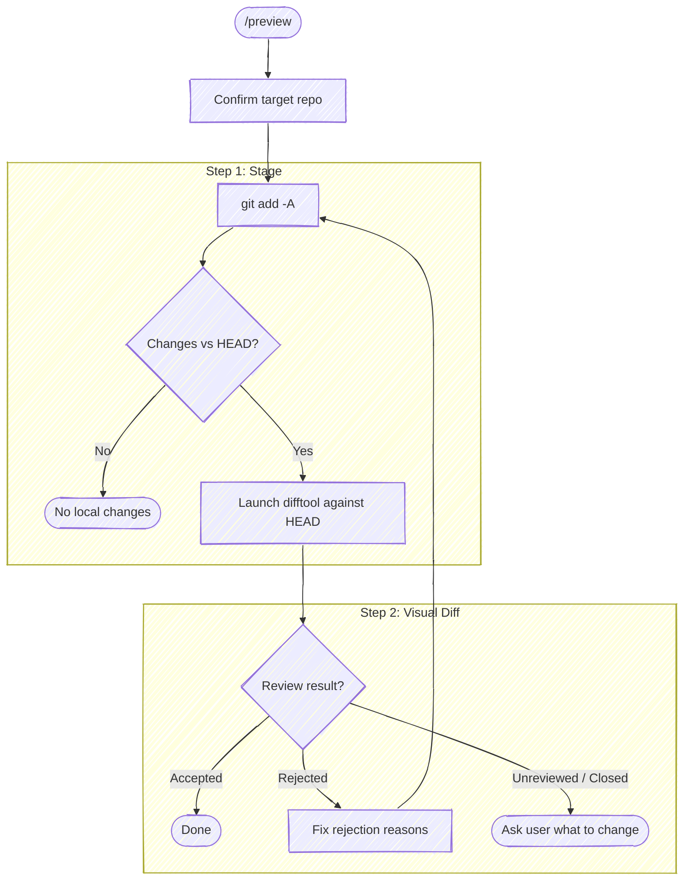

# Preview Local Changes

Stage all local changes (staged + unstaged) and launch [moor](https://github.com/chris-peterson/moor) against `HEAD` so the user can review the in-flight work before committing. Reuses the same moor sidecar protocol as `/commit` so directed feedback (rejected hunks with reasons) flows back as actionable edits.

**Don't narrate your work.** Every step below is an operating instruction, not a script to read aloud. Don't announce what you're about to do, don't report the plumbing of each command (ahead-counts, sidecar paths, *"launching in the background"*, *"let me read its stdout"*, *"confirming it's running"*), and don't restate the same status twice. Speak only when the user must act or decide: the resolved repo in one line and the review verdict.



/preview is a two-step skill (stage, diff), so it does not allocate its own tasks. If invoked inside an orchestrator (a task is already `in_progress` when you call `TaskList`), just run the steps below; the orchestrator's task list stays intact.

## Target repo

Before anything else, resolve which repo this operates on — the working directory isn't a reliable proxy (edits may have landed in a sibling repo). Re-resolve on every invocation; don't assume the previous target carries forward.

- **With an argument** (`/anchor:preview <name>`): case-insensitive substring-match `<name>` against the basename of every git repo the session has touched. One match → use it (confirm in one line). Zero or multiple → list the candidates and ask.
- **No argument**: run `git rev-parse --show-toplevel` from the working directory. If the session touched more than one repo, or edits landed outside it, state the resolved path and ask which to target.

Run git with `-C <repo>` when the working directory isn't the target, rather than `cd`.

## Step 1: Stage all changes

Stage everything so the index equals the working tree. Staging up front keeps the difftool invocation simple (one range against `HEAD`) and surfaces any further edits made in response to rejection feedback as fresh unstaged hunks on the next pass.

```bash
git add -A
```

Then check whether there's anything to preview:

```bash
git diff --cached --stat HEAD
```

If the output is empty, tell the user there are no local changes to preview and stop. Mark the remaining task `deleted`.

Otherwise, display the `--stat` summary so the user can see what's about to open in the difftool, then proceed.

## Step 2: Launch visual diff

Compare the working tree (now identical to the index after `git add -A`) against `HEAD` — the full surface of local changes, staged and previously-unstaged together. Launch the wrapper with `HEAD` as the range; it drives git's configured difftool and prints the verdict on its own stdout.

**Launch as a background call** (`run_in_background: true`): the wrapper blocks until the difftool closes, so a foreground call would hold the turn open until the Bash timeout.

```bash
bash "${CLAUDE_PLUGIN_ROOT}/scripts/review-diff.sh" HEAD
```

When the background command completes, read its stdout with the **BashOutput tool** — not `tail` / `$(...)`, which trip the command-substitution gate. The last lines carry the verdict (no separate file read):

- `REVIEW_VERDICT` — `0` clean · `1` rejections · `2` unreviewed · `3` closed early · `absent` (the difftool wrote no verdict — e.g. the configured tool doesn't report one)
- `REVIEW_OUTPUT` — compact JSON; when the verdict is `1`, read `.rejections` from here. The verdict and rejections come from the difftool's sidecar contract, defined in [moor's `SPEC.md`](https://github.com/chris-peterson/moor/blob/main/SPEC.md) (`IM.OUT-*`).

Map the verdict to exactly this output and nothing more:

- **`0`** → `Previewed — no rejections`.
- **`1`** → `Previewed — rejected hunks detected`, list the rejections, then loop back to Step 1 (re-stage and re-preview after the fix).
- **`2`** → `Previewed — unreviewed hunks, what do you want to change?`
- **`3` or `absent`** → `Previewed — review closed without a verdict, what do you want to change?`

A difftool that speaks the sidecar contract (moor) returns the `0/1/2/3` verdict and the rejected-hunk feedback; any other configured difftool yields `absent` and you ask the user directly.
