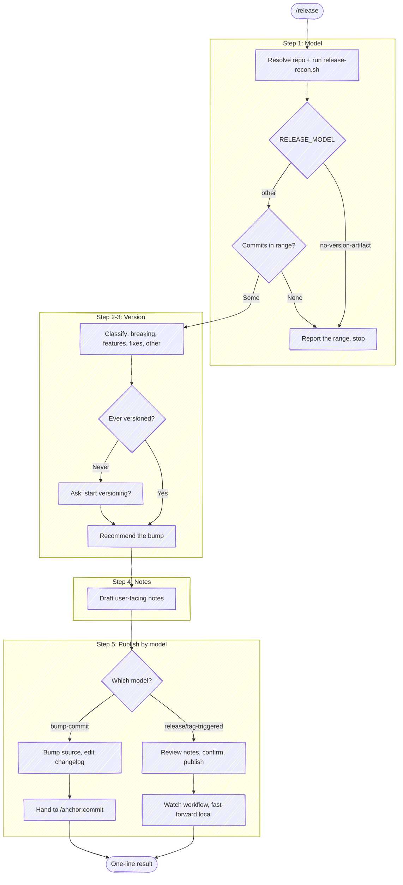

# Release

Turn what has landed since the last release into a released version: work out
what is shipping, recommend a semver bump, draft notes a *user* of the project
can read, and publish along the path the repo's own release model prescribes.

This is the step after `/anchor:merge`. It is **always invoked explicitly** —
`merge` names it as the next step but never runs it, because publishing is a
deliberate act and batching several merges into one release is the normal shape.
So this skill assumes nothing about a preceding merge in the same session: it
reads the release state from the repo, and runs the same way whether one CR just
landed or five did last week.

**Release model** = who owns the version bump: the CI workflow, a commit in this
repo, or nobody. It is the first thing to establish and the one thing worth being
certain about — hand-editing a manifest whose workflow also bumps it lands two
commits that fight, and it surfaces only after the release is public.

**Don't narrate your work.** Every step below is an operating instruction, not a
script to read aloud — follow the execute-quietly discipline:
`${CLAUDE_PLUGIN_ROOT}/guides/execute-quietly.md`. For this skill, the only things
worth surfacing are the resolved repo and model in one line, any fork that needs
the author, the version recommendation, and the one-line result.



## Task tracking when orchestrated

At the very start, call `TaskList`. If any task is already `in_progress`, this
skill is running inside an orchestrator — run silently and do **not** create your
own tasks. Otherwise enumerate:

- `Step 1: Establish the release model`
- `Step 2: Decide the version and draft the notes`
- `Step 3: Publish`

## Target repo and release state

Resolve the repo as the other `anchor` skills do. **With a name argument**, resolve
it with `${CLAUDE_PLUGIN_ROOT}/scripts/resolve-target.sh <name>`
(see the cookbook's "Resolving a named target repo"): `TARGET_VIA=resolved` → use
`TARGET_LOCAL` as the checkout — this skill reads git history and may commit, so it
needs one; if `TARGET_LOCAL` is empty, ask where the checkout lives rather than
proceeding. `ambiguous` → prompt with `TARGET_CANDIDATES`. `cwd` (no match) → fall
back to a substring-match against repos the session has touched.
**With no argument**, `git rev-parse --show-toplevel` from the working directory;
ambiguous → ask.

When the target repo isn't the working directory, pass it through rather than
`cd`-ing: `--repo <checkout>` on the helpers below, `-C <repo>` on git, and
`-R <owner/name>` on `gh`/`glab` (the URL-encoded project for `:fullpath`, plus
`--hostname <host>`, on `glab api`). The retargeting rules are in
`${CLAUDE_PLUGIN_ROOT}/guides/forge-cookbook.md` ("Targeting a repo that isn't the
working directory").

## Step 1: Establish the release model

One recon pass supplies every fact this skill would otherwise derive by hand.
Read it, don't re-derive it — re-running these git and CI reads by hand is the
waste this helper exists to remove:

```bash
bash "${CLAUDE_PLUGIN_ROOT}/scripts/release-recon.sh"
```

`RELEASE_MODEL` decides the whole path. Read the matching section of
`${CLAUDE_PLUGIN_ROOT}/guides/release-models.md` — it carries the per-model
procedure and the traps each one hides:

| `RELEASE_MODEL` | Who bumps | What Step 5 does |
|---|---|---|
| `release-triggered` | the CI workflow (`RELEASE_WORKFLOW`) | create a forge release; never touch the manifest |
| `tag-triggered` | the CI workflow | push an annotated tag |
| `bump-commit` | this skill | bump, edit the changelog, commit |
| `no-version-artifact` | nobody | nothing — report and stop |

Two states end the run here, and both are correct outcomes rather than failures:

- **`no-version-artifact`** — no manifest, so there is no version to recommend and
  nothing to publish. The merge already was the release. Say so, summarize what
  `RELEASE_RANGE` contains, and stop. Where the merge triggers a deploy, add its
  state via `/anchor:pipeline` rather than inventing a publish step.
- **`RELEASE_COMMITS=0`** — nothing has landed since `RELEASE_LAST_REF`. Report
  that the last release is current and stop; don't manufacture a version.

Two states need surfacing before going further:

- **`RELEASE_DIRTY=1`** — uncommitted changes. A release describes committed work.
  Surface the dirty tree and ask whether to commit it first (`/anchor:commit`) or
  release what's committed.
- **`RELEASE_UNPUSHED` > 0 with `RELEASE_ON_DEFAULT=1`** — local commits the remote
  hasn't seen. On the release-triggered and tag-triggered models the workflow builds
  from the remote, so publishing now would ship without them. Push first.

## Step 2: Read what is shipping

Read the range the recon block resolved (`RELEASE_RANGE`) — both the log and the
diff, because a commit's subject is what the author called it and the diff is what
it did:

```bash
git log <RELEASE_RANGE> --oneline
git diff <RELEASE_RANGE> --stat
git diff <RELEASE_RANGE>
```

Sort each meaningful change into one bucket. A change can touch several; pick the
most significant.

- **Breaking** — a removed or renamed public surface, a changed default that
  breaks existing callers, behavior that requires consumers to act.
- **Features** — new capability: a command, endpoint, option, flag.
- **Fixes** — corrected behavior, a fixed regression.
- **Other** — docs, tests, refactoring, CI. Summarize briefly rather than
  enumerating.

`RELEASE_LAST_REF_KIND` says what the range is anchored to: `tag` (a real prior
release), `bump-commit` (no tags — the last commit that moved the version), or
`root` (nothing has ever shipped, so this is a first release). On `root`, say that
this is the first release rather than describing the whole history as changes.

## Step 3: Decide the version

Apply [semver](https://semver.org) to `RELEASE_VERSION`: any breaking change →
major; otherwise a new feature → minor; otherwise → patch.

Three cases are the author's decision, not the skill's. Put each through
`AskUserQuestion` with the recommendation first:

- **A major bump.** Breaking changes make it mechanical, but declaring one is a
  consumer-facing statement. Name what breaks and confirm.
- **`RELEASE_VERSION_BUMPS=0`.** The version has never moved, so this repo hasn't
  opted into per-release versioning — starting is a change of convention. Ask
  (start versioning at the recommended bump / keep the existing no-bump
  convention); don't default to a bump.
- **`RELEASE_CHANGELOG_HAS_CURRENT=1`.** The current version already has a
  changelog section, so it looks already shipped. Releasing that same version
  again is usually a no-op that writes nothing — confirm the next version rather
  than accreting into a section users already have. Never rewrite a shipped
  section's bullets.

## Step 4: Draft the notes

Write the notes for someone who *uses* the project and never reads its diffs.
Lead each bullet with the effect, not the edit:

- Not "add `--timeout` flag to `run`" → "commands can be given a timeout, so a
  hung call fails instead of blocking".
- Not "refactor `AuthService` to rotate tokens" → "tokens rotate automatically,
  so sessions stop expiring mid-request".

Use the categories from Step 2 as `###` sections, omitting empty ones, under a
heading naming the new version. Where a breaking change is present, its section
goes first and says what the consumer must change.

### Honor `anchor.*` config

Read the project + global keys once — `git config --get-regexp '^anchor\.' 2>/dev/null` — and match the names case-insensitively (`--get-regexp` lowercases them). Absent keys keep `anchor`'s defaults; never invent a value.

- **`anchor.releaseVerbosity`** — an integer 1–100 setting where the notes sit between brevity and thoroughness. **Unset behaves as `10`** — the lowest of `anchor`'s four verbosity defaults, which descend as the audience widens (issue `75` → commit `50` → CR `25` → release `10`). Release notes have the widest audience of anything `anchor` writes, and most of that audience is reading to find out whether this release affects them. Clamp an out-of-range or non-integer value into the 1–100 band and say so once rather than failing the draft.

  **It shortens entries; it never drops one.** Every change in scope has its bullet at `1` as it does at `100`, and a breaking change keeps its migration steps at every setting — a reader who never learns a change shipped is a reader the notes failed. Work down this order and stop where the draft balances where the setting asks: the rationale for a change → the consequences a reader can infer from the effect you already stated → each bullet down to its floor, the change as its effect on someone using the project. At the default that floor is most of what's left, which is the intent.

Two conventions to honor: the loaded-framing discipline in
`${CLAUDE_PLUGIN_ROOT}/guides/loaded-framing.md` (notes state what changed, not
how hard it was or how little it touched), and the forge's markdown quirks in
`${CLAUDE_PLUGIN_ROOT}/guides/markdown-gotchas.md` (a release body renders as
forge markdown). Write the notes to `RELEASE_NOTES_PATH` from the recon block —
every consumer below takes them by file, never as an inline escaped string.

## Step 5: Publish along the model's path

Read the matching section of `${CLAUDE_PLUGIN_ROOT}/guides/release-models.md`
before writing anything. The two families differ in *what gets reviewed*, because
they differ in where the notes end up.

### `release-triggered` and `tag-triggered` — the notes are the published body

The workflow owns the bump; the notes never enter a commit, so they get the review
gate themselves.

The notes are one drafted document, so this skill defaults to the `editor`
backend: they open in the user's editor and whatever they save *is* the notes. A
configured viewer, or an editor with nowhere to open, gets the diff viewer
instead — where the baseline is empty, so it reads as all additions. Ask
`--print-backend` which one it will be, and say so in one line when it reports
`REVIEW_BACKEND_CONFIGURED` — the run opening something other than what the
preference named.

Then open the notes against `RELEASE_NOTES_BASELINE` (the empty left-hand side
the recon block created) through the **dispatcher** — not the backend directly.
It blocks until closed, so launch it as a **background** Bash call and read its
stdout with the **BashOutput tool**; `tail` / `$(...)` trips the
command-substitution gate:

```bash
bash "${CLAUDE_PLUGIN_ROOT}/scripts/review-diff.sh" --skill release --files \
  <RELEASE_NOTES_BASELINE> <RELEASE_NOTES_PATH> \
  --title 'Release notes' \
  --detail version=<NEW_VERSION> --detail range=<RELEASE_RANGE>
```

Map `REVIEW_VERDICT` as the other skills do: only `approved` proceeds — and where
it carries `editedFields` with `target: "release-notes"`, the saved buffer *is*
the notes, so publish that text verbatim rather than re-drafting from it;
`changes-requested` means fold in every comment (they're ungraded) and re-open
against the previous draft — copied aside to a sibling path with `.prev` before
the extension — so the second pass shows what the feedback changed; `incomplete`
and `no-verdict` mean the reviewer didn't grade it. A result with **no parseable `REVIEW_VERDICT`** (empty stdout,
stderr only — the dispatcher exited before reporting) reads the same way, and so
does a probe reporting nothing installed.

Every ungraded case takes the ladder in
`${CLAUDE_PLUGIN_ROOT}/guides/review-fallback.md`: say what happened in one line,
then walk it with the drafted notes as the artifact. The notes are a drafted
document, so the document rungs apply and the changeset walk doesn't.

**Then confirm the publish explicitly, even after an `approved` review.** This is
the one place `anchor` keeps a second gate: a CR description is editable, but a
published release is public the instant it exists and its tag may be immutable.
State the version, the tag, and the model's consequence, and take a yes/no:

> Publishing `v1.2.0` creates the tag and fires `.github/workflows/release.yml`,
> which owns the version bump and changelog. Proceed? `[yes / no]`

On `yes`, publish — the notes by file, never `--generate-notes` (a generated body
lands unrelated prior CRs in the changelog the workflow writes). The two models
publish differently:

- **`release-triggered`** — create the forge release with the notes as its body
  (the cookbook's "Publish a release"). Creating it makes the tag. Leave the
  target at its default, the default branch's tip, which the recon block has
  already established HEAD to be (`RELEASE_ON_DEFAULT=1`, `RELEASE_UNPUSHED=0`);
  reach for `--target` / `--ref` only to tag a different commit, and pass the
  full 40-char sha there, because GitHub rejects an abbreviated one.
- **`tag-triggered`** — the tag *is* the trigger: annotate it with the notes and
  push it as its own step (`git tag -a v<X.Y.Z> -F <RELEASE_NOTES_PATH>` then
  `git push origin v<X.Y.Z>`), so a failed push doesn't leave a local-only tag
  that looks published. Add a forge release afterward only where the repo already
  publishes them.

On a 401/403, surface it and ask for fresh credentials; do not retry or reach for
another path.

**The create returning a URL is not the finish line.** Two follow-throughs, both
easy to drop precisely because the publish already succeeded:

1. **Watch the workflow to a terminal state** — it still has to bump, write the
   changelog, and commit, and a red run leaves a published release with no
   changelog. Delegate to `/anchor:pipeline`, which watches in the background and
   runs silently under an orchestrator. Hand it the workflow by name
   (`--workflow <RELEASE_WORKFLOW>`) and watch *before* the pull below: this run
   belongs to the commit that was tagged, and it shares that commit with whatever
   the merge already ran, so naming the workflow is what makes the verdict the
   release's.
2. **Fast-forward the local checkout onto the workflow's commit** —
   `git pull --ff-only`, once the run is green. Do it; don't offer it. That commit
   carries generated content, so skipping it leaves the tree missing files and the
   next push rejected as non-fast-forward.

### `bump-commit` — the bookkeeping is a commit

Here the notes land *in the repo*, so they are reviewed as part of the commit
rather than on their own — `/anchor:commit` opens the whole bookkeeping diff for
review before committing, and a separate notes review would ask the same question
twice.

1. **Bump the version.** Edit `RELEASE_MANIFEST_SOURCE` when it's set — the
   manifest is generated from it — then run `RELEASE_MANIFEST_REGEN`. Otherwise
   edit `RELEASE_MANIFEST`. Read the manifest with the **Read tool** before editing
   so the Edit lands without a retry.
2. **Write the notes into the changelog.** When `RELEASE_CHANGELOG_UNRELEASED=1`,
   retitle that section to the new version rather than inserting a section above
   it — a fresh one leaves a duplicate empty `Unreleased` heading. Reconcile its
   existing bullets against the range while there.
3. **Shape the commit to `RELEASE_BUMP_CONVENTION`** (`standalone` / `fold` /
   `mixed` — the guide has the per-value call), then hand off to
   `/anchor:commit`, which runs the tests, reviews the diff, writes the message,
   and pushes. Don't hand-roll `git commit` / `git push` here.

## Step 6: Report

One line: the version, how it published, and where to see it —
`Released v1.2.0 (minor) — <release url>` for the triggered models, or
`Released v1.2.0 (minor) in <sha>` for a bump commit. Add the pipeline verdict
when Step 5 watched one. Where a tack route is bound to the session, attach the
release URL to the route's tack as a link so the shipped artifact is recorded:

```bash
tack link add <route> <tackId> "v<X.Y.Z>" "<release-url>"
```

No tack route bound → skip it; don't create one just to record a link.
