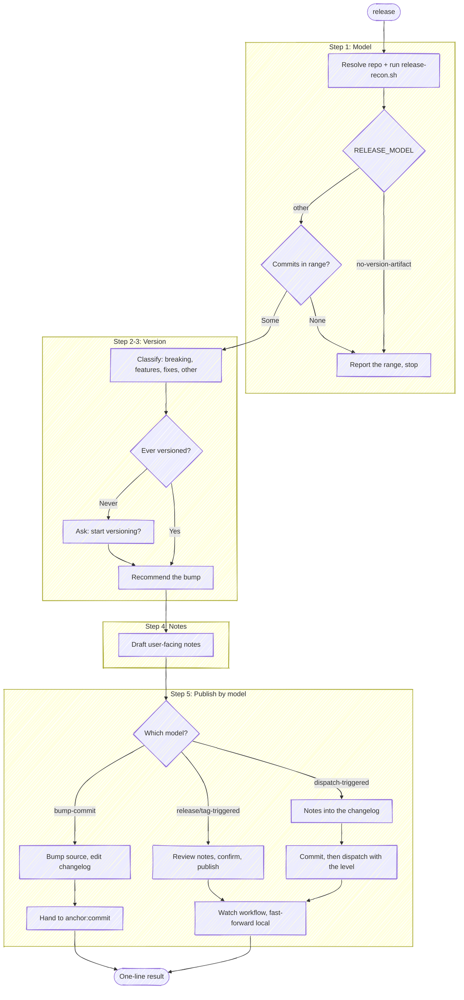

# Release

Before using a bundled path, resolve `<anchor-root>` to the installed plugin root
from the host's value or this `SKILL.md` path, then follow the host-neutral tool
conventions in `<anchor-root>/guides/host-runtime.md`.

Turn what has landed since the last release into a released version: work out
what is shipping, recommend a semver bump, draft notes a *user* of the project
can read, and publish along the path the repo's own release model prescribes.

This is the step after `anchor:merge`. It is **always invoked explicitly** —
`merge` names it as the next step but never runs it, because publishing is a
deliberate act and batching several merges into one release is the normal shape.
So this skill assumes nothing about a preceding merge in the same session: it
reads the release state from the repo, and runs the same way whether one CR just
landed or five did last week.

**Release model** = who owns the version bump: a CI workflow, a commit in this
repo, or nobody — and where the repo states its own publish path, that statement
rather than the inference. It is the first thing to establish and the one thing worth being
certain about — hand-editing a manifest whose workflow also bumps it lands two
commits that fight, and it surfaces only after the release is public.

**Keep plumbing quiet.** Every step below is an operating instruction, not a
script to read aloud — follow the execute-quietly discipline:
`<anchor-root>/guides/execute-quietly.md`. For this skill, the only things
worth surfacing are the resolved repo and model in one line, any fork that needs
the author, the version recommendation, and the one-line result.

## Task tracking when orchestrated

If the host exposes task tracking, inspect it first. If any task is already in
progress, this skill is running inside an orchestrator — run inside that list and
do not create your own tasks. If the host has no task mechanism, follow an
evident enclosing workflow without inventing one. Otherwise enumerate:

- `Step 1: Establish the release model`
- `Step 2: Decide the version and draft the notes`
- `Step 3: Publish`

## Target repo and release state

Resolve the repo as the other `anchor` skills do. **With a name argument**, resolve
it with `<anchor-root>/scripts/resolve-target.sh <name>`
(see the cookbook's "Resolving a named target repo"): `TARGET_VIA=resolved` → use
`TARGET_LOCAL` as the checkout — this skill reads git history and may commit, so it
needs one; if `TARGET_LOCAL` is empty, ask where the checkout lives rather than
proceeding. `ambiguous` → prompt with `TARGET_CANDIDATES`. `cwd` (no match) → fall
back to a substring-match against repos the session has touched.
**With no argument**, `git rev-parse --show-toplevel` from the working directory;
ambiguous → ask.

When the target repo isn't the working directory, pass it through rather than
`cd`-ing: `--repo <checkout>` on the helpers below, `-C <repo>` on git, and
`-R <owner/name>` on `gh`/`glab` (the URL-encoded project for `:fullpath`, plus
`--hostname <host>`, on `glab api`). The retargeting rules are in
`<anchor-root>/guides/forge-cookbook.md` ("Targeting a repo that isn't the
working directory").
