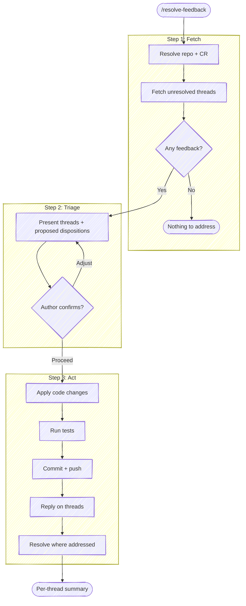

# Resolve Review Feedback

Fetch the unresolved review threads on an open change request, triage each
one with the author, then act: change the code, reply on the thread, resolve
it — in whatever combination each thread calls for. The goal is **resolution**:
every thread ends fixed, answered, or resolved, not merely acknowledged. This
closes the loop that `/anchor:prepare-review` opens: prepare-review routes
reviewer attention out; resolve-feedback brings their findings back into the
branch and drives each one to done.

CR = change request: a pull request on GitHub, a merge request on GitLab.
Pick the forge tool by the `origin` remote.

**Don't narrate your work.** Every step below is an operating instruction, not a script to read aloud. Don't announce what you're about to do, don't report the plumbing of each command (resolution probes, API calls, *"let me fetch the threads"*), and don't restate the same status twice. Speak only when the user must act or decide: the resolved repo and CR in one line, each thread's triage, and what changed on it.



## Task tracking when orchestrated

At the very start, call `TaskList`. If any task is already `in_progress`, run
silently inside the orchestrator's list. Otherwise enumerate:

- `Step 1: Fetch unresolved feedback`
- `Step 2: Triage with the author`
- `Step 3: Apply changes and respond`

If there's no unresolved feedback, mark remaining tasks `deleted`.

## Target repo and CR

Resolve the repo as the other anchor skills do. **With a name argument**, resolve
it through tack's repo db (`scripts/resolve-target.sh <name>`, see the cookbook's
"Resolving a named target repo"): `TARGET_VIA=tack` → use `TARGET_LOCAL` as the
checkout — this skill writes commits, so it needs one; if `TARGET_LOCAL` is empty,
ask where the checkout lives rather than proceeding. `ambiguous` → prompt with
`TARGET_CANDIDATES`. `cwd` (no tack, or no match) → fall back to a substring-match
against repos the session has touched. **With no argument**, `git rev-parse
--show-toplevel` from the working directory; ambiguous → ask. Run git with
`-C <repo>` when the working directory isn't the target.

When the target repo isn't the working directory, the forge commands below
(fetch, reply, resolve) also default to the cwd repo — retarget each:

- **`gh` / `glab` subcommands** (`gh pr view`, `glab mr view`) — add `-R <owner/name>`.
- **`glab api`** — has no `-R`; it expands `:fullpath` from the *current* git
  dir. Substitute the URL-encoded project path for `:fullpath` (e.g.
  `group%2Fproject`), and add `--hostname <host>` for self-hosted GitLab.

Derive `owner/name` and the host once from `git -C <repo> remote get-url origin`
(or, with a CR URL argument, from the URL itself).

**With a CR URL argument**, derive everything from it: the forge host, the
project path, and the CR number. If the repo isn't already local, ask the user
where the working copy lives — this skill writes commits, so it needs one.

Resolve the open CR for the branch (when no URL was given):

```bash
# GitLab
glab mr view --output json 2>/dev/null | jq '{iid, web_url, draft, sha}'

# GitHub
gh pr view --json number,url,isDraft,headRefOid 2>/dev/null
```

No open CR → say so and stop; there's nothing to address.

**Confirm local state matches the CR head** (same check as prepare-review):
`git status --porcelain` clean, and local HEAD equals the CR head SHA. If
they disagree, surface the mismatch and stop — replies that say "fixed in
<sha>" must reference commits that actually contain the fix on top of what
the reviewer saw.

## Step 1: Fetch unresolved feedback

Pull every unresolved, human-authored thread. Canonical invocations live in
the bundled forge cookbook (`${CLAUDE_PLUGIN_ROOT}/guides/forge-cookbook.md`, section "List
unresolved review threads"); in short:

- **GitLab** — `glab api "projects/:fullpath/merge_requests/<iid>/discussions?per_page=100"`,
  filtered to non-system discussions with at least one `resolvable` note that
  isn't `resolved`. Keep each discussion's `id`, authors, bodies, and
  `position` (`new_path`, `new_line`) when line-anchored.
- **GitHub** — the GraphQL `reviewThreads` query (REST doesn't expose
  resolution state), filtered to `isResolved: false`. Keep the thread `id`,
  `path`/`line`, and each comment's `databaseId`, author, body.

Also fetch top-level CR comments that ask for changes without anchoring to a
line (GitLab: `notes` with `system == false` not already part of a
discussion; GitHub: `gh pr view --json comments,reviews` review bodies with
`CHANGES_REQUESTED` or non-empty text). Reviewers often put the biggest asks
there.

If there is no unresolved feedback, report that and stop.

## Step 2: Triage with the author

Present every thread in one table, ordered by file/line, each with a
**proposed disposition**:

| # | Where | Reviewer | Ask (summarized) | Proposed |
|---|-------|----------|------------------|----------|
| 1 | `src/deploy.sh:42` | @reviewer | rename flag for clarity | **fix + reply + resolve** |
| 2 | `taskdef.yml:7` | @reviewer | why not Fargate? | **reply only** |

Disposition vocabulary:

- **fix + reply + resolve** — actionable and you agree: change the code,
  reply with what changed and the commit SHA, resolve the thread.
- **fix + reply** — same, but leave resolution to the reviewer (some teams
  reserve resolution for the person who opened the thread — follow the
  project's convention; when unknown, resolving your own addressed threads
  is the common default on GitLab, leaving them open is safer on teams
  you don't know).
- **reply only** — questions, explanations, pushback. Answer on the thread;
  the asker decides whether it's settled. Never resolve a question you
  answered but the asker hasn't acknowledged.
- **defer** — legitimate ask, out of this CR's scope. Reply saying so and
  where it lands (issue link, follow-up CR) — don't leave it unanswered.
- **skip** — leave untouched this round.

Then confirm with the author before acting (use `AskUserQuestion`, header
`Triage`): **Proceed as proposed** / **Adjust** (they name the thread numbers
and new dispositions) / **Abort**. Anything the author wants to argue or
clarify happens here — replies are outward-facing writes; draft wording the
author would stand behind.

## Step 3: Act

Work the dispositions in this order — code first, then talk:

### 3a. Apply code changes

Make the edits for every *fix* disposition. Group related fixes into one
commit; unrelated concerns get separate commits so each reply can cite a
focused SHA.

Keep each fix within the changeset's existing scope — the bundled guide
(`${CLAUDE_PLUGIN_ROOT}/guides/changeset-scope.md`) has the bar and the surface-and-confirm move.

If the author flags something in the CR description as worth keeping,
fold it into the repo's docs as part of the fix commit — the bar and the
adaptation rules are in the bundled guide (`${CLAUDE_PLUGIN_ROOT}/guides/description-vs-docs.md`).

### 3b. Test and commit

Run the project's test suite (same detection as `/anchor:commit` Step 0); a
failing suite blocks the push, no exceptions. Then commit **as new commits —
never amend** what the reviewer has seen: a CR with feedback on it is being
read, so the "changes since you last looked" diff is load-bearing regardless
of draft state. Subject names the concern, body cites the thread:

```text
Rename --force to --skip-validation

Addresses review feedback from @reviewer on deploy.sh:42 — "force"
implied more than the flag does.
```

Show the commit(s) for confirmation, then push (plain push — the branch only
gains commits).

### 3c. Reply on each thread

Write each reply body to a unique temp file (`mktemp -u /tmp/reply.XXXXXX.md`)
and post it into the *existing* thread — not as a new top-level comment (see
the cookbook, "Reply to a review thread"). Reply content:

- For fixes, the default is exactly this, and nothing more:

  ```markdown
  addressed in [follow-up commit](<commit-url>)
  ```

  The commit message and diff carry the detail; restating it in the thread
  is noise, and prose explaining *why the reviewer was right* reads as
  defensive. Add a sentence only when the fix took a different direction
  than the reviewer suggested.
- For answers: the answer. If the question revealed something the code or
  docs should say, prefer fixing that and replying with the pointer.
- For defers: where the ask landed (issue/CR link).

### 3d. Resolve

Resolve exactly the threads whose disposition included *resolve* (cookbook:
"Resolve / unresolve a review thread"). Verify each resolution call returned
`resolved: true` / `isResolved: true` — a silently-dropped resolution looks
identical to a forgotten one.

## Step 4: Summary

Report one line per thread: `#N <file:line> — <disposition> — <commit sha /
reply posted / resolved>`, plus anything deferred and where it went. If any
thread was skipped, say so — the next `/anchor:resolve-feedback` run picks it
up.
