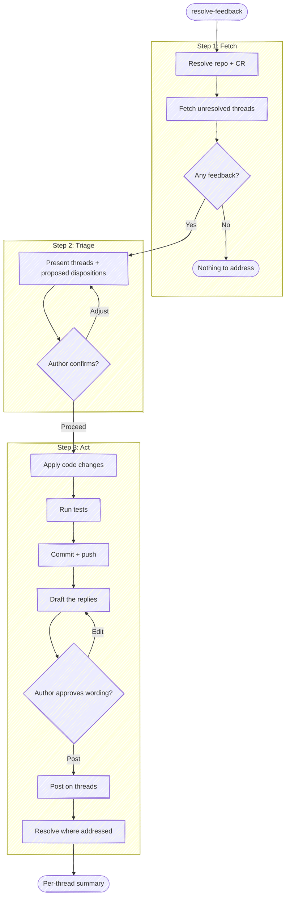

# Resolve Review Feedback

Before using a bundled path, resolve `<anchor-root>` to the installed plugin root
from the host's value or this `SKILL.md` path, then follow the host-neutral tool
conventions in `<anchor-root>/guides/host-runtime.md`.

Fetch the unresolved review threads on an open change request, triage each
one with the author, then act: change the code, reply on the thread, resolve
it — in whatever combination each thread calls for. The goal is **resolution**:
every thread ends fixed, answered, or resolved, not merely acknowledged. This
closes the loop that `anchor:prepare-review` opens: prepare-review routes
reviewer attention out; resolve-feedback brings their findings back into the
branch and drives each one to done.

CR = change request: a pull request on GitHub, a merge request on GitLab.
Pick the forge tool by the `origin` remote.

**Keep plumbing quiet.** Every step below is an operating instruction, not a script to read aloud — follow the execute-quietly discipline: `<anchor-root>/guides/execute-quietly.md`. For this skill, the only things worth surfacing are the resolved repo and CR in one line, each thread's triage, the reply bodies awaiting the user's approval in 3c, and what changed on each thread.



## Task tracking when orchestrated

If the host exposes task tracking, inspect it first. If any task is already in
progress, run inside the orchestrator's list. If the host has no task mechanism,
follow an evident enclosing workflow without inventing one. Otherwise enumerate:

- `Step 1: Fetch unresolved feedback`
- `Step 2: Triage with the author`
- `Step 3: Apply changes and respond`

If there's no unresolved feedback, mark remaining tasks `deleted`.

## Target repo and CR

Resolve the repo as the other `anchor` skills do. **With a name argument**, resolve
it with `<anchor-root>/scripts/resolve-target.sh <name>` (see the cookbook's
"Resolving a named target repo"): `TARGET_VIA=resolved` → use `TARGET_LOCAL` as the
checkout — this skill writes commits, so it needs one; if `TARGET_LOCAL` is empty,
ask where the checkout lives rather than proceeding. `ambiguous` → prompt with
`TARGET_CANDIDATES`. `cwd` (no match) → fall back to a substring-match against
repos the session has touched. **With no argument**, `git rev-parse
--show-toplevel` from the working directory; ambiguous → ask. Run git with
`-C <repo>` when the working directory isn't the target.

When the target repo isn't the working directory, the forge commands below
(fetch, reply, resolve) also default to the cwd repo — retarget each:

- **`gh` / `glab` subcommands** (`gh pr view`, `glab mr view`) — add `-R <owner/name>`.
- **`glab api`** — has no `-R`; it expands `:fullpath` from the *current* git
  dir. Substitute the URL-encoded project path for `:fullpath` (e.g.
  `group%2Fproject`), and add `--hostname <host>` for self-hosted GitLab.

Derive `owner/name` and the host once from `git -C <repo> remote get-url origin`
(or, with a CR URL argument, from the URL itself).

**With a CR URL argument**, derive everything from it: the forge host, the
project path, and the CR number. If the repo isn't already local, ask the user
where the working copy lives — this skill writes commits, so it needs one.

Resolve the open CR for the branch (when no URL was given):

```bash
# GitLab
glab mr view --output json 2>/dev/null | jq '{iid, web_url, draft, sha}'

# GitHub
gh pr view --json number,url,isDraft,headRefOid 2>/dev/null
```

No open CR → say so and stop; there's nothing to address.

**Confirm local state matches the CR head** (same check as prepare-review):
`git status --porcelain` clean, and local HEAD equals the CR head SHA. If
they disagree, surface the mismatch and stop — replies that say "fixed in
<sha>" must reference commits that actually contain the fix on top of what
the reviewer saw.
