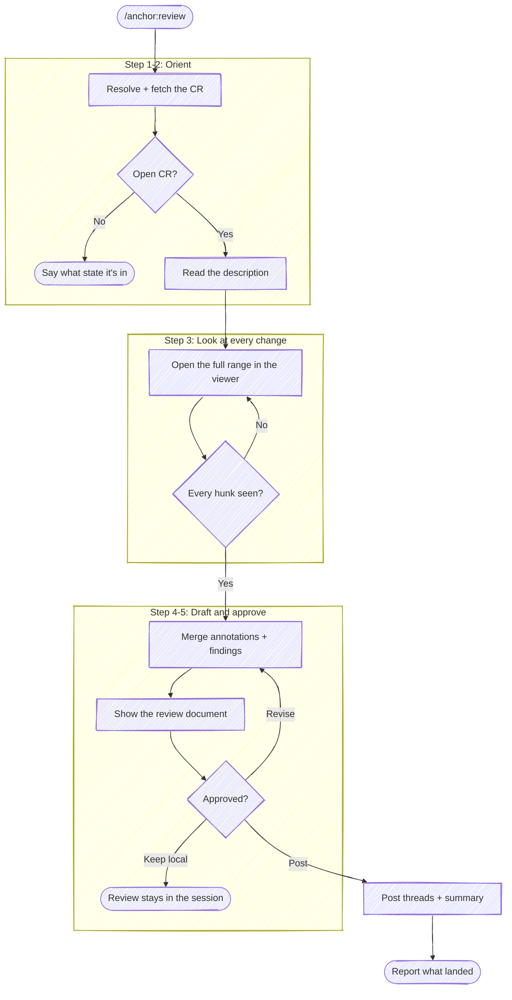

# Review

Take a change request someone else wrote and drive it to feedback that reaches
them: resolve the CR, read the description that says why it exists, look at
every change, collect findings that name a file and a line, and — once the user
approves the exact wording — post them where the code is.

This is the other side of `/anchor:resolve-feedback`. That skill brings a
reviewer's findings back into your branch; this one produces them on someone
else's.

**Recording a verdict is not this skill's act.** Approving a CR (`gh pr review
--approve`, `glab mr approve`) is the one irreversible thing in the flow and it
belongs to the human reviewer. This skill posts comments and threads, and says
so; it never approves and never requests changes as a forge state.

CR = change request: a pull request on GitHub, a merge request on GitLab. Pick
the forge tool by the resolved CR, not by the working directory's `origin`.

**Don't narrate your work.** Every step below is an operating instruction —
follow the execute-quietly discipline:
`${CLAUDE_PLUGIN_ROOT}/guides/execute-quietly.md`. The only things worth
surfacing are the resolved CR in one line, the questions in Step 2, the review
document, and what landed where.



## Task tracking when orchestrated

At the very start, call `TaskList`. If any task is already `in_progress`, run
silently inside the orchestrator's list. Otherwise enumerate:

- `Step 1: Fetch the change request`
- `Step 3: Review every change`
- `Step 4: Draft the review`
- `Step 6: Post the approved findings`

## Step 1: Resolve and fetch the change request

**Target repo.** Resolve it as the other `anchor` skills do. **With a name
argument**, go through tack's repo db
(`${CLAUDE_PLUGIN_ROOT}/scripts/resolve-target.sh <name>`): `TARGET_VIA=tack` →
pass `TARGET_LOCAL` as `--repo`; empty `TARGET_LOCAL` → ask where the checkout
lives; `ambiguous` → prompt with `TARGET_CANDIDATES`; `cwd` → the working
directory's repo. **With a CR URL**, the URL names the project — if that project
isn't the cwd repo, resolve its checkout the same way before continuing. This
skill reads a work tree, so it needs one; it writes no commits, so no worktree
isolation is required.

Then gather everything in one call:

```bash
bash "${CLAUDE_PLUGIN_ROOT}/scripts/review-cr.sh" <number|url|branch> [--repo <path>]
```

With no argument it resolves the open CR for the current branch. Read the block
and act only on what it surfaces:

| Key | What to do with it |
|-----|--------------------|
| `FORGE` / `HOST` / `PROJECT` | pick the CLI and target it; `HOST` is `glab --hostname` on self-hosted GitLab |
| `CR_IID` / `CR_URL` / `CR_TITLE` / `CR_AUTHOR` | the one line you report, and the header for Step 3's viewer |
| `CR_STATE` | anything but `open` → say what state it's in and ask before continuing; a merged CR takes comments but nobody is waiting on them |
| `CR_DRAFT=true` | the author hasn't asked for review yet — say so and confirm before spending their attention |
| `IS_OWN_CR=1` | the CR is the user's own; say so once. `/anchor:prepare-review` describes your own change, and self-review is a different act from the one this skill performs |
| `CR_HEAD_SHA` / `CR_BASE_SHA` / `CR_START_SHA` | pinned at fetch time; Step 6 passes them back so every anchor lands on the diff that was actually read |
| `DIFF_RANGE` | what Step 3 hands the viewer — the **whole** range, never a subset |
| `CHANGED_FILES` | the size of what's being reviewed |
| `DESC_PATH` | the description, for Step 2 |
| `DIFF_PATH` | the unified diff, for your own read in Step 4 |
| `FINDINGS_PATH` | where the findings JSON goes; already seeded and `mktemp`'d, so don't make your own |

A `REVIEW_ERROR=…` line means there is nothing to review — surface it and stop.
On a 401/403 the same line carries the auth failure: ask the user to refresh
credentials rather than retrying or reaching for another endpoint.

## Step 2: Read the description before the diff

Read `DESC_PATH` first, in full. The description states what the change is *for*,
and that is what decides whether the diff is a good answer — a reviewer who
starts in the diff can only check whether the code is internally consistent,
which is the cheaper half of the job. `anchor` spends a whole skill making that
description worth reading; use it.

Take from it: the problem the author says they're solving, the approach they
chose, anything they flagged as contested or unverified, and any Review guide
pointing at where they want attention. Note what the description **doesn't**
answer — a change whose reason is missing is itself a finding, and a better one
than most line-level remarks.

Then read `DIFF_PATH` against that. Where the diff does something the
description doesn't account for, that gap is the highest-value thing you have.

## Step 3: Look at every change

Open the whole range in the diff viewer. This step is not skippable and the
range is not filtered: a review that saw part of a change and signed off on all
of it is worth less than no review, and the only way the user can stand behind
findings is to have seen what produced them.

Ask the dispatcher which backend to open — it resolves this skill's key over the
umbrella one and considers only installed tools:

```bash
bash "${CLAUDE_PLUGIN_ROOT}/scripts/review-diff.sh" --skill review --print-backend
```

Then launch it as a **background** Bash call (`run_in_background: true`) — the
viewer blocks until closed:

```bash
bash "${CLAUDE_PLUGIN_ROOT}/scripts/review-diff.sh" --skill review \
  --backend <REVIEW_BACKEND> [--repo <path>] <DIFF_RANGE> \
  --title '<CR_TITLE>' \
  --detail CR=<CR_URL> --detail author=<CR_AUTHOR> --detail files=<CHANGED_FILES>
```

The `--title` / `--detail` overrides matter here: without them the header
describes the local `HEAD`, which on a CR you didn't write is somebody else's
change labelled with your last commit.

**Don't announce the launch** — the backend puts the diff on screen itself.

Read the result with the **BashOutput tool**. This skill reads the verdict
differently from its siblings, because here the reviewer's comments are the
*product* rather than an obstacle:

- **`changes-requested`** — the expected outcome. `REVIEW_OUTPUT.comments` are
  findings the user typed; carry them into Step 4 verbatim.
- **`approved`** — every change was read and nothing was flagged. That is a real
  review with no inline findings; Step 4 still writes the summary.
- **`incomplete`** — the backend is telling you not every hunk was reviewed.
  Name what went unseen and re-open the viewer. Do not build a document over it:
  this verdict is exactly the rubber-stamp the step exists to prevent.
- **`no-verdict`** — the review did not complete (`backend: "difftool"` or
  `capabilities.producesVerdict: false` means a difftool with no contract showed
  it; otherwise read `raw.exitCode`). Say what happened and ask whether the user
  read the changes, rather than assuming either answer.
- **No verdict line at all** — treat as `no-verdict`; absent output is never a
  completed review.

`reviewCompleteness` is `null` on a backend that cannot measure it — that means
*unmeasured*, not *complete*. The obligation this step carries is the one you
control: hand the viewer the entire `DIFF_RANGE`, every time.

## Step 4: Build the review document

Write the findings to `FINDINGS_PATH` as JSON, then read it back rendered. The
entries use the DIFF contract's comment shape, so a comment the user typed in
the viewer and one you wrote are the same kind of object:

```json
{
  "cr": {"url": "<CR_URL>", "headSha": "<CR_HEAD_SHA>"},
  "summary": "the overall read",
  "comments": [
    {"body": "…", "target": "line", "file": "src/cache.js",
     "startLine": 42, "endLine": 42, "side": "new", "origin": "reviewer"}
  ]
}
```

Keep `cr.headSha` exactly as Step 1 pinned it — Step 6 checks it. Set `origin`
to `reviewer` for anything the user typed in the viewer and `agent` for your
own. What a finding should *say*, and how the summary is shaped, is in
`${CLAUDE_PLUGIN_ROOT}/templates/cr-review.md`; read it before drafting.

Findings that carry a file and a line become inline threads. A `file` or
`changeset` target folds into the summary comment rather than being dropped —
that fallback is the script's, so state the concern where it belongs and let the
rendering place it.

**What to look for is your judgment, not a checklist.** This skill supplies the
plumbing — target to diff to findings to threads on the right lines — and
deliberately doesn't ship a code-quality rubric. Read the change against the
description's claims, and weight the reviewer's own annotations above your own.

Render the document and revise it with the user until it says what they mean:

```bash
bash "${CLAUDE_PLUGIN_ROOT}/scripts/review-post.sh" --preview --findings <FINDINGS_PATH>
```

Its output is the review — put it in your reply, since a Bash result reaches you
and not the user. Iterate here as many rounds as the user wants; nothing has
left the session yet.

## Step 5: Approve the exact text

Everything below posts under the user's name with nothing marking it as drafted
by an agent, so the words are theirs to approve — not a summary of them, and not
a plan describing them. The `--preview` output *is* the text; present that.

Then ask with `AskUserQuestion` (header `Post`):

- **Post all** *(default)* — every thread plus the summary.
- **Post one at a time** — walk the numbered findings, confirming each; skip any
  the user drops.
- **Keep it local** — the review stays in the session. This is a finished
  outcome; say where the document is and stop.

A revision at this gate re-renders and comes back here. Approval of one round is
not approval of the next.

## Step 6: Post the approved findings

```bash
bash "${CLAUDE_PLUGIN_ROOT}/scripts/review-post.sh" --post \
  --findings <FINDINGS_PATH> --forge <FORGE> --project <PROJECT> --cr <CR_IID> \
  [--host <HOST>] --base-sha <CR_BASE_SHA> --start-sha <CR_START_SHA> \
  [--index <n|summary>]
```

Without `--index` everything posts — on GitHub as one batched review so the
author gets a single notification, on GitLab as one POST per thread because it
has no batch endpoint. With `--index` it posts exactly one finding, which is
what **Post one at a time** walks.

The script re-reads the CR head before writing anything. `POST_ERROR=head-moved`
means the author pushed while the review was being written: every anchor now
points at lines that may not exist. Report the two SHAs and offer to re-run from
Step 1 against the new head — never post anyway, and never re-anchor by guessing
where the lines went.

Post what was approved. An improvement you notice while posting goes back
through Step 5.

## Step 7: Report

One line per finding: `#N <file:line> — posted` plus the summary comment's
outcome, and the CR URL. Say plainly what was **not** posted — anything the user
dropped, and anything that folded into the summary for want of an anchor.

Close by naming the verdict as the user's to record, with the invocation:

```text
Comments posted. Recording a verdict is yours:
  gh pr review <n> --approve          # or --request-changes
  glab mr approve <iid>
```

## Related

`/anchor:prepare-review` writes the description this skill reads first;
`/anchor:resolve-feedback` is what the author runs when these findings reach
them. The canonical forge invocations behind Step 6 — line-anchored threads on
both forges, the batched review, the position payload GitLab silently drops when
it's malformed — are in `${CLAUDE_PLUGIN_ROOT}/guides/forge-cookbook.md`.
