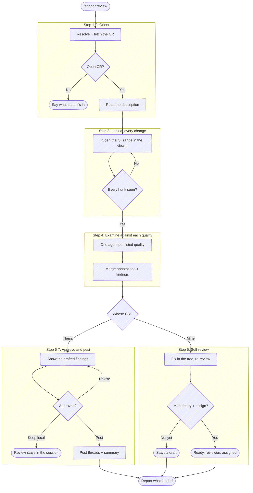

# Review

Take a change request and drive it to feedback: resolve the CR, read the
description that says why it exists, look at every change, examine the diff
against each quality in
`${CLAUDE_PLUGIN_ROOT}/templates/review-qualities.md`, and collect findings that
name a file and a line.

Where those findings go depends on who wrote the CR, and **authorship picks the
mode** (Step 5):

| The CR | Mode | The findings |
|---|---|---|
| someone else's | **review** | threads on their CR, once the user approves the exact wording |
| the user's own (`IS_OWN_CR=1`) | **self-review** | a fix list worked in the tree; nothing posts, and the mode ends by offering to mark the CR ready |

Self-review is the cold pass an author makes before handing a change to anyone
else. `/anchor:prepare-review` opens the CR as a draft precisely so that
decision stays theirs, and this is where they make it.

This is also the other side of `/anchor:resolve-feedback`. That skill brings a
reviewer's findings back into your branch; this one produces them.

**Recording a verdict is not this skill's act.** Approving a CR (`gh pr review
--approve`, `glab mr approve`) is the one irreversible thing in the flow and it
belongs to the human reviewer. This skill posts comments and threads, and says
so; it never approves and never requests changes as a forge state.

CR = change request: a pull request on GitHub, a merge request on GitLab. Pick
the forge tool by the resolved CR, not by the working directory's `origin`.

**Don't narrate your work.** Every step below is an operating instruction —
follow the execute-quietly discipline:
`${CLAUDE_PLUGIN_ROOT}/guides/execute-quietly.md`. The only things worth
surfacing are the resolved CR in one line, the questions in Step 2, the drafted
findings, and what landed where.



## Task tracking when orchestrated

At the very start, call `TaskList`. If any task is already `in_progress`, run
silently inside the orchestrator's list. Otherwise enumerate:

- `Step 1: Fetch the change request`
- `Step 3: Review every change`
- `Step 4: Examine the diff against each quality`
- `Step 5: Self-review the findings` *(own CR)* or
  `Step 6: Post the approved findings` *(someone else's)*

## Step 1: Resolve and fetch the change request

**Target repo.** Resolve it as the other `anchor` skills do. **With a name
argument**, resolve it with
`${CLAUDE_PLUGIN_ROOT}/scripts/resolve-target.sh <name>`: `TARGET_VIA=resolved` →
pass `TARGET_LOCAL` as `--repo`; empty `TARGET_LOCAL` → ask where the checkout
lives; `ambiguous` → prompt with `TARGET_CANDIDATES`; `cwd` → the working
directory's repo. **With a CR URL**, the URL names the project — if that project
isn't the cwd repo, resolve its checkout the same way before continuing. This
skill reads a work tree, so it needs one.

Then gather everything in one call:

```bash
bash "${CLAUDE_PLUGIN_ROOT}/scripts/review-cr.sh" <number|url|branch> [--repo <path>]
```

With no argument it resolves the open CR for the current branch. Read the block
and act only on what it surfaces:

| Key | What to do with it |
|-----|--------------------|
| `FORGE` / `HOST` / `PROJECT` | pick the CLI and target it; `HOST` is `glab --hostname` on self-hosted GitLab |
| `CR_IID` / `CR_URL` / `CR_TITLE` / `CR_AUTHOR` | the one line you report, and the header for Step 3's viewer |
| `CR_STATE` | anything but `open` → say what state it's in and ask before continuing; a merged CR takes comments but nobody is waiting on them |
| `CR_DRAFT=true` | on someone else's CR the author hasn't asked for review yet — say so and confirm before spending their attention. In self-review it is the expected state and needs no comment |
| `IS_OWN_CR=1` | the CR is the user's own, so this runs as a **self-review** (Step 5). Say which mode you're in once, and don't ask them to confirm reviewing their own change |
| `CR_HEAD_SHA` / `CR_BASE_SHA` / `CR_START_SHA` | pinned at fetch time; Step 7 passes them back so every anchor lands on the diff that was actually read |
| `DIFF_RANGE` | what Step 3 hands the viewer — the **whole** range, never a subset |
| `CHANGED_FILES` | the size of what's being reviewed |
| `DESC_PATH` | the description, for Step 2 |
| `DIFF_PATH` | the unified diff, for your own read in Step 4 |
| `FINDINGS_PATH` | where the findings JSON goes; already seeded and `mktemp`'d, so don't make your own |

A `REVIEW_ERROR=…` line means there is nothing to review — surface it and stop.
On a 401/403 the same line carries the auth failure: ask the user to refresh
credentials rather than retrying or reaching for another endpoint.

## Step 2: Read the description before the diff

Read `DESC_PATH` first, in full. The description states what the change is *for*,
and that is what decides whether the diff is a good answer — a reviewer who
starts in the diff can only check whether the code is internally consistent,
which is the cheaper half of the job. `anchor` spends a whole skill making that
description worth reading; use it.

Take from it: the problem the author says they're solving, the approach they
chose, anything they flagged as contested or unverified, and any Review guide
pointing at where they want attention. Note what the description **doesn't**
answer — a change whose reason is missing is itself a finding, and a better one
than most line-level remarks.

Then read `DIFF_PATH` against that. Where the diff does something the
description doesn't account for, that gap is the highest-value thing you have.

## Step 3: Look at every change

Open the whole range in the diff viewer. This step is not skippable and the
range is not filtered: a review that saw part of a change and signed off on all
of it is worth less than no review, and the only way the user can stand behind
findings is to have seen what produced them.

Ask the dispatcher how this review resolves — it takes this skill's mode key
over the umbrella one, falls back to what the subject picks, and considers only
tools that can actually open:

```bash
bash "${CLAUDE_PLUGIN_ROOT}/scripts/review-diff.sh" --skill review --probe
```

Two answers mean **don't launch** — this skill's subject is a changeset, and
neither reaches one:

- **`REVIEW_AVAILABLE=0`** — nothing usable is installed.
- **`REVIEW_MODE=edit`** — edit mode edits a single drafted artifact and refuses
  a diff-only review (DIFF-15), so launching it would report a configuration
  error instead of showing the CR. A CR's changeset is a diff subject, so this
  answer means something is wrong rather than something is configured: say the
  skill needs a viewer and what the probe reported. `REVIEW_EDIT_AVAILABLE` is
  about a different question and doesn't rescue it here.

Either way, go to the changeset rung of
`${CLAUDE_PLUGIN_ROOT}/guides/review-fallback.md` — file by file, in your reply —
rather than launching into a refusal.

Otherwise launch it as a **background** Bash call (`run_in_background: true`) —
the viewer blocks until closed:

```bash
bash "${CLAUDE_PLUGIN_ROOT}/scripts/review-diff.sh" --skill review \
  --mode <REVIEW_MODE> [--repo <path>] <DIFF_RANGE> \
  --title '<CR_TITLE>' \
  --detail CR=<CR_URL> --detail author=<CR_AUTHOR> --detail files=<CHANGED_FILES>
```

The `--title` / `--detail` overrides matter here: without them the header
describes the local `HEAD`, which on a CR you didn't write is somebody else's
change labelled with your last commit.

**Print the manifest as you launch** — a table of the CR's changed files with
their `+`/`−` counts, plus the CR number, its author, and the tool. This is
somebody else's change, so the set is what says whether you are about to review
what they asked you to. The shape is in
`${CLAUDE_PLUGIN_ROOT}/guides/execute-quietly.md` under "show what is going
under review". Nothing else about the launch is output.

Read the result with the **BashOutput tool**. This skill reads the verdict
differently from its siblings, because here the reviewer's comments are the
*product* rather than an obstacle:

- **`changes-requested`** — the expected outcome. `REVIEW_OUTPUT.comments` are
  findings the user typed; carry them into Step 4 verbatim. One whose `target` is
  `file` with a diff in its body is a finding they typed *into the code* through
  a difftool — read it per `${CLAUDE_PLUGIN_ROOT}/guides/reviewer-edits.md` and carry
  what it says, not the patch, into the summary.
- **`approved`** — every change was read and nothing was flagged. That is a real
  review with no inline findings; Step 4 still writes the summary.
- **`incomplete`** — the tool is telling you not every hunk was reviewed.
  Name what went unseen and re-open the viewer. Do not build a document over it:
  this verdict is exactly the rubber-stamp the step exists to prevent.
- **`no-verdict`** — the review did not complete. `capabilities.producesVerdict:
  false` means the tool graded nothing; `mode: "edit"` means edit mode was
  selected anyway and refused
  the changeset (DIFF-15), which the probe above catches first; otherwise read
  `raw.exitCode`. Say what happened in one line, then walk the changeset rung of
  `${CLAUDE_PLUGIN_ROOT}/guides/review-fallback.md` — file by file, in your reply.
  Don't ask whether the user read the changes: this step's product *is* the
  reading, so an answer either way leaves you with no findings to carry forward.
- **No verdict line at all** — treat as `no-verdict`; absent output is never a
  completed review.

`reviewCompleteness` is `null` on a tool that cannot measure it — that means
*unmeasured*, not *complete*. The obligation this step carries is the one you
control: hand the viewer the entire `DIFF_RANGE`, every time.

## Step 4: Examine the diff against each quality

**Read `${CLAUDE_PLUGIN_ROOT}/templates/review-qualities.md` before the
examination, not after.** It lists the qualities a review weighs and the
instruction their findings come back in. It is the user's file to edit, so the list as it stands is
the review's scope: don't weigh a quality it doesn't list, and don't skip one it
does.

**One agent per listed quality**, launched in a single message so they run
concurrently. Each gets the pinned diff (`DIFF_PATH`), what Step 2 established
the change is *for*, one quality's name and wording verbatim, and the template's
output instruction — nothing about the other qualities. Independent lenses are
the point; one pass over the whole list blurs them, which is most of why the list
is worth enumerating. Cost scales with it: four qualities is four agents, ten is
ten.

Then merge everything into one set:

- **The reviewer's own comments are findings**, kept **verbatim**. That sentence
  is already the one they wanted to send, and rewriting it into a house voice
  replaces what they approved with something they didn't.
- **On a line carrying both**, keep the reviewer's and drop the agent's rather
  than posting the line twice.
- **Two agents on the same line for the same reason is one finding** — keep the
  more specific and drop the rest.

### Where each finding goes

Put each remark at the **narrowest location that carries it**:

| Finding | Where it lands |
|---|---|
| a file and a line | an inline thread anchored to that line |
| a method or hunk, no single line | a thread on the line that opens it |
| a file, no line | the summary comment, named with its file |
| the changeset as a whole | the summary comment |

**Nothing is dropped for want of an anchor.** A `file` or `changeset` target
folds into the summary comment — that fallback is the script's, so state the
concern where it belongs and let the rendering place it. Both forges take line
anchors the same way, so which findings can be anchored doesn't depend on where
the CR lives.

### What a finding says

The body is what lands in the thread, so write it as the thing the reviewer would
type into the CR:

- **State the consequence, not the observation.** *"This drops the tenant from
  the cache key, so two tenants share an entry"* gives the author something to
  act on; *"cache key changed"* restates the diff they wrote.
- **One concern per finding.** Two concerns on one line are two findings; the
  author resolves them separately.
- **Ask when it is a question.** A question dressed as a demand wastes a round
  trip.
- **Point at the alternative when there is one**, in one clause. A finding that
  only says *no* leaves the author to guess what *yes* looks like.
- **Skip what the diff already shows.** The author can see which files changed.

The register is `anchor`'s everywhere: plain words, no loaded framing
(`${CLAUDE_PLUGIN_ROOT}/guides/loaded-framing.md`), no size-minimizers, no praise
padding. Findings go out under the reviewer's name and read as the reviewer
talking.

The **summary** says whether the change does what its description claims and
names the one thing most worth attention. It is not a verdict — recording
approval or requesting changes on the forge is the human reviewer's own act
(Step 8).

### Write it out

Write the findings to `FINDINGS_PATH` as JSON, then read it back rendered. The
entries use the DIFF contract's comment shape, so a comment the user typed in
the viewer and one an agent wrote are the same kind of object:

```json
{
  "cr": {"url": "<CR_URL>", "headSha": "<CR_HEAD_SHA>"},
  "summary": "the overall read",
  "comments": [
    {"body": "…", "target": "line", "file": "src/cache.js",
     "startLine": 42, "endLine": 42, "side": "new", "origin": "reviewer"}
  ]
}
```

Keep `cr.headSha` exactly as Step 1 pinned it — Step 7 checks it. Set `origin`
to `reviewer` for anything the user typed in the viewer and `agent` for a
finding the fan-out produced.

Render the findings and revise them with the user until they say what they mean:

```bash
bash "${CLAUDE_PLUGIN_ROOT}/scripts/review-post.sh" --preview --findings <FINDINGS_PATH>
```

Its output is the review — put it in your reply, since a Bash result reaches you
and not the user. Iterate here as many rounds as the user wants; nothing has
left the session yet.

## Step 5: Self-review — the CR is yours

Reached when Step 1 reported `IS_OWN_CR=1`. Nothing in this step posts to the
forge: a thread an author opens against themselves is a round trip with no
reviewer in it, so the findings are a fix list instead. Steps 6 and 7 don't run.

1. **Give them the fix list.** The `--preview` render is it — put it in your
   reply as Step 4 says. Ask which findings they want acted on; a finding they
   disagree with is dropped, not argued.
2. **Fix in the working tree**, one finding at a time, running the project's
   tests as you go. Commits go through `/anchor:commit`, which decides
   amend-vs-new-commit from the push state and the draft flag — don't rewrite
   history here by hand.
3. **Re-review the corrected diff.** Re-run Step 1 so `CR_HEAD_SHA` and
   `DIFF_RANGE` cover the fix commits, then Steps 3 and 4 against the new head.
   That is a loop inside this invocation, not a reason to start over: repeat
   until a pass comes back with nothing the user wants fixed.
4. **Hand it off.** Ask with `AskUserQuestion` (header `Handoff`):

   - **Mark ready and request reviewers** — ask who, then do both.
   - **Mark ready** — ready with no reviewer named.
   - **Leave it a draft** *(default)* — a finished outcome. The author reviewed
     their own change and isn't handing it over yet; say so and stop.
   - **Post findings as threads** — for a known gap or a follow-up the author
     wants a reviewer to see. Those findings go out through Steps 6 and 7 with
     the same gates as anyone else's CR.

   Neither marking ready nor requesting a reviewer happens without the user
   picking it here. `/anchor:merge` also offers to mark a CR ready, but it asks
   as a gate on the merge — the author is already landing the change by then, so
   the question arrives long after the moment they wanted to hand it over. The
   invocations for both forges are in
   `${CLAUDE_PLUGIN_ROOT}/guides/forge-cookbook.md`.

Then report as Step 8 describes.

## Step 6: Approve the exact text

Everything below posts under the user's name with nothing marking it as drafted
by an agent, so the words are theirs to approve — not a summary of them, and not
a plan describing them. The `--preview` output *is* the text; present that.

Then ask with `AskUserQuestion` (header `Post`):

- **Post all** *(default)* — every thread plus the summary.
- **Post one at a time** — walk the numbered findings, confirming each; skip any
  the user drops.
- **Keep it local** — the review stays in the session. This is a finished
  outcome; say where the findings file is and stop.

A revision at this gate re-renders and comes back here. Approval of one round is
not approval of the next.

## Step 7: Post the approved findings

```bash
bash "${CLAUDE_PLUGIN_ROOT}/scripts/review-post.sh" --post \
  --findings <FINDINGS_PATH> --forge <FORGE> --project <PROJECT> --cr <CR_IID> \
  [--host <HOST>] --base-sha <CR_BASE_SHA> --start-sha <CR_START_SHA> \
  [--index <n|summary>]
```

Without `--index` everything posts — on GitHub as one batched review so the
author gets a single notification, on GitLab as one POST per thread because it
has no batch endpoint. With `--index` it posts exactly one finding, which is
what **Post one at a time** walks.

The script re-reads the CR head before writing anything. `POST_ERROR=head-moved`
means the author pushed while the review was being written: every anchor now
points at lines that may not exist. Report the two SHAs and offer to re-run from
Step 1 against the new head — never post anyway, and never re-anchor by guessing
where the lines went.

Post what was approved. An improvement you notice while posting goes back
through Step 6.

## Step 8: Report

**After a post (Steps 6-7).** One line per finding: `#N <file:line> — posted`
plus the summary comment's outcome, and the CR URL. Say plainly what was **not**
posted — anything the user dropped, and anything that folded into the summary for
want of an anchor.

Close by naming the verdict as the user's to record, with the invocation:

```text
Comments posted. Recording a verdict is yours:
  gh pr review <n> --approve          # or --request-changes
  glab mr approve <iid>
```

**After a self-review (Step 5).** One line per finding: `#N <file:line> — fixed
in <sha>`, `— dropped`, or `— posted` for one that went out as a thread. Then the
CR's state: still a draft, or ready with whoever was requested, and the CR URL.
Nothing about a verdict — on your own CR there is none to record.

## Related

`/anchor:prepare-review` writes the description this skill reads first;
`/anchor:resolve-feedback` is what the author runs when these findings reach
them. The canonical forge invocations behind Step 7 — line-anchored threads on
both forges, the batched review, the position payload GitLab silently drops when
it's malformed — are in `${CLAUDE_PLUGIN_ROOT}/guides/forge-cookbook.md`.
