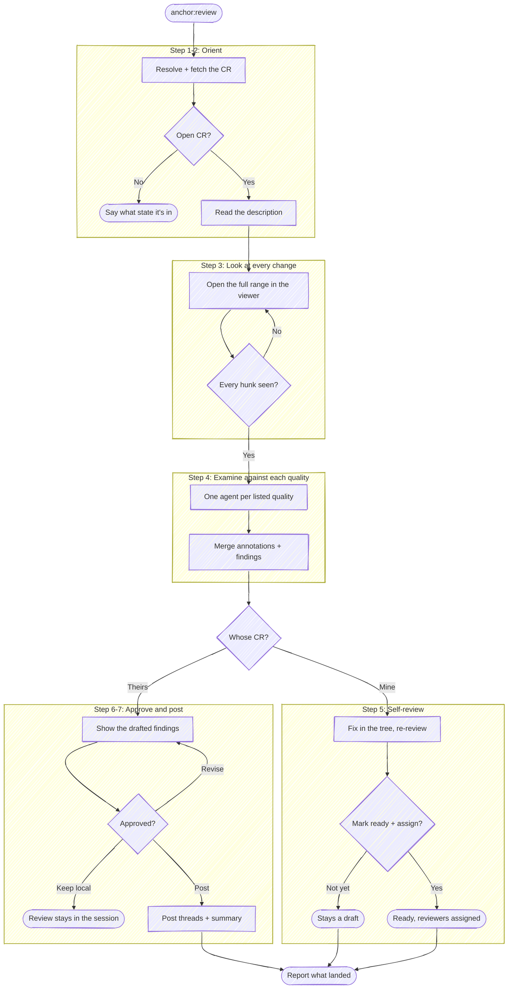

# Review

Before using a bundled path, resolve `<anchor-root>` to the installed plugin root
from the host's value or this `SKILL.md` path, then follow the host-neutral tool
conventions in `<anchor-root>/guides/host-runtime.md`.

Take a change request and drive it to feedback: resolve the CR, read the
description that says why it exists, look at every change, examine the diff
against each quality in
`<anchor-root>/templates/review-qualities.md`, and collect findings that
name a file and a line.

Where those findings go depends on who wrote the CR, and **authorship picks the
mode** (Step 5):

| The CR | Mode | The findings |
|---|---|---|
| someone else's | **review** | threads on their CR, once the user approves the exact wording |
| the user's own (`IS_OWN_CR=1`) | **self-review** | a fix list worked in the tree; nothing posts, and the mode ends by offering to mark the CR ready |

Self-review is the cold pass an author makes before handing a change to anyone
else. `anchor:prepare-review` opens the CR as a draft precisely so that
decision stays theirs, and this is where they make it.

This is also the other side of `anchor:resolve-feedback`. That skill brings a
reviewer's findings back into your branch; this one produces them.

**Recording a verdict is not this skill's act.** Approving a CR (`gh pr review
--approve`, `glab mr approve`) is the one irreversible thing in the flow and it
belongs to the human reviewer. This skill posts comments and threads, and says
so; it never approves and never requests changes as a forge state.

CR = change request: a pull request on GitHub, a merge request on GitLab. Pick
the forge tool by the resolved CR, not by the working directory's `origin`.

**Keep plumbing quiet.** Every step below is an operating instruction —
follow the execute-quietly discipline:
`<anchor-root>/guides/execute-quietly.md`. The only things worth
surfacing are the resolved CR in one line, the questions in Step 2, the drafted
findings, and what landed where.

## Task tracking when orchestrated

If the host exposes task tracking, inspect it first. If any task is already in
progress, run inside the orchestrator's list. If the host has no task mechanism,
follow an evident enclosing workflow without inventing one. Otherwise enumerate:

- `Step 1: Fetch the change request`
- `Step 3: Review every change`
- `Step 4: Examine the diff against each quality`
- `Step 5: Self-review the findings` *(own CR)* or
  `Step 6: Post the approved findings` *(someone else's)*
